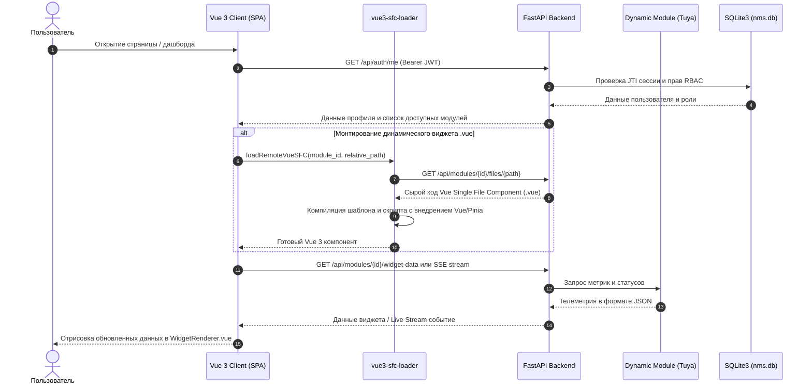

# 🚀 Обзор системы и ключевые концепции

---

## 📌 Назначение NMS WebUI

**NMS WebUI** (Network Management System Web Interface) — это высокопроизводительная модульная платформа для централизованного мониторинга, визуализации и администрирования распределенной сетевой инфраструктуры и инженерных узлов.

Платформа спроектирована по принципу **Plug-and-Play**: модули (драйверы устройств, подсистемы мониторинга, аналитические виджеты) подключаются динамически во время выполнения без необходимости пересборки ядра или остановки сервиса.

### Ключевые возможности:
- **Сбор телеметрии в реальном времени**: Поддержка протоколов HTTP REST, WebSockets, Server-Sent Events (SSE), а также интеграция с сетевыми устройствами и внешними сервисами.
- **Интерактивные дашборды**: Кастомизируемая свободная сетка виджетов с поддержкой Drag & Drop, изменения размеров (Resize), автоматического опроса и живых стримов.
- **Динамический загрузчик плагинов**: Сканирование, валидация по Pydantic-манифестам (`manifest.yaml`), топологическая сортировка зависимостей и изоляция ресурсов.
- **Динамическая компиляция Vue SFC**: Загрузка и компиляция пользовательских интерфейсных компонентов `.vue` непосредственно в браузере клиента (*In-Browser SFC Compilation*) с помощью библиотеки `vue3-sfc-loader` без пересборки бандла фронтенда.
- **Строгая безопасность и RBAC**: Иерархическая ролевая модель доступа, HMAC-SHA256 JWT токен-сессии с валидацией JTI, двухфакторная аутентификация TOTP (RFC 6238), IP-вайтлисты и непрерывный журнал аудита.
- **Фоновые задачи и очередность**: Встроенная поддержка очереди фоновых задач Celery для отложенной и регулярной обработки (бэкапы, опрос оборудования).
- **Отказ от внешних сервисных зависимостей**: Нулевые сторонние БД-демоны (используется встроенный SQLite3 в режиме WAL / Rollback journal).

---

## 🏗 Архитектурный стек и структура системы

Приложение разделено на независимые слои:

```svg
<svg viewBox="0 0 800 460" width="100%" height="100%" xmlns="http://www.w3.org/2000/svg">
  <defs>
    <linearGradient id="grad-frontend" x1="0%" y1="0%" x2="100%" y2="100%">
      <stop offset="0%" stop-color="#2563eb"/>
      <stop offset="100%" stop-color="#1d4ed8"/>
    </linearGradient>
    <linearGradient id="grad-backend" x1="0%" y1="0%" x2="100%" y2="100%">
      <stop offset="0%" stop-color="#7c3aed"/>
      <stop offset="100%" stop-color="#6d28d9"/>
    </linearGradient>
    <linearGradient id="grad-db" x1="0%" y1="0%" x2="100%" y2="100%">
      <stop offset="0%" stop-color="#059669"/>
      <stop offset="100%" stop-color="#047857"/>
    </linearGradient>
    <linearGradient id="grad-celery" x1="0%" y1="0%" x2="100%" y2="100%">
      <stop offset="0%" stop-color="#d97706"/>
      <stop offset="100%" stop-color="#b45309"/>
    </linearGradient>
    <linearGradient id="grad-driver" x1="0%" y1="0%" x2="100%" y2="100%">
      <stop offset="0%" stop-color="#db2777"/>
      <stop offset="100%" stop-color="#be185d"/>
    </linearGradient>
    
    <marker id="arrow" viewBox="0 0 10 10" refX="6" refY="5" markerWidth="6" markerHeight="6" orient="auto-start-reverse">
      <path d="M 0 1 L 8 5 L 0 9 z" fill="#94a3b8"/>
    </marker>
    <marker id="arrow-blue" viewBox="0 0 10 10" refX="6" refY="5" markerWidth="6" markerHeight="6" orient="auto-start-reverse">
      <path d="M 0 1 L 8 5 L 0 9 z" fill="#60a5fa"/>
    </marker>
  </defs>

  <!-- Frontend Layer -->
  <g transform="translate(150, 20)">
    <rect width="500" height="84" rx="14" fill="url(#grad-frontend)" filter="drop-shadow(0 4px 12px rgba(37, 99, 235, 0.35))"/>
    <text x="250" y="30" fill="#ffffff" font-size="16" font-weight="bold" text-anchor="middle" font-family="sans-serif">Vue 3 Single Page Application (SPA)</text>
    <text x="250" y="50" fill="#dbeafe" font-size="12" text-anchor="middle" font-family="sans-serif">Pinia Store | vue3-sfc-loader | WidgetRenderer.vue</text>
    <text x="250" y="68" fill="#93c5fd" font-size="11" text-anchor="middle" font-family="sans-serif">Двуязычная локализация i18n (RU / EN) | Theme Tokens</text>
  </g>

  <!-- Communication Pill -->
  <line x1="400" y1="104" x2="400" y2="148" stroke="#60a5fa" stroke-width="2.5" stroke-dasharray="6,4" marker-end="url(#arrow-blue)"/>
  <rect x="270" y="114" width="260" height="26" rx="13" fill="#0f172a" stroke="#3b82f6" stroke-width="1.5"/>
  <text x="400" y="131" fill="#93c5fd" font-size="11" font-weight="600" text-anchor="middle" font-family="sans-serif">REST API (HTTP) / WebSockets / SSE</text>

  <!-- Backend Layer -->
  <g transform="translate(100, 150)">
    <rect width="600" height="100" rx="14" fill="url(#grad-backend)" filter="drop-shadow(0 4px 12px rgba(124, 58, 237, 0.35))"/>
    <text x="300" y="30" fill="#ffffff" font-size="16" font-weight="bold" text-anchor="middle" font-family="sans-serif">FastAPI Backend Engine (Python 3.11+)</text>
    <text x="300" y="52" fill="#ede9fe" font-size="12" text-anchor="middle" font-family="sans-serif">Plugin Loader (toposort) | Pydantic v2 ModuleManifest | RBAC &amp; HMAC JWT Auth</text>
    <text x="300" y="72" fill="#ddd6fe" font-size="11" text-anchor="middle" font-family="sans-serif">EventBroadcaster (SSE/WS) | Audit Logger | System Locales i18n</text>
    <text x="300" y="88" fill="#c4b5fd" font-size="10" text-anchor="middle" font-family="sans-serif">Разработка: --no-auth (Dev Bypass Mode)</text>
  </g>

  <!-- Connection Lines to Storage, Celery and External Drivers -->
  <line x1="220" y1="250" x2="160" y2="310" stroke="#94a3b8" stroke-width="2" marker-end="url(#arrow)"/>
  <line x1="400" y1="250" x2="400" y2="310" stroke="#94a3b8" stroke-width="2" marker-end="url(#arrow)"/>
  <line x1="580" y1="250" x2="640" y2="310" stroke="#94a3b8" stroke-width="2" marker-end="url(#arrow)"/>

  <!-- Storage Layer -->
  <g transform="translate(40, 312)">
    <rect width="240" height="84" rx="12" fill="url(#grad-db)" filter="drop-shadow(0 4px 10px rgba(5, 150, 105, 0.25))"/>
    <text x="120" y="30" fill="#ffffff" font-size="13" font-weight="bold" text-anchor="middle" font-family="sans-serif">SQLite 3 Database (nms.db)</text>
    <text x="120" y="48" fill="#d1fae5" font-size="11" text-anchor="middle" font-family="sans-serif">WAL / Rollback Journal</text>
    <text x="120" y="66" fill="#a7f3d0" font-size="10" text-anchor="middle" font-family="sans-serif">Users, Roles, Audit, Sessions, Settings</text>
  </g>

  <!-- Celery Task Queue Layer -->
  <g transform="translate(300, 312)">
    <rect width="200" height="84" rx="12" fill="url(#grad-celery)" filter="drop-shadow(0 4px 10px rgba(217, 119, 6, 0.25))"/>
    <text x="100" y="30" fill="#ffffff" font-size="13" font-weight="bold" text-anchor="middle" font-family="sans-serif">Celery Worker</text>
    <text x="100" y="48" fill="#fef3c7" font-size="11" text-anchor="middle" font-family="sans-serif">Фоновые задачи</text>
    <text x="100" y="66" fill="#fde68a" font-size="10" text-anchor="middle" font-family="sans-serif">Опрос устройств, бэкапы</text>
  </g>

  <!-- External Infrastructure Layer -->
  <g transform="translate(520, 312)">
    <rect width="240" height="84" rx="12" fill="url(#grad-driver)" filter="drop-shadow(0 4px 10px rgba(219, 39, 119, 0.25))"/>
    <text x="120" y="30" fill="#ffffff" font-size="13" font-weight="bold" text-anchor="middle" font-family="sans-serif">Внешнее оборудование</text>
    <text x="120" y="48" fill="#fce7f3" font-size="11" text-anchor="middle" font-family="sans-serif">Tuya IoT Cloud / Local</text>
    <text x="120" y="66" fill="#fbcfe8" font-size="10" text-anchor="middle" font-family="sans-serif">HTTP API / Remote Log Sources</text>
  </g>
</svg>
```

### Технологический стек:

| Компонент | Технология | Версия / Описание |
| :--- | :--- | :--- |
| **Backend Framework** | FastAPI / Uvicorn | Python 3.11+, асинхронный движок ASGI |
| **Data Validation** | Pydantic v2 | Строгая валидация манифестов плагинов (`manifest.yaml`) и API схем |
| **Frontend Framework** | Vue 3 (Composition API) | TypeScript 5.3, Script Setup, Pinia State Management |
| **Bundler & Build** | Vite 5 | Сверхбыстрый HMR dev-сервер |
| **In-Browser Vue Compiler** | `vue3-sfc-loader` (v0.9.5) | Нативная динамическая компиляция `.vue` файлов в браузере через [`vueSfcLoader.ts`](file:///opt/nms-webui/frontend/src/core/vueSfcLoader.ts) |
| **Styling & UI** | Tailwind CSS 3.4 / Design Tokens | Кастомная тёмная/светлая система токенов, Material Symbols |
| **Database** | SQLite 3 | Встроенная БД (`nms.db`), табличная структура безопасности и аудита |
| **Task Queue** | Celery 5.3+ | Подсистема асинхронных фоновых задач и регулярного планирования |
| **Authentication** | HMAC-SHA256 JWT + TOTP | Стандарт RFC 6238 для MFA (Google Authenticator, Яндекс.Ключ) и точечный отзыв сессий по JTI |

---

## 🔄 Поток данных (Data Flow)

Ниже приведена диаграмма последовательности взаимодействия фронтенда, компилятора компонентов, ядра FastAPI и модулей системы:



---

## 📖 Глоссарий терминов

| Термин | Описание |
| :--- | :--- |
| **NMS** | Network Management System — система мониторинга и централизованного управления сетевыми ресурсами. |
| **Dynamic Module (Плагин)** | Независимый изолированный модуль в `backend/modules/<name>/` и `frontend/src/modules/<name>/`, содержащий собственный `manifest.yaml`, REST API роутеры, сервисы, локализации и Vue-виджеты. |
| **Plugin Manifest** | Файл `manifest.yaml`, являющийся единым источником правды (*Single Source of Truth*) для метаданных, зависимостей, прав доступа, эндпоинтов и виджетов плагина. |
| **Module Context (`ModuleContext`)** | Объект окружения, передаваемый в точки входа плагина, содержащий идентификаторы, пути к каталогам данных и локализации. |
| **Topological Sort (`toposort_modules`)** | Алгоритм резолва графа зависимостей модулей (`deps`), гарантирующий корректный порядок их загрузки и инициализации. |
| **Widget (Виджет)** | Интерактивная карточка UI, монтируемая в дашборд. Поддерживает типы `summary`, `stat`, `list` и `custom`. |
| **Widget Slot (Слот)** | Позиция свободного дашборда (`top`, `sidebar`, `grid`), в которую компонент [`WidgetRenderer.vue`](file:///opt/nms-webui/frontend/src/components/common/WidgetRenderer.vue) монтирует виджет. |
| **Widget Renderer (`WidgetRenderer.vue`)** | Универсальный обёртка-компонент, отвечающий за рендеринг виджетов, подписку на live-стримы (SSE/WS), Drag & Drop, изменение размеров и проверку RBAC-прав. |
| **In-Browser SFC Compilation** | Технология загрузки `.vue` файлов из бэкенда через HTTP и их компиляции в браузере с помощью библиотеки `vue3-sfc-loader` в [`vueSfcLoader.ts`](file:///opt/nms-webui/frontend/src/core/vueSfcLoader.ts) без перезапуска Vite/Node.js. |
| **Theme Tokens** | Системные CSS-переменные (`--bg-surface`, `--text-primary`, `--primary` и др.), обеспечивающие единый стиль платформы. |
| **RBAC** | Role-Based Access Control — ролевая модель разграничения прав пользователей (`Superuser`, `Admin`, `Operator`, `Viewer`). |
| **Implied Permissions** | Автоматическое наследование прав доступа (например, право `users.manage` автоматически включает право просмотра `users.view`). |
| **JTI (JWT ID)** | Уникальный идентификатор JWT-токена (`jti-uuid`), позволяющий мгновенно и точечно аннулировать отдельную сессию пользователя. |
| **TOTP MFA** | Time-based One-Time Password — двухфакторная аутентификация по стандарту RFC 6238 без внешних библиотек. |
| **Audit Log** | Журнал фиксации критических событий безопасности в таблице `audit_logs` (вход, создание пользователей, бэкап, изменение настроек). |
| **Log Provider** | Абстрактный интерфейс (`LogProvider`) для чтения и скачивания логов из локальных файлов, модулей или удаленных HTTP-серверов. |
| **No-Auth Mode (`--no-auth`)** | Флаг отладочного запуска (`./run_webui.sh dev --no-auth`), автоматически предоставляющий права `Superuser` без формы авторизации. |
| **Celery Worker** | Подсистема выполнения асинхронных тяжелых задач и расписаний в фоновом режиме. |
| **EventBroadcaster** | Движок публикации системных событий реального времени через SSE (Server-Sent Events) и WebSockets. |
