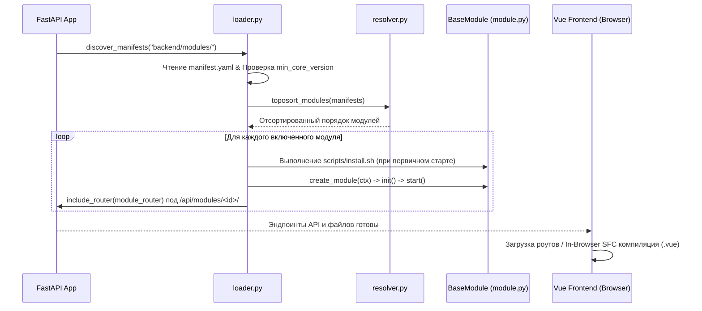

# Жизненный цикл плагинов, Хранилище и 0 Rebuilds Frontend

В платформе **NMS WebUI** реализована полностью автономизированная подсистема динамических модулей. И Backend (`FastAPI`), и Frontend (`Vue 3`) способны автоматически обнаруживать, валидировать версионирование, исполнять скрипты установки/удаления, изолировать дисковые данные и на лету компилировать `.vue` компоненты в браузере без `npm run build`.

---

## 🏗️ Архитектура ядра плагинов

Подсистема расположена в [`backend/core/plugin/`](file:///opt/nms-webui/backend/core/plugin):

* 📜 [`manifest.py`](file:///opt/nms-webui/backend/core/plugin/manifest.py) — Pydantic-схема `manifest.yaml` (версия, `min_core_version`, `max_core_version`, роуты, пермишены, виджеты).
* 🔍 [`loader.py`](file:///opt/nms-webui/backend/core/plugin/loader.py) — Сканирование директорий, проверка семантического версионирования, вызов `install.sh`/`uninstall.sh` и загрузка в память.
* 🔀 [`resolver.py`](file:///opt/nms-webui/backend/core/plugin/resolver.py) — Топологическая сортировка (`toposort`) модулей с учетом графа зависимостей (`deps`).
* 📦 [`context.py`](file:///opt/nms-webui/backend/core/plugin/context.py) — Изоляция ресурсов модуля (Sandbox), доступ к `get_data_dir()` и `get_cache_dir()`.
* 🌐 [`api.py`](file:///opt/nms-webui/backend/core/plugin/api.py) — REST API управления (`/api/modules`), установка ZIP, экспорт и HTTP-раздача `.vue` файлов.

---

## 🔄 Пошаговая последовательность загрузки модуля



---

## 🛡️ Проверка совместимости версий (`min_core_version` / `max_core_version`)

Каждый модуль может указать рамки совместимых версий ядра платформы в `manifest.yaml`:

```yaml
id: "tuya"
name: "Tuya Integration"
version: "1.2.0"
min_core_version: "1.0.0"
max_core_version: "2.0.0"
```

При сканировании или установке модуля:
1. `loader.py` сравнивает текущую версию `CORE_VERSION` платформы с диапазоном `min_core_version` ... `max_core_version`.
2. Если версия не совпадает, модуль **автоматически отбраковывается**, а API установки возвращает код `400 Bad Request` (`MODULE_INCOMPATIBLE_CORE_VERSION`).

---

## ⚡ 0 Rebuilds Frontend: In-Browser Vue SFC Compiler

В боевом продакшн-режиме при дописывании или копировании нового `.vue` файла фронтенд **не требует пересборки (`npm run build`)**.

### Трехуровневая стратегия загрузки компонентов ([`registry.ts`](file:///opt/nms-webui/frontend/src/modules/registry.ts)):
1. **Уровень 1 (Предскомпилированный бандл):** Если компонент уже собран в main бандл Vite — он загружается из памяти.
2. **Уровень 2 (In-Browser Vue SFC Loader):** Если компонента нет в предскомпилированном бандле, фронтенд выполняет HTTP-запрос `GET /api/modules/<id>/files/views/<ComponentName>.vue` и с помощью утилиты [`vueSfcLoader.ts`](file:///opt/nms-webui/frontend/src/core/vueSfcLoader.ts) за 2-3 миллисекунды компилирует шаблон, скрипты и стили прямо в браузере на лету.
3. **Уровень 3 (Auto-Form Generator):** Если `.vue` файл отсутствует вовсе, фронтенд динамически генерирует форму настроек [`ModuleView.vue`](file:///opt/nms-webui/frontend/src/views/ModuleView.vue) по JSON-схеме `settings_schema`.

---

## 📦 Изоляция дискового пространства (`ModuleContext` Sandbox)

Каждый модуль получает изолированный экземпляр класса [`ModuleContext`](file:///opt/nms-webui/backend/core/plugin/context.py):

* **Данные модуля:** `context.get_data_dir()` отдает `/backend/data/modules/<module_id>/`.
* **Кэш модуля:** `context.get_cache_dir()` отдает `/backend/cache/modules/<module_id>/`.
* **Защита песочницы:** `context.ensure_safe_path(path)` гарантирует, что модуль не сможет выйти за пределы отведенных ему папок на сервере.

---

## 💻 Bash-хуки установки и удаления (`install.sh` / `uninstall.sh`)

Модули поддерживают исполнение пользовательских bash-скриптов:

* **При установке:** При первичном обнаружении или загрузке модуля выполняются `scripts/install.sh` (или путь из `hooks.install`). В скрипт пробрасываются переменные окружения: `MODULE_ID`, `MODULE_DATA_DIR`, `PROJECT_ROOT`.
* **При удалении:** При вызове `DELETE /api/modules/{id}` перед очисткой файлов с диска автоматически запускается `scripts/uninstall.sh` (или `hooks.uninstall`) для завершения внешних системных процессов и очистки ресурсов.
rAllModuleViews() {
  for (const path in viewModules) {
    const filename = path.split('/').pop()?.replace(/\.vue$/, '') || ''
    if (!filename) continue
    const loader = viewModules[path] as () => Promise<any>
    
    if (/widget$/i.test(filename)) {
      registerWidgetComponent(filename, loader)
    } else {
      registerViewComponent(filename, loader)
    }
  }
}
```

* Компоненты вида `*Widget.vue` регистрируются как виджеты дашборда.
* Компоненты вида `*View.vue` или другие `.vue` в `src/modules/` регистрируются как динамические страницы.

---

## 🛡️ Изоляция сбоев и обработка ошибок

- **Безопасная загрузка YAML**: Ошибки синтаксиса `manifest.yaml` логируются через `logging.getLogger("nms.plugin.loader")`, не вызывая падения всего приложения.
- **Сбои импорта py-файлов**: Если модуль содержит синтаксическую ошибку Python, `loader.py` помечает его статус как `error` и продолжает загрузку остальных модулей.
