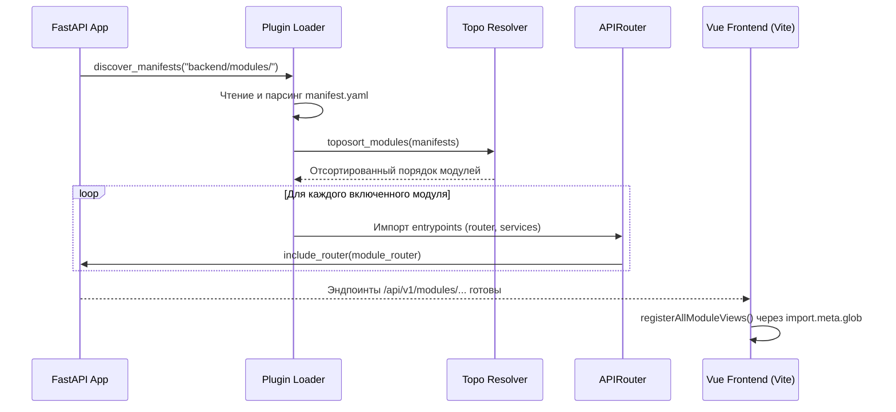

# Жизненный цикл плагинов и динамическая загрузка

В платформе **NMS WebUI** реализована модульная архитектура: и Backend (`FastAPI`), и Frontend (`Vue 3`) способны автоматически обнаруживать, проверять и динамически загружать модули при запуске без необходимости ручной регистрации в ядре системы.

---

## 🏗️ Архитектура подсистемы плагинов (Backend)

Ядро обработки модулей находится в `backend/core/plugin/`:

* 📜 `manifest.py` — Pydantic-схема манифеста `manifest.yaml` (версия, ID, зависимостей, роутеры, виджеты).
* 🔍 `loader.py` — Сканирование директории `backend/modules/`, поиск манифестов (включая субмодули) и валидация.
* 🔀 `resolver.py` — Топологическая сортировка (`toposort`) модулей с учетом их зависимостей (`deps`).
* 📦 `registry.py` — Хранение состояний модулей (включен/отключен), сохранение конфигурации в SQLite.
* 🌐 `api.py` — REST API управления модулями (`/api/v1/modules`).

---

## 🔄 Пошаговый жизненный цикл загрузки модуля



---

## 🛠️ Точки входа и хуки модулей

### 1. Backend: FastAPI Router & Services
В манифесте модуля `manifest.yaml` объявляются точки входа backend:

```yaml
id: "tuya"
name: "Tuya IoT Integration"
version: "1.0.0"
entrypoints:
  router: "backend.modules.tuya.router"
  services: "backend.modules.tuya.services"
deps: []
```

При запуске `backend/core/app.py`:
1. `loader.py` находит `manifest.yaml`.
2. Проверяется статус в реестре (`is_module_enabled`).
3. Модуль импортируется через `importlib.import_module()`.
4. Router подключается в главное FastAPI приложение с префиксом модуля.

---

### 2. Frontend: Динамический автолоадер (Vite Glob)
Фронтенд автоматически обнаруживает Vue-компоненты модулей через Vite glob:
*(Файл: [loader.ts](file:///opt/nms-webui/frontend/src/modules/loader.ts))*

```typescript
const viewModules = import.meta.glob<any>([
  '../views/**/*.vue',
  '../modules/**/*.vue',
])

export function registerAllModuleViews() {
  for (const path in viewModules) {
    const filename = path.split('/').pop()?.replace(/\.vue$/, '') || ''
    if (!filename) continue
    const loader = viewModules[path] as () => Promise<any>
    
    if (/widget$/i.test(filename)) {
      registerWidgetComponent(filename, loader)
    } else {
      registerViewComponent(filename, loader)
    }
  }
}
```

* Компоненты вида `*Widget.vue` регистрируются как виджеты дашборда.
* Компоненты вида `*View.vue` или другие `.vue` в `src/modules/` регистрируются как динамические страницы.

---

## 🛡️ Изоляция сбоев и обработка ошибок

- **Безопасная загрузка YAML**: Ошибки синтаксиса `manifest.yaml` логируются через `logging.getLogger("nms.plugin.loader")`, не вызывая падения всего приложения.
- **Сбои импорта py-файлов**: Если модуль содержит синтаксическую ошибку Python, `loader.py` помечает его статус как `error` и продолжает загрузку остальных модулей.
