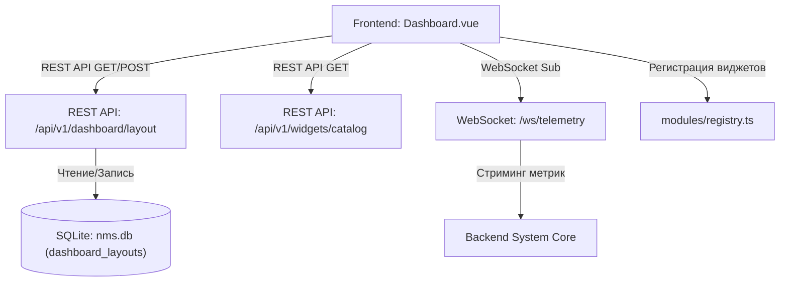

# 📖 Главная страница (Дашборд) и работа с виджетами

---

## 📌 1. Назначение страницы, URL-маршруты и RBAC-права

**Главная страница (Дашборд)** — это центральный оперативный консольный экран NMS WebUI. На нем аккумулируются агрегированные статусы сетевого оборудования, графики загрузки интерфейсов, оперативные аварии, метрики телеметрии и элементы быстрого управления со всех активных модулей системы. Экран предоставляет гибкую 12-колоночную интерактивную сетку с поддержкой Drag & Drop, масштабирования, коллизий, множественных рабочих столов (десктопов), системы пресетов, экспорта/импорта макетов и адаптивного мобильного вида.

* **URL-маршрут**: `/` (или `/dashboard`)
* **Требуемые права доступа (RBAC)**: Доступна всем авторизованным пользователям (`requiresAuth: true`). Отображение отдельных виджетов дополнительно фильтруется на основе прав текущего оператора (например, виджеты управления пользователями требуют право `users.view`).

---

## 🖥 2. Подробный функциональный состав

### 2.1. Верхняя панель управления (Action Bar)

1. **Кнопка «Добавить виджет» (`addWidget`)**:
   * Вызывает всплывающее модальное окно **Каталога виджетов**.
   * Позволяет выбрать и добавить виджеты базового ядра или подключенных модулей.

2. **Переключатель «Режим кастомизации» (`Customize Dashboard / Done`)**:
   * Переключает интерфейс между режимом оперативного мониторинга и режимом свободной верстки.
   * При активации на экране проявляется точечный паттерн сетки (`radial-gradient`), панели управления коллизиями, привязкой, пресетами и видимостью виджетов.

3. **Привязка к сетке (`Snap to Grid`)** *(в режиме кастомизации)*:
   * Чекбокс, включающий автоматическую магнитно-дискретную привязку перемещаемых карточек к шагу 12-колоночной сетки.

4. **Выбор режима коллизий (`Collision Mode`)** *(в режиме кастомизации)*:
   * **Выталкивание (`push`)**: При перемещении виджета на занятое место соседние виджеты автоматически смещаются вниз по направлению потока.
   * **Блокировка (`block`)**: Перемещение виджета блокируется при перекрытии ячеек. В зоне конфликта подсвечивается импульсная красная полосатая рамка с бейджем **«Занято» (`slotOccupied`)**.
   * **Свободный нахлест (`off`)**: Виджеты могут свободно накладываться друг на друга со слоевым порядком Z-index.

5. **Фантомная рамка предпросмотра (`Drag Ghost Frame`)**:
   * При перемещении виджета мышью в режиме кастомизации отображается синяя пунктирная рамка `dragGhostRect`, показывающая точное конечное место приземления карточки.

6. **Управление пресетами макетов (`Presets`)** *(в режиме кастомизации)*:
   * Выпадающий список сохраненных пользователем макетов (например, *«Оперативный мониторинг»*, *«Сетевые трассировки»*, *«Заводской пресет»*).
   * Кнопка **«Сохранить пресет»** (`bookmark_add`): Сохраняет текущее расположение виджетов под собственным именем.

7. **Экспорт и Импорт макета (`Export JSON` / `Import JSON`)** *(в режиме кастомизации)*:
   * **Экспорт**: Загрузка JSON-файла с конфигурацией всех рабочих столов и координат виджетов.
   * **Импорт**: Загрузка макета из JSON-файла с автоматической адаптацией под разрешительную способность экрана.

8. **Кнопка «Сбросить макет» (`Reset Layout`)**:
   * Возвращает расположение виджетов к конфигурации по умолчанию.

---

### 2.2. Панель быстрых переключателей видимости (Quick Visibility Bar)
В режиме кастомизации вверху экрана отображается интерактивная плашка с виджетами:
* Показывает счетчик скрытых виджетов (`hiddenWidgetsCount`).
* Строка кнопок со значками `visibility` / `visibility_off` позволяет в один клик временно скрывать или показывать нужные виджеты без их удаления с рабочего стола.

---

### 2.3. Навигация по рабочим столам (Multi-Desktop Workspaces)
Система поддерживает неограниченное число независимых экранов мониторинга:

* **Вкладки рабочих столов**: Переключение между экранами (например, *«Главный экран»*, *«Серверная»*, *«Сетевые каналы»*).
* **Горизонтальная прокрутка вкладок**: Колесико мыши осуществляет плавный скроллинг панели вкладок.
* **Создание рабочего стола (`createDesktop`)**:
  * Модальное окно ввода наименования нового стола.
  * Чекбокс **«Скопировать из текущего» (`copyFromCurrent`)**: Создание нового десктопа на основе копии макета и виджетов активного экрана.
* **Контекстные операции**:
  * **Переименование (`Rename`)**: Изменение наименования стола.
  * **Дублирование (`Duplicate`)**: Мгновенное создание точной копии экрана.
  * **Удаление (`Delete`)**: Удаление рабочего стола (доступно при наличии двух и более столов).

---

### 2.4. Интерактивная сетка и модальные окна виджетов

* **Адаптивность и мобильный вид (`isMobile`)**:
  * **Desktop**: 12-колоночный холст с фоновым точечным паттерном (`radial-gradient`).
  * **Mobile**: Автоматический переход в линейный вертикальный вид с адаптивным масштабированием карточек под узкие экраны.
* **Элементы управления карточкой виджета (`WidgetRenderer`)**:
  * Заголовок с поддержкой Drag & Drop перемещения.
  * Нижний правый угол для динамического изменения размеров (Resize).
  * Выведение на передний план (`bringToFront`): Клик по виджету поднимает его над остальными.
  * Кнопка быстрой скрытия/показа и кнопка удаления (`×`).
* **Модальное окно каталога виджетов (`Widget Catalog Modal`)**:
  * Поле живого поиска по названиям и описаниям виджетов.
  * Фильтрация по типам и модулям-поставщикам (`module_id`).
  * Кнопки **«+ Добавить»** и индикатор **«Уже добавлен» (`alreadyAdded`)**.
* **Состояние пустого холста (Empty State)**:
  * Отображается при скрытии или удалении всех виджетов с кнопкой мгновенного перехода к каталогу.

---

## 🔄 3. Взаимодействие с остальным приложением

### 3.1. Backend REST API
* `GET /api/v1/dashboard/layout`: Загрузка сохраненных столов, пресетов и координат виджетов текущего пользователя.
* `POST /api/v1/dashboard/layout`: Сохранение изменений рабочих столов и геометрии сетки.
* `GET /api/v1/widgets/catalog`: Получение каталога системных и модульных виджетов.

### 3.2. База данных `nms.db`
* Таблица `dashboard_layouts`: Хранит JSON-структуру персональных настроек (`user_id`, `desktops`, `active_preset`, `updated_at`).

### 3.3. WebSockets и Real-Time обновлении
* Виджеты подключаются к каналу `/ws/telemetry` для мгновенного обновления графиков и показателей без перезагрузки страницы.

### 3.4. Модульная архитектура
* При деактивации модуля в разделе «Управление модулями» его виджеты автоматически скрываются с Дашборда и из Каталога.
