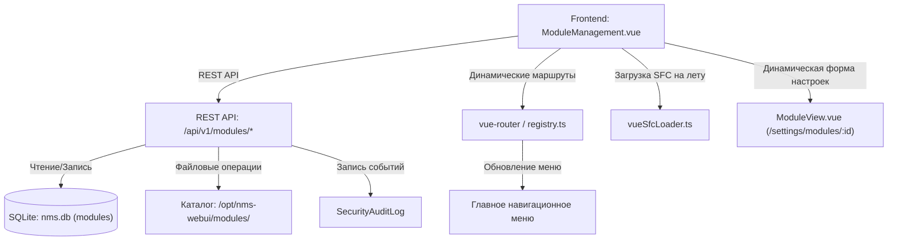

# 🧩 Управление модулями системы

---

## 📌 1. Назначение страницы, URL-маршруты и RBAC-права

Раздел **«Управление модулями системы»** обеспечивает полное управление плагинами и расширениями NMS WebUI: сканирование директорий сервера, установку новых модулей из пакетов ZIP, мгновенное переключение их состояния (Active/Disabled), отслеживание обязательных и опциональных зависимостей, просмотр встроенных виджетов и RBAC-разрешений, экспорт исходных пакетов, удаление и динамический переход к персональным страницам конфигурации модулей (`ModuleView`).

* **URL-маршруты**: 
  * `/settings/modules` — Реестр и панель управления модулями.
  * `/settings/modules/:moduleId` — Страница динамической настройки и встроенных экранов конкретного модуля (`ModuleView.vue`).
* **Требуемые права доступа (RBAC)**:
  * `modules.view` — Просмотр списка модулей, типов, зависимостей, виджетов и детальной карточки.
  * `modules.manage` — Сканирование файловой системы, установка ZIP-пакетов, включение/отключение модулей, экспорт конфигураций и удаление плагинов.

---

## 🖥 2. Подробный функциональный состав

Страница интегрирована с боковым меню быстрого перехода по настройкам (`SettingsRail`) и состоит из следующих ключевых панелей:

---

### 2.1. Верхняя панель управления и карточки метрик

1. **Кнопки управления**:
   * **Пересканировать модули (`scanModules`)**: Запускает повторный анализ физической директории `modules/` на сервере для обнаружения новых установленных плагинов. Кнопка анимируется иконкой `refresh`.
   * **Установить модуль (`installModule`)**: Вызывает модальное окно загрузки и установки архива модуля `.zip`.

2. **Верхние карточки метрик (Metrics Cards)**:
   * **Всего модулей (`totalModules`)**: Общее число зарегистрированных модулей на сервере.
   * **Активные (`active`)**: Количество включенных плагинов с подсвеченной зеленой цифрой.
   * **Отключенные (`disabled`)**: Количество деактивированных плагинов.
   * **Типы модулей (`moduleType`)**: Сводка по распределению категорий модулей в системе (`System`, `Collector`, `Monitoring`, `Device`, `UI`).

---

### 2.2. Таблица реестра модулей (Module Registry Table)

Интерактивная таблица всех доступных модулей с быстрой фильтрацией:

* **Кнопки фильтрации статуса**: Переключатели `Все` (`all`), `Только активные` (`active`), `Только отключенные` (`disabled`).
* **Колонки таблицы**:
  1. **Название и ID модуля (`moduleName`)**: Отображаемое имя и системный идентификатор в скобках (например, `nms-core-collector`).
  2. **Тип модуля (`moduleType`)**: Категория модуля (`Системный`, `Сбор данных`, `Мониторинг`, `Устройства`, `Интерфейс`).
  3. **Версия (`version`)**: Версия пакета (например, `1.4.2`).
  4. **Статус (`status`)**: Интерактивный тумблер мгновенного включения/отключения. Включение активирует функционал модуля без перезагрузки системы.
  5. **Действия (`actions`)**:
     * **Экспорт (`exportModule`)**: Выгрузка архива кода модуля (иконка `download`).
     * **Удаление (`deleteModule`)**: Удаление кастомного модуля (иконка `delete`, недоступно для системных базовых модулей).

---

### 2.3. Боковая панель деталей выбранного модуля (Selected Module Details Panel)

При клике на любую строку таблицы справа раскрывается карточка глубокой инспекции модуля:

* **Идентификатор и Название**: Системный ID и имя модуля с иконкой плагина `extension`.
* **Описание (`description`)**: Полное текстовое описание назначения модуля.
* **Обязательные зависимости (`moduleDeps`)**: Список системных идентификаторов модулей, необходимых для корректной работы. Если зависимости отсутствуют, выводится пометка `noDependencies`.
* **Опциональные зависимости (`moduleOptionalDeps`)**: Сводка поддерживаемых дополнительных плагинов с цветовыми бейджами активности:
  * 🟢 **(Активна / `depActive`)**: Опциональный модуль присутствует и включен в системе.
  * ⚪ **(Неактивна / `depInactive`)**: Опциональный модуль отсутствует или отключен.
* **Предоставляемые виджеты (`widgetsTitle`)**: Перечень виджетов Дашборда, поставляемых данным модулем, с их названиями и описаниями.
* **Требуемые разрешения (`modulePermissions`)**: Список ключей RBAC-прав, необходимых для использования функций модуля (например, `telemetry.view`).
* **Переход к настройкам модуля (`goToModuleSettings`)**: Если модуль объявляет схему параметров `config_schema`, выводится кнопка перехода на персональную страницу `/settings/modules/:moduleId`.
* **Кнопка выгрузки архива (`exportModule`)**: Повторная выгрузка ZIP-пакета модуля.

---

### 2.4. Модальные окна управления

1. **Модальное окно установки модуля (`Install Module Modal`)**:
   * Зона перетаскивания и выбора файла `.zip` с иконкой `folder_zip`.
   * Отображение имени выбранного файла.
   * Кнопка **«Установить»** с анимацией процесса загрузки и распаковки.

2. **Модальное окно подтверждения удаления (`Delete Confirmation Modal`)**:
   * Запрос подтверждения удаления с предупреждением об очистке файлов плагина и отвязке маршрутов.

---

### 2.5. Динамическая страница настроек модуля (`ModuleView.vue`)
При переходе по URL `/settings/modules/:moduleId`:
* Автоматически рендерится динамическая форма настроек на основе схемы `config_schema`.
* Поддерживает редактирование параметров плагина, управление подключением к оборудованию и сохранение персональных настроек модуля в `nms.db`.

---

## 🔄 3. Взаимодействие с остальным приложением

### 3.1. Backend REST API
* `GET /api/v1/modules`: Получение списка модулей с их метаданными, схемами конфигурации, зависимостями и виджетами.
* `POST /api/v1/modules/scan`: Сканирование директории `modules/` на сервере.
* `POST /api/v1/modules/{id}/toggle`: Включение или отключение модуля.
* `POST /api/v1/modules/install`: Загрузка и установка ZIP-пакета.
* `GET /api/v1/modules/{id}/export`: Скачивание ZIP-архива модуля.
* `DELETE /api/v1/modules/{id}`: Удаление кастомного модуля.

### 3.2. База данных `nms.db`
* Таблица `modules`: Хранит метаданные (`id`, `name`, `version`, `type`, `enabled`, `config_json`, `manifest_data`, `installed_at`).

### 3.3. Динамическая система загрузки (`vueSfcLoader.ts` & `registry.ts`)
* **Динамическая маршрутизация**: Переключение тумблера активности модуля динамически добавляет или удаляет Vue-маршруты модуля из `vue-router`.
* **Загрузка компонентов на лету**: `vueSfcLoader.ts` позволяет исполнять Vue-компоненты модуля без необходимости перезаборки проекта.
* **Каталог виджетов**: Виджеты включенного модуля немедленно становятся доступны на Главном Дашборде.
