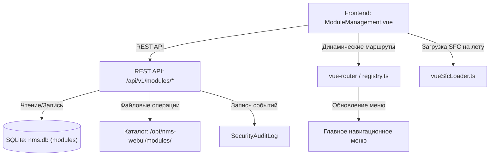

# 🧩 Управление модулями системы

---

## 📌 1. Назначение страницы, URL-маршруты и RBAC-права

Раздел **«Управление модулями»** предназначен для администраторов и инженеров платформы. Он обеспечивает полное управление жизненным циклом плагинов и модулей расширения NMS WebUI: сканирование директорий, установку новых модулей из пакетов, включение/отключение, детальную диагностику зависимостей, экспорт и удаление.

* **URL-маршруты**: 
  * `/settings/modules` — Реестр и панель управления модулями.
  * `/settings/modules/:moduleId` — Просмотр встроенных страниц конкретного модуля.
* **Требуемые права доступа (RBAC)**:
  * `modules.view` — Просмотр реестра модулей, их статусов и параметров.
  * `modules.manage` — Установка, изменение статуса (включение/отключение), экспорт и удаление модулей.

---

## 🖥 2. Подробный функциональный состав

### 2.1. Верхняя панель управления и метрики
1. **Кнопка «Пересканировать модули» (`Scan Modules`)**:
   * Запускает повторный анализ физической директории `modules/` на сервере.
   * Находит новые директории с манифестами `module.json` и заносит их в реестр.

2. **Кнопка «Установить модуль» (`Install Module`)**:
   * Открывает модальное окно для загрузки установочного ZIP-архива или файла манифеста.

3. **Верхние карточки метрик (Metrics Cards)**:
   * **Всего модулей (`Total Modules`)**: Общее количество зарегистрированных модулей.
   * **Активные (`Active`)**: Количество включенных и работающих модулей.
   * **Отключенные (`Disabled`)**: Количество деактивированных плагинов.
   * **Типы модулей (`Module Types`)**: Сводка по категориям (`System`, `Collector`, `Monitoring`, `Device`, `UI`).

---

### 2.2. Таблица реестра модулей (Module Registry)
Центральный элемент страницы — интерактивная таблица всех модулей:

* **Поля таблицы**:
  * **Название и ID**: Отображаемое имя и системный идентификатор (например, `nms-core-collector`).
  * **Тип модуля**: Цветовая плашка категории (`Системный`, `Сбор данных`, `Мониторинг`, `Устройства`, `Интерфейс`).
  * **Версия**: Семантическая версия (например, `1.4.2`).
  * **Статус (Переключатель Active/Disabled)**: Интерактивный тумблер мгновенного переключения состояния.
  * **Действия**:
    * **Экспорт (`download`)**: Скачивание архива с исходным кодом и манифестом модуля.
    * **Удаление (`delete`)**: Удаление кастомного модуля из системы (недоступно для системных базовых модулей).
* **Фильтрация таблицы**: Быстрые кнопки-переключатели `Все`, `Только активные`, `Только отключенные`.

---

### 2.3. Боковая панель деталей выбранного модуля (Module Details Panel)
При клике на любую строку таблицы справа открывается подробная карточка модуля:

* **Метаданные**: Полное описание назначения, автор, лицензия, дата установки.
* **Манифест и конфигурация**: Просмотр структуры `manifest.json`.
* **Заявляемые маршруты (Routes)**: Список дополнительных страниц, добавляемых модулем в WebUI.
* **Предоставляемые виджеты**: Перечень виджетов, встраиваемых модулем на Главный Дашборд.
* **Права доступа (Permissions)**: Список RBAC-ключей, требуемых модулем для работы.
* **Зависимости (Dependencies)**: Проверка наличия других требуемых модулей и версий Python/Node.js.

---

### 2.4. Модальные окна управления
1. **Окно установки модуля (`Install Module Modal`)**:
   * Drag-and-drop область для перетаскивания архива `.zip`.
   * Автоматическая валидация манифеста перед записью.
   * Отчет о проверке безопасности и доступности необходимых прав.

2. **Окно подтверждения удаления (`Delete Confirmation Modal`)**:
   * Запрос подтверждения с предупреждением об удалении ассоциированных маршрутов, виджетов и настроек.

---

## 🔄 3. Взаимодействие с остальным приложением

### 3.1. Backend REST API
* `GET /api/v1/modules`: Получение полного списка модулей с их текущим статусом.
* `POST /api/v1/modules/scan`: Запуск сканера файловой системы backend'а.
* `POST /api/v1/modules/{id}/toggle`: Переключение активности (включение/выключение) модуля.
* `POST /api/v1/modules/install`: Загрузка и распаковка архива модуля.
* `GET /api/v1/modules/{id}/export`: Генерация ZIP-архива модуля для скачивания.
* `DELETE /api/v1/modules/{id}`: Удаление файлов модуля и его записи из БД.

### 3.2. База данных `nms.db`
* Таблица `modules`: Хранит метаданные (`id`, `name`, `version`, `type`, `enabled`, `manifest_data`, `installed_at`).

### 3.3. Динамическая маршрутизация и Vue SFC Loader
* **Frontend Registry (`modules/registry.ts`)**: При переключении статуса модуля frontend мгновенно обновляет реестр Vue-маршрутов (`getModuleRoutes()`).
* **Vue SFC Loader (`vueSfcLoader.ts`)**: Позволяет на лету компилировать и подключать `.vue` компоненты из кастомных модулей без перезаборки всего WebUI.
* **Главное меню**: Активация модуля динамически добавляет его пункты в левое навигационное меню приложения.

### 3.4. Взаимодействие с другими разделами
* **Дашборд**: Включение модуля регистрирует его виджеты в «Каталоге виджетов» Дашборда.
* **Аудит безопасности**: Любые операции установки, удаления или переключения статуса фиксируются в `SecurityAuditLog` с указанием IP-адреса и имени администратора.
