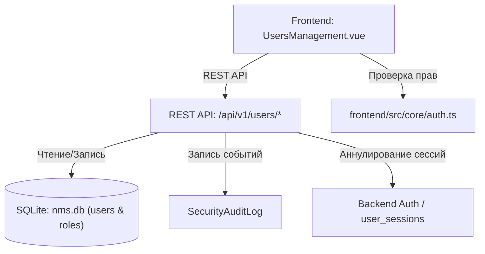

# 👥 Управление пользователями и операторами

---

## 📌 1. Назначение страницы, URL-маршруты и RBAC-права

Страница **«Управление пользователями»** предоставляет средства администрирования учетных записей операторов, инженеров и пользователей NMS WebUI. Раздел позволяет управлять доступом, назначать роли, выполнять блокировку аккаунтов, сбрасывать пароли, отслеживать статус двухфакторной аутентификации (MFA) и экспортировать списки учетных записей.

* **URL-маршрут**: `/settings/users`
* **Требуемые права доступа (RBAC)**:
  * `users.view` — Просмотр списка пользователей, поиска, фильтрации и карточек операторов.
  * `users.manage` — Создание, редактирование, блокировка/разблокировка, сброс паролей, массовые операции и удаление.

---

## 🖥 2. Подробный функциональный состав

### 2.1. Панель поиска, фильтрации и экспорта
1. **Поле поиска (`filterOperators`)**:
   * Живой поиск по имени пользователя (username), полному имени (Full Name) и адрес электронного почты (Email).

2. **Фильтр по статусу (`Status Filter`)**:
   * `Все` — Полный список пользователей.
   * `Активные` — Доступные для входа аккаунты.
   * `Заблокированные` — Заблокированные вручную или из-за превышения неудачных попыток входа.
   * `MFA включен` — Операторы с активированной двухфакторной аутентификацией.

3. **Кнопки экспорта**:
   * **CSV (`exportCSV`)**: Экспорт текущей выборки операторов в формат таблиц CSV.
   * **JSON (`exportJSON`)**: Экспорт структурированного JSON-файла со сведениями об операторах и их ролях.

4. **Кнопка «Добавить пользователя» (`addNewUser`)**:
   * Вызывает окно создания нового оператора (доступна при наличии права `users.manage`).

---

### 2.2. Панель массовых операций (Bulk Actions Bar)
Появляется автоматически при выборе чекбоксов одного или нескольких пользователей:

* **Счетчик выбранных операторов**: Показывает число выделенных аккаунтов.
* **Заблокировать выбранных (`Lock Selected`)**: Массовая блокировка доступа выделенным учетным записям.
* **Разблокировать выбранных (`Unlock Selected`)**: Массовое снятие блокировки.
* **Назначить роль (`Bulk Role Assignment`)**: Выпадающий список всех ролей системы с кнопкой применения ко всем выделенным пользователям.

---

### 2.3. Таблица операторов (Operators Table)
Основной рабочий инструмент администратора:

* **Колонки таблицы**:
  * **Чекбокс**: Для индивидуального и массового выделения.
  * **Оператор (Аватар, Имя, Email)**: Графический аватар или инициалы, логин и email.
  * **Роль**: Цветовой бейдж назначенной роли (`Администратор`, `Оператор`, `Наблюдатель` или кастомная роль).
  * **Статус аккаунта**:
    * `Активен` (зеленый бэйдж).
    * `Заблокирован` (красный бэйдж).
    * `Требуется смена пароля` (желтый бэйдж `must_change_password`).
    * `MFA` (иконка подлинности 2FA).
  * **Последний вход**: Дата, время и IP-адрес последнего успешного сеанса.
  * **Действия**:
    * **Редактировать (`edit`)**: Изменение личных данных и роли.
    * **Заблокировать / Разблокировать (`lock / lock_open`)**: Переключение блокировки в один клик.
    * **Сбросить пароль (`key`)**: Вызов процедуры генерации нового пароля.
    * **Удалить (`delete`)**: Удаление учетной записи.

---

### 2.4. Модальные окна
1. **Создание и редактирование пользователя**:
   * Поля: Имя пользователя, Полное имя, Email, Пароль, Выбор роли.
   * Чекбоксы: `Активен`, `Требовать смену пароля при следующем входе`, `Обязательный MFA`.

2. **Модальное окно сброса пароля**:
   * Автоматическая генерация надежного временного пароля или ручной ввод.
   * Кнопка быстрой копирования в буфер обмена.

3. **Предупреждение о деактивированной авторизации**:
   * При запуске системы в режиме отключенной авторизации вверху выводится информационный баннер.

---

## 🔄 3. Взаимодействие с остальным приложением

### 3.1. Backend REST API
* `GET /api/v1/users`: Получение списка пользователей с возможностью пагинации, поиска и фильтрации.
* `POST /api/v1/users`: Создание новой учетной записи.
* `PUT /api/v1/users/{id}`: Обновление параметров существующего пользователя.
* `POST /api/v1/users/{id}/lock`: Блокировка/разблокировка аккаунта.
* `POST /api/v1/users/{id}/reset-password`: Сброс пароля пользователя.
* `POST /api/v1/users/bulk`: Выполнение массовых операций (блокировка, смена роли).
* `DELETE /api/v1/users/{id}`: Удаление аккаунта.

### 3.2. База данных `nms.db`
* Таблица `users`: Хранит хеши паролей (Bcrypt/Argon2), статусы блокировки, флаг `must_change_password`, секрет 2FA и счетчик неудачных попыток входа.
* Связь с таблицей `roles`: Поле `role_id` указывает на назначенные права.

### 3.3. Безопасность и сброс сессий
* **Аннулирование токенов**: При блокировке или смене роли пользователя backend автоматически аннулирует все его активные JWT-токены в таблице `user_sessions`, мгновенно завершая сеанс оператора на всех устройствах.
* **Защита от самоудаления**: Система блокирует попытку текущего администратора удалить собственную учетную запись.
* **Аудит**: Любые действия с учетными записями фиксируются в `SecurityAuditLog`.
