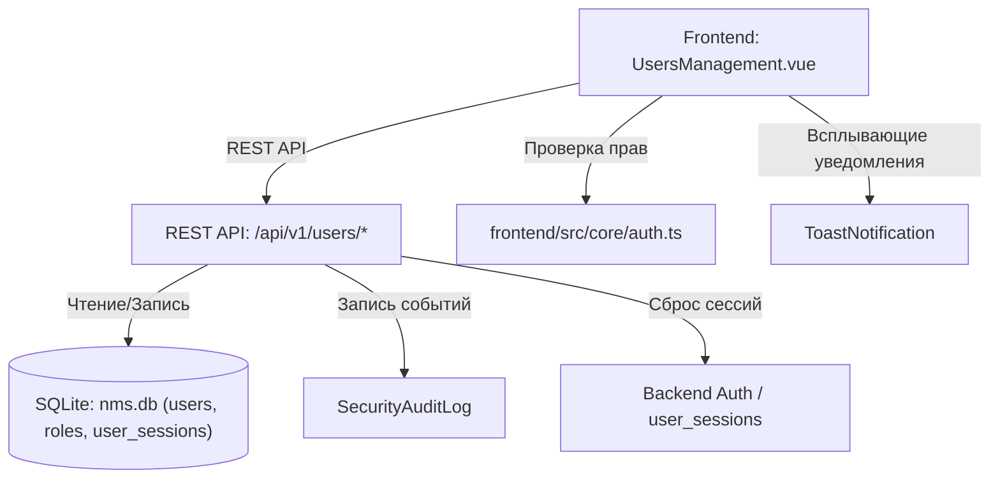

# 👥 Управление пользователями и операторами

---

## 📌 1. Назначение страницы, URL-маршруты и RBAC-права

Раздел **«Управление пользователями и операторами»** — это центральный административный консольный экран NMS WebUI для управления учетными записями операторов, инженеров и системных администраторов. Раздел обеспечивает полный контроль доступа: создание и редактирование аккаунтов, назначение ролей, блокировку/разблокировку доступа, сброс паролей, принудительную ротацию учетных данных (`must_change_password`), мониторинг статуса присутствия (Online/Offline/Locked), управление активными устройствами и сессиями операторов, а также массовые операции и экспорт списков.

* **URL-маршрут**: `/settings/users`
* **Требуемые права доступа (RBAC)**:
  * `users.view` — Просмотр списка пользователей, статусов сессий, поиска, фильтров и открытых устройств.
  * `users.manage` — Создание, редактирование личных данных, блокировка/разблокировка, сброс паролей, завершение сессий, массовые операции и удаление.

---

## 🖥 2. Подробный функциональный состав

### 2.1. Предупреждающий баннер безопасности (Auth Disabled Warning Banner)
* Появляется в самом верху страницы, если в конфигурации сервера отключена авторизация (`AUTH_ENABLED=false`).
* Предупреждает администратора о работе в режиме без аутентификации.

---

### 2.2. Панель поиска, фильтрации и экспорта (Action & Filter Bar)
1. **Поле живого поиска (`filterOperators`)**:
   * Текстовый поиск в реальном времени по имени пользователя (`username`), полному имени (`Full Name`), должности/отделу (`Title/Department`) и адресу электронной почты (`Email`).

2. **Фильтр по статусу аккаунта (`Status Filter`)**:
   * `Все статусы` — Полный список пользователей.
   * `Активные` — Доступные для входа учетные записи.
   * `Заблокированные` — Заблокированные вручную или из-за превышения попыток входа аккаунты.
   * `MFA включен` — Пользователи с включенной двухфакторной аутентификацией.

3. **Счетчик операторов (`showingOperators`)**:
   * Отображает число отфильтрованных пользователей в текущей выборке.

4. **Кнопки экспорта**:
   * **CSV (`exportCSV`)**: Выгрузка списка пользователей в формате таблиц CSV.
   * **JSON (`exportJSON`)**: Выгрузка структурированных данных пользователей со сведениями о ролях и UID.

5. **Кнопка «Добавить пользователя» (`addNewUser`)**:
   * Кнопка со свечением `person_add`, вызывающая окно создания нового оператора (требует право `users.manage`).

---

### 2.3. Панель массовых операций (Bulk Action Bar)
Автоматически раскрывается при выделении чекбоксом одного или нескольких пользователей:

* **Счетчик выделенных**: Показывает число выбранных операторов (`selectedUsersCount`).
* **Заблокировать выбранных (`Lock Selected`)**: Массовая блокировка доступа выделенным пользователям.
* **Разблокировать выбранных (`Unlock Selected`)**: Массовое снятие блокировки.
* **Массовое назначение роли (`Bulk Role Assignment`)**: Выпадающий список всех зарегистрированных ролей и кнопка применения роли ко всем выделенным учетным записям.
* **Завершить сессии выбранных (`Revoke Sessions Selected`)**: Массовое принудительное завершение всех сеансов входа выделенных операторов на всех устройствах.
* **Сброс выделения (`Clear Selection`)**: Кнопка `×` для мгновенной отмены выбора чекбоксов.

---

### 2.4. Интерактивная таблица операторов (Data Table)
Таблица с поддержкой сортировки, пагинации и динамических индикаторов состояния:

* **Колонки таблицы**:
  1. **Чекбокс**: Индивидуальный чекбокс выбора и переключатель «Выбрать все» (`Select All`) в шапке.
  2. **Оператор (`User`)**:
     * Графический аватар, инициалы или иконка блокировки (`person_off`).
     * Полное имя (`Full Name`).
     * Должность/Отдел (`Title / Department`).
     * Адрес электронной почты (`Email`).
  3. **Логин и UID (`Username & UID`)**:
     * Системное имя пользователя (`username`).
     * Уникальный цифровой идентификатор `UID` (например, `UID: 1002`).
  4. **Роль (`Role`)**:
     * Иконка категории роли (`admin_panel_settings` для Superuser, `manage_accounts` для Operator, `visibility` для Viewer).
     * Отображаемое название роли.
  5. **Динамический онлайн-статус (`Status Indicator`)**:
     * 🟢 **Online**: Пульсирующий зеленый индикатор, означающий активный сеанс в реальном времени.
     * ⚪ **Offline**: Серый круг, обозначающий отсутствие активных сессий.
     * 🔴 **Locked**: Красный замок, указывающий на заблокированный доступ.
  6. **Строка быстрых действий (`Actions`)**:
     * **Активные устройства и сессии (`devices`)**: Открывает модальное окно управления сеансами пользователя.
     * **Редактировать (`edit`)**: Открывает окно редактирования профиля и роли.
     * **Заблокировать / Разблокировать (`lock / lock_open`)**: Переключение блокировки аккаунта.
     * **Сбросить пароль (`key`)**: Вызов окна сброса пароля.
     * **Завершить сеансы (`logout`)**: Принудительное завершение всех активных сессий данного пользователя на всех компьютерах.
     * **Удалить (`delete`)**: Удаление учетной записи.

* **Серверная пагинация (Pagination Footer)**:
  * Диапазон отображаемых строк (например, *Показано 1 - 20 из 150*).
  * Текущая страница и общее количество страниц.
  * Кнопки переключения страниц `<` и `>`.

---

### 2.5. Модальные окна управления

#### 1. Модальное окно создания и редактирования пользователя (`Add / Edit User Modal`)
* **Поля формы**:
  * **Полное имя (`Full Name`)**: Обязательное текстовое поле.
  * **Должность / Отдел (`Title / Department`)**: Необязательное поле привязки к оргструктуре.
  * **E-mail**: Электронная почта оператора.
  * **Логин (`Username`)**: Имя для входа в систему.
  * **UID**: Отображение уникального идентификатора пользователя (в режиме редактирования).
  * **Пароль (`Password`)**: Задание пароля при создании нового пользователя.
  * **Выбор роли (`Role`)**: Выпадающий список доступных ролей системы.
  * **Блокировка доступа (`Lock Access`)**: Чекбокс перевода учетной записи в заблокированное состояние.
  * **Принудительная смена пароля (`Must Change Password`)**: Чекбокс `mustChangePassword`, обязывающий пользователя сменить пароль при следующем входе.

#### 2. Модальное окно сброса пароля (`Password Reset Modal`)
* Отображает имя и логин выбранного пользователя.
* **Ввод пароля**: Поле ввода нового пароля.
* **Генератор пароля (`Generate`)**: Кнопка автоматической генерации криптографически стойкого случайного пароля.

#### 3. Модальное окно подтверждения удаления (`Delete Confirmation Modal`)
* Предупреждение об удалении оператора с подтверждением выполнения.
* Защита от удаления собственной учетной записи администратора.

#### 4. Модальное окно управления активными сессиями (`User Active Sessions Modal`)
Позволяет детализировать и инспектировать все активные устройства оператора:
* Список подключенных устройств с указанием User-Agent браузера и операционной системы.
* IP-адрес подключения (`IP: 192.168.1.50`).
* Время последней активности (`Active: 2 мин. назад`).
* Индивидуальная кнопка **«Отозвать сессию» (`Revoke`)** для закрытия доступа на конкретном устройстве.

---

## 🔄 3. Взаимодействие с остальным приложением

### 3.1. Backend REST API
* `GET /api/v1/users`: Загрузка списка пользователей с пагинацией (`page`, `page_size`), поисковым запросом (`query`) и фильтром по статусу.
* `POST /api/v1/users`: Создание учетной записи.
* `PUT /api/v1/users/{id}`: Обновление личных данных, роли, блокировки и флага `must_change_password`.
* `POST /api/v1/users/{id}/lock`: Переключение состояния блокировки.
* `POST /api/v1/users/{id}/reset-password`: Установка нового пароля.
* `GET /api/v1/users/{id}/sessions`: Получение списка активных сессий пользователя.
* `DELETE /api/v1/users/{id}/sessions/{session_id}`: Отозвать конкретную сессию.
* `POST /api/v1/users/{id}/terminate-sessions`: Завершить все активные сессии оператора.
* `POST /api/v1/users/bulk`: Массовые операции (массовая блокировка, массовая смена роли, массовый сброс сессий).
* `DELETE /api/v1/users/{id}`: Удаление аккаунта.

### 3.2. База данных `nms.db`
* Таблица `users`: Хранит `id`, `uid`, `username`, `password_hash`, `name`, `title`, `email`, `role_id`, `is_locked`, `must_change_password`, `mfa_secret`, `created_at`.
* Таблица `user_sessions`: Связывает сессии пользователя с токенами `token_jti`, `ip_address`, `user_agent`, `last_seen`.

### 3.3. Безопасность и токенизация
* **Мгновенный сброс сессий**: При сбросе сессий (`terminate_sessions`) или блокировке аккаунта backend инвалидирует все токены пользователя в `user_sessions`. На следующем API-запросе скомпрометированное устройство получает ошибку `401 Unauthorized` и принудительно перенаправляется на `/login`.
* **Защита от самоудаления**: Система на уровне frontend и backend запрещает администратору блокировать или удалять собственный логин.
* **Логирование**: Все манипуляции с пользователями и сессиями фиксируются в `SecurityAuditLog`.
