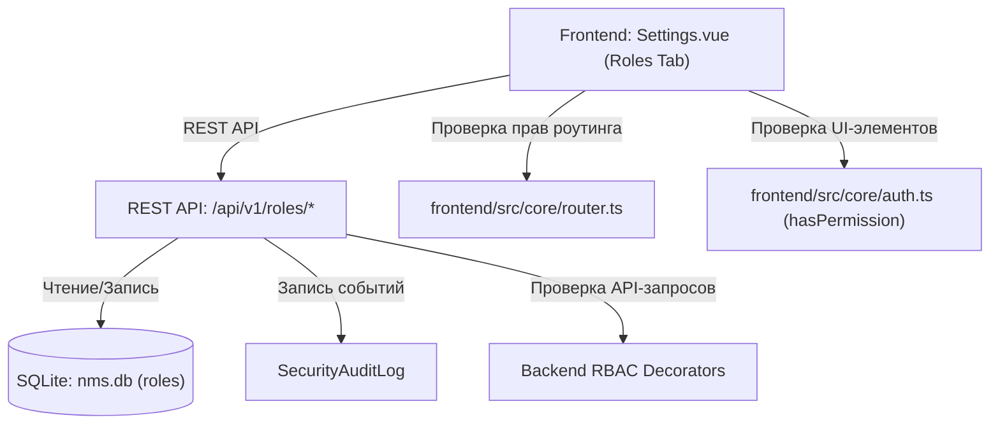

# 🔐 Разграничение прав доступа и управление ролями (RBAC)

---

## 📌 1. Назначение страницы, URL-маршруты и RBAC-права

Раздел **«Управление ролями и разграничение прав доступа»** реализует модель доступа на основе ролей (Role-Based Access Control, RBAC). Он позволяет настраивать детализированные политики доступа для групп операторов, создавать кастомные роли, ограничивать доступ к функциям платформы, модулям, разделам настроек и REST API.

* **URL-маршрут**: `/settings` (вкладка *Управление ролями*)
* **Требуемые права доступа (RBAC)**:
  * `roles.view` — Просмотр списка ролей, матрицы разрешений и привязанных пользователей.
  * `roles.manage` — Создание новых ролей, редактирование прав, клонирование и удаление ролей.

---

## 🖥 2. Подробный функциональный состав

### 2.1. Список ролей и фильтрация
Левая панель страницы отображает список всех зарегистрированных в системе ролей:

1. **Системные роли (System Roles)**:
   * `Администратор` (`admin`): Полные неотзываемые права на все подсистемы NMS WebUI.
   * `Оператор` (`operator`): Права на оперативный мониторинг, просмотр логов и управление устройствами.
   * `Наблюдатель` (`viewer`): Права исключительно на просмотр графиков и состояний без возможности внесения изменений.
   * *Маркировка*: Системные роли отмечены иконкой «Замок» (`lock`), защищающей их от удаления и случайной порчи.

2. **Кастомные роли (Custom Roles)**:
   * Пользовательские роли, создаваемые администраторами под конкретные служебные обязанности (например, *«Инженер сбора данных»*, *«Аудитор безопасности»*).

3. **Кнопки управления ролями**:
   * **Создать роль (`Add Role`)**: Открывает диалог ввода названия и описания новой роли.
   * **Клонировать роль (`Clone Role`)**: Дублирует выбранную роль со всей выбранной матрицей прав.
   * **Удалить роль (`Delete Role`)**: Удаляет кастомную роль (только если к ней не привязан ни один активный пользователь).

---

### 2.2. Матрица разрешений (Permission Matrix)
Центральная область содержит детализированный конструктор прав доступа, сгруппированный по категориальным блокам:

* **Группы разрешений**:
  * 🛠 **Система (`system.*`)**: Права на управление сервером, бэкапами, системными настройками и просмотр логов (`system.admin`, `system.view`, `system.backup`, `system.logs`).
  * 👥 **Пользователи (`users.*`)**: Просмотр и полное управление операторами (`users.view`, `users.manage`).
  * 🔐 **Роли (`roles.*`)**: Управление политиками RBAC (`roles.view`, `roles.manage`).
  * 🧩 **Модули (`modules.*`)**: Просмотр реестра, установка и переключение плагинов (`modules.view`, `modules.manage`).
  * 📡 **Мониторинг и Устройства (`devices.*`, `telemetry.*`)**: Просмотр телеметрии, отправка команд управления, квитирование аварий.
* **Быстрый выбор**:
  * Переключатели **«Выбрать все»** / **«Снять все»** для каждой отдельной категории.
  * Текстовый фильтр для быстрого поиска разрешения по названию или ключу.

---

## 🔄 3. Взаимодействие с остальным приложением

### 3.1. Backend REST API
* `GET /api/v1/roles`: Загрузка списка ролей с матрицей разрешений и количеством ассоциированных пользователей.
* `GET /api/v1/permissions`: Получение полного списка доступных ключей разрешений, зарегистрированных в ядре и модулях.
* `POST /api/v1/roles`: Создание новой роли с заданным набором прав.
* `PUT /api/v1/roles/{id}`: Обновление прав существующей роли.
* `DELETE /api/v1/roles/{id}`: Удаление кастомной роли.

### 3.2. База данных `nms.db`
* Таблица `roles`: Хранит записи ролей (`id`, `name`, `description`, `permissions_json`, `is_system`, `created_at`).

### 3.3. Применение правил на Frontend и Backend
* **Frontend Navigation Guard (`router.ts`)**: Перед каждым переходом на страницу роутер проверяет `to.meta.permission`. Если у текущей роли пользователя отсутствует нужный ключ (например, `system.admin`), происходит автоматический перенаправление на Главный Дашборд.
* **Скрытие UI-компонентов (`hasPermission`)**: Вспомогательная функция `hasPermission('users.manage')` динамически скрывает или деактивирует кнопки действий в интерфейсе.
* **Backend Middleware**: Все API-эндпоинты защищены декораторами проверки разрешений в JWT-токена.

### 3.4. Аудит изменений
* Любое изменение состава прав в ролях, создание или удаление ролей немедленно регистрируется в `SecurityAuditLog` для предотвращения несанкционированного повышения привилегий (Privilege Escalation).
