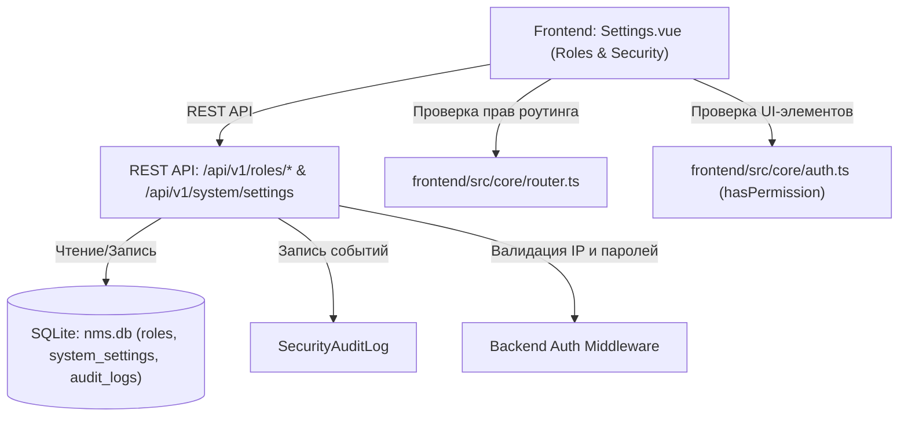

# 🔐 Разграничение прав доступа и управление ролями (RBAC)

---

## 📌 1. Назначение страницы, URL-маршруты и RBAC-права

Страница **«Разграничение прав доступа и управление ролями (RBAC)»** — это центральный комплекс обеспечения информационной безопасности NMS WebUI. Раздел объединяет управление глобальными политиками аутентификации, политиками сложности паролей, ограничениями сеансов, белыми списками IP-адресов, гибкой роль-ориентированной моделью доступа (RBAC), матрицы разрешений и встроенным монитором аудита безопасности.

* **URL-маршрут**: `/settings`
* **Требуемые права доступа (RBAC)**:
  * `roles.view` — Просмотр списка ролей, политики безопасности, матрицы разрешений и привязанных пользователей.
  * `roles.manage` — Изменение глобальных политик безопасности, создание и редактирование ролей, управление тумблерами матрицы прав и удаление кастомных ролей.

---

## 🖥 2. Подробный функциональный состав

Страница состоит из трех ключевых взаимосвязанных секций безопасности:

---

### 2.1. Секция 1: Политики безопасности и аутентификация (Security Policies & Auth)
Управление глобальными правилами безопасности сервера:

1. **Глобальные тумблеры авторизации и 2FA**:
   * **Веб-авторизация (`globalAuth`)**: Переключатель включения/отключения обязательной авторизации в системе (при выключении отображается баннер безопасности).
   * **Обязательная смена пароля (`mandatoryPassword`)**: Требование ротации паролей при первом входе.
   * **Обязательный MFA/2FA (`forceMfaTitle`)**: Требование принудительного включения двухфакторной аутентификации для всех пользователей.

2. **Ограничение частоты входа и блокировка (Rate Limiting & Lockout)**:
   * **Максимальное число попыток входа (`maxLoginAttempts`)**: Число неверных вводов пароля до автоблокировки (от 1 до 20).
   * **Длительность блокировки (`lockoutDuration`)**: Время блокировки аккаунта в минутах (от 1 до 1440 минут).

3. **Жизненный цикл сессий (Session Lifecycle)**:
   * **Срок жизни сессии (`sessionTtlLabel`)**: Максимальная продолжительность сеанса в часах (от 1 до 168 часов).
   * **Таймаут неактивности (`inactivityTimeoutLabel`)**: Время отсутствия действий пользователя в минутах до автовыхода (от 1 до 1440 минут).

4. **Политика сложности паролей (Password Complexity Policy)**:
   * **Минимальная длина пароля (`minPwdLength`)**: От 4 до 64 символов.
   * **Чекбокс Заглавные буквы (`requireUppercase`)**: Требование наличия букв в верхнем регистре (`A-Z`).
   * **Чекбокс Цифры (`requireDigits`)**: Требование наличия цифр (`0-9`).
   * **Чекбокс Спецсимволы (`requireSpecialChars`)**: Требование символов (`!@#$%^&*`).

5. **Белый список IP-адресов (IP Whitelist Policy)**:
   * Ввод подсетей в формате CIDR или отдельных IP-адресов (например, `127.0.0.1, 192.168.1.0/24`), с которых разрешен вход операторов.

---

### 2.2. Секция 2: Реестр ролей и Матрица разрешений (Roles & Permissions)

#### 1. Таблица ролей системы (Roles Table)
* **Защита системных ролей**: Системная роль администратора (`Superuser / admin`, `id: 1`) защищена от удаления и порчи прав.
* **Колонки таблицы**:
  * **Название роли (`roleName`)**: Имя роли с иконкой щита (`shield`).
  * **Описание (`description`)**: Текстовое пояснение области ответственности.
  * **Количество пользователей (`usersCount`)**: Счетчик аккаунтов, привязанных к этой роли.
  * **Действия**: Редактирование роли (`edit`) и Удаление (`delete` — недоступно для системных ролей).

#### 2. Интерактивная Матрица разрешений (Permissions Matrix)
Центральная интерактивная сетка назначения прав доступа:

* **Поиск по матрице (`searchPermsPlaceholder`)**: Текстовый фильтр прав по названию или системному ключу (например, `users.manage`).
* **Категориальная группировка прав**:
  * Группы прав ядра (Ядро, Система, Пользователи, Роли, Устройства, Мониторинг) отмечены иконкой `shield`.
  * Разрешения, принесенные внешними модулями, отмечены иконкой плагина `extension`.
  * Счетчик элементов в категории `(perms.length)`.
* **Массовое переключение категории роли**:
  * В шапке каждой категории под столбцом каждой кастомной роли расположены кнопки **«Выбрать все» (`selectAll`)** и **«Снять все» (`clearAll`)**, позволяющие одним кликом выдать или отзывать все права данной категории для выбранной роли.
  * Для роли `Superuser` права зафиксированы в состоянии `ALL`.
* **Индивидуальные тумблеры прав (`UiToggle`)**: На пересечении строк разрешений и столбцов ролей расположены переключатели точечной выдачи прав.

#### 3. Модальное окно создания и редактирования роли (`Add / Edit Role Modal`)
* Поля: *Название роли (`Role Name`)* и *Описание (`Description`)*.

---

### 2.3. Секция 3: Встроенный монитор аудита безопасности (Security Audit Log Monitor)
Панель оперативного просмотра критических событий безопасности внизу страницы:

* **Поиск по аудиту (`auditSearchPlaceholder`)**: Быстрый фильтр событий.
* **Выпадающее меню категорий фильтрации**:
  * `Все события` (`all`).
  * `Ошибки и сбои` (`errors`).
  * `События аутентификации` (`auth`).
  * `События управления` (`user`).
* **Таблица аудита**: Поля `#ID`, `Штамп времени`, `Оператор`, `Тип действия`, `Ресурс`, `Детали`, `IP-адрес`.
* **Кнопка обновления (`refresh`)** и **Экспорт журнала (`exportLogs`)**.
* **Пагинация**: Страницы событий аудита с кнопками навигации `<` и `>`.

---

## 🔄 3. Взаимодействие с остальным приложением

### 3.1. Backend REST API
* `GET /api/v1/roles`: Загрузка списка ролей с матрицей разрешений и количеством ассоциированных пользователей.
* `POST /api/v1/roles`: Создание новой кастомной роли.
* `PUT /api/v1/roles/{id}`: Обновление наименования и набора прав роли.
* `DELETE /api/v1/roles/{id}`: Удаление кастомной роли.
* `GET /api/v1/permissions`: Получение реестра всех разрешений ядра и установленных модулей.
* `GET/PUT /api/v1/system/settings`: Сохранение глобальных политик (IP Whitelist, Password Policy, Rate Limiting, Session TTL).

### 3.2. База данных `nms.db`
* Таблица `roles`: Хранит записи ролей и JSON-матрицу разрешений (`permissions_json`).
* Таблица `system_settings`: Хранит параметры `max_login_attempts`, `lockout_duration`, `session_ttl`, `min_password_length`, `ip_whitelist`.

### 3.3. Применение правил в системе
* **Защита IP-адресов**: Backend Middleware проверяет IP-адрес входящего запроса по списку `ip_whitelist`.
* **Сложность паролей**: При создании или сбросе пароля проверяются установленные флаги длины, спецсимволов и цифр.
* **Frontend Guards**: Роутер `router.ts` и хелпер `hasPermission` моментально обновляют права пользователя при сохранении матрицы ролей.
