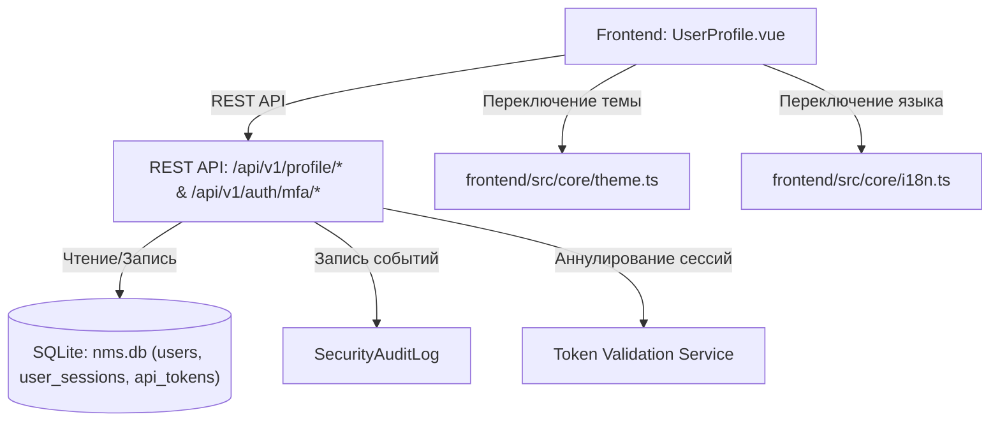

# 👤 Личный кабинет и профиль пользователя

---

## 📌 1. Назначение страницы, URL-маршруты и RBAC-права

Раздел **«Личный кабинет и профиль пользователя»** обеспечивает персональное управление учетной записью текущего оператора. Страница объединяет функции управления аватаром, смены пароля с оценкой криптостойкости, привязки двухфакторной аутентификации (2FA/TOTP), настройки тем оформления, локализации интерфейса, часового пояса с функцией автоопределения геолокации браузера, а также полный мониторинг активных сессий на удаленных устройствах с парсингом бразуера/ОС и возможностью их принудительного отзыва.

* **URL-маршруты**: 
  * `/settings/profile` — Личный кабинет пользователя.
  * `/settings/profile?must_change=true` — Блокирующий режим принудительной смены пароля после первого входа.
* **Требуемые права доступа (RBAC)**: Доступна всем авторизованным пользователям (`requiresAuth: true`).

---

## 🖥 2. Подробный функциональный состав

Страница организована в виде двухколоночного интерактивного макета:

---

### 2.1. Левая колонка (Аватар, Пароль, 2FA/MFA)

#### 1. Карточка аватара и статуса присутствия (Avatar Card)
* **Аватар профиля**:
  * Отображение загруженного фото пользователя или круглой заглушки с инициалами (`initials`).
  * Графический индикатор сеанса на аватаре: 🟢 `Active` (зеленый светодиод активной сессии) или 🔴 `Session Terminated` (красный замок).
* **Сведения об операторе**: Отображаемое полное имя, назначенная роль, системный цифровой идентификатор `UID` (например, `UID: 1002`).
* **Живые цифровые часы (Digital Clock)**: Выводятся в реальном времени с учетом выбранного пользователем часового пояса (`selectedTimezone`).
* **Управление изображением**:
  * **Загрузить (`upload`)**: Модальный выбор файла изображения (`image/*`).
  * **Сбросить (`reset`)**: Возврат к иконке с инициалами.

#### 2. Карточка смены пароля (Security Policies & Password Form)
* **Баннер принудительной смены (`mfaMandatoryPasswordBanner`)**: Всплывает при наличии флага `must_change_password`, блокируя доступ к другим подсистемам WebUI до обновления пароля.
* **Форма смены пароля**:
  * Поля: *Текущий пароль (`currentPassword`)*, *Новый пароль (`newPassword`)*, *Подтверждение пароля (`confirmPassword`)*.
* **Индикатор прочности пароля (Password Strength Meter)**:
  * Рассчитывает сложность пароля по шкале от 1 до 3.
  * Визуальные полосы индикации и понятный цветовой статус (Слабый / Средний / Надежный).

#### 3. Карточка двухфакторной аутентификации (2FA / MFA Card)
* **Статус 2FA**: Бейдж текущего состояния (`mfaEnabled` — `Включена` / `mfaDisabled` — `Выключена`).
* **Информационный баннер жесткой политики (`mfaEnforcedPolicy`)**: Отображается, если 2FA принудительно включена администратором платформы. В этом случае кнопка отключения блокируется.
* **Кнопка «Настроить 2FA» (`mfaSetupBtn`)**: Запускает процедуру привязки 2FA через модальное окно.

---

### 2.2. Правая колонка (Персональные данные, Региональность, Сессии)

#### 1. Карточка персональных данных (Personal Information Card)
* **Редактируемые поля**:
  * **Полное имя (`fullName`)**: Отображаемое ФИО оператора.
  * **E-mail (`emailAddress`)**: Электронный адрес для получения системных алертов.
* **Поля только для чтения (`readonlyField`)**:
  * **Отдел / Подразделение (`department`)**: Закрепленное подразделение оргструктуры.
  * **Роль (`role`)**: Текущая назначенная роль в системе.
* **Детектор несохраненных изменений (`useDirtyGuard`)**: Кнопка **«Сохранить изменения»** подсвечивается свечением `shadow-glow` только при наличии изменений в полях.

#### 2. Карточка оформления и региональности (Appearance & Regionality)
* **Выбор темы интерфейса (`theme`)**: Переключатель режимов — `Системная` (`system`), `Темная` (`dark`), `Светлая` (`light`). Мгновенно меняет цветовую гамму приложения без перезагрузки.
* **Язык интерфейса (`language`)**: Переключатель локализации — `Русский` (`ru`) или `English` (`en`).
* **Выбор часового пояса (`timezone`)**:
  * Выпадающий список всех часовых поясов мира (`availableTimezones`).
  * **Кнопка «Автоопределение» (`autoDetect`)**: Автоматически считывает часовой пояс браузера оператора через иконку геолокации `my_location`.

#### 3. Карточка управления активными сессиями (Active Sessions Table)
Полный контроль подключенных устройств текущего пользователя:

* **Кнопки управления сессиями**:
  * **Завершить другие сессии (`terminateOthersBtn`)**: Отозвать авторизацию со всех устройств, кроме текущего.
  * **Завершить все и выйти (`terminateAllLogoutBtn`)**: Мгновенный принудительный выход со всех устройств, включая текущее.
* **Таблица активных устройств**:
  * **IP-адрес**: IPv4/IPv6 адрес подключения с бейджем **«Текущая сессия» (`sessionCurrentBadge`)**.
  * **Устройство и Браузер (`deviceBrowser`)**: Автоматический парсинг строки User-Agent с выводом понятного браузера и ОС (например, `Chrome (Linux)`, `Firefox (Windows)`, `Safari (iOS)`).
  * **Время последней активности (`lastSeen`)**: Время последнего API-запроса, отформатированное с учетом выбранного часового пояса.
  * **Кнопка «Отозвать» (`sessionRevokeBtn`)**: Закрытие конкретного сеанса связи.

---

### 2.3. Модальные окна

#### Модальное окно настройки 2FA / MFA (`Setup 2FA Modal`)
1. **Инструкция по сканированию**: Руководство по привязке приложения-аутентификатора.
2. **QR-код**: Отрисовка графического QR-кода для сканирования камерой телефона.
3. **Секретный ключ (`mfaSecretKey`)**: Вывод 16-значного текстового ключа с возможностью быстрого выделения и копирования.
4. **Код подтверждения (`mfaEnterCodeToConfirm`)**: 6-значное поле ввода одноразового кода для проверки и финальной активации 2FA.

---

## 🔄 3. Взаимодействие с остальным приложением

### 3.1. Backend REST API
* `GET /api/v1/profile`: Получение профиля оператора, статуса 2FA и настроек темы/языка.
* `PUT /api/v1/profile`: Обновление ФИО, email, темы, языка и часового пояса.
* `POST /api/v1/profile/change-password`: Изменение пароля и сброс флага принудительной смены.
* `POST /api/v1/auth/mfa/setup` / `POST /api/v1/auth/mfa/verify`: Генерация QR-кода и активация 2FA.
* `POST /api/v1/auth/mfa/disable`: Отключение 2FA (с проверкой флага принудительной политики).
* `GET /api/v1/profile/sessions`: Загрузка списка всех активных сессий пользователя.
* `DELETE /api/v1/profile/sessions/{id}`: Отзыв конкретной сессии.
* `POST /api/v1/profile/sessions/terminate-others`: Отзыв всех сессий, кроме текущей.

### 3.2. Хранение данных в `nms.db`
* Таблица `users`: Поля `full_name`, `email`, `password_hash`, `mfa_secret`, `avatar_url`, `theme_preference`, `timezone_preference`.
* Таблица `user_sessions`: Поля `token_jti`, `ip_address`, `user_agent`, `last_seen`.

### 3.3. Локализация и темы на клиентской стороне
* **Интеграция с `theme.ts`**: Изменение темы мгновенно обновляет переменные цвета CSS на всех вкладках WebUI.
* **Интеграция с `i18n.ts`**: Переключение языка меняет тексты интерфейса и генерирует событие `nms-language-changed`.
* **Автоопределение часового пояса**: Вызов API `Intl.DateTimeFormat().resolvedOptions().timeZone` считывает часовой пояс браузера.
