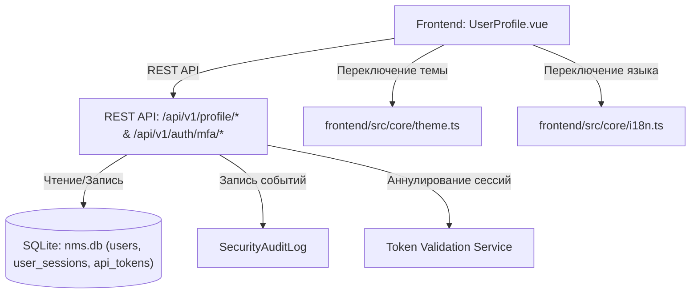

# 👤 Личный кабинет и профиль пользователя

---

## 📌 1. Назначение страницы, URL-маршруты и RBAC-права

Раздел **«Личный кабинет и профиль пользователя»** предназначен для индивидуальной настройки параметров учетной записи текущего оператора. Страница позволяет изменять персональные данные, обновлять пароль, настраивать двухфакторную аутентификацию (2FA/TOTP), отслеживать и завершать активные сессии на других устройствах, выпускать персональные API-токены и изменять визуальное оформление интерфейса WebUI.

* **URL-маршрут**: `/settings/profile` (при необходимости смены пароля: `/settings/profile?must_change=true`)
* **Требуемые права доступа (RBAC)**: Доступна всем авторизованным пользователям (`requiresAuth: true`).

---

## 🖥 2. Подробный функциональный состав

### 2.1. Персональные данные и фото профиля
* **Загрузка аватара (`Avatar Manager`)**:
  * Загрузка пользовательского изображения (JPEG, PNG, WebP).
  * Кнопка **«Удалить аватар»**: сброс к иконке с инициалами пользователя.
* **Поля профиля**:
  * **Имя пользователя (`Username`)**: Отображение системного логина (только для чтения).
  * **Полное имя (`Full Name`)**: Редактируемое поле отображаемого имени.
  * **Email**: Редактируемый адрес электронной почты для получения уведомлений.
  * **Бейдж роли**: Отображение текущей назначенного статуса доступа (`Администратор`, `Оператор` и т.д.).

---

### 2.2. Безопасность и смена пароля
* **Баннер принудительной смены пароля**: Появляется вверху страницы, если администратор установил флаг `must_change_password`. Все остальные разделы WebUI блокируются до выполнения процедуры.
* **Форма смены пароля**:
  * Поля: *Текущий пароль*, *Новый пароль*, *Подтверждение нового пароля*.
  * Индикатор надежности пароля (проверка длины, наличия спецсимволов и цифр).

---

### 2.3. Двухфакторная аутентификация (2FA / TOTP)
* **Статус 2FA**: Индикатор состояния (`Включена` / `Выключена`).
* **Процедура активации (QR-код и TOTP)**:
  1. Нажатие кнопки **«Включить 2FA»** генерирует секретный ключ.
  2. Отображается QR-код для сканирования в приложениях (Google Authenticator, Яндекс Ключ, Authy).
  3. Ввод 6-значного одноразового кода подтверждения для завершения привязки.
* **Отключение 2FA**: Отключение требует подтверждения ввода текущего пароля оператора.

---

### 2.4. Управление активными сессиями (Active Sessions)
Таблица текущих сеансов входа текущего пользователя:

* **Информационные поля**: IP-адрес, браузер и операционная система (User-Agent), дата входа и время последней активности.
* **Текущая сессия**: Отмечена бейджем *«Текущая сессия»*.
* **Действия**:
  * **Завершить сессию (`Logout session`)**: Кнопка закрытия конкретного сеанса на удаленном устройстве.
  * **Завершить все остальные сессии (`Revoke All Other Sessions`)**: Мгновенный отзыв доступа со всех устройств, кроме текущего.

---

### 2.5. Персональные API-токены (Personal Access Tokens)
Раздел для разработчиков и скриптов автоматизации:

* **Список токенов**: Таблица с названиями токенов, разрешенными скоупами доступа, датой создания и датой истечения срока действия.
* **Генерация токена**:
  * Задание имени токена (например, *«Скрипт резервного копирования»*), срока жизни (30, 90 дней или бессрочно) и прав доступа.
  * Модальное окно вывода сгенерированного токена (показывается только один раз).
* **Отзыв токена (`Revoke Token`)**: Удаление токена и мгновенная блокировка API-запросов от его имени.

---

### 2.6. Персонализация интерфейса (Preferences)
* **Тема оформления**: Переключатель темы — `Темная` (Dark Mode), `Светлая` (Light Mode) или `Системная` (System).
* **Язык интерфейса**: Выбор языка отображения (`Русский` / `English`).
* **Интервал автообновления**: Настройка частоты опроса данных в виджетах.

---

## 🔄 3. Взаимодействие с остальным приложением

### 3.1. Backend REST API
* `GET /api/v1/profile`: Получение профиля текущего пользователя.
* `PUT /api/v1/profile`: Обновление личных данных и настроек.
* `POST /api/v1/profile/change-password`: Смена пароля и сброс флага `must_change_password`.
* `POST /api/v1/auth/mfa/setup` & `POST /api/v1/auth/mfa/verify`: Настройка и проверка 2FA.
* `GET/DELETE /api/v1/profile/sessions`: Просмотр и завершение активных сессионных токенов.
* `GET/POST/DELETE /api/v1/profile/tokens`: Управление персональными API-ключами.

### 3.2. База данных `nms.db`
* Таблица `users`: Обновление `full_name`, `email`, `password_hash`, `mfa_secret`, `avatar_url`, `theme_preference`.
* Таблица `user_sessions`: Хранение сессий, IP-адресов и меток последней активности.
* Таблица `api_tokens`: Реестр токенов и их хешей.

### 3.3. Влияние на клиентское приложение (Frontend State)
* **Реактивность темы (`theme.ts`)**: Смена темы мгновенно обновляет CSS-переменные цвета на всех страницах WebUI без перезагрузки.
* **Локализация (`i18n.ts`)**: Переключение языка меняет язык интерфейса и генерирует событие `nms-language-changed` для динамического обзора заголовков.
* **Блокирующий редирект**: Если у пользователя активен флаг `must_change_password`, роутер `router.ts` удерживает оператора на странице профиля до смены пароля.

### 3.4. Аудит безопасности
* Смена пароля, активация 2FA, завершение сессий и создание API-токенов автоматически записываются в `SecurityAuditLog`.
