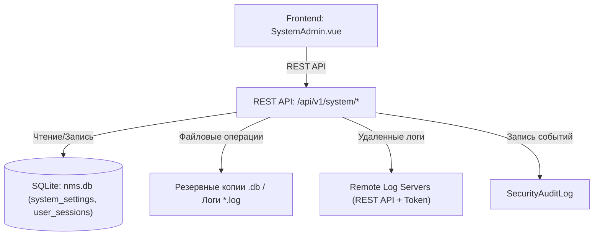

# ⚙️ Системное администрирование платформы

---

## 📌 1. Назначение страницы, URL-маршруты и RBAC-права

Раздел **«Системное администрирование платформы»** — это главный узел оперативно-технического управления NMS WebUI. Раздел включает инструменты создания и восстановления резервных копий базы данных `nms.db`, ручной ротации журналов аудита, управления всеми открытыми сеансами связи пользователей в системе, а также встроенный терминал вывода системных логов с поддержкой локальных файлов и удаленных log-серверов (Remote Log Sources).

* **URL-маршрут**: `/settings/system`
* **Требуемые права доступа (RBAC)**:
  * `system.admin` — Полный доступ к бэкапам, ротации аудита, сбросу сессий всех пользователей, подсоединению удаленных серверов логов и просмотру журналов.
  * `system.logs` — Просмотр встроенного терминала системных логов.

---

## 🖥 2. Подробный функциональный состав

Страница состоит из трех ключевых функциональных секций:

---

### 2.1. Секция 1: Резервное копирование и Восстановление (Backup & Restore)

Управление сохранностью и целостностью данных:

1. **Скачать резервную копию (`downloadBackup`)**:
   * Кнопка со свечением `shadow-glow`, инициирующая моментальное создание снимка базы данных SQLite `nms.db` и выгружающая файл `.db` на ПК администратора.

2. **Восстановить из файла (`restoreBackup`)**:
   * Загрузка файла резервной копии `.db` с локального компьютера для полного восстановления структуры таблиц, настроек, пользователей и ролей.
   * Анимированный индикатор выполнения восстановления (`restoring`).

3. **Ротация журналов аудита (`rotateAuditBtn`)**:
   * Кнопка выполнения принудительной ротации и архивации старых записей `SecurityAuditLog` для предотвращения переполнения диска.

---

### 2.2. Секция 2: Активные сессии и Безопасность системы (Active System Sessions)

Общий консольный мониторинг всех операторов, авторизованных в системе в данный момент:

1. **Групповой сброс сессий**:
   * **Завершить другие сессии (`terminateOthersBtn`)**: Принудительное разлогинивание всех пользователей системы, кроме текущей сессии администратора.
   * **Завершить все и выйти (`terminateAllLogoutBtn`)**: Мгновенное завершение абсолютно всех сессий в системе с принудительным выходом на экран входа `/login`.

2. **Таблица текущих сессий**:
   * **Логин и Роль**: Имя пользователя с бейджем роли и пометкой **«Текущая сессия» (`sessionCurrentBadge`)**.
   * **IP-адрес и Устройство**: Сетевой IPv4/IPv6 адрес подключения и User-Agent браузера.
   * **Время активности**: Штамп последнего REST API запроса.
   * **Индивидуальный отзыв (`revoke`)**: Кнопка закрытия доступа конкретной сессии любого пользователя системы.

---

### 2.3. Секция 3: Встроенный терминал системных логов (System Logs Viewer)

Полноэкранная интерактивная консоль сбора и анализа журналов сервера:

1. **Выбор источника логов (`logFile`)**:
   * Загрузка локальных файлов сервера с отображением категории и точного размера на диске (например, `[system] backend.log (2.3 MB)`, `[mcp] mcp-server.log (105 KB)`, `[access] access.log`).

2. **Фильтр по уровню важности (`logLevel`)**:
   * Переключатель `ALL`, `ERROR`, `WARN`, `INFO`, `DEBUG`.

3. **Поиск по логам (`searchLogsPlaceholder`)**:
   * Живой текстовый поиск по фрагментам выводимого терминала (`data-testid="log-search-input"`).

4. **Автообновление (`autoRefresh`)**:
   * Чекбокс периодического опроса файла для поступающих строк в реальном времени.

5. **Инструменты консоли**:
   * **Обновить (`refresh`)**: Ручной перезапрос файла со спиннер-анимацией.
   * **Очистить экран (`clearLogsScreen`)**: Сброс содержимого терминала на экране (иконка `cleaning_services`).
   * **Скачать лог (`downloadLogTooltip`)**: Скачивание файла журнала на ПК.

6. **Подключение удаленного log-сервера (`remoteServer`)**:
   * Кнопка `add_link` вызывает модальное окно добавлении удаленного источника логов.
   * **Модальное окно `Add Remote Log Source`**:
     * *Имя источника (`sourceName`)* — Понятный заголовок сервера.
     * *URL REST API сервера (`serverRestApiUrl`)* — Эндпоинт (например, `http://192.168.1.50:9000/api/system/logs/backend.log`).
     * *API Token (`apiTokenOptional`)* — Необязательный токен авторизации (`Bearer token`).

7. **Терминальный холст вывода**:
   * Темная консоль (`bg-zinc-950`) с подсветкой строк по уровням важности (красный для ошибок, желтый для предупреждений).

---

## 🔄 3. Взаимодействие с остальным приложением

### 3.1. Backend REST API
* `GET /api/v1/system/backup`: Создание и скачивание резервной копии БД.
* `POST /api/v1/system/restore`: Восстановление базы данных из загруженного `.db` файла.
* `POST /api/v1/system/audit/rotate`: Принудительная ротация аудита.
* `GET /api/v1/system/sessions`: Загрузка списка всех активных сессий пользователей платформы.
* `DELETE /api/v1/system/sessions/{id}`: Отзыв сессии выбранного пользователя.
* `POST /api/v1/system/sessions/terminate-all`: Групповой сброс сессий.
* `GET /api/v1/system/logs`: Получение списка доступных источников логов.
* `GET /api/v1/system/logs/{id}/content`: Чтение содержимого log-файла с фильтрацией.
* `POST /api/v1/system/logs/remote`: Сохранение конфигурации удаленного log-сервера.

### 3.2. База данных `nms.db`
* Горячее копирование и восстановление файла базы данных `nms.db`.
* Таблица `user_sessions`: Массовая отчистка записей сеансов при нажатии кнопок сброса.

### 3.3. Аудит и Безопасность
* Восстановление базы данных, скачивание бэкапов, ротация логов и отмена сессий пользователей регистрируются с наивысшим приоритетом в `SecurityAuditLog`.
