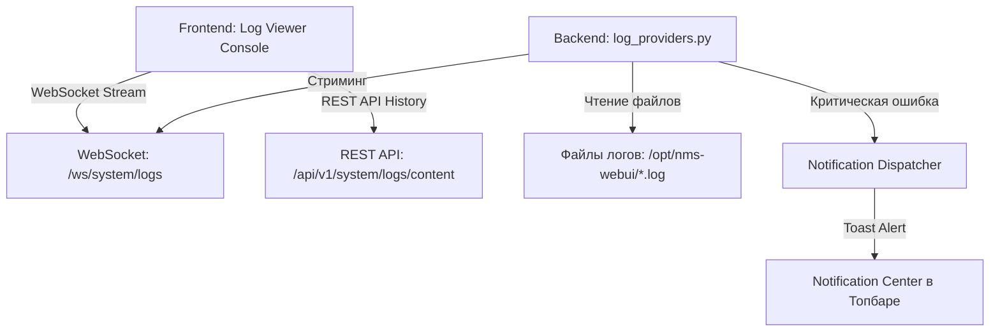

# 📊 Журналы системы и мониторинг состояния

---

## 📌 1. Назначение страницы, URL-маршруты и RBAC-права

Раздел **«Системные журналы и мониторинг»** предоставляет инженерному персоналу и администраторам инструменты онлайн-отслеживания работы серверных компонентов NMS WebUI. Раздел обеспечивает диагностику ошибок в реальном времени, поиск сбойных ситуаций по логам, анализ производительности и выгрузку дамп-файлов.

* **URL-маршрут**: `/settings/system` (вкладка *Системные журналы*)
* **Требуемые права доступа (RBAC)**: `system.logs` или `system.admin`.

---

## 🖥 2. Подробный функциональный состав

### 2.1. Панель управления журналами (Log Control Bar)
Управление источниками и режимом отображения логов:

1. **Выбор источника логов (`Log Source Dropdown`)**:
   * `Основное ядро (backend.log)` — Логи основного процесса REST API и бизнес-логики.
   * `MCP-сервер (mcp-server.log)` — Логи взаимодействия с подсистемой AI-агентов и интеграторов.
   * `HTTP-запросы (access.log)` — Журнал сетевых запросов клиентов.
   * `Системные задачи (celery.log)` — Логи фоновых асинхронных задач.

2. **Фильтры по уровню важности (Severity Levels)**:
   * Кнопки-переключатели: `ВСЕ`, `DEBUG`, `INFO`, `WARNING`, `ERROR`, `CRITICAL`.

3. **Режим «Живого стриминга» (Live Tail Controls)**:
   * **Старт / Пауза (`play_arrow / pause`)**: Приостановка потока новых записей для спокойного изучения кода ошибки.
   * **Автоскролл (`Auto-scroll`)**: Автоматическая прокрутка консоли вниз при поступлении новых строк.
   * **Очистить консоль (`clear_all`)**: Очищает текущий экран просмотра без удаления файлов на диске.

4. **Поиск и фильтрация строк**:
   * Поле текста с поддержкой обычного текстового поиска и **регулярных выражений (Regex)**.
   * Переключатель учет регистра (Case sensitivity).

---

### 2.2. Терминальная консоль логов (Log Terminal Console)
Интерактивный экран вывода текстовых записей:

* **Структура строки лога**:
  * **Штамп времени (Timestamp)**: Точное время события в формате `YYYY-MM-DD HH:mm:ss.SSS`.
  * **Уровень (Severity Badge)**: Цветовая подсветка уровня (`ERROR` — красный, `WARN` — желтый, `INFO` — зеленый).
  * **Источник / Модуль**: Название подсистемы (например, `core.auth`, `modules.collector`).
  * **Текст сообщения**: Описание события или фрагмент кода.
* **Просмотр Stacktrace**: При клике на строку с ошибкой откроется модальное окно с полным многострочным стеком вызовов Python/Node.js.

---

### 2.3. Экспорт и настройка ротации
* **Скачать файл логов (`Download Logs`)**: Выгрузка полного текущего log-файла.
* **Экспорт отфильтрованного списка**: Сохранение текущих отфильтрованных строк консоли в файл `.txt` или `.json`.

---

## 🔄 3. Взаимодействие с остальным приложением

### 3.1. Backend REST API
* `GET /api/v1/system/logs/sources`: Получение списка доступных log-файлов на сервере.
* `GET /api/v1/system/logs/content`: Загрузка исторических строк лога за выбранный период.
* `GET /api/v1/system/logs/download`: Формирование и скачивание архива логов.

### 3.2. WebSockets и Стриминг логов
* Клиентский интерфейс устанавливает постоянное WebSocket-соединение с эндпоинтом `/ws/system/logs`.
* Серверный модуль `log_providers.py` использует файловые уведомления ядра Linux (inotify) для моментального отправления новых строк в браузер оператора.

### 3.3. Интеграция с Центром Уведомлений
* При обнаружении строк с уровнем `CRITICAL` подсистема `log_providers.py` автоматически передает событие в `notification_dispatcher.py`, создавая всплывающее красное Toast-уведомление для всех подключенных администраторов.
