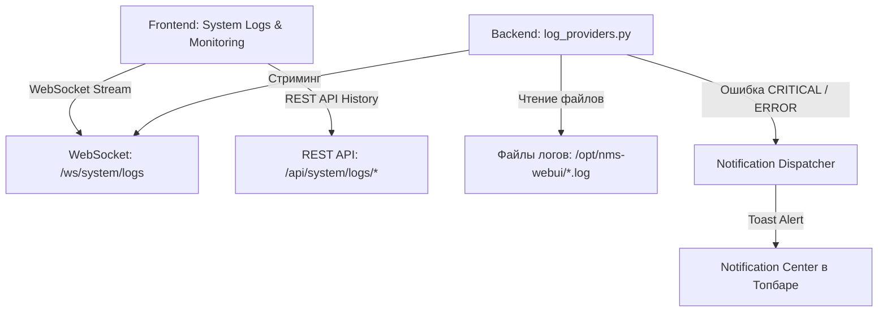

# 📊 Журналы системы и мониторинг состояния

---

## 📌 1. Назначение страницы, URL-маршруты и RBAC-права

Раздел **«Журналы системы и мониторинг состояния»** предназначен для системных инженеров и администраторов NMS WebUI. Раздел объединяет функционал аппаратного мониторинга серверов (загрузка ЦП, RAM, дисков, статус фоновых демонов) и полнофункциональный консольный терминал просмотра системных логов с поддержкой локальных журналов, внешних удаленных серверов (Remote Log Sources), WebSocket-стриминга в реальном времени и автоматической эскалации аварий в Центр Уведомлений.

* **URL-маршруты**: 
  * `/settings/system` (секция *Системные журналы* и *Состояние службы*).
  * Экраны мониторинга телеметрии на Главном Дашборде (`/`).
* **Требуемые права доступа (RBAC)**: `system.logs` или `system.admin`.

---

## 🖥 2. Подробный функциональный состав

Страница состоит из двух взаимосвязанных блоков: подсистемы телеметрии состояния и консоли системных логов.

---

### 2.1. Подсистема мониторинга состояния (System Health Monitoring)

Отслеживание жизнедеятельности аппаратной и программной инфраструктуры платформы:

1. **Аппаратные метрики сервера (Hardware Telemetry Metrics)**:
   * **Загрузка ЦП (`CPU Load %`)**: Опрос использования ядер процессора в реальном времени через `/proc/stat`.
   * **Оперативная память (`RAM Memory Usage`)**: Мониторинг объем занятой и свободной памяти, объемов буферов и Swap-файла.
   * **Дисковое пространство (`Disk Storage`)**: Занятость раздела `/` и объем базы данных `nms.db`.
   * **Сетевой трафик**: Скорость передачи данных (Входящий / Исходящий поток в Кбит/с и Мбит/с).

2. **Мониторинг фоновых служб (Services Status Table)**:
   * **Ядро REST API (`Backend Python Core`)**: Проверка отклика процессов FastAPI.
   * **База данных (`SQLite Integrity Check`)**: Проверка состояния файла базы и WAL-журнала.
   * **Асинхронные задачи (`Background Workers`)**: Отслеживание работы системных воркеров.
   * **Шлюз WebSockets (`WebSocket Gateway`)**: Проверка статуса сокет-соединений.

---

### 2.2. Консольный терминал системных логов (System Logs Viewer)

Интерактивная среда анализа и поиска логов:

1. **Выбор источника логов (`logFile`)**:
   * Загрузка файлов сервера со сводкой категории и размера (например, `[system] backend.log (2.3 MB)`, `[mcp] mcp-server.log (105 KB)`, `[access] access.log`).

2. **Подключение удаленных log-серверов (`remoteServer`)**:
   * Кнопка `add_link` вызова модального окна добавления удаленного сервера.
   * **Модальное окно `Add Remote Log Server`**:
     * *Имя источника (`sourceName`)* — Понятное название удаленного узла.
     * *URL REST API (`serverRestApiUrl`)* — Прямая ссылка на эндпоинт журнала.
     * *API Token (`apiTokenOptional`)* — Авторизация по Bearer-токену.

3. **Фильтрация по уровням важности (`logLevel`)**:
   * Переключатели `ALL`, `ERROR`, `WARN`, `INFO`, `DEBUG`.

4. **Живой текстовый поиск (`searchLogsPlaceholder`)**:
   * Поле подсвечиваемого поиска строк с поддержкой регулярных выражений (Regex).

5. **Режим «Живого стриминга» (Live Tail) и Автообновление (`autoRefresh`)**:
   * Включение периодического опроса поступления новых строк в терминал.
   * Автоматическая прокрутка экрана к последним поступившим событиям.

6. **Инструменты терминала**:
   * **Обновить (`refresh`)**: Запрос последних данных файла с индикацией загрузки.
   * **Очистить консоль (`clearLogsScreen`)**: Сброс выведенного текста с экрана (иконка `cleaning_services`).
   * **Скачать журнал (`download`)**: Загрузка log-файла целиком на локальный ПК.

7. **Терминальная консоль (`bg-zinc-950`)**:
   * Отображение штампов времени, источников, уровней важности (красный для `ERROR`, желтый для `WARN`, зеленый для `INFO`) и многострочных стектрейсов ошибок.

---

## 🔄 3. Взаимодействие с остальным приложением

### 3.1. Backend REST API
* `GET /api/system/logs`: Список доступных локальных и удаленных log-источников.
* `GET /api/system/logs/{log_name}`: Чтение содержимого журнала с поиском (`search`), лимитом (`lines`) и фильтрацией по уровням (`level`).
* `POST /api/system/logs/remote-sources`: Сохранение подключения к удаленному log-серверу.
* `DELETE /api/system/logs/remote-sources/{source_id}`: Удаление удаленного источника логов.

### 3.2. WebSockets и Стриминг
* Подключение к каналу `/api/events/ws` обеспечивает получение событий и обновлений в реальном времени.

### 3.3. Эскалация ошибок в Центр Уведомлений
* При появлении в `backend.log` или `mcp-server.log` критических строк (`CRITICAL` или `ERROR`) подсистема `log_providers.py` передает аварию в `notification_dispatcher.py`, формируя всплывающее Toast-уведомление и создавая запись в Центре Уведомлений в шапке UI.
