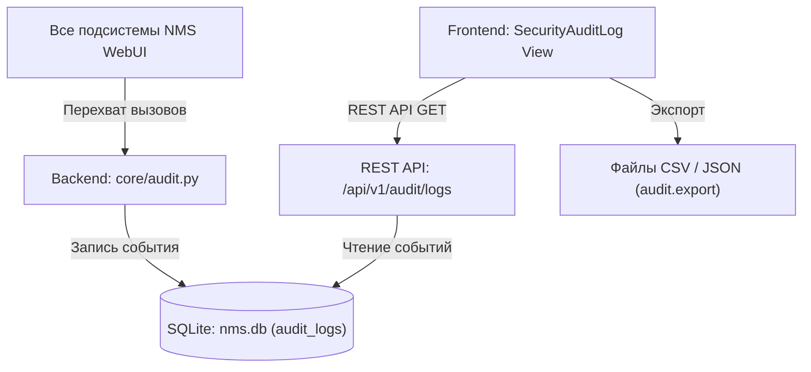

# 🛡 Журнал аудита безопасности (Security Audit Log)

---

## 📌 1. Назначение страницы, URL-маршруты и RBAC-права

**Журнал аудита безопасности (Security Audit Log)** — это сквозной элемент контроля защищенности и прозрачности NMS WebUI. Подсистема обеспечивает неотвратимую и неизменяемую фиксацию всех юридически значимых и критических действий пользователей: от попыток входа и смены паролей до изменения ролей доступа, блокировки операторов, установки модулей, ручной ротации журналов и восстановления системы из бэкапов.

* **URL-маршруты**: 
  * `/settings` (встроенный модуль *Security Audit Log Monitor*).
  * `/settings/system` (секция *Аудит безопасности*).
* **Требуемые права доступа (RBAC)**:
  * `system.admin` или `audit.view` — Просмотр таблицы аудита, поиск, категориальная фильтрация и откровение деталей событий.
  * `audit.export` — Право выгрузки реестра событий аудита в форматы CSV и JSON.

---

## 🖥 2. Подробный функциональный состав

Страница состоит из панели фильтрации, таблицы фиксации событий, модального окна инспекции деталей и панели экспорта:

---

### 2.1. Панель поиска и категории событий (Action & Filter Bar)

1. **Живой текстовый поиск (`auditSearchPlaceholder`)**:
   * Текстовое поле быстрой фильтрации по номеру события (`#ID`), имени пользователя (`username`), коду действия (`action`), названию целевого ресурса (`resource`), IP-адресу или подробностям (`details`).

2. **Выпадающее меню категорий событий (`filterEventsTooltip`)**:
   * `Все события` (`allEvents / all`) — Полный неотфильтрованный журнал.
   * `Ошибки и сбои` (`errorsFailures / errors`) — Только неудачные попытки входа, отказы в доступе и сбои операций.
   * `Аутентификация` (`authEvents / auth`) — События входа/выхода, вводы 2FA, блокировки по превышению попыток пароля.
   * `Управление и конфигурация` (`mgmtEvents / user`) — Изменения учетных записей, ролей, политик безопасности и системных настроек.

3. **Кнопка обновления (`refresh`)**:
   * Перезапрос данных с сервера для считывания самых последних событий аудита.

4. **Кнопка экспорта журнала (`exportLogs`)**:
   * Выгрузка текущего списка событий в файл CSV или JSON (активна при наличии права `audit.export`).

---

### 2.2. Таблица событий аудита (Audit Events Table)

Интерактивная таблица с цветовыми индикаторами важности действий:

* **Колонки таблицы**:
  1. **# ID**: Системный порядковый номер записи (например, `#1048`).
  2. **Штамп времени (`timestamp`)**: Дата и время события в формате `YYYY-MM-DD HH:mm:ss.SSS`.
  3. **Оператор (`user`)**: Логин пользователя, выполнившего действие (например, `admin`).
  4. **Действие (`action`)**: Цветовой бэйдж системного кода события (`USER_LOCKED`, `ROLE_CREATED`, `LOGIN_FAILED`, `MFA_ENABLED` и др.):
     * 🟢 Зеленый бэйдж — Успешное выполнение.
     * 🟡 Желтый бэйдж — Предупреждение или изменение конфигурации.
     * 🔴 Красный бэйдж — Ошибка или отказ в доступе.
  5. **Ресурс (`resource`)**: Целевой объект воздействия (например, `User: operator_2`, `Role: Security Engineer`, `System Settings`).
  6. **Детали (`details`)**: Краткое текстовое описание изменений с иконкой `info` при наведении.
  7. **IP-адрес (`ipAddress`)**: Сетевой IPv4/IPv6 адрес клиента или пометка `local`.

* **Пагинация таблицы (Pagination Footer)**:
  * Отображение общего количества записей (`totalEventsCount`).
  * Текущая страница и общее число страниц.
  * Кнопки перелистывания `<` и `>`.

---

### 2.3. Модальное окно инспекции деталей события (Event Details Modal)

При клике на любую строку таблицы раскрывается окно глубокого аудита:

* **Полный JSON-дамп события**: Вывод всей структуры метаданных записи.
* **Инспекция состояний (JSON Diff)**:
  * `Before State`: Состояние объекта до выполнения операции.
  * `After State`: Итоговое состояние объекта после внесения изменений.
* **Сетевой контекст**: Вызванный API-эндпоинт (`POST /api/v1/users/4/lock`), HTTP-метод, User-Agent браузера и идентификатор сессии `session_id`.

---

### 2.4. Гарантия неизменяемости (Immutability & Non-repudiation)
* Записи подсистемы `SecurityAuditLog` защищены от редактирования или выборочного удаления через пользовательский интерфейс WebUI.
* Единственный способ очистки устаревших записей — принудительная ручная ротация (`rotateAuditBtn`) или автоматическая системная ротация файлов при достижении лимита хранения.

---

## 🔄 3. Взаимодействие с остальным приложением

### 3.1. Backend REST API
* `GET /api/v1/audit/logs`: Получение списка записей аудита с поддержкой поиска (`query`), категории (`category`), диапазона дат и пагинации.
* `GET /api/v1/audit/categories`: Реестр категорий аудит-событий.
* `GET /api/v1/audit/export`: Генерация и скачивание файлов выгрузки `.csv` / `.json`.

### 3.2. Автоматический перехват событий (`audit.py`)
* Подсистема `backend/core/audit.py` автоматически регистрирует события при вызове функций в сервисах пользователей, ролей, модулей, авторизации и системного администрирования.

### 3.3. Таблица БД `nms.db`
* Таблица `audit_logs`: Поля `id`, `timestamp`, `user_id`, `username`, `action`, `category`, `status`, `resource`, `details`, `ip_address`, `before_state`, `after_state`.
