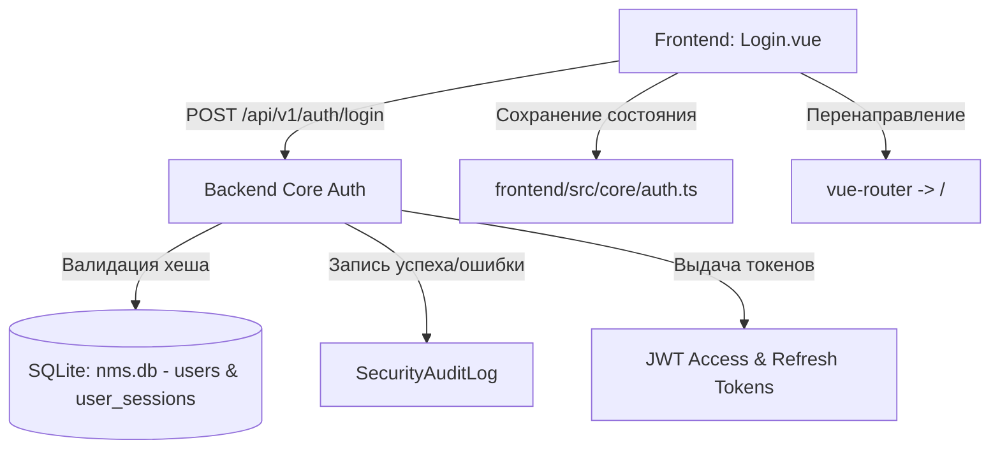

# 🔑 Авторизация, аутентификация и вход в систему

---

## 📌 1. Назначение страницы, URL-маршруты и RBAC-права

Страница **«Вход в систему»** обеспечивают защиту платформы NMS WebUI от несанкционированного доступа. Она реализует механизмы аутентификации по логину и паролю, проверки двухфакторных кодов (2FA/TOTP), защиты от перебора паролей (Brute-force protection), автовыхода по таймауту неактивности и управления токенами сессий.

* **URL-маршрут**: `/login`
* **Требуемые права доступа (RBAC)**: Публичный доступ (`requiresAuth: false`). Авторизованные пользователи автоматически перенаправляются на Главный Дашборд.

---

## 🖥 2. Подробный функциональный состав

### 2.1. Форма входа (Login Form)
* **Поля ввода**:
  * **Имя пользователя (`Username`)**: Текстовое поле ввода логина.
  * **Пароль (`Password`)**: Скрытое поле ввода с кнопкой переключения видимости символов (`visibility / visibility_off`).
  * **Запомнить меня (`Remember Me`)**: Чекбокс сохранения длительной сессии.
* **Кнопка «Войти» (`Log In`)**: Запуск проверки учетных данных на сервере.

---

### 2.2. Форма ввода двухфакторного кода (2FA Challenge)
Появляется автоматически, если у учетной записи активирована 2FA:

* **Поле ввода 6-значного кода**: Ввод динамического TOTP-кода из аутентификатора.
* **Кнопка подтверждения**: Валидация кода и выдача JWT-токена доступа.

---

### 2.3. Механизмы защиты и блокировки
1. **Защита от перебора паролей (Brute-Force Lockout)**:
   * При превышении допустимого количества неверных попыток (по умолчанию 5 попыток) аккаунт временно блокируется.
   * На экране выводится сообщение с таймером обратного отсчета разблокировки.

2. **Принудительная смена пароля (`must_change_password`)**:
   * Если администратор создал пользователя с флагом смены пароля, после первого входа роутер заблокирует доступ ко всем страницам и перенаправит в Профиль (`/settings/profile?must_change=true`).

3. **Автоматический выход по неактивности (Idle Timeout)**:
   * Модуль `useIdleTimeout.ts` отслеживает движения мыши и нажатия клавиш.
   * При отсутствии активности в течение заданного времени (например, 15 минут) выводится всплывающее предупреждение, после чего происходит автовыход.

---

## 🔄 3. Взаимодействие с остальным приложением

### 3.1. Backend REST API
* `POST /api/v1/auth/login`: Первичная аутентификация логин/пароль.
* `POST /api/v1/auth/mfa/challenge`: Проверка TOTP-кода.
* `POST /api/v1/auth/refresh`: Бесшовное обновление Access-токена по Refresh-токену.
* `POST /api/v1/auth/logout`: Аннулирование сессионных токенов на сервере.
* `GET /api/v1/auth/status`: Проверка текущего статуса авторизации сессии.

### 3.2. Хранение токенов и перехватчик Axios (`api.ts`)
* После успешного входа Access-токен сохраняется в реактивной структуре `auth.ts`.
* Перехватчик запросов в `api.ts` автоматически подставляет заголовок `Authorization: Bearer <token>` во все последующие REST API запросы.
* При получении ошибки `401 Unauthorized` перехватчик делает попытку автоматически обновить токен через `/api/v1/auth/refresh`.

### 3.3. Аудит безопасности
* Все успешные входы, ошибки ввода пароля, блокировки аккаунтов и автовыходы немедленно регистрируются в `SecurityAuditLog` с фиксацией IP-адреса.
