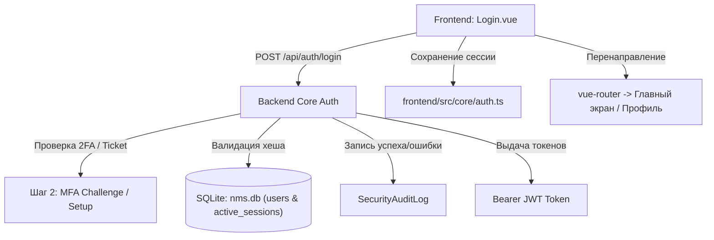

# 🔑 Авторизация, аутентификация и вход в систему

---

## 📌 1. Назначение страницы, URL-маршруты и RBAC-права

Раздел **«Авторизация, аутентификация и вход в систему»** — это входные ворота безопасности платформы NMS WebUI. Подсистема обеспечивает двухэтапную аутентификацию по логину и паролю, проверку кодов двухфакторной аутентификации (2FA/TOTP), первичное сканирование QR-кода при вынужденной регистрации 2FA прямо на экране входа, переключение языков (RU/EN), защиту от перебора паролей (Brute-force lockout), отслеживание активности сессии (Idle timeout) и редиректы при принудительной смене пароля.

* **URL-маршрут**: `/login`
* **Требуемые права доступа (RBAC)**: Публичный доступ (`requiresAuth: false`). Авторизованные пользователи с действующей сессией автоматически перенаправляются на Главный Дашборд (`/`).

---

## 🖥 2. Подробный функциональный состав

Экран входа выполнен на фоне графического оверлея серверной комнаты с размытием Backdrop Blur и состоит из двух шагов:

---

### 2.1. Глобальные элементы формы входа

1. **Переключатель языка (Language Switcher Pill)**:
   * Компактный плавающий тумблер в правом верхнем углу карточки входа для мгновенной смены локализации интерфейса (`RU` / `EN`).

2. **Индикатор состояния подключения (`systemStatusLive`)**:
   * Информационная плашка внизу карточки, отображающая статус связи с backend-сервером.

---

### 2.2. Шаг 1: Форма ввода учетных данных (`step: credentials`)

1. **Поле «Логин оператора» (`operatorIdLabel`)**:
   * Ввод имени пользователя (username) с иконкой `person`.
2. **Поле «Код доступа / Пароль» (`accessCodeLabel`)**:
   * Маскированное поле ввода пароля с иконкой `lock`.
3. **Чекбокс «Запомнить меня» (`remember Me`)**:
   * При получении JWT-токена определяет место его сохранения: `localStorage` (длительное сохранение сессии) или `sessionStorage` (до закрытия вкладки браузера).
4. **Ссылка «Забыли код?» (`forgotCode`)**:
   * Вызывает уведомление с контактами администратора безопасности для сброса пароля.
5. **Кнопка «Установить соединение» (`establishConnection`)**:
   * Отправка запроса проверки логина и пароля с анимированным индикатором загрузки (`authenticating`).

---

### 2.3. Шаг 2: Ввод и Регистрация 2FA/TOTP (`step: mfa`)

Форма двухфакторной аутентификации активируется автоматически, если сервер возвращает флаг `mfa_required: true`:

1. **Стандартный ввод 2FA**:
   * 6-значное поле цифрового кода (`oneTimeCodeLabel`) с трекингом шрифта (`000000`) и автоматическим фокусом.
2. **Инлайн-регистрация 2FA при первом входе (`mfaSetupRequired`)**:
   * Если у оператора включена принудительная политика 2FA, но код еще не был привязан, прямо на экране входа отображаются:
     * **QR-код для сканирования (`mfaQrCode`)** — Отрисовка кода для мобильных приложений (Google Authenticator, Yandex Key).
     * **Секретный ключ (`secretKeyLabel`)** — Вывод текстового 16-значного ключа `mfaSecret` с копированием.
   * Оператор сканирует QR-код и сразу вводит первый 6-значный код для завершения привязки и входа.
3. **Кнопка «Назад» (`back`)**:
   * Возврат к первому шагу ввода логина и пароля.

---

### 2.4. Блокировки и Автоматические перенаправления

1. **Защита от перебора паролей (Brute-Force Protection)**:
   * При ошибочном вводе пароля выводится красное сообщение `invalidCredentials`.
   * При достижении лимита попыток выводится сообщение о блокировке учетной записи с таймером разблокировки.
2. **Перенаправление на принудительную смену пароля (`must_change_password`)**:
   * Если у пользователя активен флаг смены пароля, после входа роутер удерживает оператора на странице профиля (`/settings/profile?must_change=true`).
3. **Таймаут неактивности (Idle Timeout Auto-Logout)**:
   * Компонента `useIdleTimeout.ts` отслеживает события мыши и клавиатуры. При превышении времени неактивности происходит автоматический выход на страницу `/login`.

---

## 🔄 3. Взаимодействие с остальным приложением

### 3.1. Backend REST API
* `POST /api/auth/login`: Первичная валидация логина и пароля, возвращает JWT-токен либо `mfa_ticket`.
* `POST /api/auth/mfa/verify`: Проверка одноразового TOTP-кода по полученному `mfa_ticket`.
* `GET /api/auth/me`: Проверка валидности текущей сессии при старте приложения (`ensureAuthStatus`).
* `POST /api/auth/logout`: Выход из системы и завершение активной сессии.

### 3.2. Хранение токенов и Axios Interceptor (`api.ts`)
* Метод `setAuthSession(token, user, rememberMe)` сохраняет JWT-токен в соответствующее хранилище браузера.
* Все REST API запросы автоматизированы через перехватчик `api.ts`, добавляющий заголовок `Authorization: Bearer <token>`.
* При получении ответа `401 Unauthorized` перехватчик инициирует обновление токена либо перенаправляет пользователя на `/login`.

### 3.3. Логирование в аудит
* Все удачные и неудачные попытки авторизации с указанием IP-адреса и браузера регистрируются в `SecurityAuditLog`.
