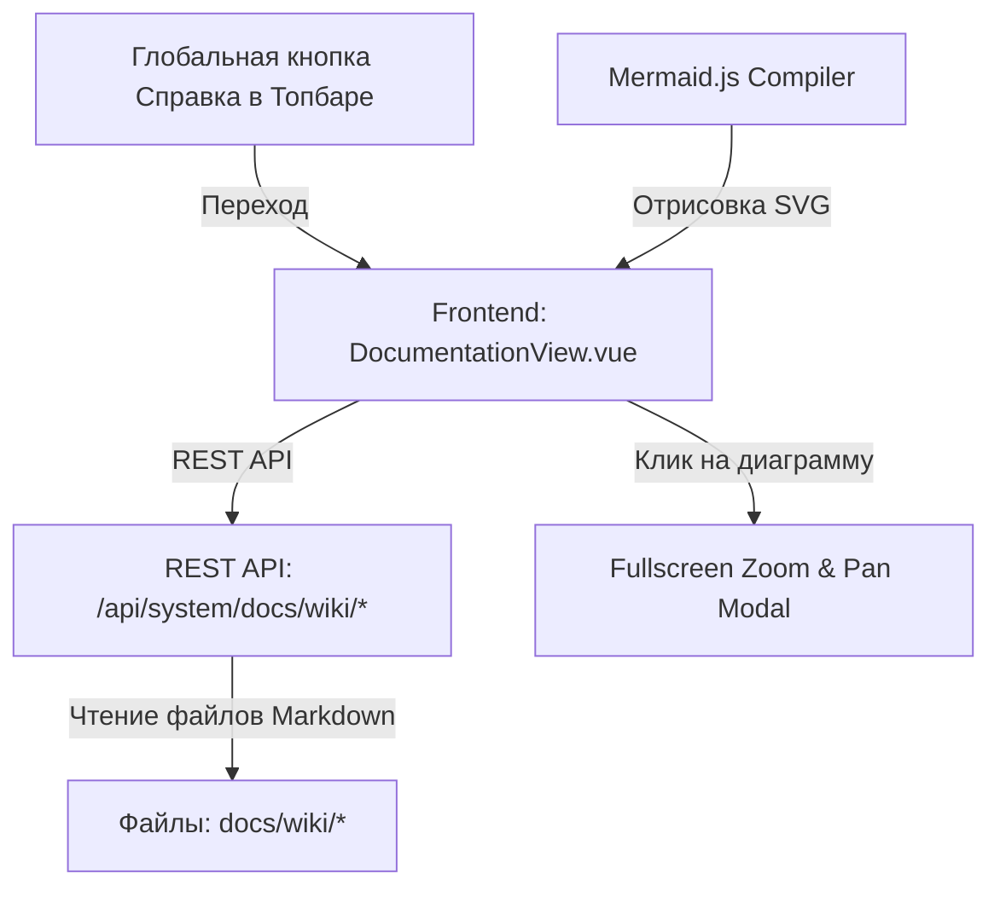

# 📚 Документация и встроенный справочный центр

---

## 📌 1. Назначение страницы, URL-маршруты и RBAC-права

Встроенный **Справочный центр (Documentation & Wiki Center)** — это интегрированная информационная система NMS WebUI для просмотра документации, руководств по эксплуатации, архитектурных описаний и спецификаций разработки модулей. Раздел содержит древовидное меню категорий, живой поиск по статьям, быструю навигацию по разделам открытого документа, HTML-рендерер Markdown и интерактивный модальный просмотрщик диаграмм Mermaid в полноэкранном режиме с масштабированием (Zoom & Pan).

* **URL-маршруты**: 
  * `/docs` — Встроенный справочный центр.
  * Глобальная кнопка Справки (`help`) в шапке приложения (Topbar).
* **Требуемые права доступа (RBAC)**: Доступна всем авторизованным пользователям (`requiresAuth: true`).

---

## 🖥 2. Подробный функциональный состав

Страница включает левую фиксированную панель навигации, центральную область чтения и модальный просмотрщик диаграмм:

---

### 2.1. Фиксированное боковое меню навигации (Wiki Side Navigation Bar)

1. **Поле живого поиска (`searchWiki`)**:
   * Полнотекстовый фильтр по заголовкам статей и категориям Wiki.

2. **Древовидная навигация категорий (Wiki Navigation Tree)**:
   * Группировка статей по тематическим папкам с иконками:
     * 📘 **01-overview** — Обзор архитектуры, технологии, системные требования.
     * 📖 **02-usage** — Руководства пользователя по всем 11 модулям и разделам интерфейса.
     * 🧩 **03-module-development** — Разработка модулей, спецификации `manifest.json` и Vue SFC.
   * Активная статья подсвечивается свечением `shadow-glow` и цветным фоном `bg-primary/10`.

---

### 2.2. Центральная область чтения статьи (Main Wiki Content Area)

1. **Верхняя панель заголовка**:
   * Хлебные крошки типа категории и статьи (`wikiTitle / displayArticleTitle`).
   * Кнопка **«Обновить» (`widgetRefresh`)** с анимированной иконкой `refresh` для повторного чтения статьи с сервера.

2. **Быстрые кнопки навигации по разделам (Quick Nav Pills)**:
   * Автоматически извлекаются из заголовков H1/H2 текущей открытой статьи.
   * Позволяют в один клик выполнять плавный скроллинг к нужной секции документа со свечением активного раздела.

3. **Контейнер рендеринга Markdown (`doc-body`)**:
   * Посексионная отрисовка текста с поддержкой форматирования GFM, списков, таблиц, предупреждающих карточек и кода.
   * **Компиляция Mermaid**: Векторная отрисовка схем взаимодействия по нажатию `mermaid.initialize({ theme: 'dark' })`.

---

### 2.3. Полноэкранный модальный просмотрщик диаграмм (Fullscreen Zoom & Pan Modal)

При клике на любую диаграмму Mermaid в тексте статьи активируется специальный модальный режим инспекции:

* **Интерактивный холст просмотрщика (`zoomModalOpen`)**:
  * Темный полупрозрачный фон с размытием Backdrop Blur.
  * Возможность свободного перетаскивания схемы мышью (курсоры `cursor-grab / active:cursor-grabbing`).
* **Панель управления масштабом**:
  * **Отдалить (`zoom_out`)**: Уменьшение масштаба схемы (до 50% / `0.5x`).
  * **Приблизить (`zoom_in`)**: Увеличение масштаба схемы (до 400% / `4.0x`).
  * **Сбросить масштаб (`restart_alt`)**: Возврат к 100% масштабу.
  * **Индикатор текущего процента**: Точное числовое значение масштабирования (например, `125%`).
  * **Закрыть (`close`)**: Выход из модального режима.

---

## 🔄 3. Взаимодействие с остальным приложением

### 3.1. Backend REST API
* `GET /api/system/docs/wiki/tree`: Загрузка иерархического дерева всех разделов и файлов из каталога `docs/wiki/`.
* `GET /api/system/docs/wiki/article`: Загрузка сырого Markdown-содержимого выбранной статьи (`params: { path }`).
* `GET /api/system/docs/module-guide`: Загрузка общего руководства по модулям.

### 3.2. Хранение справочных материалов
* Документация хранится на сервере в открытом формате Markdown (`.md`) в папке `docs/wiki/`, что позволяет обновлять базу знаний системы без необходимости компиляции приложения.

### 3.3. Глобальная интеграция с интерфейсом WebUI
* Кнопка **«Справка»** (`help`) в шапке любого экрана приложения мгновенно перенаправляет пользователя на соответствующий раздел встроенной документации.
