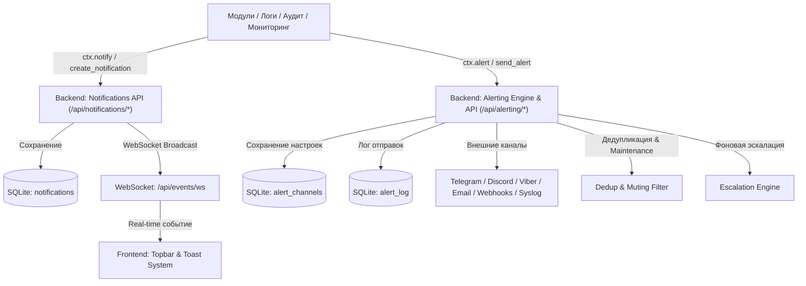

# 🔔 Центр уведомлений и оповещений (Notification & Alerts)

---

## 📌 1. Назначение страницы, URL-маршруты и RBAC-права

**Центр уведомлений и оповещений (Notification & Alerts)** — это сквозная система сбора, фильтрации, квитирования и рассылки оперативных сообщений NMS WebUI. Подсистема принимает события со всех модулей приложения (аварии оборудования, ошибки логов, события аудита безопасности, системные предупреждения) и доставляет их операторам в реальном времени через верхнюю панель управления (Topbar), всплывающие карточки (Toast), аудио-сигналы, браузерные Web Push и внешние мессенджеры (Telegram, Discord, Viber, Custom Webhooks).

* **URL-маршруты**: 
  * Доступен на любой странице приложения через колокольчик шапки (`notifications_active`).
  * Модальное окно внешней интеграции: `NotificationIntegrationsModal.vue`.
* **Требуемые права доступа (RBAC)**: Доступен всем авторизованным пользователям (`requiresAuth: true`). Права доступа фильтруют сообщения: инциденты безопасности доставляются операторам с правом `system.admin`.

---

## 🖥 2. Подробный функциональный состав

### 2.1. Индикатор шапки (Topbar Bell Button & Badge)

* **Иконка «Колокольчик» (`notifications_active`)**: Кнопка раскрытия панели уведомлений в правой части шапки.
* **Бейдж непрочитанных (`unreadCount`)**: Пульсирующий красный круг (`animate-pulse`) со счетчиком необработанных алертов (`99+` при превышении 99 сообщений).

---

### 2.2. Выдвижная панель уведомлений (Notification Drawer Panel)

1. **Панель управления шапки панели**:
   - **Контрастная выпадающая панель**: Выполнена на слое Material 3 (`bg-surface-container-high`) с акцентной рамкой `ring-1 ring-white/10` и тенью `shadow-2xl`.
   - **Компактный блок кнопок управления**:
     - **Настройки внешних интеграций (`hub`)**: Вызов окна привязки внешних каналов рассылки.
     - **Переключатель звука (`volume_up / volume_off`)**: Тумблер звукового оповещения при поступлении новых аварий.
     - **Переключатель Web Push (`notifications_active / notifications_off`)**: Тумблер браузерных Push-уведомлений.
     - **Отметить все прочитанными (`done_all`)**: Кнопка с подсказкой «Прочитать все» для сброса счетчика необработанных алертов.
     - **Очистить все (`delete_sweep`)**: Кнопка с подсказкой «Очистить все» для полной очистки списка сообщений.
   - Блок кнопок приведен к единому икончатому виду с всплывающими подсказками (tooltips), гарантируя отсутствие переполнения на любых экранах.

2. **Поле поиска по истории (`searchHistoryPlaceholder`)**:
   - Стильное капсульное поле ввода `rounded-xl bg-surface-container-highest/50` с контрастным темным фоном и светлым текстом.
   - Оснащено анимированной подсветкой при фокусе (`ring-2 ring-primary/20`), динамическим выделением иконки лупы и кнопкой быстрой очистки текста.

3. **Вкладки фильтрации (Filter Tabs)**:
   - `Все` (`all`) — Полный список сообщений.
   - `Непрочитанные` (`unread`) — Только новые неотмеченные алерты.
   - `Системные` (`system`) — События ядра, бэкапов и фоновых задач.
   - `Ошибки` (`errors`) — Только аварийные сообщения уровня `ERROR` и `CRITICAL`.

4. **Интерактивные карточки уведомлений**:
   - **Левый вертикальный маркер**: Яркая цветная полоска `border-l-4 border-l-primary` и выделенный фон для визуального отличия непрочитанных сообщений.
   - **Переключение статуса «Прочитано / Непрочитано»**:
     - Для каждого сообщения доступна иконка-конверт (`mark_email_read` / `mark_email_unread`).
     - Клик по иконке позволяет как отметить сообщение прочитанным, так и **вернуть прочитанное сообщение обратно в непрочитанные** в любой момент.
   - **Принятие в работу / Квитирование (Alarm Acknowledgment / `Ack`)**:
     - Для предупреждений и ошибок доступна кнопка **«Принять в работу» (`check_box`)**.
     - При нажатии сообщение получает зеленый бейдж **`Ack` (`done_all`)** с всплывающей подсказкой оператора, зафиксировавшего аварию (`acknowledgedBy: {user}`).
     - **Независимость состояний**: Принятие в работу (`Ack`) и факт прочтения (`Read`) изолированы. Оператор может принять аварию в работу, сохранив при этом сообщение непрочитанным для последующего контроля.
   - **Интерактивный переход (Payload Navigation)**: Клик по тексту карточки автоматически перенаправляет оператора на соответствующий экран системы (например, к блокированному пользователю или инциденту).
   - **Удаление события (`close`)**: Кнопка индивидуальной очистки карточки.

---

### 2.3. Модальное окно настроек внешних алертов (`AlertingSettingsModal.vue`)

Настройка трансляции аварий во внешние каналы связи и просмотр журнала истории отправки:
* **Портал вывода (`<Teleport to="body">`)**: Окно рендерится в корне страницы (`<body>` с приоритетом `z-[100]`), центрируется по центру экрана.
* **Вкладки интерфейса**:
  - `Каналы рассылки`: Telegram Bot, Discord Webhook, Viber Bot API, Email (SMTP), Custom HTTP Webhooks и Syslog (SIEM).
  - `Журнал доставки`: История отправок внешних сообщений с фиксацией успешности и возможных ошибок.

---

### 2.4. Всплывающие Toast-уведомления (Toast Overlays)
* Отображаются в нижнем правом углу экрана с таймерами автоскрытия.
* Сообщения `Critical` не скрываются до явного квитирования или клика оператора.

---

### 2.5. Продвинутые механизмы алертинга (Advanced Alerting Features)

1. **Защита от «шторма алертов» и дедупликация (Deduplication)**:
   - Автоматический расчёт MD5-хэша `fingerprint` на основе `category + severity + title`.
   - Если аналогичный алерт пришел в течение 60 секунд, повторная отправка во внешние сервисы подавляется, а в базе данных обновляется `repeat_count` (счетчик повторов) и `last_seen`.
2. **Гарантированная доставка с повторными попытками (Exponential Backoff & Rate Limit)**:
   - Внешний диспетчер автоматически выполняет до 3 повторных попыток отправки при сетевых сбоях и таймаутах.
   - Корректная обработка `HTTP 429 Too Many Requests` с учётом задержки `Retry-After`.
3. **Окна технического обслуживания (Maintenance Windows)**:
   - Поддержка создания плановых интервалов обслуживания (`/api/alerting/maintenance`).
   - Если ресурс находится на обслуживании (`starts_at <= now <= ends_at`), алерты автоматически маркируются как `suppressed = 1` и не отвлекают дежурных операторов.
4. **Эскалация неотвеченных алертов (Un-Acked Escalation Engine)**:
   - Автоматический фоновый процесс контроля неквитированных критических аварий (`acknowledged = 0`).
   - По истечении заданного таймаута (например, 15 минут) формируется эскалационное оповещение `🚨 [ESCALATION]` в дежурный/резервной канал.
5. **Гибкие шаблоны сообщений (Alert Templating)**:
   - Кастомная настройка форматирования сообщений для каждого канала рассылки с плейсхолдерами `{title}`, `{message}`, `{severity}`, `{category}`, `{icon}`, `{time}`.

---

## 🔄 3. Взаимодействие с остальным приложением

### 3.1. Backend REST API

**Внутренние уведомления (`/api/notifications`)**:
* `GET /api/notifications`: Загрузка списка сообщений с фильтрами (`unread_only`, `limit`, `search`, `category`, `type`).
* `GET /api/notifications/unread-count`: Получение количества непрочитанных сообщений.
* `POST /api/notifications/{id}/read`: Отметка о прочтении.
* `POST /api/notifications/{id}/unread`: Отмена прочтения (возврат в непрочитанные).
* `POST /api/notifications/{id}/ack`: Квитирование аварии оператором.
* `POST /api/notifications/read-all`: Массовая отметка прочтения.
* `DELETE /api/notifications/clear`: Удаление списка прочитанных сообщений.

**Внешний алертинг (`/api/alerting`)**:
* `GET /api/alerting/channels`: Получение списка настроенных внешних каналов.
* `POST /api/alerting/channels`: Создание нового канала рассылки.
* `PUT /api/alerting/channels/{id}`: Обновление параметров канала.
* `DELETE /api/alerting/channels/{id}`: Удаление канала.
* `POST /api/alerting/channels/{id}/test`: Отправка тестового алерта.
* `GET /api/alerting/log`: История логов доставки алертов во внешние каналы.
* `GET /api/alerting/maintenance`: Список окон технического обслуживания.
* `POST /api/alerting/maintenance`: Создание окна обслуживания.
* `DELETE /api/alerting/maintenance/{id}`: Удаление окна обслуживания.
* `GET /api/alerting/escalations`: Правила эскалации неквитированных тревог.
* `POST /api/alerting/escalations`: Создание правила эскалации.
* `DELETE /api/alerting/escalations/{id}`: Удаление правила эскалации.

### 3.2. Подсистемы и Хранение в `nms.db`
* `notifications`: Таблица хранения внутренних сообщений приложения (`id`, `user_id`, `title`, `message`, `category`, `type`, `read`, `acknowledged`, `fingerprint`, `repeat_count`, `last_seen`, `escalated`, `created_at`).
* `alert_channels`: Таблица конфигураций каналов внешней рассылки (`id`, `name`, `type`, `enabled`, `min_type`, `categories`, `config`).
* `alert_log`: Журнал истории внешней рассылки (`id`, `channel_id`, `channel_type`, `title`, `message`, `severity`, `success`, `error_message`, `retry_count`, `suppressed`, `created_at`).
* `maintenance_windows`: Таблица окон технического обслуживания (`id`, `name`, `target_category`, `starts_at`, `ends_at`, `enabled`).
* `escalation_rules`: Правила эскалации для неотвеченных алертов (`id`, `name`, `min_severity`, `unack_timeout_sec`, `target_channel_id`, `enabled`).

