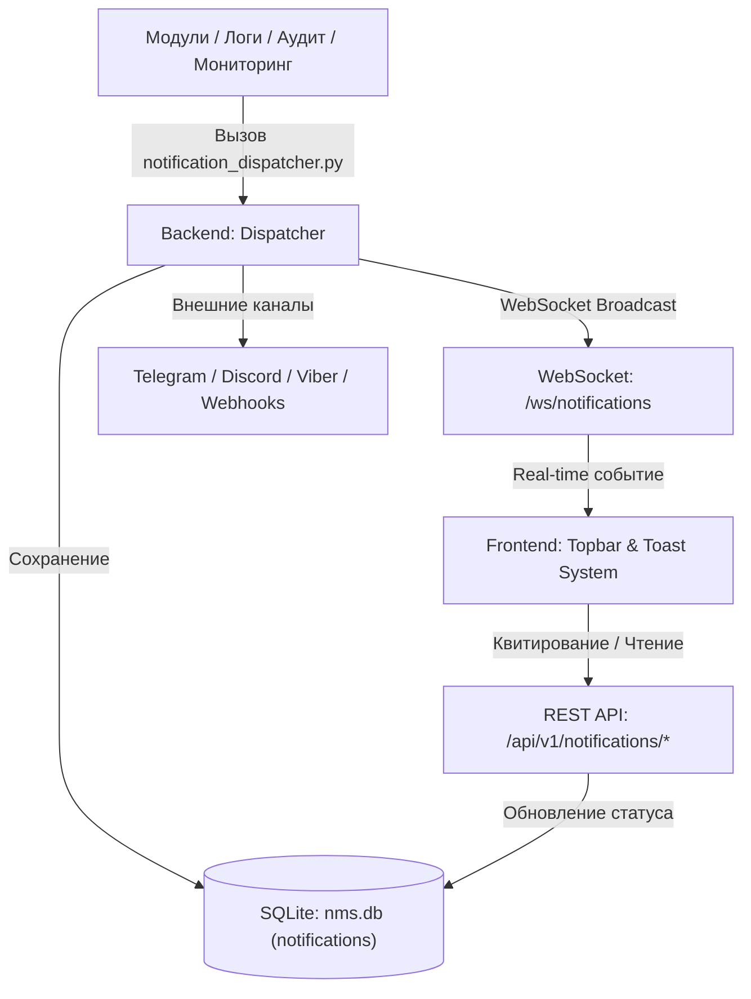

# 🔔 Центр уведомлений и оповещений (Notification & Alerts)

---

## 📌 1. Назначение страницы, URL-маршруты и RBAC-права

**Центр уведомлений и оповещений (Notification & Alerts)** — это сквозная система сбора, фильтрации, квитирования и рассылки оперативных сообщений NMS WebUI. Подсистема принимает события со всех модулей приложения (аварии оборудования, ошибки логов, события аудита безопасности, системные предупреждения) и доставляет их операторам в реальном времени через верхнюю панель управления (Topbar), всплывающие карточки (Toast), аудио-сигналы, браузерные Web Push и внешние мессенджеры (Telegram, Discord, Viber, Custom Webhooks).

* **URL-маршруты**: 
  * Доступен на любой странице приложения через колокольчик шапки (`notifications_active`).
  * Модальное окно внешней интеграции: `NotificationIntegrationsModal.vue`.
* **Требуемые права доступа (RBAC)**: Доступен всем авторизованным пользователям (`requiresAuth: true`). Права доступа фильтруют сообщения: инциденты безопасности доставляются операторам с правом `system.admin`.

---

## 🖥 2. Подробный функциональный состав

### 2.1. Индикатор шапки (Topbar Bell Button & Badge)

* **Иконка «Колокольчик» (`notifications_active`)**: Кнопка раскрытия панели уведомлений в правой части шапки.
* **Бейдж непрочитанных (`unreadCount`)**: Пульсирующий красный круг (`animate-pulse`) со счетчиком необработанных алертов (`99+` при превышении 99 сообщений).

---

### 2.2. Выдвижная панель уведомлений (Notification Drawer Panel)

1. **Панель управления шапки панели**:
   * **Переключатель звука (`volume_up / volume_off`)**: Тумблер звукового оповещения при поступлении новых аварий.
   * **Переключатель Web Push (`notifications_active / notifications_off`)**: Тумблер браузерных Push-уведомлений.
   * **Настройки внешних интеграций (`hub`)**: Кнопка вызова окна привязки внешних шлюзов рассылки.
   * **Отметить все прочитанными (`notificationsMarkAllRead`)**: Сброс счетчика необработанных алертов.
   * **Очистить все (`notificationsClearAll`)**: Полная очистка списка сообщений.

2. **Поле поиска по истории (`searchHistoryPlaceholder`)**:
   * Поисковая строка для поиска среди доставленных сообщений по названию или тексту.

3. **Вкладки фильтрации (Filter Tabs)**:
   * `Все` (`all`) — Полный список сообщений.
   * `Непрочитанные` (`unread`) — Только новые неотмеченные алерты.
   * `Системные` (`system`) — События ядра, бэкапов и фоновых задач.
   * `Ошибки` (`errors`) — Только аварийные сообщения уровня `ERROR` и `CRITICAL`.

4. **Интерактивные карточки уведомлений**:
   * **Статусный синий маркер**: Отображается для новых непрочитанных сообщений.
   * **Квитирование аварий (Alarm Acknowledgment / `Ack`)**:
     * Для предупреждений и ошибок доступна кнопка **«Квитировать» (`check_box`)**.
     * При нажатии сообщение получает бейдж **`Ack` (`done_all`)** с всплывающей подсказкой имени оператора, взявшего аварию в работу (`acknowledgedBy: {user}`).
   * **Интерактивный переход (Payload Navigation)**: Клик по карточке уведомления автоматически перенаправляет оператора на соответствующий экран системы (например, к блокированному пользователю или аварийному логу).
   * **Удаление события (`close`)**: Кнопка индивидуальной очистки карточки.

---

### 2.3. Модальное окно внешних интеграций (`NotificationIntegrationsModal.vue`)

Настройка прямой трансляции аварий в внешние каналы связи:

1. **Интеграция с Telegram Bot**:
   * Ввод `Bot Token` и `Chat ID` группы или канала.
   * Переключатель активности Telegram-диспетчера.
   * Кнопка **«Отправить тестовое сообщение»**.

2. **Интеграция с Discord Webhook**:
   * Ввод `Webhook URL`.
   * Переключатель активности Discord-рассылки и проверка связи.

3. **Интеграция с Viber Bot**:
   * Ввод `Auth Token` бота и `Subscriber ID` администратора.

4. **Пользовательские вебхуки (Custom HTTP Webhooks)**:
   * Задание `Target URL` (HTTP/HTTPS API).
   * Задание секретного ключа `Secret Key` для подписи вызовов и дополнительных заголовков JSON.

---

### 2.4. Всплывающие Toast-уведомления (Toast Overlays)
* Отображаются в нижнем правом углу экрана с таймерами автоскрытия.
* Сообщения `Critical` не скрываются до явного квитирования или клика оператора.

---

## 🔄 3. Взаимодействие с остальным приложением

### 3.1. Backend REST API
* `GET /api/v1/notifications`: Загрузка списка сообщений с пагинацией и фильтрами.
* `PUT /api/v1/notifications/{id}/read`: Отметка о прочтении.
* `PUT /api/v1/notifications/{id}/ack`: Квитирование аварии оператором с сохранением `acknowledged_by`.
* `PUT /api/v1/notifications/read-all`: Массовая отметка прочтения.
* `DELETE /api/v1/notifications/clear`: Удаление списка прочитанных сообщений.
* `POST /api/v1/notifications/integrations/test`: Отправка тестового алерта во внешние мессенджеры.

### 3.2. Диспетчер и Внешние интеграции (`notification_dispatcher.py`)
* Подсистема `backend/core/notification_dispatcher.py` обрабатывает входящие события и параллельно рассылает их по WebSocket-каналу `/ws/notifications` и во внешние HTTP-эндпоинты Telegram, Discord, Viber и Webhooks.

### 3.3. Хранение в `nms.db`
* Таблица `notifications`: Хранит `id`, `user_id`, `title`, `message`, `category`, `severity`, `is_read`, `acknowledged`, `acknowledged_by`, `created_at`.
