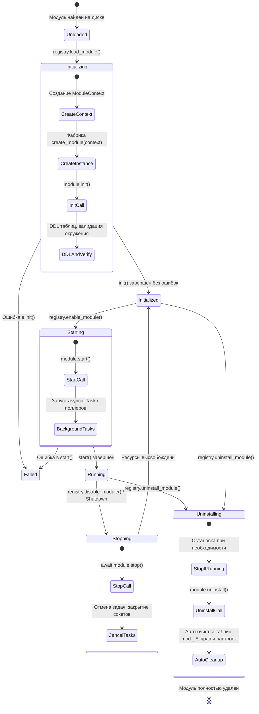

# 🛠 2. Создание модулей и базовое API (`BaseModule` & `ModuleContext`)

Документ описывает архитектуру бэкенд-модулей платформы NMS WebUI, базовый класс `BaseModule`, подмодули `BaseSubmodule`, интерфейс взаимодействия `ModuleContext`, изоляцию ресурсов (базы данных, песочницы файловой системы, логирования), а также правила объявления FastAPI REST API (`api.py`).

---

## 📌 Архитектура и жизненный цикл модуля бэкенда

Каждый бэкенд-модуль платформы представляет собой изолированный Python-пакет в директории `backend/modules/<module_id>/`.

Жизненным циклом каждого модуля управляет ядро платформы (`backend/core/plugin/registry.py`). Платформа последовательно инициализирует инстанс модуля, передает ему контекст управления `ModuleContext`, запускает рабочие сервисы и обеспечивает безопасное завершение работы (Graceful Shutdown).

### Диаграмма состояний жизненного цикла



---

## 🏛 Класс `BaseModule`

Все модули верхнего уровня наследуются от абстрактного класса `BaseModule` (`backend/modules/base.py`).

### Контракт и интерфейс класса

```python
from abc import ABC, abstractmethod
from typing import Any
from backend.core.plugin.context import ModuleContext

class BaseModule(ABC):
    """Базовый контракт для модулей верхнего уровня."""

    def __init__(self, context: ModuleContext):
        self.context = context

    @abstractmethod
    def init(self) -> None:
        """Подготовка модуля (DDL таблиц, валидация параметров, подписка на события)."""

    @abstractmethod
    def start(self) -> None:
        """Запуск модуля и его фоновых сервисов."""

    @abstractmethod
    async def stop(self) -> None:
        """Остановка модуля и высвобождение ресурсов."""

    @abstractmethod
    def get_status(self) -> dict[str, Any]:
        """Возврат текущего состояния модуля для мониторинга системы."""

    def get_log_provider(self) -> Any | None:
        """Опциональный провайдер логов модуля (если модуль ведет собственный изолированный журнал)."""
        return None

    def uninstall(self) -> None:
        """Пользовательский деструктор при полном удалении модуля.
        
        Кастомная очистка ресурсов на диске или во внешних системах.
        Таблицы mod_<module_id>_*, права доступа и настройки очищаются платформой автоматически.
        """
        pass

    def is_dependency_active(self, module_id: str) -> bool:
        """Проверить, активна ли указанная зависимость."""
        return self.context.is_module_active(module_id)

    def get_dependency_instance(self, module_id: str) -> Any | None:
        """Получить экземпляр зависимости (если она загружена и активна)."""
        return self.context.get_module_instance(module_id)
```

### Детальное описание методов

1. `__init__(self, context: ModuleContext)`
   - Сохраняет ссылки на переданный `ModuleContext`. На этом этапе нельзя выполнять долгие синхронные операции или внешние вызовы.
2. `init(self) -> None`
   - Синхронный метод первичной инициализации. 
   - Выполняет создание таблиц в SQLite с помощью `self.context.create_table(...)`.
   - Валидирует первичное состояние окружения и конфигурацию.
3. `start(self) -> None`
   - Запускает фоновые рабочие процессы. Если модулю требуется фоновый опрос (polling loop) или работа с сокетами, в `start()` через `asyncio.get_running_loop().create_task(...)` создаются фоновые задачи (`asyncio.Task`).
4. `stop(self) -> async None`
   - Асинхронный метод остановки. Вызывается при выключении модуля через интерфейс или при завершении работы NMS WebUI.
   - Обязан отменить все запущенные `asyncio.Task`, закрыть клиентские соединения (HTTP/gRPC/MQTT) и дождаться полного завершения задач.
5. `get_status(self) -> dict[str, Any]`
   - Используется ядром платформы для отображения здоровья модуля на дашборде администрирования. Должен возвращать словарь со статусом работы (`"running"`, `"stopped"`, `"degraded"`), количеством активных объектов, метриками сбоев и т.п.
6. `uninstall(self) -> None`
   - Вызывается только при полной деинсталляции модуля администратором. Используется для удаления специфических внешних файлов или освобождения внешних ресурсов.

---

## 🧰 Класс `ModuleContext`

Объект `ModuleContext` (`backend/core/plugin/context.py`) передается инстансу модуля при инициализации и предоставляет стандартизированный API для безопасного доступа к ресурсам платформы.

### Атрибуты `ModuleContext`

| Атрибут | Тип | Описание |
| :--- | :--- | :--- |
| `module_id` | `str` | Уникальный идентификатор модуля (например, `"tuya"`, `"sensor_monitor"`) |
| `root` | `Path` | Абсолютный путь к директории модуля на диске |
| `manifest` | `dict[str, Any]` | Загруженный словарь `manifest.yaml` |
| `parent_module_id` | `str \| None` | ID родительского модуля (для подмодулей) |
| `is_submodule` | `bool` | Флаг, указывающий является ли этот инстанс подмодулем |

### Методы и возможности `ModuleContext`

#### 1. Логирование (`context.logger`)
Возвращает предварительно настроенный объект `logging.Logger` с именем `nms.plugin.<module_id>`.

```python
self.context.logger.info("Подключение к оборудованию по IP %s", ip_address)
self.context.logger.error("Ошибка авторизации в стороннем API", exc_info=True)
```

#### 2. Работа с базой данных SQLite
Платформа использует единую базу данных `nms.db`. Все таблицы модулей должны иметь обязательный префикс `mod_<module_id>_`.

- `get_db() -> sqlite3.Connection`: Получить подключение к единой базе данных SQLite.
- `get_table_prefix() -> str`: Возвращает префикс таблицы модуля (символы `-` и `.` заменяются на `_`). Пример: для модуля `tuya` вернет `mod_tuya_`.
- `create_table(table_name: str, schema: dict[str, str] | str) -> None`: Автоматически создает таблицу с подстановкой префикса `mod_<module_id>_`.

**Примеры создания таблиц:**

```python
# Вариант 1: Определение полей через словарь
self.context.create_table(
    "devices",
    {
        "device_id": "TEXT PRIMARY KEY",
        "name": "TEXT NOT NULL",
        "ip": "TEXT",
        "online": "INTEGER DEFAULT 0",
        "created_at": "TIMESTAMP DEFAULT CURRENT_TIMESTAMP"
    }
)
# Будет выполнено: CREATE TABLE IF NOT EXISTS mod_tuya_devices (...)

# Вариант 2: DDL-строка определения колонок
self.context.create_table(
    "events",
    """
    id INTEGER PRIMARY KEY AUTOINCREMENT,
    device_id TEXT NOT NULL,
    payload TEXT,
    FOREIGN KEY(device_id) REFERENCES mod_tuya_devices(device_id) ON DELETE CASCADE
    """
)
```

#### 3. Изоляция файловой системы (Песочница / Sandbox Security)

Модули не должны произвольно читать и писать файлы в файловой системе сервера. Для хранения данных и кэша используются изолированные директории.

- `get_data_dir() -> Path`: Возвращает путь к изолированной директории данных `backend/data/modules/<module_id>/`. Создается автоматически при вызове.
- `get_cache_dir() -> Path`: Возвращает путь к директории временного кэша `backend/cache/modules/<module_id>/`.
- `ensure_safe_path(target_path: Path | str) -> Path`: Проверяет, что запрашиваемый путь находится строго внутри директории данных модуля, кэша или его собственного исходного кода (`root`). Блокирует атаки класса Path Traversal (`ValueError`).

```python
# Безопасное сохранение дампа конфигурации
data_file = self.context.get_data_dir() / "config_dump.json"
safe_path = self.context.ensure_safe_path(data_file)
safe_path.write_text(json.dumps(data), encoding="utf-8")
```

#### 4. Взаимодействие с реестром и зависимостями

- `is_module_active(target_module_id: str) -> bool`: Проверить, активен ли другой модуль.
- `has_dependency(target_module_id: str) -> bool`: Алиас для проверки активности зависимости.
- `get_module_instance(target_module_id: str) -> Any | None`: Получить ссылку на инстанс активного модуля.

#### 5. Система уведомлений (`context.notify`)
Позволяет модулю генерировать системные или персональные уведомления для пользователей.

```python
self.context.notify(
    title="Сбой опроса устройств",
    message="Не удалось подключиться к контроллеру 192.168.1.50",
    notification_type="error",
    category="tuya",
    link="/modules/tuya/settings"
)
```

---

## 🌿 Класс `BaseSubmodule`

Для создания иерархических модулей и дочерних сервисов используется `BaseSubmodule` (`backend/modules/base.py`), наследуемый от `BaseModule`.

```python
class BaseSubmodule(BaseModule, ABC):
    """Контракт подмодуля с привязкой к родительскому модулю."""

    @property
    def parent_module_id(self) -> str | None:
        return self.context.parent_module_id
```

Подмодули имеют доступ к своему контексту, но ассоциированы с `parent_module_id`. Подробнее об иерархических подмодулях см. в руководстве `03-submodules-hierarchy.md`.

---

## 🔗 Регистрация FastAPI REST API (`api.py`)

Если модуль предоставляет REST API, в директории модуля создается файл `api.py`.

### Обязательные требования к `api.py`:
1. Наличие глобального объекта `APIRouter` с префиксом `/api/v1/m/<module_id>`.
2. Наличие экспортируемой фабричной функции `get_router(ctx: Any = None) -> APIRouter`.
3. Все эндпоинты должны защищаться механизмами аутентификации (`CurrentUser`) и RBAC-разрешениями (`require_permission`).

### Структура файла `api.py`

```python
from __future__ import annotations

from typing import Any
from fastapi import APIRouter, Depends, Request
from pydantic import BaseModel

from backend.core.auth import CurrentUser, require_permission
from backend.core.plugin.registry import get_instance
from backend.core.exceptions import ModuleNotActiveError

router = APIRouter(prefix="/api/v1/m/sensor_monitor", tags=["sensor_monitor"])

def get_router(ctx: Any = None) -> APIRouter:
    """Фабрика роутера для платформы."""
    return router

def _get_module() -> Any:
    """Получение инстанса активного модуля из реестра платформы."""
    instance = get_instance("sensor_monitor")
    if not instance:
        raise ModuleNotActiveError("Модуль sensor_monitor не активен")
    return instance

class DeviceCreateSchema(BaseModel):
    device_id: str
    name: str
    ip: str

@router.get("/status")
async def get_module_status(
    request: Request = None,
    user: dict = Depends(CurrentUser),
    _: None = Depends(require_permission("module.sensor_monitor.view"))
):
    """Получить статус модуля."""
    module = _get_module()
    return module.get_status()

@router.post("/devices")
async def add_device(
    payload: DeviceCreateSchema,
    user: dict = Depends(CurrentUser),
    _: None = Depends(require_permission("module.sensor_monitor.control"))
):
    """Добавить устройство в мониторинг."""
    module = _get_module()
    # Логика работы с инстансом модуля
    return {"status": "ok", "device_id": payload.device_id}
```

---

## 💡 Полноценный Production-Ready пример модуля

Ниже приведен готовый пример структуры стандартного бэкенд-модуля.

### 1. `module.py`

```python
from __future__ import annotations

import asyncio
from typing import Any

from backend.modules.base import BaseModule
from backend.core.plugin.context import ModuleContext

class SensorMonitorModule(BaseModule):
    """Модуль мониторинга показателей датчиков."""

    def __init__(self, context: ModuleContext):
        super().__init__(context)
        self._running: bool = False
        self._poll_task: asyncio.Task | None = None

    def init(self) -> None:
        """Этап 1: Подготовка БД и инициализация директорий."""
        self.context.logger.info("Инициализация модуля SensorMonitor...")
        
        # Создаем таблицу в nms.db (авто-префикс mod_sensor_monitor_)
        self.context.create_table(
            "metrics",
            {
                "id": "INTEGER PRIMARY KEY AUTOINCREMENT",
                "sensor_id": "TEXT NOT NULL",
                "value": "REAL NOT NULL",
                "timestamp": "TIMESTAMP DEFAULT CURRENT_TIMESTAMP"
            }
        )

    def start(self) -> None:
        """Этап 2: Запуск фонового опроса."""
        self.context.logger.info("Запуск фоновых сервисов SensorMonitor...")
        self._running = True
        try:
            loop = asyncio.get_running_loop()
            if self._poll_task is None or self._poll_task.done():
                self._poll_task = loop.create_task(self._background_polling())
        except RuntimeError:
            self.context.logger.warning("Event loop недоступен при запуске модуля.")

    async def stop(self) -> None:
        """Этап 3: Корректная остановка задач."""
        self.context.logger.info("Остановка модуля SensorMonitor...")
        self._running = False
        if self._poll_task and not self._poll_task.done():
            self._poll_task.cancel()
            try:
                await self._poll_task
            except asyncio.CancelledError:
                pass
        self._poll_task = None

    async def _background_polling(self) -> None:
        """Фоновый цикл опроса датчиков."""
        while self._running:
            try:
                # Имитация работы или сбор данных
                await asyncio.sleep(10)
            except asyncio.CancelledError:
                break
            except Exception as exc:
                self.context.logger.error("Ошибка в цикле опроса: %s", exc)
                await asyncio.sleep(5)

    def get_status(self) -> dict[str, Any]:
        """Возврат метрик состояния модуля."""
        return {
            "status": "running" if self._running else "stopped",
            "polling_task_active": self._poll_task is not None and not self._poll_task.done()
        }

def create_module(context: ModuleContext) -> BaseModule:
    """Обязательная фабричная функция модуля."""
    return SensorMonitorModule(context)
```

---

## ⚠️ Best Practices и частые ошибки

1. **Не зашивайте имена таблиц вручную without prefixes**  
   ❌ `CREATE TABLE devices (...)`  
   ✅ Вызывайте `self.context.create_table("devices", ...)` — платформа автоматически подставит `mod_<module_id>_devices`.

2. **Защищайте операции с файловой системой**  
   ❌ `open(f"/opt/data/{filename}")`  
   ✅ `path = self.context.ensure_safe_path(self.context.get_data_dir() / filename)`

3. **Корректно обрабатывайте отмену `asyncio.Task` в `stop()`**  
   При вызове `stop()` отменяйте задачи через `task.cancel()` и перехватывайте `asyncio.CancelledError`, чтобы выключение модуля не зависало и не генерировало лишних Traceback в логах.

4. **Не храните данные в оперативной памяти безотказно**  
   Поскольку модуль может перезапускаться администратором на лету (`enable`/`disable`), состояние должно либо восстанавливаться из БД SQLite (`nms.db`), либо из хранилища в `context.get_data_dir()`.
