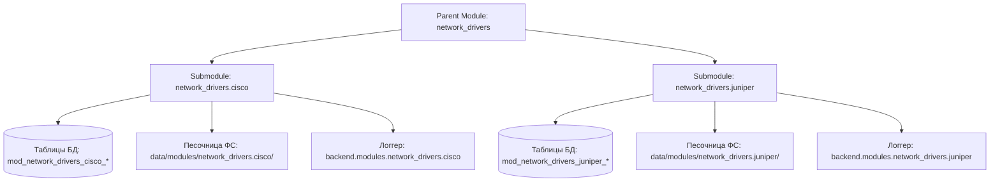
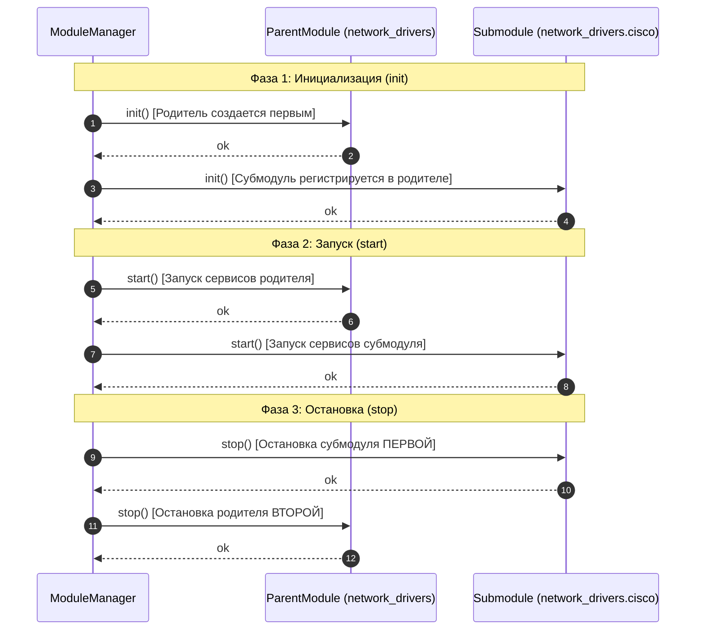

# 🌿 3. Разработка субмодулей и иерархия плагинов (`BaseSubmodule`)

---

Документ подробно описывает архитектуру и порядок разработки **субмодулей** в платформе **NMS WebUI**. Вы узнаете, как организовывать иерархические семейные структуры модулей (например, драйверы оборудования, плагины отчетов, расширения протоколов), как использовать базовый класс `BaseSubmodule`, настраивать манифесты `manifest.yaml`, изолировать ресурсы и строить надежное взаимодействие между родительским модулем и его дочерними плагинами.

---

## 📌 1. Концепция и архитектура субмодулей

### Зачем нужны субмодули?
В крупных enterprise-системах мониторинга и управления сетью часто возникает необходимость объединять схожие по смыслу функции под единой абстракцией. 

Субмодули позволяют:
- **Декомпозировать модули**: Выделять специфическую логику (например, поддержка конкретного вендора оборудования) в отдельные дочерние плагины.
- **Создавать семейства драйверов**: Родительский модуль (`network_drivers`) определяет общий контракт взаимодействия, а дочерние субмодули (`cisco`, `juniper`, `mikrotik`) реализуют особенности конкретных устройств.
- **Обеспечивать изоляцию и модульность**: Отключение или ошибка в одном субмодуле не нарушает работоспособность всего родительского модуля или других субмодулей.
- **Гибко управлять лицензированием и доступом**: Каждому субмодулю можно назначать индивидуальные права доступа (RBAC) и включать/отключать их независимо.

### Сравнение `BaseModule` и `BaseSubmodule`

| Характеристика | Родительский модуль (`BaseModule`) | Субмодуль (`BaseSubmodule`) |
| :--- | :--- | :--- |
| **Базовый класс** | `backend.modules.base.BaseModule` | `backend.modules.base.BaseSubmodule` |
| **Автономность** | Полностью автономен | Зависит от родительского модуля (`parent`) |
| **Идентификатор (ID)** | Простой slug, например `network_drivers` | Составной ID вида `network_drivers.cisco` |
| **Расположение** | `backend/modules/<module_id>/` | `backend/modules/<parent_id>/submodules/<submodule_id>/` |
| **Управление в Загрузчике** | Регистрируется как независимый узел | Загружается с обязательной авто-зависимостью от родителя |
| **Контекст (`ModuleContext`)** | `parent_module_id = None`, `is_submodule = False` | `parent_module_id = "<parent_id>"`, `is_submodule = True` |

### Иерархическая структура каталогов на диске
Субмодули физически располагаются внутри директории `submodules/` родительского модуля. Поддерживается также рекурсивное сканирование (вложенные субмодули `parent.child.subchild`):

```text
backend/modules/network_drivers/              # 📦 Родительский модуль
├── manifest.yaml                              # Манифест родителя (id: network_drivers)
├── __init__.py
├── main.py                                    # Класс NetworkDriversModule(BaseModule)
├── base_driver.py                             # Абстрактные интерфейсы драйверов
└── submodules/                                # 🌿 Директория субмодулей
    ├── cisco/                                 # 🔹 Субмодуль Cisco
    │   ├── manifest.yaml                      # Манифест субмодуля (id: cisco, parent: network_drivers)
    │   ├── __init__.py
    │   ├── driver.py                          # Класс CiscoSubmodule(BaseSubmodule)
    │   └── api.py                             # REST API субмодуля
    └── mikrotik/                              # 🔹 Субмодуль MikroTik
        ├── manifest.yaml                      # Манифест субмодуля (id: mikrotik, parent: network_drivers)
        ├── __init__.py
        └── driver.py                          # Класс MikroTikSubmodule(BaseSubmodule)
```

> [!NOTE]
> Загрузчик платформы (`loader.py`) при сканировании файловой системы автоматически выполняет обход каталогов `submodules/` и выстраивает граф зависимостей.

### Многоуровневая (рекурсивная) вложенность
Платформа поддерживает произвольную глубину рекурсивной вложенности плагинов (`parent.child.subchild`). Функция `_walk_submodules` в `loader.py` обходит директории `submodules/` на всех уровнях:

```text
backend/modules/network_drivers/
└── submodules/
    └── cisco/                                 # Submodule (id: network_drivers.cisco)
        └── submodules/
            └── ios_xr/                        # Submodule 3-го уровня (id: network_drivers.cisco.ios_xr)
                └── manifest.yaml              # parent: cisco
```

* **Составной ID**: Для плагина 3-го уровня будет сформирован системный идентификатор `network_drivers.cisco.ios_xr`.
* **Цепочка зависимостей**: В `deps` субмодуля 3-го уровня автоматически инъецируется его непосредственный родитель `network_drivers.cisco`.

---

## 📜 2. Оформление манифеста субмодуля (`manifest.yaml`)

Манифест субмодуля объявляется по стандарту `manifest.yaml` (см. 01-manifests.md), но содержит ключевое обязательное поле **`parent`**.

### Пример манифеста субмодуля `cisco`:
```yaml
id: cisco                                        # Локальный ID субмодуля (без точки)
parent: network_drivers                          # Системный ID родительского модуля
name: Cisco Network Driver                       # Человекочитаемое название
version: 1.0.0
type: driver                                     # Категория/тип модуля
description: "Драйвер взаимодействия с устройствами Cisco IOS / NX-OS"
author: "NMS Team"

entrypoints:
  factory: "backend.modules.network_drivers.submodules.cisco.driver:create_submodule"
  router: "backend.modules.network_drivers.submodules.cisco.api:router"

# Дополнительные внешние зависимости (родитель подставляется автоматически!)
deps:
  - core_topology
```

### Механика нормализации Загрузчика (`loader.py`)
При чтении манифеста функция `_parse_manifest` в Загрузчике автоматизирует следующие шаги:

1. **Формирование составного ID**:
   Если указан `parent`, локальный ID объединяется с ID родителя через точку:
   ```python
   # Локальный id: 'cisco', parent_id: 'network_drivers'
   # Нормализованный id станет: 'network_drivers.cisco'
   ```
2. **Автоматическое инъецирование зависимости от родителя**:
   Загрузчик гарантирует, что родительский модуль всегда находится в списке зависимостей `deps` субмодуля:
   ```python
   if parent_id and parent_id not in manifest.deps:
       manifest.deps.append(parent_id)
   ```
3. **Установка флагов контекста**:
   Флаг `is_submodule` устанавливается в `True`, а `parent_module_id` получает значение родителя.

> [!IMPORTANT]
> Нет необходимости вручную прописывать родительский модуль в массиве `deps` манифеста субмодуля. Загрузчик добавит его автоматически.

---

## 🐍 3. Класс `BaseSubmodule` и контракт разработки

Все бэкенд-субмодули наследуются от абстрактного класса `BaseSubmodule`, определенного в `backend/modules/base.py`.

### Иерархия и реализация класса `BaseSubmodule`
```python
from abc import ABC, abstractmethod
from typing import Any
from backend.modules.base import BaseSubmodule
from backend.core.plugin.context import ModuleContext

class CiscoSubmodule(BaseSubmodule):
    """Субмодуль драйвера оборудования Cisco."""

    def __init__(self, context: ModuleContext):
        super().__init__(context)
        self._connected_devices: dict[str, Any] = {}

    @property
    def parent_id(self) -> str | None:
        """Вспомогательный getter для быстрого доступа к parent_module_id."""
        return self.parent_module_id

    def init(self) -> None:
        """Шаг 1: Инициализация субмодуля.
        
        На этом этапе родительский модуль УЖЕ инициализирован.
        Регистрируем субмодуль в реестре родителя.
        """
        self.context.logger.info(
            "Инициализация субмодуля %s для родителя %s", 
            self.context.module_id, 
            self.parent_module_id
        )
        
        # Получаем экземпляр родительского модуля и регистрируем в нем свой драйвер
        parent_instance = self.context.get_module_instance(self.parent_module_id)
        if parent_instance and hasattr(parent_instance, "register_driver"):
            parent_instance.register_driver("cisco", self)

    def start(self) -> None:
        """Шаг 2: Запуск активных фоновых процессов субмодуля."""
        self.context.logger.info("Запуск субмодуля Cisco")

    async def stop(self) -> None:
        """Шаг 3: Остановка сервисов субмодуля."""
        self.context.logger.info("Остановка субмодуля Cisco")
        self._connected_devices.clear()

    def get_status(self) -> dict[str, Any]:
        """Возврат текущего статуса субмодуля."""
        return {
            "status": "active",
            "parent_id": self.parent_module_id,
            "connected_devices": len(self._connected_devices),
        }

    def uninstall(self) -> None:
        """Деструктор при полном удалении субмодуля."""
        self.context.logger.info("Очистка специфичных ресурсов субмодуля Cisco")


def create_submodule(context: ModuleContext) -> BaseSubmodule:
    """Точка входа (factory) для создания экземпляра субмодуля."""
    return CiscoSubmodule(context)
```

---

## 🧰 4. Контекст субмодуля (`ModuleContext`) и изоляция ресурсов

Каждому субмодулю при создании передается собственный изолированный экземпляр `ModuleContext`.

### Поля `ModuleContext` для субмодуля:
- `context.module_id`: Составной системный идентификатор (например, `network_drivers.cisco`).
- `context.parent_module_id`: Идентификатор родителя (например, `network_drivers`).
- `context.is_submodule`: Булевый флаг `True`.
- `context.logger`: Настроенный логгер с префиксом `backend.modules.network_drivers.cisco`.
- `context.settings`: Настройки субмодуля, изолированные в контексте его составного ID.

### Таблица изоляции ресурсов субмодуля



1. **Изоляция базы данных**:
   По соглашению платформы, если субмодулю требуются собственные таблицы в БД, они должны использовать составной префикс:
   ```sql
   CREATE TABLE mod_network_drivers_cisco_templates (
       id VARCHAR(64) PRIMARY KEY,
       template_body TEXT NOT NULL
   );
   ```
2. **Файловая песочница (`Sandbox Storage`)**:
   Метод `context.get_data_dir()` возвращает изолированный путь на диске:
   ```text
   /opt/nms-webui/data/modules/network_drivers.cisco/
   ```
3. **Изоляция логирования**:
   Все записи логов субмодуля автоматически снабжаются его составным тегом `[network_drivers.cisco]`, что упрощает фильтрацию и отладку.
4. **Вычисление `context.root` vs Локальная папка субмодуля**:
   В `ModuleContext` значение `context.root` указывает на **корневую директорию родительского модуля первого уровня** (`modules_dir / manifest.id.split(".")[0]`).
   > [!TIP]
   > Если коду субмодуля нужно получить абсолютный путь к своей собственной папке внутри `submodules/`, используйте `Path(__file__).parent.resolve()` вместо `context.root`.
5. **Выполнение Bash-скриптов (`install.sh` / `uninstall.sh`)**:
   Субмодули могут содержать собственные скрипты жизненного цикла (секция `hooks` в манифесте). Функция `run_bash_script_hook` передает скрипту контекстные переменные окружения:
   - `MODULE_ID`: `network_drivers.cisco` (составной ID субмодуля)
   - `MODULE_ROOT`: путь к корню родительского модуля
   - `MODULE_DATA_DIR`: путь к дата-песочнице субмодуля (`data/modules/network_drivers.cisco/`)
   - `PROJECT_ROOT`: корень WebUI платформы
6. **Локализация (i18n)**:
   При загрузке Загрузчик считывает `manifest.i18n` субмодуля или языковые файлы из каталога `locales/` родительского модуля. Рекомендуется задавать префиксы ключей с использованием составного ID (`modules.network_drivers.cisco.*`), предотвращая пересечение словарей перевода.

---

## 🔄 5. Жизненный цикл и порядок загрузки (Lifecycle Sequence)

Благодаря автоматическому добавлению родителя в зависимости субмодуля (`deps`), Менеджер Модулей (`manager.py`) выполняет строгую топологическую сортировку фаз жизненного цикла.



### Гарантии порядка:
- **Инициализация (`init`)**: Родительский модуль **всегда** инициализируется раньше своих субмодулей. К моменту вызова `init()` субмодуля родитель полностью готов к регистрации дочерних плагинов.
- **Запуск (`start`)**: Родительский модуль запускается до старта субмодулей.
- **Остановка (`stop`)**: Субмодули останавливаются **в обратном порядке** (раньше родителя). Это предотвращает ситуации, когда субмодуль пытается обратиться к уже остановленному родителю.
- **Отказоустойчивость (Graceful Degradation)**: Если субмодуль выбрасывает исключение во время `init()` или `start()`, Менеджер переводит в статус `error` только этот субмодуль. Родительский модуль продолжает работу.

### Каскадное управление состояниями (Enabled / Disabled / Failures)

1. **Отключение или сбой родительского модуля**:
   Поскольку Загрузчик авто-инъецирует родителя в зависимости `deps` субмодуля, резолвер графа (`toposort_modules`) **не сможет разрешить зависимости** субмодулей, если родительский модуль отключен в системе или не прошел загрузку. Все дочерние субмодули автоматический пропускаются и не инициализируются.
2. **Изолированное управление субмодулем**:
   Если администратор отключает конкретный субмодуль (например, `network_drivers.cisco`), сам родительский модуль (`network_drivers`) и соседние субмодули (`network_drivers.juniper`) продолжают полноценно работать.

---

## 🔗 6. Взаимодействие между Родителем и Субмодулем

Платформа NMS WebUI рекомендует использовать паттерн **Реестр Плагинов (Plugin / Driver Registry Pattern)** для связи между родительским модулем и его субмодулями.

### Паттерн «Реестр Драйверов»

#### 1. Родительский модуль (`backend/modules/network_drivers/main.py`):
```python
from backend.modules.base import BaseModule
from backend.core.plugin.context import ModuleContext
from typing import Any

class NetworkDriversModule(BaseModule):
    def __init__(self, context: ModuleContext):
        super().__init__(context)
        self._drivers: dict[str, Any] = {}

    def init(self) -> None:
        self.context.logger.info("Инициализация родительского модуля драйверов")

    def register_driver(self, driver_name: str, driver_instance: Any) -> None:
        """Метод регистрации дочернего драйвера (субмодуля)."""
        self._drivers[driver_name] = driver_instance
        self.context.logger.info("Зарегистрирован драйвер: %s", driver_name)

    def unregister_driver(self, driver_name: str) -> None:
        self._drivers.pop(driver_name, None)

    def get_driver(self, driver_name: str) -> Any | None:
        return self._drivers.get(driver_name)

    def start(self) -> None: pass
    async def stop(self) -> None: pass
    def get_status(self) -> dict: return {"registered_drivers": list(self._drivers.keys())}
```

#### 2. Дочерний субмодуль (`backend/modules/network_drivers/submodules/cisco/driver.py`):
```python
from backend.modules.base import BaseSubmodule
from backend.core.plugin.context import ModuleContext

class CiscoSubmodule(BaseSubmodule):
    def init(self) -> None:
        # Проверяем активность родительского модуля
        if self.is_dependency_active(self.parent_module_id):
            parent = self.get_dependency_instance(self.parent_module_id)
            if parent and hasattr(parent, "register_driver"):
                parent.register_driver("cisco", self)

    async def stop(self) -> None:
        parent = self.get_dependency_instance(self.parent_module_id)
        if parent and hasattr(parent, "unregister_driver"):
            parent.unregister_driver("cisco")

    def execute_cli_command(self, host: str, command: str) -> str:
        """Специфичный метод субмодуля Cisco."""
        return f"Cisco({host})# {command}\nResult: OK"
```

---

## 🌐 7. REST API и Маршрутизация Субмодулей

Субмодули могут предоставлять собственные конечные точки REST API (FastAPI `APIRouter`).

### Объявление роутера субмодуля (`api.py`):
```python
from fastapi import APIRouter, Depends, HTTPException
from backend.core.auth.dependencies import require_permission

router = APIRouter(
    prefix="/cisco",
    tags=["Network Drivers: Cisco"],
)

@router.get("/status")
async def get_cisco_status():
    return {"driver": "cisco", "vendor": "Cisco Systems", "status": "online"}

@router.post("/execute")
async def execute_cisco_command(
    host: str, 
    command: str,
    _user = Depends(require_permission("module:network_drivers.cisco:write"))
):
    return {"host": host, "command": command, "output": "Configured"}
```

### Автоматическое монтирование в Загрузчике
При старте приложения Роутер Модулей регистрирует маршруты субмодулей под автоматическим префиксом системного идентификатора:

```text
HTTP GET  /api/v1/modules/network_drivers.cisco/cisco/status
HTTP POST /api/v1/modules/network_drivers.cisco/cisco/execute
```

> [!TIP]
> При объявлении прав доступа RBAC рекомендуем использовать составной идентификатор субмодуля: `module:<parent_id>.<submodule_id>:<action>` (например, `module:network_drivers.cisco:read`).

---

## 💻 8. Полный сквозной рабочий пример

Ниже приведен готовый комплект файлов для создания модуля управления сетевыми драйверами с субмодулем поддержки устройств Cisco.

### Файл 1: `backend/modules/network_drivers/manifest.yaml`
```yaml
id: network_drivers
name: Network Drivers Core
version: 1.0.0
type: system
description: "Ядро управления сетевыми драйверами"
entrypoints:
  factory: "backend.modules.network_drivers.main:create_module"
```

### Файл 2: `backend/modules/network_drivers/main.py`
```python
from backend.modules.base import BaseModule
from backend.core.plugin.context import ModuleContext
from typing import Any

class NetworkDriversModule(BaseModule):
    def __init__(self, context: ModuleContext):
        super().__init__(context)
        self.drivers: dict[str, Any] = {}

    def init(self) -> None:
        self.context.logger.info("Core Network Drivers module initialized")

    def start(self) -> None: pass
    async def stop(self) -> None: self.drivers.clear()
    def get_status(self) -> dict: return {"drivers": list(self.drivers.keys())}

    def register_driver(self, name: str, driver: Any) -> None:
        self.drivers[name] = driver

def create_module(context: ModuleContext) -> BaseModule:
    return NetworkDriversModule(context)
```

### Файл 3: `backend/modules/network_drivers/submodules/cisco/manifest.yaml`
```yaml
id: cisco
parent: network_drivers
name: Cisco Driver Submodule
version: 1.0.0
type: driver
description: "Субмодуль драйвера Cisco"
entrypoints:
  factory: "backend.modules.network_drivers.submodules.cisco.driver:create_submodule"
  router: "backend.modules.network_drivers.submodules.cisco.api:router"
```

### Файл 4: `backend/modules/network_drivers/submodules/cisco/driver.py`
```python
from backend.modules.base import BaseSubmodule
from backend.core.plugin.context import ModuleContext

class CiscoSubmodule(BaseSubmodule):
    def init(self) -> None:
        parent = self.get_dependency_instance(self.parent_module_id)
        if parent:
            parent.register_driver("cisco", self)
            self.context.logger.info("Cisco submodule registered in parent %s", self.parent_module_id)

    def start(self) -> None: pass
    async def stop(self) -> None: pass
    def get_status(self) -> dict: return {"vendor": "Cisco", "ready": True}

def create_submodule(context: ModuleContext) -> BaseSubmodule:
    return CiscoSubmodule(context)
```

---

## ⚠️ 9. Частые ошибки, Анти-паттерны и Best Practices

### ❌ Анти-паттерны (Чего следует избегать)
1. **Обращение к родителю в `__init__()` субмодуля**:
   В момент вызова `__init__()` субмодуля родительский модуль может быть еще не инициализирован. Все межмодульные обращения следует выполнять строго внутри метода `init()`.
2. **Явное указание родителя в `deps` манифеста**:
   Указание `deps: ["network_drivers"]` в манифесте субмодуля с `parent: network_drivers` является избыточным кодом. Загрузчик делает это автоматически.
3. **Жесткий импорт родительского класса (`from backend.modules.network_drivers.main import ...`)**:
   Прямой импорт создает циклические зависимости модулей Python. Используйте интерфейсы, динамическое получение через `context.get_module_instance()` или абстрактные базовые классы.
4. **Создание неизолированных таблиц в БД**:
   Использование названий таблиц вроде `cisco_devices` вместо `mod_network_drivers_cisco_devices` может привести к конфликту имен с другими модулями.

### ✅ Best Practices (Рекомендации)
- **Принцип лаконичности (Ponytail)**: Пишите минимальный код субмодуля. Используйте встроенные в `ModuleContext` методы поиска активных зависимостей (`is_dependency_active`) и получения экземпляров (`get_dependency_instance`).
- **Собственные роутеры и тэги**: Каждый субмодуль должен иметь уникальные теги OpenAPI в `APIRouter`, чтобы документация Swagger была структурированной.
- **Проверки на `None`**: При получении родительского экземпляра через `context.get_module_instance()` всегда проверяйте результат на `None`.

