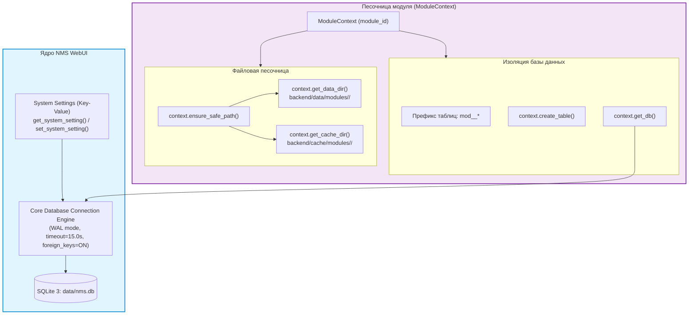

# 💾 4. Использование базы данных и хранилища (Database & Storage API)

---

Документ подробно описывает архитектуру и механизмы работы с хранилищами данных в платформе **NMS WebUI**. Вы узнаете, как использовать единую базу данных **SQLite 3 (WAL)**, подготавливать изолированные таблицы модулей, работать со встроенной файловой песочницей (`backend/data/modules/` и `backend/cache/modules/`), использовать системное Key-Value хранилище, защищать приложение от SQL-инъекций и Path Traversal, правильно обрабатывать блокирующий I/O в FastAPI, а также организовывать миграции схем, индексацию, пагинацию и хранение JSON-документов.

---

## 📌 1. Концепция, Архитектура и Изоляция данных

Платформа **NMS WebUI** использует гибридную модель хранения:
1. **Реляционные данные**: Единая база данных **SQLite 3** (`data/nms.db` в корне проекта), обслуживающая как ядро платформы, так и бэкенд-модули.
2. **Файловые ресурсы**: Изолированные директории файловой системы (`backend/data/modules/` и `backend/cache/modules/`), выделяемые каждому модулю под управление персистентными данными и временным кэшем.
3. **Системные настройки (Key-Value)**: Таблица `system_settings` для хранения конфигурационных параметров платформы и модулей.

### Архитектурная схема взаимодействия



---

### 1.1. Единая база данных SQLite 3 (WAL mode)
Все модули платформы используют единый файл базы данных `nms.db`. Для поддержания высокого уровня конкурентности и надежности подключение к БД инициализируется со следующими системными прагмами:

| Прагма SQLite | Значение | Назначение |
| :--- | :--- | :--- |
| `journal_mode` | `WAL` | Write-Ahead Logging — позволяет параллельно читать данные во время записи |
| `synchronous` | `NORMAL` | Оптимальный баланс производительности диска и стойкости к сбоям питания |
| `foreign_keys` | `ON` | Каскадное удаление и строгий контроль целостности внешних ключей |

> [!NOTE]
> Все соединения через `context.get_db()` создаются с блокировочным таймаутом `timeout=15.0` секунд. Это исключает мгновенные сбои `OperationalError: database is locked` при одновременной записи из нескольких модулей или фоновых сервисов.

---

### 1.2. Изоляция таблиц модулей (Префиксы)
Для предотвращения коллизий имен таблиц между независимыми модулями вводится строгий стандарт именования:

$$\text{Префикс} = \texttt{mod\_} + \text{clean\_module\_id} + \texttt{\_}$$

Где `clean_module_id` — идентификатор модуля, в котором символы `-` и `.` заменены на `_`.

| Идентификатор модуля (`module_id`) | Обычное имя таблицы | Физическое имя таблицы в SQLite |
| :--- | :--- | :--- |
| `sensor_monitor` | `devices` | `mod_sensor_monitor_devices` |
| `network-topology` | `links` | `mod_network_topology_links` |
| `tuya` | `credentials` | `mod_tuya_credentials` |
| `core.notifications` | `rules` | `mod_core_notifications_rules` |

> [!IMPORTANT]
> Метод `context.create_table()` и его асинхронный аналог `context.create_table_async()` выполняют автоматическое подставление префикса.
> Для асинхронных SQL-запросов без блокировки Event Loop используйте `await context.execute_sql_async(sql, params)`.
> Для легких миграций схемы (добавление новых колонок) используйте `await context.add_column_if_not_exists(table, column_name, column_type)`.

---

### 1.3. Файловая песочница модулей
Модули изолированы от прямого произвольного доступа к файловой системе сервера. Для хранения пользовательских и технических файлов каждому модулю предоставляются две персональные директории:
- **Данные (`DataDir`)**: `backend/data/modules/<clean_module_id>/` — предназначена для долгоживущих конфигураций, пользовательских файлов, экспортированных отчетов и локальных реестров.
- **Кэш (`CacheDir`)**: `backend/cache/modules/<clean_module_id>/` — предназначена для временных файлов, кэшированных ответов сторонних API и сгенерированных бинарных файлов.

---

### 1.4. Системное Key-Value хранилище (`system_settings`)
Ядро платформы предоставляют общую таблицу `system_settings` для хранения глобальных и модуль-специфичных конфигураций формата "ключ-значение". Значения автоматически сериализуются и десериализуются из JSON.

Для работы с системными настройками используются служебные функции из backend/core/database.py:

```python
from backend.core.database import get_system_setting, set_system_setting

# Чтение настройки (с дефолтным значением)
poll_interval = get_system_setting("sensor_monitor.poll_interval", default=60)

# Сохранение настройки (поддерживаются словари, списки, строки, числа)
set_system_setting("sensor_monitor.poll_interval", 30)
```

> [!TIP]
> Рекомендуется префиксировать ключи в `system_settings` с помощью `module_id` (например, `sensor_monitor.api_key`), чтобы избегать коллизий с другими модулями.

---

## 🛠 2. Справочник API ModuleContext (Database & Storage)

Все взаимодействие бэкенд-модуля с базой данных и файловой системой осуществляется через объект `ModuleContext`.

```python
from backend.core.plugin.context import ModuleContext
```

### Сводная таблица методов API

| Метод | Возвращаемый тип | Назначение |
| :--- | :--- | :--- |
| `get_db()` | `sqlite3.Connection` | Получить соединение с базой данных `nms.db` |
| `get_table_prefix()` | `str` | Получить SQL-префикс таблиц модуля (`mod_<id>_`) |
| `create_table()` | `None` | Автоматически создать таблицу с префиксом |
| `get_data_dir()` | `Path` | Получить абсолютный путь к директории данных модуля |
| `get_cache_dir()` | `Path` | Получить абсолютный путь к директории кэша модуля |
| `ensure_safe_path()` | `Path` | Валидировать путь на принадлежность песочнице модуля |

---

### 2.1. `get_db()`

Возвращает активное соединение с базой данных `nms.db`.

```python
def get_db(self) -> sqlite3.Connection:
```

- **Возвращаемое значение**: sqlite3.Connection с установленной фабрикой строк `conn.row_factory = sqlite3.Row`.
- **Пример использования**:
  ```python
  with self.context.get_db() as conn:
      cursor = conn.cursor()
      cursor.execute("SELECT * FROM users WHERE is_active = ?", (1,))
      active_users = cursor.fetchall()
  ```

---

### 2.2. `get_table_prefix()`

Возвращает стандартный SQL-префикс таблиц текущего модуля.

```python
def get_table_prefix(self) -> str:
```

- **Возвращаемое значение**: Строка формата `mod_<clean_module_id>_`.
- **Пример**:
  ```python
  prefix = self.context.get_table_prefix()
  # Для модуля "sensor-monitor" вернет "mod_sensor_monitor_"
  ```

---

### 2.3. `create_table()`

Автоматически создает таблицу модуля в базе данных `nms.db` с подстановкой системного префикса. Выполняется под конструкцией `CREATE TABLE IF NOT EXISTS`.

```python
def create_table(self, table_name: str, schema: dict[str, str] | str) -> None:
```

- **Параметры**:
  - `table_name` (`str`): Относительное имя таблицы без префикса (например, `'sensors'`).
  - `schema` (`dict[str, str] | str`): Определение структуры полей в виде словаря `{"column": "TYPE CONSTRAINTS"}` или DDL-строки.
- **Пример использования**:
  ```python
  # Вариант 1: Использование словаря (рекомендуется)
  self.context.create_table(
      "sensors",
      {
          "id": "TEXT PRIMARY KEY",
          "name": "TEXT NOT NULL",
          "value": "REAL DEFAULT 0.0",
          "updated_at": "TIMESTAMP DEFAULT CURRENT_TIMESTAMP"
      }
  )

  # Вариант 2: Использование DDL-строки
  self.context.create_table(
      "logs",
      "id INTEGER PRIMARY KEY AUTOINCREMENT, message TEXT, level VARCHAR(10)"
  )
  ```

---

### 2.4. `get_data_dir()`

Возвращает объект `Path` персистентной директории данных модуля. Если директория не существует на диске, она автоматически создается.

```python
def get_data_dir(self) -> Path:
```

- **Возвращаемое значение**: pathlib.Path (`backend/data/modules/<clean_module_id>/`).
- **Пример**:
  ```python
  config_file = self.context.get_data_dir() / "settings.json"
  ```

---

### 2.5. `get_cache_dir()`

Возвращает объект `Path` временной директории кэша модуля. Директория создается автоматически.

```python
def get_cache_dir(self) -> Path:
```

- **Возвращаемое значение**: pathlib.Path (`backend/cache/modules/<clean_module_id>/`).
- **Пример**:
  ```python
  temp_file = self.context.get_cache_dir() / "download_buffer.tmp"
  ```

---

### 2.6. `ensure_safe_path()`

Проверяет, что целевой путь находится строго внутри одной из разрешенных директорий песочницы модуля (директория модуля, data-директория или cache-директория).

```python
def ensure_safe_path(self, target_path: Path | str) -> Path:
```

- **Параметры**:
  - `target_path` (`Path | str`): Проверяемый путь.
- **Возвращаемое значение**: Абсолютный нормализованный объект `Path`.
- **Исключения**: `ValueError`, если путь выходит за пределы разрешенных директорий.
- **Пример**:
  ```python
  safe_path = self.context.ensure_safe_path(user_supplied_filename)
  ```

---

## 🗄 3. Работа с базой данных SQLite

### 3.1. Соединения и контекстные менеджеры

Все операции с базой данных рекомендуются к выполнению с использованием контекстного менеджера `with self.context.get_db() as conn:`. Это обеспечивает автоматическое управление транзакциями и исключает утечки соединений.

```python
def get_sensor_by_id(self, sensor_id: str) -> dict | None:
    table = f"{self.context.get_table_prefix()}sensors"
    with self.context.get_db() as conn:
        cursor = conn.cursor()
        cursor.execute(f"SELECT * FROM {table} WHERE id = ?", (sensor_id,))
        row = cursor.fetchone()
        return dict(row) if row else None
```

---

### 3.2. Доступ к полям по имени (`sqlite3.Row`)

Благодаря конфигурации `conn.row_factory = sqlite3.Row` результат каждого запроса представляет собой маппинг-объект, доступный как по имени колонки, так и с помощью конвертации в стандартный Python-словарь `dict`.

```python
table = f"{self.context.get_table_prefix()}devices"
with self.context.get_db() as conn:
    cursor = conn.execute(f"SELECT id, hostname, ip_address FROM {table}")
    for row in cursor.fetchall():
        # Доступ по имени колонки
        hostname = row["hostname"]
        # Конвертация всей строки в словарь
        device_dict = dict(row)
```

---

### 3.3. Параметризация запросов и защита от SQL Injection

> [!WARNING]
> Категорически запрещается подставлять данные, полученные от пользователей или из внешних источника через f-строки или конкатенацию строк в SQL-запрос!
> Единственное допустимое использование f-строк в SQL — подстановка экранированного системного имени таблицы (`prefix`).

#### ❌ Небезопасный код (Уязвимость SQL Injection):
```python
# ОПАСНО: Потенциальное внедрение SQL-кода
user_status = "online'; DROP TABLE mod_sensor_devices;--"
cursor.execute(f"SELECT * FROM {prefix}devices WHERE status = '{user_status}'")
```

#### ✅ Безопасный код (Параметризованные запросы):
```python
# Позиционные параметры (?)
cursor.execute(
    f"SELECT * FROM {prefix}devices WHERE status = ? AND type = ?",
    ("online", "router")
)

# Именованные параметры (:name)
cursor.execute(
    f"SELECT * FROM {prefix}devices WHERE status = :status AND val > :min_val",
    {"status": "online", "min_val": 10.5}
)
```

---

### 3.4. Транзакции и обработка блокировок

Блок `with conn:` в Python `sqlite3` автоматически оборачивает код в транзакцию:
- В случае успешного завершения блока выполняется `conn.commit()`.
- В случае возникновения необработанного исключения выполняется `conn.rollback()`.

#### Пакетная вставка (Batch insert):
Для атомарного сохранения массива записей с высокой производительностью используйте метод `executemany()`:

```python
batch_data = [
    ("sensor_1", "Temperature", 23.5),
    ("sensor_2", "Humidity", 60.0),
    ("sensor_3", "Pressure", 755.2),
]

table = f"{self.context.get_table_prefix()}sensors"
with self.context.get_db() as conn:
    conn.executemany(
        f"INSERT INTO {table} (id, name, val) VALUES (?, ?, ?)",
        batch_data
    )
```

---

### 3.5. Внешние ключи (Foreign Keys) и интеграция с системными таблицами

В SQLite включена прагма `PRAGMA foreign_keys = ON;`. Таблицы модулей могут ссылаться на системные таблицы ядра (например, `users(id)` или `roles(id)`), а также между собой.

```python
prefix = self.context.get_table_prefix()

# Создание таблицы заметок, привязанной к пользователю платформы
self.context.create_table(
    "user_notes",
    f"""
    id TEXT PRIMARY KEY,
    user_id TEXT NOT NULL,
    note TEXT NOT NULL,
    created_at TIMESTAMP DEFAULT CURRENT_TIMESTAMP,
    FOREIGN KEY (user_id) REFERENCES users(id) ON DELETE CASCADE
    """
)
```

---

### 3.6. Миграция и эволюция схемы данных при обновлении модуля

При обновлении модуля с версии v1.0.0 на v1.1.0 может потребоваться добавить новые колонки без потери существующих пользовательских данных.

Миграция схемы выполняется в методе `init()` модуля с помощью проверки существования столбцов через `PRAGMA table_info`:

```python
def init(self) -> None:
    prefix = self.context.get_table_prefix()
    
    # 1. Создание базовой структуры (IF NOT EXISTS)
    self.context.create_table(
        "devices",
        """
        id TEXT PRIMARY KEY,
        name TEXT NOT NULL
        """
    )
    
    # 2. Безопасное добавление новых колонок при обновлении
    with self.context.get_db() as conn:
        columns = [row["name"] for row in conn.execute(f"PRAGMA table_info({prefix}devices)").fetchall()]
        
        if "location" not in columns:
            conn.execute(f"ALTER TABLE {prefix}devices ADD COLUMN location TEXT DEFAULT ''")
            self.context.logger.info("Миграция: добавлена колонка 'location' в таблицу %sdevices", prefix)
```

---

### 3.6. Оптимизация и индексация (`CREATE INDEX`)

Для таблиц с частым поиском, фильтрацией или сортировкой необходимо явно создавать индексы при инициализации модуля.Имя индекса также должно содержать префикс модуля:

```python
table = f"{self.context.get_table_prefix()}metrics"

with self.context.get_db() as conn:
    # Индекс для ускорения фильтрации по sensor_id и времени
    conn.execute(
        f"CREATE INDEX IF NOT EXISTS {self.context.get_table_prefix()}idx_metrics_sensor_time "
        f"ON {table} (sensor_id, created_at DESC)"
    )
```

#### Проверка использования индексов:
Для отладки сложных запросов используйте `EXPLAIN QUERY PLAN`:
```python
with self.context.get_db() as conn:
    plan = conn.execute(f"EXPLAIN QUERY PLAN SELECT * FROM {table} WHERE sensor_id = ?", ("s1",)).fetchall()
    for line in plan:
        self.context.logger.debug("Query plan: %s", line["detail"])
```

---

### 3.7. Работа с асинхронным контекстом FastAPI (`def` vs `async def`)

В бэкенде FastAPI роутеры могут быть синхронными (`def`) или асинхронными (`async def`).

> [!IMPORTANT]
> Выполнение длительных блокирующих операций чтения/записи в SQLite непосредственно внутри `async def` функции блокирует основной Event Loop сервера asyncio!

#### Вариант 1: Использование синхронных роутеров (Рекомендуется по умолчанию)
FastAPI автоматически забирает выполнения обычных `def` эндпоинтов в отдельный тредпул (threadpool), что безопасно для работы с SQLite:

```python
@router.get("/items")
def get_items():
    # Автоматически исполняется в ThreadPool
    return repository.get_all()
```

#### Вариант 2: Асинхронные роутеры с `anyio.to_thread.run_sync`
Если роутер объявлен как `async def`, оборачивайте синхронные вызовы к БД в `anyio.to_thread.run_sync`:

```python
import anyio

@router.get("/items-async")
async def get_items_async():
    # Выполнение блокирующего метода в тредпуле без блокировки event loop
    items = await anyio.to_thread.run_sync(repository.get_all)
    return items
```

---

### 3.8. Фильтрация по времени, UTC и регулярная очистка (TTL Cleanup)

1. **Формат времени**: Сохраняйте метки времени в формате UTC (`TIMESTAMP DEFAULT CURRENT_TIMESTAMP` или ISO 8601).
2. **Фильтрация по интервалу**:
   ```python
   table = f"{prefix}events"
   sql = f"SELECT * FROM {table} WHERE created_at >= datetime('now', '-7 days')"
   ```
3. **Автоматическая очистка по TTL**: Для логов и временных записей реализуйте метод очистки устаревших данных:
   ```python
   def purge_old_events(self, days: int = 30) -> int:
       table = f"{self.context.get_table_prefix()}events"
       with self.context.get_db() as conn:
           cursor = conn.execute(
               f"DELETE FROM {table} WHERE created_at < datetime('now', ?)",
               (f"-{days} days",)
           )
           return cursor.rowcount
   ```

---

### 3.9. Эффективная пагинация выборок

Для веб-интерфейсов используйте пагинацию с возвратом общего количества элементов:

```python
def get_paginated_devices(self, page: int = 1, page_size: int = 20) -> dict:
    table = f"{self.context.get_table_prefix()}devices"
    offset = (page - 1) * page_size
    
    with self.context.get_db() as conn:
        # 1. Подсчет общего количества
        total = conn.execute(f"SELECT COUNT(*) FROM {table}").fetchone()[0]
        
        # 2. Выборка порции данных
        rows = conn.execute(
            f"SELECT id, name, status FROM {table} ORDER BY name ASC LIMIT ? OFFSET ?",
            (page_size, offset)
        ).fetchall()
        
        return {
            "items": [dict(r) for r in rows],
            "total": total,
            "page": page,
            "page_size": page_size
        }
```

---

## 🔄 4. Миграции и эволюция схем

### 4.1. Автоматическое создание таблиц (`create_table()`)

Метод `self.context.create_table()` следует вызывать на этапе инициализации модуля (`init()`). Если таблица не существовала, она будет создана с заданной структурой.

```python
class SensorMonitorModule(BaseModule):
    def init(self) -> None:
        self.context.create_table(
            "metrics",
            {
                "id": "TEXT PRIMARY KEY",
                "sensor_id": "TEXT NOT NULL",
                "value": "REAL DEFAULT 0.0",
                "timestamp": "TIMESTAMP DEFAULT CURRENT_TIMESTAMP"
            }
        )
```

---

### 4.2. Безопасные миграции без сторонних ORM (`PRAGMA table_info`)

Поскольку вызов `CREATE TABLE IF NOT EXISTS` не модифицирует структуру уже существующей таблицы, добавление новых полей в обновленных версиях модуля реализуется через паттерн инспекции `PRAGMA table_info`:

```python
def _apply_migrations(self) -> None:
    """Паттерн безопасной миграции структуры таблицы модуля."""
    table_name = f"{self.context.get_table_prefix()}metrics"
    
    with self.context.get_db() as conn:
        # 1. Получаем список существующих колонок
        columns_info = conn.execute(f"PRAGMA table_info({table_name})").fetchall()
        existing_columns = {col["name"] for col in columns_info}

        # 2. Добавляем отсутствующие колонки без потери существующих данных
        if "location_id" not in existing_columns:
            conn.execute(f"ALTER TABLE {table_name} ADD COLUMN location_id TEXT DEFAULT NULL")
            self.context.logger.info("Migrated schema: added 'location_id' to %s", table_name)

        if "is_valid" not in existing_columns:
            conn.execute(f"ALTER TABLE {table_name} ADD COLUMN is_valid BOOLEAN DEFAULT 1")
            self.context.logger.info("Migrated schema: added 'is_valid' to %s", table_name)
```

---

## 📁 5. Изолированное файловое хранилище (Storage API)

### 5.1. Постоянные данные (`get_data_dir()`)

Директория `context.get_data_dir()` предназначена для файлов, сохраняющих свое состояние между перезапусками сервера.

```python
data_dir = self.context.get_data_dir()
custom_rules_file = data_dir / "custom_rules.json"

if not custom_rules_file.exists():
    custom_rules_file.write_text("[]", encoding="utf-8")
```

---

### 5.2. Временный кэш (`get_cache_dir()`)

Директория `context.get_cache_dir()` служит для временных вычислений и загрузок.

```python
cache_dir = self.context.get_cache_dir()
download_tmp = cache_dir / "firmware_update.bin"
```

---

### 5.3. Защита от Path Traversal (`ensure_safe_path()`)

> [!IMPORTANT]
> Если модуль принимает имя файла от пользователя (например, при передаче параметров запроса), вы обязаны обернуть путь в `context.ensure_safe_path()`.

```python
def get_user_file_content(self, filename: str) -> str:
    # Конструируем потенциальный путь
    requested_path = self.context.get_data_dir() / filename
    
    # ensure_safe_path выбросит ValueError, если передан параметр типа "../../etc/passwd"
    safe_path = self.context.ensure_safe_path(requested_path)
    
    return safe_path.read_text(encoding="utf-8")
```

---

### 5.4. Хранение документов в формате JSON (Pydantic Pattern)

Для небольших объемов структурированных данных применяется доказавший надежность паттерн **Pydantic + JSON-файл в `data_dir`** (на основе реализации в модуле TuyaStorage):

```python
import json
from pathlib import Path
from pydantic import BaseModel, Field

class DeviceConfig(BaseModel):
    device_id: str
    label: str = ""
    settings: dict = Field(default_factory=dict)

class ModuleConfigStore:
    def __init__(self, data_dir: Path):
        self.file_path = data_dir / "device_configs.json"
        self._configs: dict[str, DeviceConfig] = {}
        self.load()

    def load(self) -> None:
        if not self.file_path.exists():
            return
        try:
            content = self.file_path.read_text(encoding="utf-8")
            data = json.loads(content)
            self._configs = {item["device_id"]: DeviceConfig(**item) for item in data}
        except Exception:
            self._configs = {}

    def save(self) -> None:
        serializable = [cfg.model_dump() for cfg in self._configs.values()]
        self.file_path.write_text(json.dumps(serializable, indent=2, ensure_ascii=False), encoding="utf-8")

    def upsert(self, config: DeviceConfig) -> None:
        self._configs[config.device_id] = config
        self.save()
```

---

### 5.5. Стратегия полная очистки данных при удалении модуля (Purge Strategy)

Если модуль предоставляет функцию полная удаления своих данных (например, по запросу администратора), он должен удалить собственные таблицы из БД и очистить изолированные директории:

```python
def purge_all_data(self) -> None:
    """Полное удаление таблиц и файлов модуля."""
    prefix = self.context.get_table_prefix()
    
    # 1. Удаление таблиц модуля из БД
    with self.context.get_db() as conn:
        tables = conn.execute(
            "SELECT name FROM sqlite_master WHERE type='table' AND name LIKE ?",
            (f"{prefix}%",)
        ).fetchall()
        for tbl in tables:
            conn.execute(f"DROP TABLE IF EXISTS {tbl['name']}")

    # 2. Очистка файловых директорий
    for folder in (self.context.get_data_dir(), self.context.get_cache_dir()):
        if folder.exists():
            import shutil
            shutil.rmtree(folder, ignore_errors=True)
```

---

## 🌿 6. Специфика субмодулей (Submodules DB & Storage)

При разработке дочерних плагинов (`BaseSubmodule`) правила именования таблиц и файловых директорий сохраняют иерархическую структуру.

Если родительский модуль имеет ID `sensor_monitor`, а субмодуль — `ping_checker` (`full_id = sensor_monitor.ping_checker`):

1. **Префикс таблиц субмодуля**:
   `self.context.get_table_prefix()` вернет: `mod_sensor_monitor_ping_checker_`
2. **Директория данных субмодуля**:
   `self.context.get_data_dir()` вернет: `backend/data/modules/sensor_monitor.ping_checker/`
3. **Доступ к данным родительского модуля**:
   Субмодуль может считывать данные из таблиц родительского модуля в БД `nms.db`, явно указав его префикс:
   ```python
   parent_prefix = "mod_sensor_monitor_"
   cursor.execute(f"SELECT * FROM {parent_prefix}devices")
   ```

---

## 🏗 7. Практический пример: Production-ready Repository Pattern

Ниже представлен эталонный класс репозитория, сочетающий создание таблиц, внешние ключи, создание индексов, безопасные миграции, использование контекстных менеджеров транзакций, пагинацию и работу с файловым хранилищем:

```python
import json
import sqlite3
from pathlib import Path
from typing import Optional, Dict, Any
from pydantic import BaseModel
from backend.core.plugin.context import ModuleContext

class SensorRecord(BaseModel):
    id: str
    name: str
    location: str = "Default"
    value: float = 0.0
    owner_id: Optional[str] = None

class SensorRepository:
    """Production-ready репозиторий модуля для управления датчиками."""

    def __init__(self, context: ModuleContext):
        self.context = context
        self.prefix = context.get_table_prefix()
        self.table_name = f"{self.prefix}sensors"
        self._init_storage()

    def _init_storage(self) -> None:
        """Инициализация таблицы и индексов в SQLite с безопасными миграциями."""
        self.context.create_table(
            "sensors",
            f"""
                id TEXT PRIMARY KEY,
                name TEXT NOT NULL,
                value REAL DEFAULT 0.0,
                created_at TIMESTAMP DEFAULT CURRENT_TIMESTAMP,
                owner_id TEXT DEFAULT NULL,
                FOREIGN KEY (owner_id) REFERENCES users(id) ON DELETE SET NULL
            """
        )
        self._migrate_and_index()

    def _migrate_and_index(self) -> None:
        """Добавление отсутствующих полей и создание индексов."""
        with self.context.get_db() as conn:
            # 1. Проверка структуры колонок
            columns = {col["name"] for col in conn.execute(f"PRAGMA table_info({self.table_name})").fetchall()}
            if "location" not in columns:
                conn.execute(f"ALTER TABLE {self.table_name} ADD COLUMN location TEXT DEFAULT 'Default'")

            # 2. Создание индексов
            idx_name = f"{self.prefix}idx_sensors_location"
            conn.execute(f"CREATE INDEX IF NOT EXISTS {idx_name} ON {self.table_name} (location)")

    def save(self, record: SensorRecord) -> None:
        """Сохранение записи в БД с использованием upsert."""
        sql = f"""
            INSERT INTO {self.table_name} (id, name, location, value, owner_id)
            VALUES (:id, :name, :location, :value, :owner_id)
            ON CONFLICT(id) DO UPDATE SET
                name = excluded.name,
                location = excluded.location,
                value = excluded.value,
                owner_id = excluded.owner_id;
        """
        with self.context.get_db() as conn:
            conn.execute(sql, record.model_dump())

    def get_by_id(self, record_id: str) -> Optional[SensorRecord]:
        """Получение записи по идентификатору."""
        sql = f"SELECT id, name, location, value, owner_id FROM {self.table_name} WHERE id = ?"
        with self.context.get_db() as conn:
            row = conn.execute(sql, (record_id,)).fetchone()
            return SensorRecord(**dict(row)) if row else None

    def list_paginated(self, page: int = 1, limit: int = 20) -> Dict[str, Any]:
        """Пагинированный выбор списков."""
        offset = (page - 1) * limit
        with self.context.get_db() as conn:
            total = conn.execute(f"SELECT COUNT(*) FROM {self.table_name}").fetchone()[0]
            rows = conn.execute(
                f"SELECT id, name, location, value, owner_id FROM {self.table_name} ORDER BY id ASC LIMIT ? OFFSET ?",
                (limit, offset)
            ).fetchall()
            return {
                "items": [SensorRecord(**dict(r)) for r in rows],
                "total": total,
                "page": page,
                "limit": limit
            }

    def export_to_json(self, export_filename: str) -> Path:
        """Экспорт всех данных модуля в безопасный файл песочницы."""
        target_path = self.context.get_data_dir() / export_filename
        safe_path = self.context.ensure_safe_path(target_path)

        sql = f"SELECT id, name, location, value, owner_id FROM {self.table_name}"
        with self.context.get_db() as conn:
            rows = conn.execute(sql).fetchall()
            export_data = [dict(r) for r in rows]

        safe_path.write_text(
            json.dumps(export_data, indent=2, ensure_ascii=False),
            encoding="utf-8"
        )
        return safe_path
```

---

## ⚠️ 8. Антипаттерны и чек-лист безопасности

### Чек-лист разработки:

- [ ] **Префиксы таблиц**: Имя любой таблицы формируется исключительно через `context.create_table()` или `context.get_table_prefix()`.
- [ ] **Параметризация SQL**: Данные пользователей передаются только через кортежи `(?)` или словари `(:name)`. Конкатенация строк в SQL запрещена.
- [ ] **Управление транзакциями**: Все SQL-операции выполняются с помощью контекстного менеджера `with context.get_db() as conn:`.
- [ ] **Проверка путей песочницы**: Все пользовательские пути к файлам валидируются методом `context.ensure_safe_path()`.
- [ ] **Изоляция Data/Cache**: Постоянные данные сохраняются в `get_data_dir()`, временные данные — в `get_cache_dir()`.
- [ ] **Совместимость миграций**: Изменения существующих таблиц выполняются без отката данных через `PRAGMA table_info` и `ALTER TABLE`.
- [ ] **FastAPI Async Safety**: Тяжёлые блокирующие DB-операции не вызываются напрямую из `async def` эндпоинтов без `anyio.to_thread.run_sync()`.
- [ ] **Индексы и FK**: Используются префиксированные индексы и каскадная целостность связей через `FOREIGN KEY`.

---

## 🔗 Связанные разделы wiki
- 📜 01. Манифесты модулей (manifest.yaml)
- 🛠 02. Создание модулей и базовое API (`BaseModule` & `ModuleContext`)
- 🌿 03. Разработка субмодулей и иерархия плагинов (`BaseSubmodule`)
