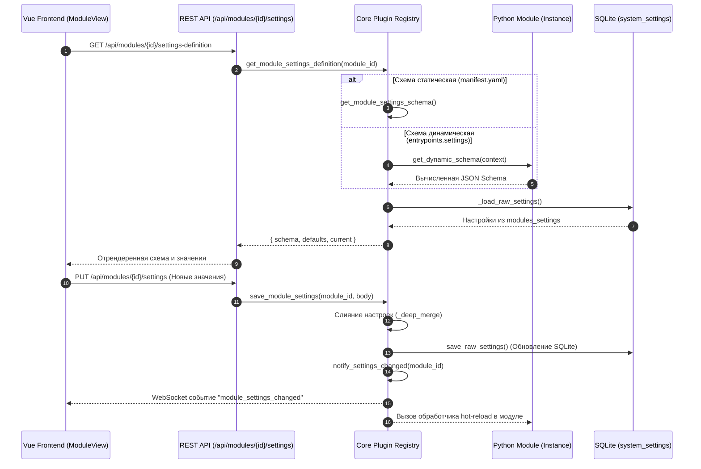

# ⚙️ 5. Настройки модулей и работа с JSON Schema (Config & Settings API)

Настоящее руководство подробно описывает подсистему управления настройками модулей в NMS WebUI. Подсистема позволяет модулям декларативно описывать свои параметры через **JSON Schema**, автоматизировать генерацию пользовательского интерфейса (UI), поддерживать динамические настройки в зависимости от состояния окружения, валидировать данные на стороне бекенда, а также обеспечивать горячее обновление параметров без перезапуска сервисов (Hot Reload).

---

## 🏗️ 1. Архитектура подсистемы настроек

Подсистема Config & Settings API состоит из трех ключевых слоев: декларации/вычисления схемы, изолированного SQLite-хранилища и графического интерфейса с подпиской на события.



### Хранение настроек в БД и стратегия слияния (Defaults Merging)
Настройки всех модулей централизованно хранятся в единой базе данных SQLite (`nms.db`) в системной таблице `system_settings` под ключом `modules_settings`.

При формировании итогового словаря конфигурации для модуля или UI действует правило приоритета:

$$\text{Final Settings} = \text{Defaults from Schema} \oplus \text{Current DB Values}$$

1. Значения по умолчанию извлекаются из поля `default` свойства в JSON Schema.
2. Значения, сохраненные пользователем в SQLite, перекрывают дефолтные значения.

Структура записи в БД:
```json
{
  "modules": {
    "sensor_monitor": {
      "enabled": true,
      "settings": {
        "poll_interval": 60,
        "interface": "eth0",
        "alert_email": "admin@example.com"
      }
    },
    "sensor_monitor.snmp_exporter": {
      "enabled": true,
      "settings": {
        "snmp_community": "public",
        "port": 161
      }
    }
  }
}
```

 Все операции чтения и записи производятся через функции служебного модуля [registry.py](file:///opt/nms-webui/backend/core/plugin/registry.py):
- `_load_raw_settings()` — считывает JSON-словарь из `system_settings`.
- `_save_raw_settings(data)` — атомарно обновляет настройки в `system_settings`.

### Изоляция настроек субмодулей
Субмодули хранят свои параметры под изолированным составным идентификатором `<parent_id>.<submodule_id>` (например, `sensor_monitor.snmp_exporter`). Это предотвращает коллизии имен настроек между родителем и дочерними компонентами.

---

## 📝 2. Декларативные схемы настроек (`config_schema`)

Каждый модуль может объявить статическую схему пользовательских настроек в своем манифесте `manifest.yaml` в блоке `config_schema`. Схема должна соответствовать спецификации **JSON Schema (Draft 7)**.

### Поддерживаемые типы данных и UI-атрибуты

| Тип в JSON Schema | Элемент интерфейса (UI в `SettingsForm.vue`) | Поддерживаемые атрибуты валидации и UI |
| :--- | :--- | :--- |
| `boolean` | Переключатель (Toggle Switch) | `title`, `description`, `default` |
| `string` (с `enum`) | Выпадающий список (`<select>`) | `title`, `description`, `enum`, `default` |
| `string` | Текстовое поле ввода (`<input type="text">`) | `title`, `description`, `placeholder`, `default` |
| `string` (`format: password` или название `secret`/`password`) | Маскированное поле ввода (`<input type="password">`) | `title`, `description`, `placeholder`, `default` |
| `integer` / `number` | Числовое поле ввода (`<input type="number">`) | `title`, `description`, `default`, `minimum`, `maximum` |

> [!NOTE]
> Автоматическая генерация формы встроенным компонентом `SettingsForm.vue` поддерживает примитивные типы (`boolean`, `string`, `enum`, `number`, `password`). Для отображения сложных вложенных структур (`object`, `array`) рекомендуется создавать пользовательские Vue-представления модуля.
> 
> Заголовки (`title`), описания (`description`) и подсказки (`placeholder`) автоматически пропускаются через системную функцию локализации `t(key)`. Если ключа нет в словаре i18n модуля, отображается оригинальный текст.

### Пример декларации `config_schema` с расширенными типами в `manifest.yaml`

```yaml
id: "sensor_monitor"
name: "Мониторинг сенсоров"
version: "1.2.0"

config_schema:
  type: "object"
  required:
    - "poll_interval"
    - "api_token"
  properties:
    poll_interval:
      type: "integer"
      title: "sensor_monitor.settings.poll_interval_title"
      description: "sensor_monitor.settings.poll_interval_desc"
      default: 30
      minimum: 5
      maximum: 3600
      step: 5

    target_hosts:
      type: "array"
      title: "Список серверов для опроса"
      description: "IP-адреса или FQDN хостов"
      minItems: 1
      uniqueItems: true
      items:
        type: "string"
        pattern: "^[a-zA-Z0-9.-]+$"

    db_credentials:
      type: "object"
      title: "Параметры БД метрик"
      properties:
        host:
          type: "string"
          title: "Хост базы данных"
          default: "127.0.0.1"
        port:
          type: "integer"
          title: "Порт"
          default: 5432

    alert_email:
      type: "string"
      title: "Email для алармов"
      placeholder: "admin@domain.com"
      default: "admin@example.com"

    api_token:
      type: "string"
      format: "password"
      title: "API Токен доступа"
      description: "Секретный токен для подключения к внешнему агенту"

    enable_notifications:
      type: "boolean"
      title: "Включить отправку уведомлений"
      default: true

    log_level:
      type: "string"
      title: "Уровень логирования"
      default: "INFO"
      enum:
        - "DEBUG"
        - "INFO"
        - "WARNING"
        - "ERROR"
```

---

## 🐍 3. Динамические схемы настроек (`entrypoints.settings`)

Если опции выпадающих списков или граничные значения параметров зависят от рантайм-условий (например, список физических сетевых интерфейсов, доступные COM-порты или текущий список пользователей системного окружения), модуль использует **динамическую схему**.

### Объявление точки входа в `manifest.yaml`
```yaml
entrypoints:
  settings: "backend.modules.sensor_monitor.settings:get_dynamic_schema"
```

### Реализация функции формирования схемы
Функция точки входа принимает аргумент `ctx: ModuleContext` и возвращает словарь JSON Schema:

```python
# backend/modules/sensor_monitor/settings.py
from typing import Any
import psutil
from backend.core.plugin.context import ModuleContext

def get_dynamic_schema(ctx: ModuleContext) -> dict[str, Any]:
    """Динамически формирует JSON Schema настроек на основе реальных сетевых интерфейсов сервера."""
    # Получаем список физических и виртуальных сетевых интерфейсов сервера
    available_interfaces = list(psutil.net_if_addrs().keys())
    if not available_interfaces:
        available_interfaces = ["eth0", "lo"]

    ctx.logger.debug("Сформирован динамический список интерфейсов: %s", available_interfaces)

    return {
      "type": "object",
      "required": ["interface", "poll_interval"],
      "properties": {
        "interface": {
          "type": "string",
          "title": "Сетевой интерфейс опроса",
          "description": "Выберите сетевой интерфейс для отправки RAW-пакетов",
          "enum": available_interfaces,
          "default": available_interfaces[0]
        },
        "poll_interval": {
          "type": "integer",
          "title": "Интервал опроса (сек)",
          "default": 15,
          "minimum": 1,
          "maximum": 300
        },
        "enable_promiscuous": {
          "type": "boolean",
          "title": "Promiscuous Mode",
          "description": "Переводить ли адаптер в режим перехвата всех пакетов",
          "default": False
        }
      }
    }
```

> [!TIP]
> При вызове внешних тяжелых CLI-команд или сетевых запросов внутри `get_dynamic_schema` используйте короткий кэш (например, на 10-30 секунд), чтобы не замедлять открытие формы настроек в UI.

---

## 🛠️ 4. Backend Python API и Валидация

Ядро NMS WebUI предоставляет функции для работы с настройками в коде бекенда ([registry.py](file:///opt/nms-webui/backend/core/plugin/registry.py)).

### Основные функции Registry

#### 1. Получение текущих настроек модуля
```python
from backend.core.plugin.registry import get_module_settings

settings: dict[str, Any] = get_module_settings("sensor_monitor")
poll_interval = settings.get("poll_interval", 30)
```

#### 2. Сохранение и слияние настроек модуля
При вызове `save_module_settings` новое значение словаря рекурсивно объединяется с текущей конфигурацией модуля в SQLite через утилиту `_deep_merge`:

```python
from backend.core.plugin.registry import save_module_settings, get_module_settings

def update_sensor_settings(module_id: str, new_values: dict[str, Any]) -> None:
    # Сохранение словаря (автоматически выполняет deep merge и отправку события notify_settings_changed)
    save_module_settings(module_id, new_values)
```

#### 3. Получение схемы и полных определений настроек
```python
from backend.core.plugin.registry import (
    get_module_settings_schema,
    get_module_settings_definition
)

# Возвращает чистую JSON Schema (статическую или динамическую)
schema = get_module_settings_schema("sensor_monitor")

# Возвращает полную структуру с дефолтами и текущими значениями
definition = get_module_settings_definition("sensor_monitor")
# Структура ответа definition:
# {
#    "module_id": "sensor_monitor",
#    "schema": { ... },
#    "defaults": { "poll_interval": 30, "interface": "eth0" },
#    "current": { "poll_interval": 60, "interface": "eth1" }
# }
```

### Автоматическое извлечение значений по умолчанию
Функция `_defaults_from_schema(schema)` в `registry.py` рекурсивно обходит JSON Schema (включая `type: "object"`) и извлекает значения из полей `default`:

```python
def _defaults_from_schema(schema: dict[str, Any]) -> dict[str, Any]:
    defaults: dict[str, Any] = {}
    props = schema.get("properties") or {}
    for key, prop in props.items():
        if isinstance(prop, dict) and "default" in prop:
            defaults[str(key)] = prop["default"]
        elif prop.get("type") == "object":
            nested = _defaults_from_schema(prop)
            if nested:
                defaults[str(key)] = nested
    return defaults
```

---

## 🌐 5. Спецификация REST API настроек

Управление настройками модулей осуществляется через HTTP API ядра ([api.py](file:///opt/nms-webui/backend/core/plugin/api.py)).

### Таблица эндпоинтов REST API

| Метод | URL-маршрут | Права RBAC | Описание |
| :--- | :--- | :--- | :--- |
| `GET` | `/api/modules/{module_id}/settings-definition` | `settings.view` | Возвращает JSON Schema, значения по умолчанию и текущие сохраненные настройки |
| `GET` | `/api/modules/{module_id}/settings` | `settings.view` | Возвращает словарь текущих настроек модуля из SQLite |
| `PUT` | `/api/modules/{module_id}/settings` | `settings.edit` | Сохраняет новый словарь настроек модуля и инициирует событие обновления |

### Пример ответа `GET /api/modules/sensor_monitor/settings-definition`
```json
{
  "module_id": "sensor_monitor",
  "schema": {
    "type": "object",
    "required": ["poll_interval"],
    "properties": {
      "poll_interval": {
        "type": "integer",
        "title": "Интервал опроса",
        "default": 30,
        "minimum": 5
      }
    }
  },
  "defaults": {
    "poll_interval": 30
  },
  "current": {
    "poll_interval": 60
  }
}
```

### Коды ответов и ошибок REST API
- **`200 OK`**: Успешное получение или сохранение настроек (`{"ok": true, "module_id": "sensor_monitor"}`).
- **`404 Not Found`** (`MODULE_NO_SETTINGS_SCHEMA`): У указанного модуля отсутствует схема настроек (`config_schema`).
- **`403 Forbidden`**: У пользователя недостаточно прав RBAC (`settings.view` для чтения или `settings.edit` для записи).

---

## 💻 6. Frontend: Автоматическая генерация UI форм настроек и i18n

Интерфейс настроек модулей расположен по маршруту `/settings/modules/:moduleId` в Vue 3 приложении.

```
frontend/src/
├── views/
│   ├── ModuleManagement.vue    # Общий список модулей и управление активностью
│   └── ModuleView.vue          # Страница настроек конкретного модуля
└── components/
    ├── layout/
    │   └── SettingsRail.vue    # Боковое меню быстрых настроек модулей
    └── settings/
        └── SettingsForm.vue    # Реактивный генератор полей формы по JSON Schema
```

### 1. Локализация (i18n) заголовков полей
Перед открытием формы настроек [ModuleView.vue](file:///opt/nms-webui/frontend/src/views/ModuleView.vue) загружает словари локализации модуля через `loadModuleLocales(moduleId, currentLang)`:

```json
// backend/modules/sensor_monitor/locales/ru.json
{
  "sensor_monitor": {
    "settings": {
      "poll_interval_title": "Частота опроса датчиков (сек)",
      "poll_interval_desc": "Задает интервал между вызовами hardware API"
    }
  }
}
```

В шаблоне `SettingsForm.vue` ключ автоматический транслируется:
```html
<label class="block text-sm font-medium text-slate-300">
  {{ t(prop.title || key) }}
</label>
```

### 2. Рендеринг элементов формы в `SettingsForm.vue`

```vue
<!-- Выдержка из frontend/src/components/settings/SettingsForm.vue -->
<template>
  <div class="space-y-6">
    <div v-for="(prop, key) in properties" :key="key" class="bg-surface-750/50 rounded-lg p-4 space-y-2">
      <label class="block text-sm font-medium text-slate-300">
        {{ t(prop.title || key) }}
      </label>

      <!-- 1. Булево значение (Переключатель) -->
      <div v-if="prop.type === 'boolean'" class="flex items-center gap-3">
        <button type="button" :class="[modelValue[key] ? 'bg-accent' : 'bg-surface-700']" @click="toggle(key)">
          <span :class="[modelValue[key] ? 'translate-x-5' : 'translate-x-0']" />
        </button>
        <span class="text-sm text-slate-400">{{ modelValue[key] ? t('onState') : t('offState') }}</span>
      </div>

      <!-- 2. Выпадающий список (Enum) -->
      <select
        v-else-if="prop.type === 'string' && prop.enum"
        :value="modelValue[key] ?? prop.default"
        @change="update(key, ($event.target as HTMLSelectElement).value)"
      >
        <option v-for="opt in prop.enum" :key="opt" :value="opt">{{ opt }}</option>
      </select>

      <!-- 3. Числовое поле (Number/Integer) -->
      <input
        v-else-if="prop.type === 'number' || prop.type === 'integer'"
        type="number"
        :value="modelValue[key] ?? prop.default"
        :min="prop.minimum"
        :max="prop.maximum"
        :step="prop.step || 1"
        @input="update(key, Number(($event.target as HTMLInputElement).value))"
      />

      <!-- 4. Строковое/Секретное поле -->
      <input
        v-else
        :type="String(key).includes('secret') || String(key).includes('password') || prop.format === 'password' ? 'password' : 'text'"
        :value="modelValue[key] ?? prop.default ?? ''"
        :placeholder="t(prop.placeholder || prop.title || key)"
        @input="update(key, ($event.target as HTMLInputElement).value)"
      />

      <p v-if="prop.description" class="text-xs text-slate-500 mt-1">
        {{ t(prop.description) }}
      </p>
    </div>
  </div>
</template>
```

---

## 🔄 7. Горячее обновление настроек (Hot Reload & WebSockets)

При сохранении настроек через REST API (`save_module_settings`) ядро NMS WebUI автоматически вызывает функцию утилиты `notify_settings_changed(module_id)`.

### 1. Подписка на фронтенде (WebSocket)
На фронтенде подписка на изменение настроек осуществляется через Vue composable `useWebSocket` или глобальный объект `window.NMS.events`:

```typescript
import { useWebSocket } from '@/composables/useWebSocket'

const { onEvent } = useWebSocket()

onEvent('module_settings_changed', (payload) => {
  if (payload.module_id === moduleId.value) {
    console.log(`Настройки модуля ${payload.module_id} были изменены`)
    loadSettings()
  }
})
```

Для динамических модулей и виджетов, загружаемых на лету во время исполнения:
```typescript
const unsubscribe = window.NMS.events.subscribe('module_settings_changed', (payload) => {
  console.log(`Обновлены настройки модуля ${payload.module_id}`)
})
```

### 2. Чтение настроек на Python бекенде
При сохранении настроек функция `notify_settings_changed(module_id)` рассылает событие по WebSocket клиентам фронтенда. На бэкенде активный экземпляр модуля считывает актуальную конфигурацию из SQLite при выполнении фоновых итераций или обработке API-запросов:

```python
# backend/modules/sensor_monitor/service.py
import asyncio
import logging
from backend.core.plugin.registry import get_module_settings

logger = logging.getLogger("nms.plugin.sensor_monitor")

class SensorMonitorService:
    def __init__(self, module_id: str):
        self.module_id = module_id
        self.poll_interval = 30
        self.interface = "eth0"

    def load_config(self):
        """Считывает свежие настройки из базы данных."""
        cfg = get_module_settings(self.module_id)
        self.poll_interval = cfg.get("poll_interval", 30)
        self.interface = cfg.get("interface", "eth0")

    async def run_loop(self):
        while True:
            self.load_config()  # Автоматически учитывает сохраненные пользователем настройки
            logger.info(f"Итерация сервиса: interval={self.poll_interval}, iface={self.interface}")
            await asyncio.sleep(self.poll_interval)
```

---

## 📦 8. Версионирование и миграция настроек

При выпуске новых версий модуля ключ структуры настроек может измениться. Миграцию сохраненных настроек рекомендуется выполнять в методе жизненного цикла `on_enable()` или `on_load()` основного класса модуля:

```python
# backend/modules/sensor_monitor/main.py
from backend.core.plugin.context import ModuleContext
from backend.core.plugin.registry import get_module_settings, save_module_settings

class SensorModule:
    def __init__(self, context: ModuleContext):
        self.ctx = context

    async def on_enable(self):
        self._migrate_legacy_settings()

    def _migrate_legacy_settings(self):
        settings = get_module_settings(self.ctx.module_id)
        changed = False

        # Миграция старого ключа timeout -> poll_interval
        if "timeout" in settings and "poll_interval" not in settings:
            settings["poll_interval"] = settings.pop("timeout")
            changed = True

        if changed:
            self.ctx.logger.info("Выполнена автоматическая миграция настроек модуля.")
            save_module_settings(self.ctx.module_id, settings)
```

---

## 🧪 9. Тестирование подсистемы настроек

Для обеспечения стабильности модуля рекомендуется писать модульные тесты для генерации схем и обратной совместимости конфигураций.

```python
# backend/modules/sensor_monitor/tests/test_settings.py
import pytest
from backend.core.plugin.registry import get_module_settings, save_module_settings
from backend.modules.sensor_monitor.settings import get_dynamic_schema

def test_dynamic_schema_generation(mock_module_context):
    schema = get_dynamic_schema(mock_module_context)
    assert schema["type"] == "object"
    assert "interface" in schema["properties"]
    assert len(schema["properties"]["interface"]["enum"]) > 0

def test_settings_persistence(mock_module_context):
    mod_id = mock_module_context.module_id
    save_module_settings(mod_id, {"poll_interval": 45, "interface": "eth0"})
    
    saved = get_module_settings(mod_id)
    assert saved["poll_interval"] == 45
    assert saved["interface"] == "eth0"
```

---

## 🔒 10. Безопасность и обработка секретных данных

При работе с чувствительными данными (пароли к БД, API-ключи, токены доступа) необходимо придерживаться следующих правил безопасности:

1. **Маскирование в UI**: Поля с `format: "password"` или содержащие ключевые слова `password`, `secret`, `api_key` автоматически рендерятся фронтендом с `type="password"`.
2. **Изоляция в логах**: Никогда не выводите весь словарь `get_module_settings()` в логи формата `logger.info(settings)`. Логируйте только неконфиденциальные параметры (например, `poll_interval`).
3. **Разграничение прав RBAC**:
   - `settings.view` — право только на чтение схемы и текущих значений.
   - `settings.edit` — право на сохранение новых настроек.

---

## 🚀 11. Полный практический пример модуля `sensor_monitor`

Ниже приведен готовый комплект файлов модуля с динамическими настройками, валидацией, миграцией и Hot Reload.

### `manifest.yaml`
```yaml
id: "sensor_monitor"
name: "Сенсорный монитор"
version: "1.2.0"
description: "Модуль опроса аппаратных датчиков с динамическими настройками"
author: "NMS Developer Team"

entrypoints:
  main: "backend.modules.sensor_monitor.main:SensorModule"
  settings: "backend.modules.sensor_monitor.settings:get_dynamic_schema"
```

### `settings.py` (Динамическая схема)
```python
from typing import Any
import psutil
from backend.core.plugin.context import ModuleContext

def get_dynamic_schema(ctx: ModuleContext) -> dict[str, Any]:
    ifaces = list(psutil.net_if_addrs().keys()) or ["eth0"]

    return {
        "type": "object",
        "required": ["poll_interval", "interface"],
        "properties": {
            "interface": {
                "type": "string",
                "title": "sensor_monitor.settings.interface_title",
                "enum": ifaces,
                "default": ifaces[0]
            },
            "poll_interval": {
                "type": "integer",
                "title": "sensor_monitor.settings.poll_interval_title",
                "default": 30,
                "minimum": 5,
                "maximum": 600
            },
            "api_key": {
                "type": "string",
                "format": "password",
                "title": "API Ключ доступа"
            }
        }
    }
```

### `main.py` (Основной класс модуля)
```python
import asyncio
from backend.core.plugin.context import ModuleContext
from backend.core.plugin.registry import get_module_settings, save_module_settings
from backend.core.events import register_event_listener

class SensorModule:
    def __init__(self, context: ModuleContext):
        self.ctx = context
        self.logger = context.logger
        self.task: asyncio.Task | None = None
        self.poll_interval = 30
        self.interface = "eth0"

    def apply_settings(self):
        settings = get_module_settings(self.ctx.module_id)
        self.poll_interval = settings.get("poll_interval", 30)
        self.interface = settings.get("interface", "eth0")
        self.logger.info("Применены настройки: interface=%s, interval=%d", self.interface, self.poll_interval)

    async def on_enable(self):
        self.task = asyncio.create_task(self._worker_loop())
        self.logger.info("Модуль SensorModule успешно запущен.")

    async def _worker_loop(self):
        try:
            while True:
                self.apply_settings()  # Динамическое обновление параметров из SQLite
                self.logger.debug("Опрос датчиков через %s...", self.interface)
                await asyncio.sleep(self.poll_interval)
        except asyncio.CancelledError:
            pass

    async def on_disable(self):
        if self.task:
            self.task.cancel()
            await asyncio.gather(self.task, return_exceptions=True)
        self.logger.info("Модуль SensorModule остановлен.")
```
