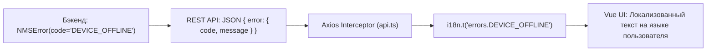

# 🚨 6. Использование исключений (Exceptions API)

---

## 📌 1. Архитектура обработки ошибок в NMS-WebUI

Система исключений в NMS-WebUI (backend/core/exceptions.py) обеспечивает единый стандартизированный формат JSON-ответов для всех ошибок, возникающих в ядре и модулях системы.

### Единый формат ответа об ошибке (JSON Contract)

Все ошибки API (как штатные `NMSError`, так и `fastapi.HTTPException`, а также неперехваченные серверные исключения) приводятся к единому формату ответа:

```json
{
  "error": {
    "code": "ERROR_CODE_NAME",
    "message": "Человекочитаемое описание ошибки",
    "details": {
      "field": "дополнительные метаданные"
    }
  }
}
```

* **`code`** (`str`): Машиночитаемый уникальный идентификатор ошибки в стиле `UPPER_SNAKE_CASE` (например, `SENSOR_NOT_FOUND`, `VALIDATION_ERROR`). Фронтенд использует этот код для локализации и специфической обработки.
* **`message`** (`str`): Сообщение об ошибке на понятном языке. Может быть сформировано с помощью модуля локализации `tr()`.
* **`details`** (`dict`): Произвольный словарь с дополнительным контекстом (идентификаторы ресурсов, невалидные поля, причины сбоя).

### Глобальные обработчики исключений в FastAPI

При старте приложения фабрика `create_app()` (backend/core/app.py) регистрирует глобальные обработчики через `register_exception_handlers(app)`:

1. **`NMSError` handler**: Возвращает клиенту структурированный JSON с переданными `status_code`, `code`, `message` и `details`.
2. **`HTTPException` handler**: Преобразует стандартные исключения FastAPI/Starlette в единую структуру. Если `exc.detail` является словарем, из него автоматически извлекаются `error_code`, `detail` и `params`. Если `exc.detail` является строкой, устанавливается код `HTTP_ERROR`.
3. **`Exception` (Generic handler)**: Перехватывает любые непредвиденные сбои Python (`Exception`), логирует подробный стэктрейс в логгер `nms.exceptions` и возвращает клиенту безопасный ответ с кодом 500 и кодом ошибки `INTERNAL_SERVER_ERROR`, скрывая внутренние детали реализации от внешних клиентов.

---

## 📦 2. Встроенные типы исключений (`backend/core/exceptions.py`)

Ядро системы предоставляет набор готовых классов исключений, перекрывающих основные типовые сценарии в модулях.

| Класс исключения | HTTP Статус | Стандартный `code` | Описание и применение |
| :--- | :--- | :--- | :--- |
| **`NMSError`** | `400` | `INTERNAL_ERROR` | Базовый класс для всех ошибок NMS. Принимает `message`, `status_code`, `code`, `details`. |
| **`ValidationError`** | `400 Bad Request` | `VALIDATION_ERROR` | Ошибки валидации входных параметров, форматов данных или бизнес-правил. |
| **`ModuleValidationError`** | `400 Bad Request` | `MODULE_VALIDATION_ERROR` | Ошибка валидации структуры, манифеста или точек входа модуля. |
| **`AuthenticationError`** | `401 Unauthorized` | `AUTH_REQUIRED` | Ошибка авторизации: отсутствие, протухание или недействительность токена/сессии. |
| **`PermissionDeniedError`**| `403 Forbidden` | `INSUFFICIENT_PERMISSIONS` | Отсутствие требуемых прав доступа (RBAC) у пользователя. |
| **`NotFoundError`** | `404 Not Found` | `NOT_FOUND` | Запрошенный ресурс (устройство, запись БД, файл) не найден. |
| **`ModuleDisabledError`** | `403 Forbidden` | `MODULE_DISABLED` | Попытка обращения к роутам или функциям отключенного модуля. |
| **`NMSModuleNotFoundError`**| `404 Not Found` | `MODULE_NOT_FOUND` | Указанный `module_id` не зарегистрирован в реестре модулей. |

### Определение класса `NMSError`

```python
class NMSError(Exception):
    """Базовое единое исключение для NMS-WebUI."""

    def __init__(
        self,
        message: str = "Internal error",
        status_code: int = 400,
        code: str = "INTERNAL_ERROR",
        details: dict[str, Any] | None = None,
    ):
        self.message = message
        self.status_code = status_code
        self.code = code
        self.details = details or {}
        super().__init__(message)
```

---

## 🛠️ 3. Создание кастомных исключений модуля

Разработчикам модулей рекомендуется выносить исключения модуля в отдельный файл `exceptions.py` в корне модуля.

### 3.1. Рекомендуемый паттерн (Пример модуля Tuya)

Рассмотрите паттерн реализации из backend/modules/tuya/exceptions.py:

```python
"""Кастомные исключения для модуля Tuya."""
from backend.core.exceptions import NMSError


class TuyaNotActiveError(NMSError):
    """Модуль Tuya отключен или не инициализирован."""
    def __init__(self, message: str = "Tuya module is not active", details: dict | None = None):
        super().__init__(
            message=message,
            status_code=503,
            code="TUYA_NOT_ACTIVE",
            details=details,
        )


class TuyaDeviceNotFoundError(NMSError):
    """Запрошенное устройство Tuya не найдено."""
    def __init__(self, device_id: str):
        super().__init__(
            message=f"Tuya device '{device_id}' not found",
            status_code=404,
            code="TUYA_DEVICE_NOT_FOUND",
            details={"device_id": device_id},
        )


class TuyaStorageError(NMSError):
    """Ошибка доступа к хранилищу или файлам модуля Tuya."""
    def __init__(self, message: str = "Tuya storage unavailable", details: dict | None = None):
        super().__init__(
            message=message,
            status_code=500,
            code="TUYA_STORAGE_UNAVAILABLE",
            details=details,
        )


class TuyaCommandError(NMSError):
    """Ошибка выполнения команды на устройстве."""
    def __init__(self, message: str = "Tuya command failed", details: dict | None = None):
        super().__init__(
            message=message,
            status_code=502,
            code="TUYA_COMMAND_FAILED",
            details=details
        )
```

### 3.2. Регистрация сторонних исключений (`register_exception`)

Если ваш модуль использует внешнюю библиотеку (например, SDK оборудования или сторонний PyPI-пакет `sqlalchemy`, `paho-mqtt`, `requests`), выбрасывающую свои типы исключений, их можно зарегистрировать в FastAPI для автоматического преобразования в стандартный JSON-формат NMS без модификации кода библиотеки:

```python
from fastapi import FastAPI
from backend.core.exceptions import register_exception
from sqlalchemy.exc import DBAPIError
from paho.mqtt.client import MQTTException

def setup_module_exceptions(app: FastAPI) -> None:
    # Преобразование ошибок БД сторонней библиотеки в ответ 503
    register_exception(
        app=app,
        exc_class=DBAPIError,
        code="DATABASE_UNAVAILABLE",
        status_code=503
    )

    # Преобразование ошибок MQTT-клиента в ответ 502
    register_exception(
        app=app,
        exc_class=MQTTException,
        code="MQTT_COMMUNICATION_ERROR",
        status_code=502
    )
```

### 3.3. Chaining исключений (Сохранение контекста)

При перехвате низкоуровневых ошибок и генерации высокоуровневых исключений модуля следует использовать синтаксис `raise ... from exc` для сохранения оригинального контекста и стэктрейса для логирования:

```python
try:
    await hardware_sdk.connect()
except HardwareDriverError as exc:
    # Сохраняем оригинальное исключение `from exc` для логгера
    raise MyModuleConnectionError(
        message="Failed to connect to hardware controller",
        details={"controller_ip": controller_ip}
    ) from exc
```

---

## 🌐 4. Сквозная локализация ошибок (i18n): Бэкенд ↔ Фронтенд

В NMS-WebUI реализована двухуровневая система локализации ошибок:



1. **Динамическая локализация на бэкенде**: При необходимости вернуть сообщении об ошибке на языке пользователя, в вызов `tr()` передается объект `request`:
   ```python
   raise NotFoundError(
       message=tr(request, "device_not_found"),
       code="DEVICE_NOT_FOUND"
   )
   ```
2. **Автоматическая локализация на фронтенде по коду ошибки**:
   Перехватчик Axios в frontend/src/core/api.ts автоматически читает `errData.error.code` и ищет перевод по ключу `errors.<CODE>` в словаре i18n. Если перевод найден, `message` подменяется локализованной строкой.

### Структурный пример словаря локализации модуля (`locales/ru.json`)

```json
{
  "errors": {
    "TUYA_NOT_ACTIVE": "Модуль Tuya отключен или не инициализирован",
    "TUYA_DEVICE_NOT_FOUND": "Устройство Tuya не найдено",
    "TUYA_COMMAND_FAILED": "Не удалось выполнить команду на устройстве",
    "DATABASE_UNAVAILABLE": "Сервис базы данных временно недоступен"
  }
}
```

---

## 💻 5. Использование исключений в коде модуля

### 5.1. В API-маршрутах (Endpoints)

Пример использования встроенных и кастомных исключений с интеграцией i18n (backend/core/i18n.py):

```python
from fastapi import APIRouter, Request
from backend.core.exceptions import ValidationError, NotFoundError
from backend.core.i18n import tr
from backend.modules.my_module.exceptions import MyModuleConnectionError

router = APIRouter(prefix="/api/v1/m/my_module")

@router.get("/devices/{device_id}")
async def get_device(device_id: str, request: Request):
    if not device_id.isalnum():
        raise ValidationError(
            message=tr(request, "invalid_device_id_format"),
            code="INVALID_DEVICE_ID"
        )

    device = await find_device(device_id)
    if not device:
        raise NotFoundError(
            message=tr(request, "device_not_found"),
            code="DEVICE_NOT_FOUND",
            details={"device_id": device_id}
        )

    try:
        await device.ping()
    except Exception as exc:
        raise MyModuleConnectionError(
            message=f"Device ping failed: {exc}",
            details={"device_id": device_id, "raw_error": str(exc)}
        ) from exc

    return device
```

### 5.2. В фоновых задачах и циклах (Background Tasks)

В фоновых циклах (например, `asyncio.create_task`) неперехваченное исключение приведёт к бесшумной остановке фоновой задачи.

**Правильный паттерн непрерывного цикла:**

```python
import asyncio
import logging
from backend.core.exceptions import NMSError

_log = logging.getLogger("nms.modules.my_module")

async def background_poll_loop():
    while True:
        try:
            await poll_hardware_devices()
        except NMSError as exc:
            _log.warning("Poller encountered known error [%s]: %s (details: %s)", exc.code, exc.message, exc.details)
        except Exception as exc:
            _log.exception("Unexpected error in background poller: %s", exc)
        
        await asyncio.sleep(30)
```

**Безопасный запуск фоновых задач (`add_done_callback`):**

```python
def handle_task_result(task: asyncio.Task) -> None:
    try:
        task.result()
    except asyncio.CancelledError:
        pass
    except Exception as exc:
        _log.exception("Background task failed with exception: %s", exc)

# Запуск задачи
task = asyncio.create_task(process_batch_data())
task.add_done_callback(handle_task_result)
```

### 5.3. В WebSocket соединениях

Исключения HTTP не передаются автоматически в открытый WebSocket. При ошибках внутри WebSocket-хэндлера следует отправлять JSON-сообщение структурированной ошибки клиенту:

```python
from fastapi import APIRouter, WebSocket
from backend.core.exceptions import NMSError

router = APIRouter()

@router.websocket("/ws")
async def websocket_endpoint(websocket: WebSocket):
    await websocket.accept()
    try:
        # Логика работы с WebSocket
        pass
    except NMSError as exc:
        await websocket.send_json({
            "type": "error",
            "error": {
                "code": exc.code,
                "message": exc.message,
                "details": exc.details,
            }
        })
        await websocket.close(code=4000)
```

---

## 🎭 6. Обработка ошибок на Frontend (Vue / TypeScript)

На стороне фронтенда все HTTP-запросы проходят через Axios-клиент в frontend/src/core/api.ts.

### 6.1. Поведение Axios Interceptors

1. **Авторизация (HTTP 401)**:
   При получении ответа `401 Unauthorized` перехватчик автоматически сбрасывает текущую сессию (`clearAuthSession()`) и перенаправляет пользователя на страницу входа `/login`.
2. **Автоматические повторы (Retry for 502/503/504)**:
   Для GET-запросов при сетевых сбоях или временно недоступном сервере выполняется до 2 повторных попыток с экспоненциальной задержкой.
3. **Автоматическая локализация ошибок (i18n)**:
   Перехватчик читает `errData.error.code` и ищет перевод по ключу `errors.<CODE>` через систему `i18n.ts`. Если перевод найден, `errData.error.message` автоматически заменяется на локализованную строку.

### 6.2. Типизация ошибок в TypeScript

Для строгой типизации ответов с ошибками используйте следующие интерфейсы:

```typescript
export interface NMSErrorDetail {
  code: string
  message: string
  details?: Record<string, any>
}

export interface NMSApiErrorResponse {
  error: NMSErrorDetail
}
```

### 6.3. Хелпер и пример обработки ошибки в Vue-компоненте

```typescript
import { ref } from 'vue'
import type { AxiosError } from 'axios'
import { http } from '@/core/api'
import type { NMSApiErrorResponse } from '@/types/api'

const loading = ref(false)
const errorMessage = ref('')

/** Хелпер извлечения сообщения ошибки */
export function getApiErrorMessage(error: unknown, fallback = 'Произошла неизвестная ошибка'): string {
    const axiosErr = error as AxiosError<NMSApiErrorResponse>
    return axiosErr?.response?.data?.error?.message || fallback
}

async function saveDeviceSettings(deviceId: string, payload: Record<string, any>) {
    loading.value = true
    errorMessage.value = ''
    try {
        await http.put(`/api/v1/m/tuya/devices/${deviceId}`, payload)
    } catch (error: any) {
        errorMessage.value = getApiErrorMessage(error, 'Не удалось сохранить настройки устройства')
        
        const errObj = (error as AxiosError<NMSApiErrorResponse>)?.response?.data?.error
        if (errObj) {
            console.warn(`[DeviceEdit] Code: ${errObj.code}`, errObj.details)
        }
    } finally {
        loading.value = false
    }
}
```

---

## 📋 7. Best Practices и безопасность

> [!TIP]
> **Принцип минимализма (Ponytail rule):** Используйте стандартные дочерние классы `NMSError` (например, `NotFoundError` или `ValidationError`), если вам не требуется специфика уникального `code` или бизнес-логика. Не плодите десятки однотипных классов ошибок без необходимости.

### 🔒 Безопасность данных в ошибках
1. 🛑 **Не передавайте секреты в `details`**: Запрещено помещать пароли, API-ключи, токены сессий и персональные данные пользователей в словарь `details` или `message`.
2. 🛡️ **Маскируйте внутренние ошибки базы данных и ФС**: Не возвращайте клиенту сырые строки системных путей или структуры SQL-запросов. Используйте `register_exception` или обворачивайте ошибки в `NMSError`.

### 📋 Чек-лист разработчика
1. ✅ **Всегда наследуйтесь от `NMSError`**: Это гарантирует автоматический перехват и приведение ответа к единому JSON-формату.
2. ✅ **Используйте понятные `code` в стиле `UPPER_SNAKE_CASE`**: Коды ошибок являются публичным API вашего модуля. Не меняйте их без необходимости.
3. ✅ **Заполняйте словарь `details` контекстом**: Передавайте в `details` ID объектов, имена параметров, а не формируйте из них гигантские сообщения `message`.
4. ✅ **Не глотайте неперехваченные исключения**: В фоновых задачах всегда логируйте непредвиденные ошибки через `_log.exception()`.
5. ✅ **Используйте `raise ... from exc`**: Для сохранения первопричины ошибки в системных логах сервера.
6. ✅ **Добавляйте локализацию**: Добавляйте ключи ошибок в `errors.<CODE>` в файл локализации модуля.
