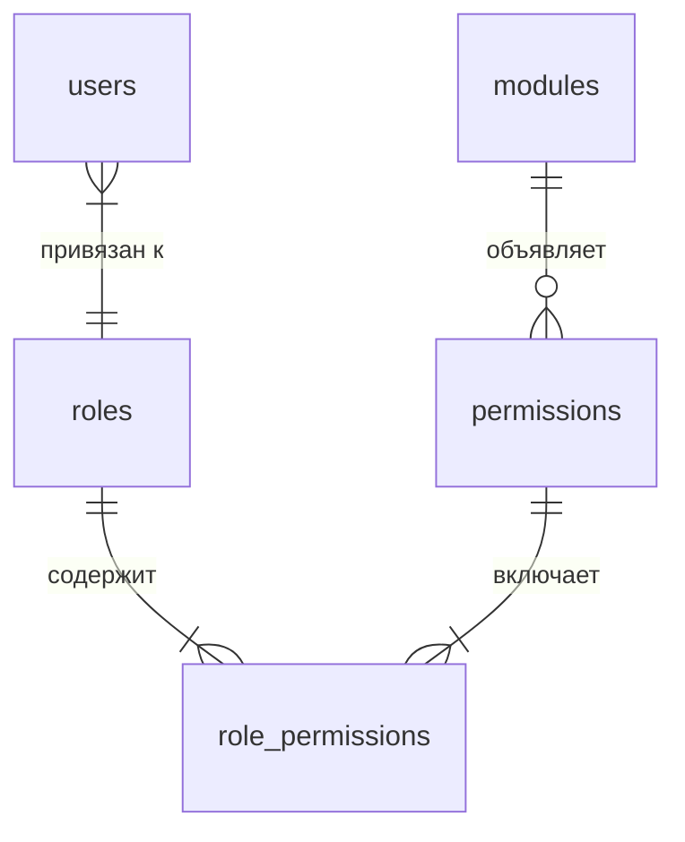

# 🔐 10. Уровни доступа и RBAC (Permissions API)

Архитектура разграничения прав доступа в **NMS WebUI** построена на основе классической модели **RBAC (Role-Based Access Control)** с поддержкой атомарных разрешений (permissions), иерархических/подразумеваемых прав (implied permissions), кэширования в оперативной памяти и автоматической синхронизацией разрешений при динамическом подключении модулей/плагинов.

---

## 📐 1. Архитектура RBAC и модель данных

Система прав доступа включает в себя следующие ключевые сущности:

1. **Пользователи (`users`)**: учетные записи, привязанные к конкретной роли (`role_id`).
2. **Роли (`roles`)**: группы прав с уникальным идентификатором (`id`, `name`, `description`, `is_system`).
3. **Разрешения (`permissions`)**: атомарные ключи доступа (`id`, `category`, `name`, `description`, `module_id`).
4. **Связь ролей и прав (`role_permissions`)**: таблица сопоставления N:M между ролями и разрешениями.



### Схема БД SQLite

Базовые таблицы инициализируются в [backend/core/database.py](file:///opt/nms-webui/backend/core/database.py):

```sql
-- Роли
CREATE TABLE IF NOT EXISTS roles (
    id TEXT PRIMARY KEY,
    name TEXT UNIQUE NOT NULL,
    description TEXT,
    is_system BOOLEAN DEFAULT 0
);

-- Разрешения (включая привязанные к модулям)
CREATE TABLE IF NOT EXISTS permissions (
    id TEXT PRIMARY KEY,
    category TEXT NOT NULL,
    name TEXT NOT NULL,
    description TEXT,
    module_id TEXT DEFAULT NULL
);

-- Связь ролей и разрешений
CREATE TABLE IF NOT EXISTS role_permissions (
    role_id TEXT NOT NULL,
    permission_id TEXT NOT NULL,
    PRIMARY KEY (role_id, permission_id),
    FOREIGN KEY (role_id) REFERENCES roles (id) ON DELETE CASCADE,
    FOREIGN KEY (permission_id) REFERENCES permissions (id) ON DELETE CASCADE
);
```

### Предопределенные системные роли по умолчанию

При первом запуске системы БД заполняется стандартными системными ролями:

| ID роли | Наименование | Системная (`is_system`) | Назначение и набор прав по умолчанию |
| :--- | :--- | :--- | :--- |
| `1` | **Superuser** | `1` | Полный доступ ко всем функциям и модулям системы (`system.all` + все новые права модулей). |
| `2` | **Admin** | `1` | Административный контроль системы (`system.admin`, `users.*`, `roles.*`, `settings.*`, `modules.*`, `audit.*`). |
| `3` | **Operator** | `1` | Управление конфигурациями и просмотр модулей (`settings.view`, `settings.edit`, `modules.view`, `audit.view`). |
| `4` | **Viewer** | `1` | Только просмотр состояния и логов (`audit.view`). |

---

## 🔑 2. Иерархия прав и Подразумеваемые разрешения (Implied Permissions)

### Глобальный Супер-пермишен `system.all`
Пользователи, имеющие право `system.all` (например, системная роль **Superuser**), автоматически проходят любые проверки прав доступа как на бэкенде, так и на фронтенде.

### Подразумеваемые права (Implied Map)
Для упрощения администрирования права на управление автоматически включают права на просмотр соответствующего раздела.

На бэкенде в [backend/core/auth.py](file:///opt/nms-webui/backend/core/auth.py) и на фронтенде в [frontend/src/core/auth.ts](file:///opt/nms-webui/frontend/src/core/auth.ts) определена матрица соответствий:

| Запрашиваемое право на просмотр | Подразумевается при наличии права на управление |
| :--- | :--- |
| `users.view` | `users.manage` |
| `roles.view` | `roles.manage` |
| `settings.view` | `settings.edit` |
| `modules.view` | `modules.manage` |
| `audit.view` | `audit.export` |

### Режим с отключенной аутентификацией (`auth_enabled = false`)
В NMS WebUI предусмотрена возможность отключения авторизации на уровне конфигурации системы:
* На бэкенде метод `get_current_user` при `auth_enabled = false` автоматически возвращает виртуального пользователя с `role_id="1"` и правом `system.all`.
* На фронтенде `auth.ts` при токене `system_disabled_auth` считает пользователя полностью авторизованным с правами суперпользователя.

---

## ⚡️ 3. Кэширование прав доступа на бэкенде

Для предотвращения избыточных SQL-запросов к БД при каждом вызове API в [backend/core/auth.py](file:///opt/nms-webui/backend/core/auth.py) реализовано in-memory кэширование:

```python
_role_permissions_cache: dict[str, tuple[str, ...]] = {}
```

### Сброс кэша прав (`clear_role_permissions_cache`)

Кэш автоматически инвалидируется при изменении конфигурации доступа:

```python
from backend.core.auth import clear_role_permissions_cache

# Инвалидация конкретной роли при редактировании матрицы прав
clear_role_permissions_cache(role_id="2")

# Полный сброс кэша (например, при загрузке/отключении плагинов)
clear_role_permissions_cache()
```

---

## 📦 4. Декларация прав в модулях (`manifest.yaml`)

Каждый модуль может объявлять собственную сетку прав доступа в манифесте `manifest.yaml`:

```yaml
id: "sensor_monitor"
name: "Мониторинг датчиков"
version: "1.0.0"

permissions:
  - id: "module.sensor_monitor.view"
    name: "Просмотр датчиков"
    category: "Мониторинг датчиков"
    description: "Разрешает доступ к просмотру текущих показаний датчиков"
  - id: "module.sensor_monitor.control"
    name: "Управление датчиками"
    category: "Мониторинг датчиков"
    description: "Разрешает перезагрузку и изменение конфигурации датчиков"
```

### Автоматическая генерация дефолтных прав
Если модуль **не указывает** раздел `permissions` в своем `manifest.yaml`, реестр модулей ([backend/core/plugin/registry.py](file:///opt/nms-webui/backend/core/plugin/registry.py)) автоматически генерирует для него стандартный тройной набор прав:

* `module.<module_id>.view` — Просмотр модуля
* `module.<module_id>.edit` — Настройка модуля
* `module.<module_id>.control` — Управление модулем

### Авто-синхронизация при загрузке плагина
При регистрации и включении модуля вызывается функция `sync_module_permissions(manifest)`:

1. Права из манифеста заносятся в таблицу `permissions` (со связкой `module_id`).
2. Новые разрешения **автоматически привязываются** к системным ролям `1` (Superuser) и `2` (Admin) в `role_permissions`.
3. При отключении или выгрузке модуля ([backend/core/plugin/loader.py](file:///opt/nms-webui/backend/core/plugin/loader.py)) разрешения данного модуля и их привязки к ролям автоматически зачищаются, а кэш `_role_permissions_cache` сбрасывается.

---

## 🛡 5. Защита REST API и WebSocket на бэкенде (FastAPI)

Для проверки прав бэкенд предоставляет специальный набор зависимостей FastAPI в [backend/core/auth.py](file:///opt/nms-webui/backend/core/auth.py).

### Зависимость `require_permission`

Применяется к эндпоинтам для проверки конкретного права у текущего пользователя:

```python
from fastapi import APIRouter, Depends
from backend.core.auth import CurrentUser, require_permission

router = APIRouter(prefix="/api/v1/m/sensor_monitor", tags=["sensor_monitor"])

@router.get("/metrics")
async def get_metrics(
    user: CurrentUser = Depends(require_permission("module.sensor_monitor.view"))
):
    """Получение метрик. Доступно при наличии module.sensor_monitor.view."""
    return {"status": "ok", "user": user.username}
```

### Зависимость `require_module_permission`

Проверяет не только права пользователя, но и **статус включения модуля** в системе (`is_module_enabled`). Если модуль выключен администратором, возвращает ошибку `ModuleDisabledError` (HTTP 403 / 404).

```python
from fastapi import APIRouter, Depends
from backend.core.auth import CurrentUser, require_module_permission

router = APIRouter(prefix="/api/v1/m/sensor_monitor", tags=["sensor_monitor"])

@router.post("/reboot")
async def reboot_sensor(
    sensor_id: str,
    user: CurrentUser = Depends(require_module_permission("sensor_monitor", action="control"))
):
    """Перезагрузка датчика. Проверяет включенность модуля sensor_monitor и право module.sensor_monitor.control."""
    return {"status": "rebooting", "sensor_id": sensor_id, "by": user.username}
```

### 🔌 Защита WebSocket соединения по RBAC

Для проверки прав при открытии соединения по протоколу WebSocket JWT-токен передается в query-параметрах `?token=...`. В хэндлере используется `get_current_user_from_token` и `has_permission`:

```python
from fastapi import APIRouter, WebSocket, WebSocketDisconnect, status
from backend.core.auth import decode_access_token, get_current_user_by_id

@router.websocket("/ws")
async def websocket_endpoint(websocket: WebSocket, token: str):
    await websocket.accept()
    
    # 1. Валидация токена и извлечение пользователя
    user = await get_user_from_ws_token(token)
    if not user:
        await websocket.close(code=status.WS_1008_POLICY_VIOLATION)
        return

    # 2. Проверка права на просмотр WebSocket канала
    if "system.all" not in user.permissions and "module.sensor_monitor.view" not in user.permissions:
        await websocket.close(code=status.WS_1008_POLICY_VIOLATION)
        return

    # Чтение сообщений из сокета...
```

### Обработка ошибок отказа в доступе

При нехватке прав бэкенд возбуждает исключение `PermissionDeniedError` (HTTP 403 Forbidden):

```json
{
  "error": "Недостаточно прав для выполнения операции (требуется: module.sensor_monitor.control)",
  "code": "INSUFFICIENT_PERMISSIONS",
  "details": {
    "permission": "module.sensor_monitor.control"
  }
}
```

При обращении к выключенному модулю через `require_module_permission` выбрасывается `ModuleDisabledError`:

```json
{
  "error": "Модуль 'sensor_monitor' отключен в системе",
  "code": "MODULE_DISABLED",
  "details": {
    "module_id": "sensor_monitor"
  }
}
```

---

## 💻 6. Разграничение прав на Фронтенде (Vue 3 / TypeScript)

Вся логика проверки прав на клиенте сосредоточена в модуле [frontend/src/core/auth.ts](file:///opt/nms-webui/frontend/src/core/auth.ts).

### Утилиты проверки прав

```typescript
import { hasPermission, hasAnyPermission, hasAllPermissions } from '@/core/auth'

// 1. Проверка одиночного разрешения
if (hasPermission('module.sensor_monitor.control')) {
  // Выполнить действие управления
}

// 2. Проверка наличия хотя бы одного разрешения из списка
if (hasAnyPermission(['module.sensor_monitor.view', 'system.admin'])) {
  // Показать панель
}

// 3. Проверка наличия всех указанных разрешений
if (hasAllPermissions(['module.sensor_monitor.view', 'module.sensor_monitor.control'])) {
  // Полнофункциональный режим
}
```

### Условный рендеринг элементов UI в Vue-компонентах

Для скрытия/отображения кнопок и панелей в шаблонах используется `v-if` с вызовом `hasPermission`:

```vue
<template>
  <div class="sensor-card">
    <h3>Датчик #102</h3>

    <!-- Показываем кнопку перезагрузки только при наличии прав управления -->
    <button 
      v-if="hasPermission('module.sensor_monitor.control')"
      @click="rebootSensor"
      class="btn-danger"
    >
      Перезагрузить
    </button>
  </div>
</template>

<script setup lang="ts">
import { hasPermission } from '@/core/auth'

const rebootSensor = () => {
  // ...
}
</script>
```

### Защита маршрутов в Vue Router

Маршруты страниц защищаются в [frontend/src/core/router.ts](file:///opt/nms-webui/frontend/src/core/router.ts) через поле `meta.permission`:

```typescript
{
  path: '/settings/users',
  name: 'users-management',
  component: () => import('@/views/UsersManagement.vue'),
  meta: {
    requiresAuth: true,
    permission: 'users.view' // При отсутствии права пользователь перенаправляется на главную
  }
}
```

### 🔄 Динамическое обновление прав (`nms-user-updated`)

При смене профиля пользователя, обновлении токена или прав без перезагрузки страницы вызывается событие `nms-user-updated`:

```typescript
window.addEventListener('nms-user-updated', (event) => {
    // Автоматическое перепроведение реактивных ссылок auth.ts
    syncAuthRef();
});
```

---

## 🛠 7. REST API управления ролями и разрешениями

Администрирование ролей и прав доступа осуществляется через системные эндпоинты в [backend/core/users_api.py](file:///opt/nms-webui/backend/core/users_api.py):

| Метод | Эндпоинт | Требуемое право | Описание |
| :--- | :--- | :--- | :--- |
| `GET` | `/api/v1/roles` | `roles.view` | Список всех ролей системы |
| `GET` | `/api/v1/permissions` | `roles.view` | Полный список зарегистрированных разрешений |
| `POST` | `/api/v1/roles` | `roles.manage` | Создание новой роли |
| `PUT` | `/api/v1/roles/{role_id}` | `roles.manage` | Обновление наименования и прав роли |
| `DELETE` | `/api/v1/roles/{role_id}` | `roles.manage` | Удаление пользовательской роли |

---

## ✅ 8. Чек-лист разработчика по интеграции RBAC в модуль

1. **[ ] Объявить права в `manifest.yaml`**: Добавить раздел `permissions` с понятными названиями и описаниями на русском языке.
2. **[ ] Защитить эндпоинты бэкенда**: Обернуть вызовы роутера FastAPI в `Depends(require_permission("..."))` или `Depends(require_module_permission("...", "..."))`.
3. **[ ] Проверить WebSocket-хэндлеры**: Убедиться, что соединения WS проверяют токен и разрешения перед приемом/отправкой сообщений.
4. **[ ] Скрыть управляющие элементы на фронтенде**: Обернуть интерактивные кнопки/формы в `v-if="hasPermission('...')"` во Vue-компонентах.
5. **[ ] Защитить фронтенд-маршруты модуля**: При регистрации страниц модуля указать `permission` в `meta` свойстве маршрута.
6. **[ ] Протестировать с ограниченной ролью**: Создать тестовую роль без соответствующих прав и убедиться в корректности блокировки (HTTP 403 на бэкенде и отсутствие элементов интерфейса на фронтенде).
