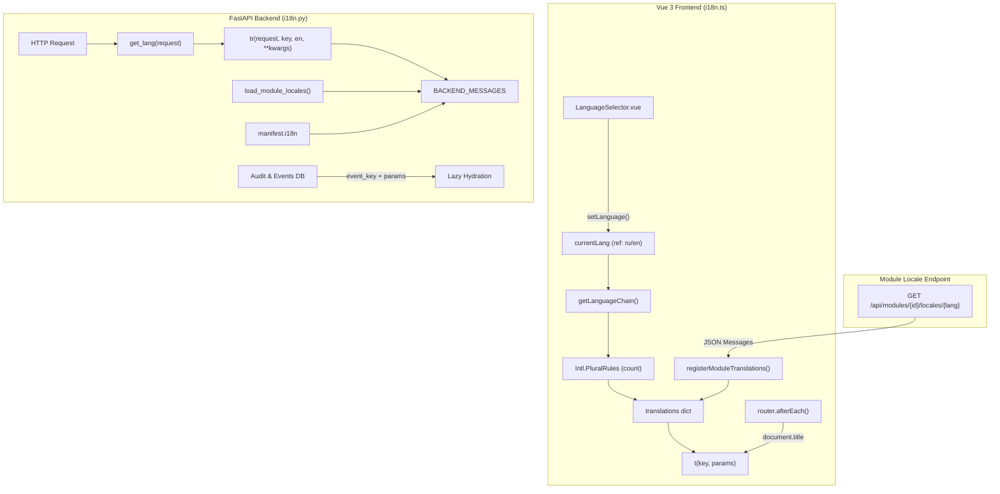

# 🌐 11. Использование локализации (i18n API)

---

## 📌 1. Общая архитектура подсистемы i18n

Подсистема интернационализации и локализации (i18n) в **NMS-WebUI** построена на двухуровневом принципе:
- **Backend (Python / FastAPI)**: Утилиты извлечения языка из HTTP-запроса, контекстная функция переводов `tr()`, централизованный реестр `BACKEND_MESSAGES`, паттерн "Lazy Localization" для событий аудита и автоматическая загрузка словарей модулей.
- **Frontend (Vue 3 / TypeScript)**: Реактивное управление текущим языком, полная поддержка плюрализации на базе стандартного `Intl.PluralRules`, цепочки поиска fallback-языков, динамическая загрузка локализаций модулей на лету без пересборки приложения, готовность к RTL-режиму и специализированные хелперы для предметных областей (роли RBAC, категории прав, имена модулей, форматирование дат и переводы ошибок API).



---

## 🐍 2. Бэкенд-локализация (`backend/core/i18n.py`)

### 2.1. Извлечение языка запроса (`get_lang`)

Язык текущего пользователя определяется функцией `get_lang(request)`:

```python
def get_lang(request: Optional[Request]) -> str:
    """Извлечь язык из параметров запроса или заголовков HTTP. По умолчанию 'en'."""
    if not request:
        return "en"
    query_lang = request.query_params.get("lang", "").lower()
    if query_lang in ("ru", "en"):
        return query_lang
    accept = request.headers.get("accept-language", "").lower()
    if "ru" in accept:
        return "ru"
    return "en"
```

**Приоритет определения языка:**
1. Явный query-параметр в URL (`?lang=ru` или `?lang=en`).
2. HTTP-заголовок `Accept-Language` (если содержит `ru`, выбирается `"ru"`).
3. По умолчанию возвращается `"en"`.

---

### 2.2. Функция перевода `tr()`

Функция `tr()` подготавливает локализованное сообщение для отправки клиенту:

```python
def tr(request: Optional[Request], key_or_ru: str, en: Optional[str] = None, **kwargs) -> str:
    """
    Вернуть локализованную строку по ключу или (ru, en) паре.
    Поддерживает подстановку параметров через kwargs.
    """
    lang = get_lang(request)
    if key_or_ru in BACKEND_MESSAGES:
        msg_dict = BACKEND_MESSAGES[key_or_ru]
        template = msg_dict.get(lang, msg_dict.get("en", key_or_ru))
        return template.format(**kwargs) if kwargs else template

    if en is not None:
        raw_text = key_or_ru if lang == "ru" else en
        return raw_text.format(**kwargs) if kwargs else raw_text

    return key_or_ru.format(**kwargs) if kwargs else key_or_ru
```

#### Способы вызова `tr()`:

1. **По централизованному ключу из словаря:**
   ```python
   from backend.core.i18n import tr

   # Использование зарегистрированного ключа с подстановкой параметров
   msg = tr(request, "sensorErrOverheat", name="Датчик-101", val=89.5)
   ```

2. **Через прямую пару строк (RU, EN):**
   ```python
   # Если ключ не зарегистрирован в словаре, указываются строки для RU и EN
   msg = tr(request, "Ошибка подключения к устройству {id}", "Device connection error {id}", id="DEV-42")
   ```

---

### 2.3. Регистрация и автоматическая загрузка словарей модулей

Словари локализации бэкенда собираются в едином объекте `BACKEND_MESSAGES` (`dict[str, dict[str, str]]`):
- Базовые словари ядра загружаются из `backend/core/locales/ru.py` и `backend/core/locales/en.py`.
- Модули могут регистрировать собственные локализации через `register_module_messages`:
  ```python
  from backend.core.i18n import register_module_messages

  register_module_messages({
      "tuya.device_not_found": {
          "ru": "Устройство Tuya '{id}' не найдено",
          "en": "Tuya device '{id}' was not found"
      }
  })
  ```
- При загрузке модуля через `loader.py` автоматически вызывается сканирование файлов `.json` из папки `locales/` модуля:
  ```python
  from backend.core.i18n import load_module_locales

  # Загрузит locales/ru.json, locales/en.json и т.д.
  load_module_locales(module_dir)
  ```

---

### 2.4. REST API локализации модулей

Бэкенд предоставляет специальный HTTP endpoint для отдачи локализаций конкретного модуля фронтенду:

- **Endpoint**: `GET /api/modules/{module_id}/locales/{lang}`
- **Логика работы** (`backend/core/plugin/api.py`):
  1. Извлекает переводы из `manifest.i18n` для указанного языка.
  2. Объединяет их с данными из файла `modules/{module_id}/locales/{lang}.json` (при его наличии).
  3. Возвращает JSON-структуру:
     ```json
     {
       "module_id": "tuya",
       "lang": "ru",
       "messages": {
         "sensorTitle": "Мониторинг Датчиков",
         "sensorErrOverheat": "Внимание: Сенсор '{name}' перегрет ({val}°C)"
       }
     }
     ```

---

### 2.5. Локализация фоновых уведомлений, логов аудита и серверных отчетов

> [!IMPORTANT]
> **Паттерн "Lazy Localization"**: В базу данных системного аудита (Audit Log) и фоновых задач никогда не следует сохранять итоговый локализованный текст на одном языке. Пользователи системы могут работать в интерфейсе на разных языках.

#### 1. Сохранение событий аудита и уведомлений:
В БД записывается структура из **ключа события** и **словаря параметров**:

```python
# Пример записи в таблицу audit_logs / notifications
audit_entry = {
    "event_key": "audit.device_rebooted",
    "params": {"device_id": "DEV-99", "user": "admin"},
    "timestamp": "2026-08-07T22:10:00Z"
}
```

Фронтенд при отображении списка записей аудита самостоятельно гидрирует текст:
```typescript
t(log.event_key, log.params) // "Пользователь admin перезагрузил устройство DEV-99"
```

#### 2. Серверная генерация PDF/CSV отчетов и рассылок:
Если бэкенд формирует PDF-документ или отправляет Telegram/Email-уведомление без участия фронтенда, язык определяется из настроек получателя/запроса:

```python
from backend.core.i18n import BACKEND_MESSAGES

def format_server_message(lang: str, key: str, **kwargs) -> str:
    """Локализовать сообщение на бэкенде для заданной локали пользователя."""
    msg_dict = BACKEND_MESSAGES.get(key, {})
    template = msg_dict.get(lang, msg_dict.get("en", key))
    return template.format(**kwargs) if kwargs else template

# Использование
text = format_server_message("ru", "audit.device_rebooted", device_id="DEV-99", user="admin")
```

---

## 🎨 3. Фронтенд-локализация (`frontend/src/core/i18n.ts`)

### 3.1. Реактивное состояние языка и его переключение

В `frontend/src/core/i18n.ts` экспортируется реактивная переменная `currentLang` и функция управления языком `setLanguage`:

```typescript
export type Language = 'ru' | 'en'
export const DEFAULT_LANG: Language = 'en'

export const currentLang = ref<Language>(savedLang || defaultLang)

export function setLanguage(lang: Language) {
  currentLang.value = lang
  if (typeof localStorage !== 'undefined') {
    localStorage.setItem('nms_lang', lang)
  }
  if (typeof document !== 'undefined') {
    document.documentElement.lang = lang
    window.dispatchEvent(new CustomEvent('nms-language-changed', { detail: { lang } }))
  }
}
```

- **Автодетекция**: при первом входе проверяется `navigator.language` (если начинается с `ru`, ставится `'ru'`, иначе `'en'`).
- **Сохранение**: выбранный язык сохраняется в `localStorage` под ключом `nms_lang`.
- **Синхронизация DOM и событий**: меняется атрибут `lang` элемента `<html>` и генерируется кастомное браузерное событие `nms-language-changed`.

---

### 3.2. Основная функция перевода `t()` и плюрализация

Функция `t(key, params)` осуществляет локализацию строк на фронтенде:

```typescript
export function t(key: string, params?: Record<string, string | number>): string
```

#### Ключевые возможности:

1. **Цепочка поиска языка (`getLanguageChain`)**:
   Если перевод отсутствует в активном языке (например, `ru`), система ищет ключ в `DEFAULT_LANG` (`en`), а затем в любых других доступных словарях. Если ключ не найден нигде, возвращается сам `key`.

2. **Поддержка вложенных ключей (Dot Notation)**:
   Поддерживаются ключи с точками, например: `t('dashboard.stats.total')`.

3. **Форматирование параметров**:
   Шаблон вида `"Привет, {name}"` автоматически заменяет `{name}` значением из объекта `params`.

4. **Плюрализация через `Intl.PluralRules`**:
   Если в `params` передано числовое поле `count`, функция формирует суффикс множественного числа с помощью стандартного браузерного `Intl.PluralRules(currentLang)`:
   - Сначала ищется ключ `${key}_${rule}` (например: `bulkActionSuccess_one`, `bulkActionSuccess_few`, `bulkActionSuccess_many`).
   - Если такой ключ найден, используется он; иначе происходит fallback на базовый `key`.

#### Пример плюрализации в словаре (`locales/ru.ts` и `locales/en.ts`):

```typescript
// ru.ts
bulkActionSuccess_one: 'Массовое действие выполнено ({count} пользователь)',
bulkActionSuccess_few: 'Массовое действие выполнено ({count} пользователя)',
bulkActionSuccess_many: 'Массовое действие выполнено ({count} пользователей)',

// en.ts
bulkActionSuccess_one: 'Bulk action applied ({count} user)',
bulkActionSuccess_other: 'Bulk action applied ({count} users)',
```

#### Использование в коде:
```typescript
t('bulkActionSuccess', { count: 1 }) // "Массовое действие выполнено (1 пользователь)"
t('bulkActionSuccess', { count: 3 }) // "Массовое действие выполнено (3 пользователя)"
t('bulkActionSuccess', { count: 5 }) // "Массовое действие выполнено (5 пользователей)"
```

---

### 3.3. Специализированные хелперы предметной области

Модуль `i18n.ts` предоставляет готовые вспомогательные функции для корректной локализации сущностей платформы:

| Функция | Описание |
| :--- | :--- |
| `getRoleTitle(roleName)` | Возвращает локализованное название роли RBAC (`superuser`, `admin`, `operator`, `viewer`). |
| `getRoleDescription(roleName, defaultDesc)` | Возвращает локализованное описание роли RBAC. |
| `translatePermissionCategory(category)` | Переводит системные и модульные категории прав доступа. |
| `translatePermissionName(permId, fallback)` | Переводит наименование конкретного права доступа. |
| `translatePermissionDesc(permId, fallback)` | Переводит описание права доступа. |
| `translateModuleName(nameOrId)` | Переводит имя модуля или ядра (`Core Engine` -> `Ядро системы`). |
| `translateApiError(err, fallbackKey)` | Маппит текст/код ошибки бэкенда на локализованное понятное сообщение. |
| `formatDateTime(date, options)` | Форматирует дату и время через `Intl` в текущей локали. |
| `formatTime(date, options)` | Форматирует время через `Intl` в текущей локали. |

---

### 3.4. Использование в Vue SFC компонентах через `useI18n()`

Во Vue-компонентах локализация подключается через composable `useI18n()`:

```vue
<script setup lang="ts">
import { useI18n } from '@/core/i18n'

const { 
  t, 
  lang, 
  setLanguage, 
  getRoleTitle, 
  translateApiError, 
  formatDateTime 
} = useI18n()

function handleLanguageChange(newLang: 'ru' | 'en') {
  setLanguage(newLang)
}
</script>

<template>
  <div class="user-profile">
    <h2>{{ t('userProfileTitle') }}</h2>
    <p>{{ t('currentLanguage') }}: {{ lang }}</p>

    <!-- Смена языка -->
    <div class="lang-switch">
      <button :class="{ active: lang === 'ru' }" @click="handleLanguageChange('ru')">RU</button>
      <button :class="{ active: lang === 'en' }" @click="handleLanguageChange('en')">EN</button>
    </div>

    <!-- Пример форматирования роли и даты -->
    <div class="info-badge">
      <span>{{ getRoleTitle('admin') }}</span>
      <time>{{ formatDateTime(new Date()) }}</time>
    </div>
  </div>
</template>
```

---

### 3.5. Динамическая загрузка локализаций модулей

При загрузке сторонних или динамических модулей их локализации считываются с бэкенда и инжектятся во фронтенд в режиме реального времени без перезагрузки страницы (`frontend/src/modules/registry.ts`):

```typescript
import { registerModuleTranslations } from '@/core/i18n'
import { http } from '@/core/api'

const loadedLocalesCache = new Set<string>()

export async function loadModuleLocales(moduleId: string, lang: string): Promise<void> {
    const cacheKey = `${moduleId}:${lang}`
    if (loadedLocalesCache.has(cacheKey)) return
    try {
        const { data } = await http.get(`/api/modules/${moduleId}/locales/${lang}`)
        if (data?.messages) {
            registerModuleTranslations({ [lang]: data.messages })
            loadedLocalesCache.add(cacheKey)
        }
    } catch {
        // ignore
    }
}
```

---

### 3.6. UI-компоненты и клиентская интеграция

#### 1. Готовый компонент переключателя языка (`LanguageSelector.vue`):

```vue
<script setup lang="ts">
import { useI18n, type Language } from '@/core/i18n'

const { lang, setLanguage, t } = useI18n()

const languages: Array<{ code: Language; label: string; flag: string }> = [
  { code: 'ru', label: 'Русский', flag: '🇷🇺' },
  { code: 'en', label: 'English', flag: '🇬🇧' }
]

function selectLang(newLang: Language) {
  setLanguage(newLang)
}
</script>

<template>
  <div class="language-selector" role="region" :aria-label="t('selectLanguage')">
    <button
      v-for="item in languages"
      :key="item.code"
      :class="['lang-btn', { active: lang === item.code }]"
      @click="selectLang(item.code)"
    >
      <span class="flag">{{ item.flag }}</span>
      <span class="code">{{ item.code.toUpperCase() }}</span>
    </button>
  </div>
</template>

<style scoped>
.language-selector {
  display: flex;
  gap: 4px;
  background: var(--bg-secondary, #1e293b);
  padding: 2px;
  border-radius: 6px;
}
.lang-btn {
  display: flex;
  align-items: center;
  gap: 6px;
  border: none;
  background: transparent;
  color: var(--text-muted, #94a3b8);
  padding: 4px 8px;
  border-radius: 4px;
  cursor: pointer;
  font-size: 0.85rem;
  font-weight: 500;
  transition: all 0.2s ease;
}
.lang-btn.active {
  background: var(--bg-active, #3b82f6);
  color: #ffffff;
}
</style>
```

#### 2. Динамические заголовки страниц (`document.title`):
Для автоматического обновления заголовка вкладки при смене маршрута или языка в `router.ts`:

```typescript
import router from '@/core/router'
import { t, currentLang } from '@/core/i18n'
import { watch } from 'vue'

function updateTitle() {
  const currentRoute = router.currentRoute.value
  if (currentRoute?.meta?.titleKey) {
    document.title = `${t(currentRoute.meta.titleKey as string)} | NMS-WebUI`
  }
}

// Обновление при смене страницы
router.afterEach(() => updateTitle())

// Реактивное обновление при смене языка
watch(currentLang, () => updateTitle())
```

#### 3. Форматированный текст с кликабельными компонентами/ссылками (Rich Text):
Если в переводимой строке содержится кликабельный элемент, используйте именованные слоги шаблонов с разбором структуры вместо хардкода `v-html`:

```vue
<script setup lang="ts">
import { useI18n } from '@/core/i18n'
const { t } = useI18n()
</script>

<template>
  <i18n-t keypath="termsNotice" tag="p">
    <template #link>
      <a href="/terms" target="_blank">{{ t('termsLinkText') }}</a>
    </template>
  </i18n-t>
</template>
```

---

### 3.7. Стратегия кэширования и горячая перезагрузка (Hot Reload)

Для экономии трафика локализации модулей кэшируются в памяти через `loadedLocalesCache`. 

При динамической перезагрузке или обновлении плагина вызовите `invalidateModuleLocalesCache()`:

```typescript
export function invalidateModuleLocalesCache(moduleId?: string) {
  if (moduleId) {
    loadedLocalesCache.delete(`${moduleId}:ru`)
    loadedLocalesCache.delete(`${moduleId}:en`)
  } else {
    loadedLocalesCache.clear()
  }
}
```

---

## 📦 4. Руководство для разработчика модуля

Разработчик модуля может объявить переводы двумя независимыми или дополняющими друг друга способами.

### Способ 1. В `manifest.yaml` (для небольших модулей)

Переводы описываются непосредственно в манифесте в секции `i18n`:

```yaml
id: "sensor_monitor"
name: "Sensor Monitor"
version: "1.0.0"

i18n:
  ru:
    sensorTitle: "Мониторинг Датчиков"
    sensorErrOverheat: "Внимание: Сенсор '{name}' перегрет ({val}°C)"
  en:
    sensorTitle: "Sensor Monitoring"
    sensorErrOverheat: "Warning: Sensor '{name}' overheated ({val}°C)"
```

---

### Способ 2. В папке `locales/` (для крупномасштабных модулей)

В корневой директории модуля создается папка `locales/` с JSON-файлами:

```text
my_module/
├── manifest.yaml
├── api.py
└── locales/
    ├── ru.json
    └── en.json
```

Содержимое `locales/ru.json`:
```json
{
  "sensor_monitor.title": "Панель датчиков",
  "sensor_monitor.status_ok": "Все датчики работают нормально",
  "sensor_monitor.status_warning": "Обнаружены отклонения"
}
```

Содержимое `locales/en.json`:
```json
{
  "sensor_monitor.title": "Sensor Panel",
  "sensor_monitor.status_ok": "All sensors operational",
  "sensor_monitor.status_warning": "Warnings detected"
}
```

---

### Рекомендации по именованию ключей (Best Practices)
1. **Используйте префиксы модулей**: Чтобы избежать коллизий с глобальными ключами, начинайте ключи с идентификатора модуля: `my_module.button_save`.
2. **Симметрия ключей**: Все ключи, существующие в `ru.json`, должны обязательно присутствовать в `en.json`.
3. **Параметризация вместо конкатенации**: Запрещено собирать строки из частей руками (`t('hello') + ' ' + name`). Используйте шаблоны: `t('helloUser', { name })`.

---

## 🧪 5. Тестирование подсистемы локализации

### 5.1. Фронтенд-тесты (Vitest)

Проверка симметрии ключей и корректности работы плюрализации в `frontend/src/core/__tests__/i18n.test.ts`:

```typescript
import { describe, test, expect } from 'vitest'
import { translations, t, setLanguage, registerModuleTranslations } from '../i18n'

describe('i18n subsystem', () => {
  test('симметрия ключей между RU и EN', () => {
    const ruKeys = Object.keys(translations.ru)
    const enKeys = Object.keys(translations.en)

    const missingInEn = ruKeys.filter((k) => !(k in translations.en))
    const missingInRu = enKeys.filter((k) => !(k in translations.ru))

    expect(missingInEn).toEqual([])
    expect(missingInRu).toEqual([])
  })

  test('плюрализация для русского языка', () => {
    setLanguage('ru')
    expect(t('bulkActionSuccess', { count: 1 })).toBe('Массовое действие выполнено (1 пользователь)')
    expect(t('bulkActionSuccess', { count: 2 })).toBe('Массовое действие выполнено (2 пользователя)')
    expect(t('bulkActionSuccess', { count: 5 })).toBe('Массовое действие выполнено (5 пользователей)')
  })

  test('динамическая регистрация переводов модуля', () => {
    registerModuleTranslations({
      ru: { custom_key: 'Тест' },
      en: { custom_key: 'Test' }
    })
    setLanguage('ru')
    expect(t('custom_key')).toBe('Тест')
  })
})
```

---

### 5.2. Бэкенд-тесты (Pytest)

Проверка автоматической загрузки словарей в `tests/test_module_i18n.py`:

```python
import json
from pathlib import Path
import tempfile
from backend.core.i18n import register_module_messages, load_module_locales, BACKEND_MESSAGES

def test_register_module_messages():
    register_module_messages({
        "custom_module.test_key": {"ru": "Тест", "en": "Test"}
    })
    assert "custom_module.test_key" in BACKEND_MESSAGES
    assert BACKEND_MESSAGES["custom_module.test_key"]["ru"] == "Тест"

def test_load_module_locales():
    with tempfile.TemporaryDirectory() as tmpdir:
        tmp_path = Path(tmpdir)
        locales_dir = tmp_path / "locales"
        locales_dir.mkdir()

        (locales_dir / "ru.json").write_text(json.dumps({"loaded_key": "Загружено"}), encoding="utf-8")
        (locales_dir / "en.json").write_text(json.dumps({"loaded_key": "Loaded"}), encoding="utf-8")

        load_module_locales(tmp_path)

        assert BACKEND_MESSAGES["loaded_key"]["ru"] == "Загружено"
        assert BACKEND_MESSAGES["loaded_key"]["en"] == "Loaded"
```

---

## 🧹 6. Инструменты автоматизации и статический аудит i18n

Для предотвращения багов с отсутствующими переводами перед коммитом рекомендуется запускать скрипт статического анализа `scripts/check_i18n_symmetry.py`:

```python
#!/usr/bin/env python3
"""Скрипт проверки симметрии словарей локализации."""
import json
from pathlib import Path
import sys

def audit_module_locales(module_path: Path) -> bool:
    locales_dir = module_path / "locales"
    if not locales_dir.exists():
        return True
    
    ru_file = locales_dir / "ru.json"
    en_file = locales_dir / "en.json"
    
    if not ru_file.exists() or not en_file.exists():
        print(f"❌ Ошибка в {module_path.name}: отсутствуют ru.json или en.json")
        return False

    ru_keys = set(json.loads(ru_file.read_text(encoding="utf-8")).keys())
    en_keys = set(json.loads(en_file.read_text(encoding="utf-8")).keys())

    missing_in_en = ru_keys - en_keys
    missing_in_ru = en_keys - ru_keys

    if missing_in_en or missing_in_ru:
        print(f"❌ Несовпадение ключей в модуле '{module_path.name}':")
        if missing_in_en:
            print(f"   Пропущены в en.json: {missing_in_en}")
        if missing_in_ru:
            print(f"   Пропущены в ru.json: {missing_in_ru}")
        return False

    print(f"✅ Модуль '{module_path.name}': i18n ключи симметричны ({len(ru_keys)} шт.)")
    return True

if __name__ == "__main__":
    modules_dir = Path("backend/modules")
    success = True
    for mod in modules_dir.iterdir():
        if mod.is_dir():
            if not audit_module_locales(mod):
                success = False
    if not success:
        sys.exit(1)
```

---

## 🌐 7. Поддержка RTL и расширение поддерживаемых языков

### 7.1. Расширение списка языков
При добавлении третьего языка (например, испанского `es`):
1. Добавьте код в тип `Language`:
   ```typescript
   export type Language = 'ru' | 'en' | 'es'
   ```
2. Создайте файл `frontend/src/core/locales/es.ts` и зарегистрируйте его в `locales/index.ts`.
3. Добавьте серверный файл `backend/core/locales/es.py`.

### 7.2. CSS-логические свойства для поддержки RTL
Для гибкой поддержки арабского или иврита в CSS всегда используйте логические свойства вместо жестких направлений:

```css
/* ✅ Правильно (автоматически зеркалируется в RTL) */
.card-content {
  margin-inline-start: 16px;
  padding-block: 8px;
  text-align: start;
}

/* ❌ Не рекомендуется (требует ручных оверрайдов) */
.card-content {
  margin-left: 16px;
  padding-top: 8px;
  text-align: left;
}
```

---

## ✅ 8. Чек-лист готовности модуля (i18n Readiness Checklist)

Перед сдачей нового модуля проверьте выполнение следующих пунктов:

- [ ] **Отсутствие хардкода**: Ни в `.vue` шаблонах, ни в Python API ответах нет открытых нелокализованных текстовых строк.
- [ ] **Уникальные префиксы**: Все i18n-ключи модуля имеют пространства имен (`<module_id>.<key_name>`).
- [ ] **Симметрия файлов переводов**: Каждому ключу из `locales/ru.json` или `manifest.yaml` соответствует идентичный ключ в `en.json`.
- [ ] **Поддержка плюрализации**: Формы множественного числа для счетчиков используют `_one`, `_few`, `_many` (RU) и `_other` (EN).
- [ ] **Параметризация**: Строки с динамическими подстановками используют скобки `{param}` вместо конкатенации строк.
- [ ] **Тесты**: Для специфичных терминов модуля написаны базовые тесты проверки локализации.
