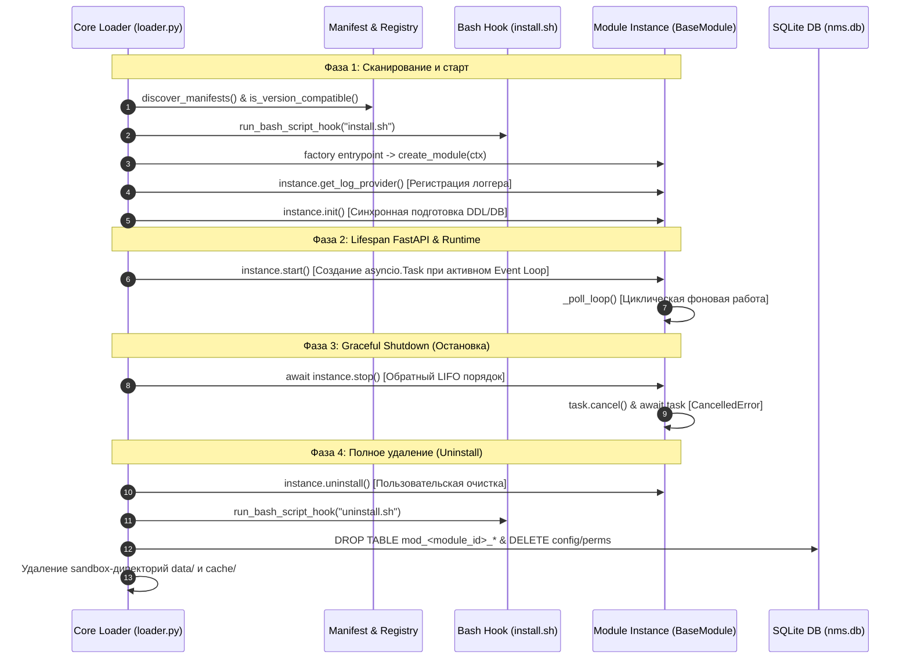
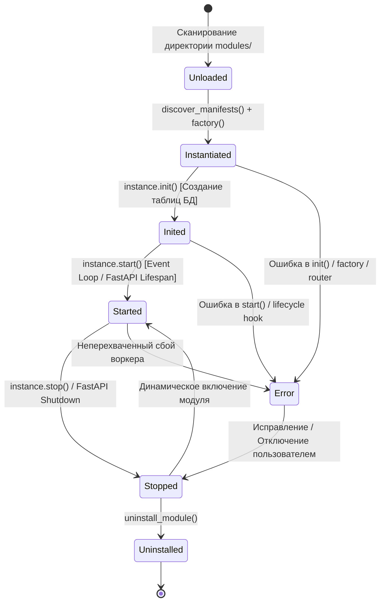

# ⚓ 13. Хуки жизненного цикла и фоновые задачи (Lifecycle & Async Services)

---

Модульная платформа **NMS WebUI** предоставляет строгий, детерминированный механизм управления жизненным циклом (Lifecycle Management) и встроенную поддержку фоновых асинхронных сервисов (Async Background Services). 

В данном руководстве подробно рассмотрена архитектура старта и остановки модулей, двухфазная инициализация, работа Python/Bash хуков, обработка ошибок инициализации, создание утилизируемых фоновых процессов на основе `asyncio.Task`, транзакционная очистка ресурсов при удалении и взаимодействие с изолированным контекстом `ModuleContext`.

---

## 🔄 1. Архитектурный цикл жизни модуля

При старте бэкенд-сервера FastAPI Загрузчик плагинов (`backend.core.plugin.loader`) выполняет поэтапную инициализацию всех зарегистрированных модулей. Порядок загрузки определяется **топологической сортировкой** (`toposort_modules`), гарантирующей, что зависимые модули инициализируются строго после своих зависимостей (`deps`). Остановка модулей производится строго в **обратном порядке (LIFO)**.

### 📊 Диаграмма последовательности загрузки и деструкции



---

### 🚦 Диаграмма состояний модуля (State Machine)

Модуль в платформе проходит через следующие детерминированные состояния:



---

### 📋 10 Этапов жизненного цикла

1. **Discovery & Version Audit**: Сканирование файлов `manifest.yaml` в директории `backend/modules/`. Проверка требований к версии ядра (`min_core_version` / `max_core_version`) функциями `is_version_compatible()`.
2. **Dependency Resolution**: Топологическая сортировка графа зависимостей (`toposort_modules`). Если хотя бы одна обязательная зависимость из `deps` отключена или отсутствует, модуль автоматически деактивируется.
3. **Bash Install Hook**: Запуск скрипта установки (по умолчанию `scripts/install.sh` или из `manifest.hooks.install`).
4. **i18n Initialization**: Автоматическая загрузка JSON/YAML файлов словарей локализации из папки `locales/` и объекта `manifest.i18n`.
5. **Factory Instantiation**: Вызов функции-фабрики из `entrypoints.factory` с передачей эксклюзивного объекта `ModuleContext`. Созданный инстанс сохраняется в реестре `register_instance(module_id, instance)`.
6. **Log Provider Registration**: Если экземпляр модуля содержит метод `get_log_provider()`, его провайдер логов регистрируется в центральном реестре `log_provider_registry`.
7. **Phase 1: Synchronous `init()`**: Вызов `instance.init()`. На этом этапе модуль подготавливает внутреннюю структуру: вызывает `context.create_table()` для создания SQLite-таблиц `mod_<module_id>_*`, инициализирует кэши и считывает конфигурацию.
8. **Phase 2: Event Loop `start()` (Двухфазный запуск)**: При запуске FastAPI в контекстном менеджере `lifespan` (`backend/core/app.py`) или при динамическом включении вызывается `instance.start()`. Если событиный цикл Python (`asyncio.get_running_loop()`) запущен, модуль создает фоновые асинхронные задачи.
9. **Router & Service Injection**: Загрузка и подключение API-роутеров (`entrypoints.router`) и дополнительных сервисов (`entrypoints.services`) к приложению FastAPI.
10. **Phase 3 & 4: LIFO Shutdown & Uninstall**: При остановке приложения вызывается `shutdown_all()`, корректно исполняющая `await instance.stop()` для каждого модуля в **обратном топологическому порядку** (LIFO). При полном удалении модуля исполняется процедура `uninstall_module(module_id)`.

---

## ⚓ 2. Хуки жизненного цикла (`hooks`)

Платформа поддерживает два типа хуков: **Python-хуки** (для управления состоянием модуля внутри бэкенда) и **Bash-хуки** (для настройки операционной системы, установки бинарных зависимостей и драйверов).

### 🐍 Python Lifecycle Hooks

Хуки задаются в секции `hooks` файла `manifest.yaml`:

```yaml
hooks:
  on_enable: "backend.modules.sensor_monitor.lifecycle:on_module_enable"
  on_disable: "backend.modules.sensor_monitor.lifecycle:on_module_disable"
```

* **`on_enable`**: Исполняется ядром при включении модуля администратором через UI или API.
* **`on_disable`**: Исполняется при отключении модуля до остановки сервисов.

#### Гибкость сигнатур и `_call_with_fallbacks`

Загрузчик ядра использует вспомогательную функцию `_call_with_fallbacks(fn, *args)`, что позволяет объявлять хуки, роутеры и фабричные функции в любой из удобных сигнатур:

```python
# 1. Принимает полный контекст модуля (Рекомендуемый подход)
def on_module_enable(ctx: ModuleContext) -> None:
    ctx.logger.info("Module %s enabled", ctx.module_id)

# 2. Не принимает параметров (если контекст не требуется)
def on_module_enable() -> None:
    print("Module enabled without context")
```

---

### 🛡️ Изоляция ошибок загрузки (`register_module_error`)

Если на любом из этапов инициализации (`init()`, `start()`, вызов Python-хука, регистрация роутера или сервиса) возникает исключение:
1. Ядро перехватывает ошибку, препятствуя падению всего сервера FastAPI.
2. В лог выводится предупреждение `_log.warning(...)`.
3. Сообщение об ошибке регистрируется в системе через `register_module_error(module_id, err_msg)`.
4. Статус ошибки доступен администраторам через веб-интерфейс и REST API `/api/modules`.

---

### 🐚 Bash Lifecycle Hooks (`install.sh` / `uninstall.sh`)

Скрипты операционной системы позволяют устанавливать системные утилиты (например, `ping`, `nmap`, `snmpget`), создавать конфигурационные файлы в ОС или очищать временные каталоги.

По умолчанию Загрузчик ищет скрипты по относительным путям:
* **Установка**: `scripts/install.sh` (или переопределение в `manifest.hooks.install`)
* **Удаление**: `scripts/uninstall.sh` (или переопределение в `manifest.hooks.uninstall`)

Функция ядра `run_bash_script_hook()` исполняет скрипт в отдельном процессе с установленным таймаутом **60 секунд** и автоматическим назначением прав на исполнение (`chmod +x`).

#### Передаваемые переменные окружения (Environment Variables):

| Переменная | Описание | Пример значения |
| :--- | :--- | :--- |
| `MODULE_ID` | Идентификатор текущего модуля | `tuya` или `sensor_monitor` |
| `MODULE_ROOT` | Абсолютный путь к директории модуля | `/opt/nms-webui/backend/modules/tuya` |
| `MODULE_DATA_DIR` | Путь к изолированной дисковой песочнице данных | `/opt/nms-webui/backend/data/modules/tuya` |
| `PROJECT_ROOT` | Корневая директория проекта NMS WebUI | `/opt/nms-webui` |

#### Пример `scripts/install.sh`:

```bash
#!/usr/bin/env bash
set -e

echo "[+] Installing system dependencies for ${MODULE_ID}..."
echo "[+] Target data dir: ${MODULE_DATA_DIR}"

# Создаем поддиректорию для локальных бинарных логов в песочнице
mkdir -p "${MODULE_DATA_DIR}/raw_logs"

echo "[+] Module ${MODULE_ID} installation completed successfully."
exit 0
```

---

## 🔄 3. Фоновые асинхронные задачи (Async Background Services)

Длительные фоновые процессы (опрос датчиков по SNMP/Modbus/REST, очистка старых записей БД, фоновая агрегация метрик) создаются в методе `start()` класса модуля, наследуемого от `BaseModule`.

### 📜 Контракт `BaseModule` (`backend/modules/base.py`)

Все модули платформы обязаны реализовывать интерфейс `BaseModule`:

```python
class BaseModule(ABC):
    def __init__(self, context: ModuleContext):
        self.context = context

    @abstractmethod
    def init(self) -> None:
        """Синхронная подготовка модуля (DDL, схемы БД, кэши)."""

    @abstractmethod
    def start(self) -> None:
        """Запуск асинхронных фоновых задач."""

    @abstractmethod
    async def stop(self) -> None:
        """Остановка фоновых задач и высвобождение ресурсов."""

    @abstractmethod
    def get_status(self) -> dict[str, Any]:
        """Возврат метрик и состояния здоровья модуля."""

    def uninstall(self) -> None:
        """Опциональный деструктор при полном удалении модуля."""
        pass

    def get_log_provider((self) -> LogProvider | None:
        """Опциональный провайдер логов модуля."""
        return None
```

---

### ⚙️ Продвинутые паттерны фоновых сервисов

#### 1. Управление множественными задачами (Multi-Task Management)
Для модулей, требующих параллельной работы нескольких воркеров (например, воркер опроса + воркер очистки кэша), рекомендуется использовать набор задач `set[asyncio.Task]`:

```python
class MultiWorkerModule(BaseModule):
    def __init__(self, context: ModuleContext):
        super().__init__(context)
        self._tasks: set[asyncio.Task] = set()
        self._running: bool = False

    def start(self) -> None:
        self._running = True
        loop = asyncio.get_running_loop()

        # Создаем несколько параллельных фоновых задач
        poll_task = loop.create_task(self._poll_loop())
        cleanup_task = loop.create_task(self._cleanup_loop())

        self._tasks.add(poll_task)
        self._tasks.add(cleanup_task)

        # Регулировка автоматической очистки завершенных тасок
        poll_task.add_done_callback(self._tasks.discard)
        cleanup_task.add_done_callback(self._tasks.discard)

    async def stop(self) -> None:
        self._running = False
        for task in self._tasks:
            task.cancel()

        if self._tasks:
            await asyncio.gather(*self._tasks, return_exceptions=True)
        self._tasks.clear()
```

---

#### 2. Обработка ошибок с Экспоненциальной Задержкой (Exponential Backoff)
Чтобы сбой внешней системы (например, отказ сетевого коммутатора) не перегружал логи и сеть постоянными повторными запросами:

```python
async def _poll_loop(self) -> None:
    backoff = 2
    max_backoff = 60

    while self._running:
        try:
            await self._fetch_remote_data()
            backoff = 2  # Сброс задержки при успешной итерации
            await asyncio.sleep(self._poll_interval)
        except asyncio.CancelledError:
            break
        except Exception as exc:
            self.context.logger.error("Connection failed: %s. Retrying in %ds...", exc, backoff)
            await asyncio.sleep(backoff)
            backoff = min(backoff * 2, max_backoff)
```

---

#### 3. Защита критических транзакций через `asyncio.shield()`
Если при отмене задачи (`cancel()`) требуется завершить ответственное сохранение данных в SQLite:

```python
async def _save_critical_state(self, data: dict) -> None:
    # Защищает корутину от мгновенного отмена со стороны CancelledError
    await asyncio.shield(self._write_to_db(data))
```

---

## 🛑 4. Graceful Shutdown (Грациозная остановка)

При остановке бэкенд-сервера FastAPI или при выключении/перезагрузке модуля через API выгрузка происходит корректно с гарантией того, что не произойдет утечки задач или коррупции SQLite БД.

### LIFO порядок остановки всех сервисов (`shutdown_all`)

Функция `shutdown_all()` из `backend/core/plugin/registry.py` останавливает модули в порядке, **обратном их топологической загрузке**:

```python
async def shutdown_all() -> None:
    """Корректная остановка всех модулей с методом stop()."""
    for mid, inst in reversed(list(_instances.items())):
        try:
            if hasattr(inst, "stop"):
                if asyncio.iscoroutinefunction(inst.stop):
                    await inst.stop()
                else:
                    inst.stop()
                _log.info("Module %s stopped", mid)
        except Exception as exc:
            _log.warning("Module %s stop failed: %s", mid, exc)
    _instances.clear()
```

> [!IMPORTANT]
> Если метод `stop()` является корутиной (`async def`), Загрузчик плагинов ядра проверяет это через `asyncio.iscoroutinefunction(inst.stop)` и исполняет его асинхронно через `await`.

---

## 🧹 5. Деструкция и полное удаление модуля (`uninstall`)

Когда пользователь полностью удаляет модуль через веб-интерфейс или REST API `DELETE /api/modules/{module_id}`, ядро вызывает функцию `uninstall_module(module_id)` (`backend/core/plugin/loader.py`).

Процедура деструкции состоит из 4 автоматических шагов:

```mermaid
flowchart TD
    A[Пользователь нажимает 'Удалить модуль'] --> B[Вызов instance.uninstall()]
    B --> C[Вызов unload_single_module: stop + uninstall.sh + on_disable]
    C --> D[Атомарная SQL-транзакция в nms.db]
    D --> E[Удаление песочниц data/ и cache/ на диске]
    E --> F[Исключение манифеста из реестра]

    subgraph SQL-Транзакция в nms.db
        D1[DROP TABLE mod_id_*]
        D2[DELETE FROM notifications WHERE category=id]
        D3[DELETE FROM permissions & role_permissions]
        D4[DELETE FROM system_settings WHERE key=module_id_settings]
        D1 --- D2 --- D3 --- D4
    end
```

### 1. Вызов пользовательского деструктора бизнес-логики (`instance.uninstall()`)
Модуль может переопределить метод `uninstall()` в своем классе для выполнения доочистки внешней инфраструктуры (например, отмена подписок на MQTT-брокер или удаление сторонних файлов):

```python
class SensorMonitorModule(BaseModule):
    def uninstall(self) -> None:
        self.context.logger.info("Running custom cleanup for SensorMonitorModule...")
        # Дополнительная очистка внешней инфраструктуры
```

### 2. Выгрузка модуля (`unload_single_module`)
* Исполнение `await instance.stop()`.
* Запуск `scripts/uninstall.sh` через `run_bash_script_hook`.
* Вызов Python-хука `manifest.hooks.on_disable` (если задан).

### 3. Атомарная транзакция очистки единой базы данных (`nms.db`)
Ядро автоматически удаляет все системные артефакты модуля в одной БД SQLite:
* **Таблицы модуля**: Находятся все таблицы `sqlite_master`, начинающиеся с `mod_<clean_id>_*` или `mod_<raw_id>_*`, и выполняется `DROP TABLE`.
* **Уведомления**: `DELETE FROM notifications WHERE category = ?`.
* **Права и роли**: `DELETE FROM role_permissions` и `DELETE FROM permissions WHERE module_id = ?`.
* **Системные настройки**: `DELETE FROM system_settings WHERE key = 'module_<id>_settings'`.

### 4. Дисковая очистка песочницы (Sandbox Cleanup)
Ядро рекурсивно удаляет папки данных и кэша:
* `backend/data/modules/<module_id>`
* `backend/cache/modules/<module_id>`

---

## 🧰 6. Взаимодействие с `ModuleContext` из фоновых служб

Объект `ModuleContext`, передаваемый при создании модуля, предоставляет бессбойный и безопасный API для взаимодействия с ядром платформы:

```python
# 1. Логирование с автоматическим префиксом 'nms.plugin.<module_id>'
self.context.logger.info("Processing background job...")

# 2. Получение подключения к единой базе данных SQLite
with self.context.get_db() as conn:
    conn.execute(...)

# 3. Безопасное создание таблиц с автоподстановкой префикса mod_<module_id>_
self.context.create_table("metrics", {"id": "INTEGER PRIMARY KEY", "val": "REAL"})

# 4. Отправка системного уведомления пользователям
self.context.notify(
    title="Перегрев датчика!",
    message="Датчик temperature-01 превысил порог 85°C",
    notification_type="warning", # "info" | "success" | "warning" | "error"
    link="/sensor-monitor"
)

# 5. Проверка состояния и получение экземпляра другого модуля (Inter-Module Communication)
if self.context.is_module_active("tuya"):
    tuya_instance = self.context.get_module_instance("tuya")
    # Вызов публичных методов другого модуля

# 6. Защищенный путь к песочнице на диске (проверка Sandbox boundaries)
safe_file = self.context.ensure_safe_path(self.context.get_data_dir() / "export.json")
```

---

## 💡 7. Полноценный практический пример (End-to-End Code Example)

Ниже представлен комплект файлов готового к продакшену модуля `sensor_monitor`.

### 1. `manifest.yaml`

```yaml
id: sensor_monitor
name: "Sensor Monitor Service"
version: "1.0.0"
description: "Фоновый мониторинг параметров датчиков окружающей среды"
enabled_by_default: true
type: "feature"

deps: []

entrypoints:
  factory: "backend.modules.sensor_monitor.module:create_module"
  router: "backend.modules.sensor_monitor.api:get_router"

hooks:
  on_enable: "backend.modules.sensor_monitor.lifecycle:on_enable"
  on_disable: "backend.modules.sensor_monitor.lifecycle:on_disable"
  install: "scripts/install.sh"
  uninstall: "scripts/uninstall.sh"

config_schema:
  type: object
  properties:
    poll_interval_sec:
      type: integer
      default: 10
      minimum: 2
      maximum: 3600
      title: "Интервал опроса (сек)"
```

---

### 2. `module.py`

```python
"""Основной класс модуля Sensor Monitor с поддержкой нескольких фоновых служб."""
from __future__ import annotations

import asyncio
from typing import Any
from backend.core.plugin.context import ModuleContext
from backend.core.plugin.registry import get_module_settings
from backend.modules.base import BaseModule

class SensorMonitorModule(BaseModule):
    def __init__(self, context: ModuleContext):
        super().__init__(context)
        self._tasks: set[asyncio.Task] = set()
        self._running: bool = False
        self._poll_count: int = 0

    def init(self) -> None:
        """Синхронный запуск DDL при старте ядра."""
        self.context.logger.info("Initializing SensorMonitorModule tables...")
        self.context.create_table(
            "logs",
            {
                "id": "INTEGER PRIMARY KEY AUTOINCREMENT",
                "message": "TEXT NOT NULL",
                "created_at": "DATETIME DEFAULT CURRENT_TIMESTAMP"
            }
        )

    def start(self) -> None:
        """Запуск асинхронных фоновых сервисов."""
        self._running = True
        try:
            loop = asyncio.get_running_loop()
            
            # Запуск нескольких воркеров
            poll_task = loop.create_task(self._poll_loop())
            cleanup_task = loop.create_task(self._cleanup_loop())
            
            self._tasks.add(poll_task)
            self._tasks.add(cleanup_task)
            
            poll_task.add_done_callback(self._tasks.discard)
            cleanup_task.add_done_callback(self._tasks.discard)

            self.context.logger.info("Sensor Monitor background tasks started.")
        except RuntimeError:
            self.context.logger.debug("Event loop not ready; deferring start().")

    async def stop(self) -> None:
        """Graceful shutdown всех фоновых задач."""
        self.context.logger.info("Stopping Sensor Monitor background tasks...")
        self._running = False

        for task in self._tasks:
            task.cancel()

        if self._tasks:
            await asyncio.gather(*self._tasks, return_exceptions=True)
        self._tasks.clear()
        
        self.context.logger.info("Sensor Monitor background tasks stopped gracefully.")

    async def _poll_loop(self) -> None:
        """Фоновый асинхронный цикл опроса с обработкой ошибок."""
        backoff = 2
        while self._running:
            try:
                settings = get_module_settings(self.context.module_id)
                interval = int(settings.get("poll_interval_sec", 10))

                self._poll_count += 1
                self.context.logger.debug("Executing poll iteration #%d", self._poll_count)

                # Запись в SQLite БД
                with self.context.get_db() as conn:
                    table_name = f"{self.context.get_table_prefix()}logs"
                    conn.execute(
                        f"INSERT INTO {table_name} (message) VALUES (?)",
                        (f"Poll iteration #{self._poll_count} completed",)
                    )

                # Уведомление при достижении порога
                if self._poll_count % 100 == 0:
                    self.context.notify(
                        title="Мониторинг активен",
                        message=f"Выполнено {self._poll_count} итераций опроса.",
                        notification_type="info"
                    )

                backoff = 2  # Сброс backoff при успехе
                await asyncio.sleep(interval)
            except asyncio.CancelledError:
                break
            except Exception as exc:
                self.context.logger.error("Poll loop error: %s. Retrying in %ds...", exc, backoff)
                await asyncio.sleep(backoff)
                backoff = min(backoff * 2, 60)

    async def _cleanup_loop(self) -> None:
        """Второй фоновый воркер очистки устаревших локальных логов."""
        while self._running:
            try:
                await asyncio.sleep(3600)  # Запуск раз в час
                self.context.logger.info("Running hourly log cleanup...")
            except asyncio.CancelledError:
                break
            except Exception as exc:
                self.context.logger.warning("Cleanup loop error: %s", exc)

    def get_status(self) -> dict[str, Any]:
        return {
            "running": self._running,
            "poll_count": self._poll_count,
            "active_tasks": len(self._tasks)
        }

    def uninstall(self) -> None:
        self.context.logger.info("Uninstalling SensorMonitorModule resources...")


def create_module(ctx: ModuleContext) -> SensorMonitorModule:
    """Точка входа factory."""
    return SensorMonitorModule(ctx)
```

---

### 3. `scripts/install.sh`

```bash
#!/usr/bin/env bash
set -e

echo "[+] Running install.sh for ${MODULE_ID}..."
mkdir -p "${MODULE_DATA_DIR}/snapshots"
echo "[+] Created snapshots directory inside sandbox: ${MODULE_DATA_DIR}/snapshots"
exit 0
```

---

### 4. `scripts/uninstall.sh`

```bash
#!/usr/bin/env bash
set -e

echo "[+] Running uninstall.sh for ${MODULE_ID}..."
echo "[+] Cleaning up external temp files if any..."
exit 0
```

---

## 🚫 8. Anti-Patterns & Best Practices (Do's & Don'ts)

| Практика | Статус | Причина / Альтернатива |
| :--- | :---: | :--- |
| **Синхронный `time.sleep()` в `_poll_loop`** | ❌ **Запрещено** | Блокирует весь главный Event Loop приложения FastAPI. Используйте `await asyncio.sleep()`. |
| **Игнорирование `asyncio.CancelledError`** | ❌ **Запрещено** | Приводит к "зависанию" процесса при выгрузке модуля. Всегда выходите из цикла по `break`. |
| **Блокирующий I/O в `init()`** | ⚠️ **Не рекомендуется** | Замедляет запуск всей платформы NMS. Переносите тяжелые фоновые операции в `start()`. |
| **Отказ от `await task` при отмене** | ❌ **Запрещено** | Задачи отменяются некорректно. Дожидайтесь отмены в `stop()` через `await asyncio.gather(...)`. |
| **Прямой вызов `sqlite3.connect()`** | ❌ **Запрещено** | Игнорирует транзакции и префиксы таблиц `mod_<id>_*`. Используйте `self.context.get_db()`. |
| **Использование `set[asyncio.Task]` для задач** | ✅ **Рекомендуется** | Защищает ссылки на задачи от преждевременной сборки мусора (Garbage Collection). |
| **Очистка временных файлов через `uninstall()`** | ✅ **Рекомендуется** | Гарантирует отсутствие "мусорных" файлов после полного удаления модуля. |

---

## 🔍 Чек-лист проверки реализации для разработчика

- [x] Класс модуля наследуется от `BaseModule` и реализует `init()`, `start()`, `async stop()`, `get_status()`.
- [x] Таблицы SQLite создаются строго через `self.context.create_table()` с префиксом `mod_<module_id>_*`.
- [x] Все циклы опроса перехватывают `asyncio.CancelledError` и корректно выходят через `break`.
- [x] Все исключения внутри фоновых циклов обрабатываются в `try ... except Exception`, препятствуя неожиданному завершению `asyncio.Task`.
- [x] В методе `stop()` вызываются `.cancel()` и `await asyncio.gather(...)` для всех асинхронных задач.
- [x] При остановке модули выгружаются в обратном LIFO-порядке топологической сортировки.
- [x] Динамическая конфигурация считывается через `get_module_settings(self.context.module_id)` внутри итераций цикла без необходимости перезапуска приложения.
- [x] Файлы системных данных сохраняются строго в каталог `self.context.get_data_dir()`.
