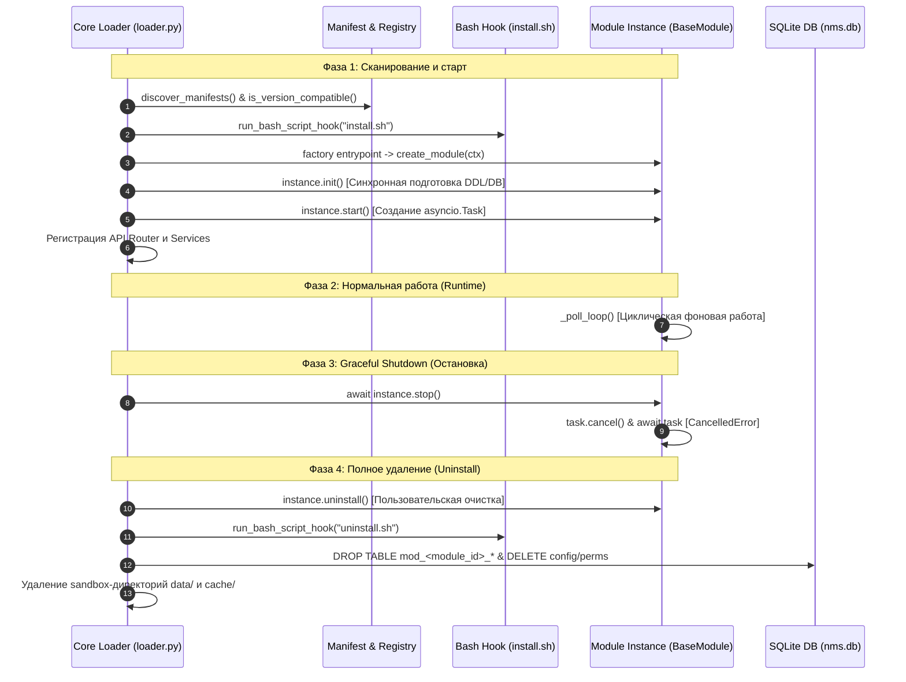

# ⚓ 13. Хуки жизненного цикла и фоновые задачи (Lifecycle & Async Services)

---

Модульная платформа **NMS WebUI** предоставляет строгий, детерминированный механизм управления жизненным циклом (Lifecycle Management) и встроенную поддержку фоновых асинхронных сервисов (Async Background Services). 

В данном руководстве подробно рассмотрена архитектура старта и остановки модулей, работа Python/Bash хуков, создание утилизируемых фоновых процессов на основе `asyncio.Task`, транзакционная очистка ресурсов при удалении и взаимодействие с изолированным контекстом `ModuleContext`.

---

## 🔄 1. Архитектурный цикл жизни модуля

При старте бэкенд-сервера FastAPI Загрузчик плагинов (`backend.core.plugin.loader`) выполняет поэтапную инициализацию всех зарегистрированных модулей. Порядок загрузки определяется **топологической сортировкой** (`toposort_modules`), гарантирующей, что зависимые модули инициализируются строго после своих зависимостей (`deps`).

### 📊 Диаграмма последовательности загрузки и деструкции



### 📋 10 Этапов жизненного цикла

1. **Discovery & Version Audit**: Сканирование файлов `manifest.yaml` в директории `backend/modules/`. Проверка требований к версии ядра (`min_core_version` / `max_core_version`) функциями `is_version_compatible()`.
2. **Dependency Resolution**: Топологическая сортировка графа зависимостей (`toposort_modules`). Если хотя бы одна обязательная зависимость из `deps` отключена или отсутствует, модуль автоматически деактивируется.
3. **Bash Install Hook**: Запуск скрипта установки (по умолчанию `scripts/install.sh` или из `manifest.hooks.install`).
4. **i18n Initialization**: Автоматическая загрузка JSON/YAML файлов словарей локализации из папки `locales/` и объекта `manifest.i18n`.
5. **Factory Instantiation**: Вызов функции-фабрики из `entrypoints.factory` с передачей эксклюзивного объекта `ModuleContext`. Созданный инстанс сохраняется в реестре `register_instance(module_id, instance)`.
6. **Log Provider Registration**: Если экземпляр модуля содержит метод `get_log_provider()`, его провайдер логов регистрируется в центральном реестре `log_provider_registry`.
7. **Phase 1: Synchronous `init()`**: Вызов `instance.init()`. На этом этапе модуль подготавливает внутреннюю структуру: вызывает `context.create_table()` для создания SQLite-таблиц `mod_<module_id>_*`, инициализирует кэши и считывает конфигурацию.
8. **Phase 2: Event Loop `start()`**: Вызов `instance.start()`. Если событиный цикл Python (`asyncio.get_running_loop()`) запущен, модуль создает фоновые асинхронные задачи.
9. **Router & Service Injection**: Загрузка и подключение API-роутеров (`entrypoints.router`) и дополнительных сервисов (`entrypoints.services`) к приложению FastAPI.
10. **Phase 3 & 4: Shutdown / Uninstall**: Вызов `instance.stop()` при остановке приложения и комплексная процедура `uninstall_module(module_id)` при полном удалении модуля пользователем.

---

## ⚓ 2. Хуки жизненного цикла (`hooks`)

Платформа поддерживает два типа хуков: **Python-хуки** (для управления состоянием модуля внутри бэкенда) и **Bash-хуки** (для настройки операционной системы, установки бинарных зависимостей и драйверов).

### 🐍 Python Lifecycle Hooks

Хуки задаются в секции `hooks` файла `manifest.yaml`:

```yaml
hooks:
  on_enable: "backend.modules.sensor_monitor.lifecycle:on_module_enable"
  on_disable: "backend.modules.sensor_monitor.lifecycle:on_module_disable"
```

* **`on_enable`**: Исполняется ядра при включении модуля администратором через UI или API.
* **`on_disable`**: Исполняется при отключении модуля до остановки сервисов.

Сигнатура Python-хука принимает экземпляр `ModuleContext`:

```python
# backend/modules/sensor_monitor/lifecycle.py
from backend.core.plugin.context import ModuleContext

def on_module_enable(ctx: ModuleContext) -> None:
    ctx.logger.info("Module %s was enabled by administrator", ctx.module_id)
    # Инициализация дополнительных системных ресурсов

def on_module_disable(ctx: ModuleContext) -> None:
    ctx.logger.info("Module %s was disabled", ctx.module_id)
```

> **Примечание по сигнатурам**: Ядро использует функцию `_call_with_fallbacks`, позволяющую передавать в хук как `ctx`, так и вызывать хук без параметров, если функция их не принимает.

---

### 🐚 Bash Lifecycle Hooks (`install.sh` / `uninstall.sh`)

Скрипты операционной системы позволяют устанавливать системные утилиты (например, `ping`, `nmap`, `snmpget`), создавать конфигурационные файлы в ОС или очищать временные каталоги.

По умолчанию Загрузчик ищет скрипты по относительным путям:
* **Установка**: `scripts/install.sh` (или переопределение в `manifest.hooks.install`)
* **Удаление**: `scripts/uninstall.sh` (или переопределение в `manifest.hooks.uninstall`)

Функция ядра `run_bash_script_hook()` исполняет скрипт в отдельном процессе с установленным таймаутом **60 секунд** и автоматическим назначением прав на исполнение (`chmod +x`).

#### Передаваемые переменные окружения (Environment Variables):

| Переменная | Описание | Пример значения |
| :--- | :--- | :--- |
| `MODULE_ID` | Идентификатор текущего модуля | `tuya` или `net-monitor.ping` |
| `MODULE_ROOT` | Абсолютный путь к директории модуля | `/opt/nms-webui/backend/modules/tuya` |
| `MODULE_DATA_DIR` | Путь к изолированной дисковой песочнице данных | `/opt/nms-webui/backend/data/modules/tuya` |
| `PROJECT_ROOT` | Корневая директория проекта NMS WebUI | `/opt/nms-webui` |

#### Пример `scripts/install.sh`:

```bash
#!/usr/bin/env bash
set -e

echo "[+] Installing system dependencies for ${MODULE_ID}..."
echo "[+] Target data dir: ${MODULE_DATA_DIR}"

# Создаем поддиректорию для локальных бинарных логов в песочнице
mkdir -p "${MODULE_DATA_DIR}/raw_logs"

echo "[+] Module ${MODULE_ID} installation completed successfully."
exit 0
```

---

## 🔄 3. Фоновые асинхронные задачи (Async Background Services)

Длительные фоновые процессы (опрос датчиков по SNMP/Modbus/REST, очистка старых записей БД, фоновая агрегация метрик) создаются в методе `start()` класса модуля, наследуемого от `BaseModule`.

### 📜 Контракт `BaseModule` (`backend/modules/base.py`)

Все модули платформы обязаны реализовывать интерфейс `BaseModule`:

```python
class BaseModule(ABC):
    def __init__(self, context: ModuleContext):
        self.context = context

    @abstractmethod
    def init(self) -> None:
        """Синхронная подготовка модуля (DDL, схемы БД, кэши)."""

    @abstractmethod
    def start(self) -> None:
        """Запуск асинхронных фоновых задач."""

    @abstractmethod
    async def stop(self) -> None:
        """Остановка фоновых задач и высвобождение ресурсов."""

    @abstractmethod
    def get_status(self) -> dict[str, Any]:
        """Возврат метрик и состояния здоровья модуля."""

    def uninstall(self) -> None:
        """Опциональный деструктор при полном удалении модуля."""
        pass
```

---

### 🔁 Паттерн Polling Loop (Цикл опроса)

Пример устойчивого фонового сервиса с динамической перезагрузкой конфигурации и изоляцией ошибок:

```python
import asyncio
from typing import Any
from backend.core.plugin.registry import get_module_settings
from backend.modules.base import BaseModule

class SensorMonitorModule(BaseModule):
    def __init__(self, context: Any):
        super().__init__(context)
        self._poll_task: asyncio.Task | None = None
        self._running: bool = False
        self._poll_interval: int = 15

    def init(self) -> None:
        """Создание таблиц SQLite и первичная загрузка настроек."""
        self.context.create_table(
            "readings",
            {
                "id": "INTEGER PRIMARY KEY AUTOINCREMENT",
                "sensor_id": "TEXT NOT NULL",
                "value": "REAL NOT NULL",
                "timestamp": "DATETIME DEFAULT CURRENT_TIMESTAMP"
            }
        )
        self._reload_config()

    def _reload_config(self) -> None:
        """Чтение динамических настроек из базы данных."""
        settings = get_module_settings(self.context.module_id)
        self._poll_interval = int(settings.get("poll_interval_sec", 15))

    def start(self) -> None:
        """Запуск фоновой задачи в Event Loop."""
        self._running = True
        try:
            loop = asyncio.get_running_loop()
            if self._poll_task is None or self._poll_task.done():
                self._poll_task = loop.create_task(self._poll_loop())
                self.context.logger.info("Background poll task launched successfully.")
        except RuntimeError:
            self.context.logger.debug("Event loop is not running yet; start() deferred.")

    async def _poll_loop(self) -> None:
        """Бесконечный цикл опроса с обработкой отмены и ошибок."""
        while self._running:
            try:
                # 1. Перезагружаем настройки для поддержки горячего обновления
                self._reload_config()

                # 2. Выполняем полезную работу
                await self._poll_all_sensors()

                # 3. Асинхронная пауза с реагированием на остановку
                await asyncio.sleep(self._poll_interval)
            except asyncio.CancelledError:
                self.context.logger.info("Poll loop received cancellation signal.")
                break
            except Exception as exc:
                # Защита: ошибка не должна убирать цикл опроса
                self.context.logger.error("Error during sensor polling: %s", exc, exc_info=True)
                await asyncio.sleep(5)  # Пауза перед повторной попыткой при сбое

    async def _poll_all_sensors(self) -> None:
        """Пример асинхронной работы с базой данных и сетью."""
        # Пример сохранения данных в БД
        with self.context.get_db() as conn:
            conn.execute(
                f"INSERT INTO {self.context.get_table_prefix()}readings (sensor_id, value) VALUES (?, ?)",
                ("sensor-01", 24.5)
            )

    def get_status(self) -> dict[str, Any]:
        """Возврат информации о состоянии для системного мониторинга."""
        return {
            "active": self._running,
            "poll_interval_sec": self._poll_interval,
            "task_alive": self._poll_task is not None and not self._poll_task.done()
        }
```

---

## 🛑 4. Graceful Shutdown (Грациозная остановка)

При остановке бэкенд-сервера FastAPI или при выключении/перезагрузке модуля через API выгрузка происходит корректно с гарантией того, что не произойдет утечки задач или коррупции SQLite БД.

### Алгоритм метода `stop()`:

```python
async def stop(self) -> None:
    """Остановка фоновых процессов и высвобождение ресурсов."""
    self.context.logger.info("Stopping SensorMonitorModule...")
    self._running = False

    if self._poll_task and not self._poll_task.done():
        # 1. Отправляем сигнал отмены асинхронной задаче
        self._poll_task.cancel()
        try:
            # 2. Дожидаемся фактического завершения таски
            await self._poll_task
        except asyncio.CancelledError:
            pass  # Нормальное завершение при отмене

    self._poll_task = None
    
    # 3. Закрываем внешние сетевые сессии (например, aiohttp.ClientSession)
    if hasattr(self, "http_client") and self.http_client:
        await self.http_client.close()

    self.context.logger.info("SensorMonitorModule stopped gracefully.")
```

> [!IMPORTANT]
> Если метод `stop()` является корутиной (`async def`), Загрузчик плагинов ядра проверяет это через `asyncio.iscoroutinefunction(inst.stop)` и исполняет его асинхронно через `await` или в текущем `event loop`.

---

## 🧹 5. Деструкция и полное удаление модуля (`uninstall`)

Когда пользователь полностью удаляет модуль через веб-интерфейс или REST API `DELETE /api/v1/modules/{module_id}`, ядро вызывает функцию `uninstall_module(module_id)` (`backend/core/plugin/loader.py`).

Процедура деструкции состоит из 4 автоматических шагов:

```mermaid
flowchart TD
    A[Пользователь нажимает 'Удалить модуль'] --> B[Вызов instance.uninstall()]
    B --> C[Вызов unload_single_module: stop + uninstall.sh + on_disable]
    C --> D[Атомарная SQL-транзакция в nms.db]
    D --> E[Удаление песочниц data/ и cache/ на диске]
    E --> F[Исключение манифеста из реестра]

    subgraph SQL-Транзакция в nms.db
        D1[DROP TABLE mod_id_*]
        D2[DELETE FROM notifications WHERE category=id]
        D3[DELETE FROM permissions & role_permissions]
        D4[DELETE FROM system_settings WHERE key=module_id_settings]
        D1 --- D2 --- D3 --- D4
    end
```

### 1. Вызов пользовательского деструктора бизнес-логики (`instance.uninstall()`)
Модуль может переопределить метод `uninstall()` в своем классе для выполнения доочистки внешней инфраструктуры (например, отмена подписок на MQTT-брокер или удаление сторонних файлов):

```python
class SensorMonitorModule(BaseModule):
    def uninstall(self) -> None:
        self.context.logger.info("Running custom cleanup for SensorMonitorModule...")
        # Дополнительная очистка внешней инфраструктуры
```

### 2. Выгрузка модуля (`unload_single_module`)
* Исполнение `await instance.stop()`.
* Запуск `scripts/uninstall.sh` через `run_bash_script_hook`.
* Вызов Python-хука `manifest.hooks.on_disable` (если задан).

### 3. Атомарная транзакция очистки единой базы данных (`nms.db`)
Ядро автоматически удаляет все системные артефакты модуля в одной БД SQLite:
* **Таблицы модуля**: Находятся все таблицы `sqlite_master`, начинающиеся с `mod_<clean_id>_*` или `mod_<raw_id>_*`, и выполняется `DROP TABLE`.
* **Уведомления**: `DELETE FROM notifications WHERE category = ?`.
* **Права и роли**: `DELETE FROM role_permissions` и `DELETE FROM permissions WHERE module_id = ?`.
* **Системные настройки**: `DELETE FROM system_settings WHERE key = 'module_<id>_settings'`.

### 4. Дисковая очистка песочницы (Sandbox Cleanup)
Ядро рекурсивно удаляет папки данных и кэша:
* `backend/data/modules/<module_id>`
* `backend/cache/modules/<module_id>`

---

## 🧰 6. Взаимодействие с `ModuleContext` из фоновых служб

Объект `ModuleContext`, передаваемый при создании модуля, предоставляет бессбойный и безопасный API для взаимодействия с ядром платформы:

```python
# 1. Логирование с автоматическим префиксом 'nms.plugin.<module_id>'
self.context.logger.info("Processing background job...")

# 2. Получение подключения к единой базе данных SQLite
with self.context.get_db() as conn:
    conn.execute(...)

# 3. Безопасное создание таблиц с автоподстановкой префикса mod_<module_id>_
self.context.create_table("metrics", {"id": "INTEGER PRIMARY KEY", "val": "REAL"})

# 4. Отправка системного уведомления пользователям
self.context.notify(
    title="Перегрев датчика!",
    message="Датчик temperature-01 превысил порог 85°C",
    notification_type="warning", # "info" | "success" | "warning" | "error"
    link="/sensor-monitor"
)

# 5. Проверка состояния и получение экземпляра другого модуля (Inter-Module Communication)
if self.context.is_module_active("tuya"):
    tuya_instance = self.context.get_module_instance("tuya")
    # Вызов публичных методов другого модуля

# 6. Защищенный путь к песочнице на диске (проверка Sandbox boundaries)
safe_file = self.context.ensure_safe_path(self.context.get_data_dir() / "export.json")
```

---

## 💡 7. Полноценный практический пример (End-to-End Code Example)

Ниже представлен комплект файлов готового к продакшену модуля `sensor_monitor`.

### 1. `manifest.yaml`

```yaml
id: sensor_monitor
name: "Sensor Monitor Service"
version: "1.0.0"
description: "Фоновый мониторинг параметров датчиков окружающей среды"
enabled_by_default: true
type: "feature"

deps: []

entrypoints:
  factory: "backend.modules.sensor_monitor.module:create_module"
  router: "backend.modules.sensor_monitor.api:get_router"

hooks:
  on_enable: "backend.modules.sensor_monitor.lifecycle:on_enable"
  on_disable: "backend.modules.sensor_monitor.lifecycle:on_disable"
  install: "scripts/install.sh"
  uninstall: "scripts/uninstall.sh"

config_schema:
  type: object
  properties:
    poll_interval_sec:
      type: integer
      default: 10
      minimum: 2
      maximum: 3600
      title: "Интервал опроса (сек)"
```

---

### 2. `module.py`

```python
"""Основной класс модуля Sensor Monitor."""
from __future__ import annotations

import asyncio
from typing import Any
from backend.core.plugin.context import ModuleContext
from backend.core.plugin.registry import get_module_settings
from backend.modules.base import BaseModule

class SensorMonitorModule(BaseModule):
    def __init__(self, context: ModuleContext):
        super().__init__(context)
        self._poll_task: asyncio.Task | None = None
        self._running: bool = False
        self._poll_count: int = 0

    def init(self) -> None:
        """Синхронный запуск DDL при старте ядра."""
        self.context.logger.info("Initializing SensorMonitorModule tables...")
        self.context.create_table(
            "logs",
            {
                "id": "INTEGER PRIMARY KEY AUTOINCREMENT",
                "message": "TEXT NOT NULL",
                "created_at": "DATETIME DEFAULT CURRENT_TIMESTAMP"
            }
        )

    def start(self) -> None:
        """Запуск асинхронного фонового сервиса."""
        self._running = True
        try:
            loop = asyncio.get_running_loop()
            if self._poll_task is None or self._poll_task.done():
                self._poll_task = loop.create_task(self._poll_loop())
                self.context.logger.info("Sensor Monitor background task started.")
        except RuntimeError:
            self.context.logger.debug("Event loop not ready; deferring start().")

    async def stop(self) -> None:
        """Graceful shutdown фоновой задачи."""
        self.context.logger.info("Stopping Sensor Monitor background task...")
        self._running = False

        if self._poll_task and not self._poll_task.done():
            self._poll_task.cancel()
            try:
                await self._poll_task
            except asyncio.CancelledError:
                pass
        self._poll_task = None
        self.context.logger.info("Sensor Monitor background task stopped.")

    async def _poll_loop(self) -> None:
        """Фоновый асинхронный цикл опроса."""
        while self._running:
            try:
                settings = get_module_settings(self.context.module_id)
                interval = int(settings.get("poll_interval_sec", 10))

                self._poll_count += 1
                self.context.logger.debug("Executing poll iteration #%d", self._poll_count)

                # Пример взаимодействия с SQLite БД
                with self.context.get_db() as conn:
                    table_name = f"{self.context.get_table_prefix()}logs"
                    conn.execute(
                        f"INSERT INTO {table_name} (message) VALUES (?)",
                        (f"Poll iteration #{self._poll_count} completed",)
                    )

                # Запись метрик / уведомление при критическом значении
                if self._poll_count % 100 == 0:
                    self.context.notify(
                        title="Мониторинг активен",
                        message=f"Выполнено {self._poll_count} итераций опроса датчиков.",
                        notification_type="info"
                    )

                await asyncio.sleep(interval)
            except asyncio.CancelledError:
                break
            except Exception as exc:
                self.context.logger.error("Poll loop error: %s", exc, exc_info=True)
                await asyncio.sleep(5)

    def get_status(self) -> dict[str, Any]:
        return {
            "running": self._running,
            "poll_count": self._poll_count,
            "task_active": self._poll_task is not None and not self._poll_task.done()
        }

    def uninstall(self) -> None:
        self.context.logger.info("Uninstalling SensorMonitorModule resources...")


def create_module(ctx: ModuleContext) -> SensorMonitorModule:
    """Точка входа factory."""
    return SensorMonitorModule(ctx)
```

---

### 3. `scripts/install.sh`

```bash
#!/usr/bin/env bash
set -e

echo "[+] Running install.sh for ${MODULE_ID}..."
mkdir -p "${MODULE_DATA_DIR}/snapshots"
echo "[+] Created snapshots directory inside sandbox: ${MODULE_DATA_DIR}/snapshots"
exit 0
```

---

### 4. `scripts/uninstall.sh`

```bash
#!/usr/bin/env bash
set -e

echo "[+] Running uninstall.sh for ${MODULE_ID}..."
echo "[+] Cleaning up external temp files if any..."
exit 0
```

---

## 🔍 Чек-лист проверки реализации для разработчика

- [x] Класс модуля наследуется от `BaseModule` и реализует `init()`, `start()`, `async stop()`, `get_status()`.
- [x] Таблицы SQLite создаются строго через `self.context.create_table()` с префиксом `mod_<module_id>_*`.
- [x] Цикл `_poll_loop` перехватывает `asyncio.CancelledError` и корректно выходит из цикла.
- [x] Все исключения внутри цикла обрабатываются в `try ... except Exception`, предотвращая неожиданное падение `asyncio.Task`.
- [x] В методе `stop()` вызывается `.cancel()` и осуществляется `await self._poll_task` для завершения работы.
- [x] Динамическая конфигурация считывается через `get_module_settings(self.context.module_id)` внутри итераций цикла без необходимости перезапуска приложения.
- [x] Файлы системных данных сохраняются строго в каталог `self.context.get_data_dir()`.
