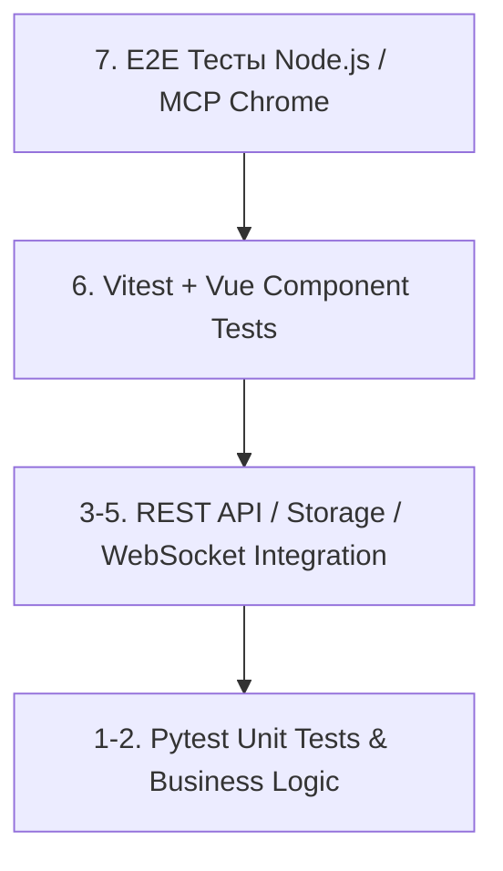

# 🧪 15. Тестирование модулей и автотесты (Module QA)

Обеспечение высокого качества (Quality Assurance) модулей в **NMS WebUI** основывается на автоматизированном тестировании на всех уровнях архитектуры: от быстрых изолированных юнит-тестов бизнес-логики до интеграционной проверки REST API, хранилища данных, асинхронных сервисов и сквозных E2E-сценариев.

---

## 🧭 0. Стратегия и пирамида тестирования NMS WebUI

Разработка автотестов для модулей строится на слоистой пирамиде тестирования. Каждый слой выполняет свою задачу и гарантирует отсечение дефектов на ранних этапах:



### 📊 Матрица уровней тестирования

| Уровень | Фреймворк / Инструмент | Область покрытия | Скорость | Расположение тестов |
| :--- | :--- | :--- | :--- | :--- |
| **Unit (Бэкенд)** | `pytest`, `unittest.mock` | Бизнес-логика, манифест, чистые функции, fallback-алгоритмы | ~1-5 мс / тест | `tests/test_<module_id>.py` или `backend/modules/<module_id>/tests/` |
| **Storage & Persistence** | `pytest`, `tmp_path` | Создание, чтение, обновление, удаление записи в хранилище | ~10-20 мс / тест | `tests/test_<module_id>_storage.py` |
| **REST API Integration** | `fastapi.testclient.TestClient` | HTTP Эндпоинты модуля, валидация Pydantic-схем, RBAC | ~50-100 мс / тест | `tests/test_<module_id>_api.py` |
| **Async & WebSockets** | `pytest-asyncio`, `AsyncMock` | Фоновые сервисы, отправка WS-сообщений, `broadcaster` | ~20-50 мс / тест | `tests/test_<module_id>_async.py` |
| **Frontend Unit/Component** | `Vitest`, `Vue Test Utils` | Vue 3 SFC компоненты, виджеты, composables, маппинг данных | ~100-300 мс / тест | `frontend/src/modules/<module_id>/__tests__/` |
| **E2E (End-to-End)** | Node.js + MCP Chrome | Полный пользовательский сценарий в реальном браузере | ~3-10 сек / тест | `tests/mcp_chrome_*.js` |

---

## 📁 1. Структура и организация тестов модуля

### 📌 Рекомендуемая топология файлов
Для сохранения чистоты кодовой базы тесты модуля могут располагаться в двух местах:

1. **Глобальный каталог `tests/` (рекомендуется для системных и интеграционных модулей)**:
   ```text
   nms-webui/
   ├── tests/
   │   ├── conftest.py                   # Глобальные фикстуры (app, mock_db, client)
   │   ├── test_tuya_module.py           # Юнит-тесты и жизненный цикл модуля Tuya
   │   ├── test_tuya_integration.py      # Интеграционные тесты Tuya API и Storage
   │   ├── test_widgets.py               # Тесты регистрации и работы виджетов
   │   └── test_module_i18n.py           # Тесты загрузки словарей локализации
   ```

2. **Изолированный каталог модуля `backend/modules/<module_id>/tests/`**:
   ```text
   backend/modules/sensor_monitor/
   ├── manifest.json
   ├── module.py
   ├── storage.py
   └── tests/
       ├── conftest.py                   # Локальные фикстуры модуля
       ├── test_unit.py                  # Внутренняя бизнес-логика
       └── test_api.py                   # Тесты REST API эндпоинтов
   ```

---

## 🛠 2. Юнит-тестирование бизнес-логики и изоляция зависимостей

Юнит-тесты проверяют корректность логики модуля без реального взаимодействия с внешней сетью или базой данных. Внешние клиенты и интерфейсы изолируются с помощью `unittest.mock`.

### 🧪 Пример 1: Проверка манифеста и класса модуля (`ModuleContext`)

```python
import pytest
from pathlib import Path
from backend.core.plugin.context import ModuleContext
from backend.core.plugin.manifest import ModuleManifest
from backend.modules.tuya.module import TuyaModule

def test_tuya_module_lifecycle(tmp_path: Path):
    """Проверка инициализации и получения статуса модуля."""
    # 1. Создаем валидный манифест модуля
    manifest = ModuleManifest(id="tuya", name="Tuya Module", version="1.0.0")
    
    # 2. Инициализируем контекст модуля во временном каталоге tmp_path
    ctx = ModuleContext(
        module_id="tuya",
        root=tmp_path,
        manifest=manifest.to_api_dict(),
    )
    
    # 3. Создаем экземпляр модуля и запускаем init()
    module = TuyaModule(ctx)
    module.init()

    # 4. Проверяем начальное состояние и статус
    status = module.get_status()
    assert status["active"] is False
    assert status["total_devices"] == 0
    assert status["module_id"] == "tuya"
```

### 🧪 Пример 2: Мокирование внешних HTTP/Cloud клиентов и проверка Fallback-логики

```python
import pytest
from unittest.mock import AsyncMock, MagicMock
from backend.modules.tuya.client import TuyaCloudClient, TuyaDeviceController

@pytest.mark.asyncio
async def test_tuya_device_controller_fallback():
    """Проверка отката на Cloud API, если локальное соединение недоступно (Auto Fallback)."""
    # Создаем мок Cloud-клиента
    mock_cloud = MagicMock(spec=TuyaCloudClient)
    mock_cloud.send_command = AsyncMock(return_value=True)

    controller = TuyaDeviceController(cloud_client=mock_cloud)

    # Запрос в режиме 'auto' без IP-адреса локального устройства -> должен вызывать Cloud API
    result = await controller.send_command(
        device_id="dev_auto_01",
        commands={"1": True},
        mode="auto",
        ip=None,
        local_key=None,
    )

    assert result is True
    # Убеждаемся, что вызов Cloud-клиента произошел ровно 1 раз
    mock_cloud.send_command.assert_called_once_with("dev_auto_01", {"1": True})
```

---

## 💾 3. Интеграционное тестирование Хранилища (Storage) и REST API

### 🧪 Пример 1: Изолированное тестирование Storage (`tmp_path`)

```python
from pathlib import Path
import pytest
from backend.modules.tuya.storage import TuyaStorage, TuyaDeviceSchema

def test_tuya_storage_crud_operations(tmp_path: Path):
    """Проверка полного цикла CRUD операций хранилища модуля."""
    storage = TuyaStorage(data_dir=tmp_path)
    assert len(storage.get_all()) == 0

    # 1. Create (Upsert)
    device = TuyaDeviceSchema(
        device_id="dev_100",
        name="Главный Коммутатор",
        ip="192.168.1.50",
        local_key="1234567890abcdef",
        mode="auto",
    )
    storage.upsert(device)

    # 2. Read
    loaded = storage.get("dev_100")
    assert loaded is not None
    assert loaded.name == "Главный Коммутатор"

    # 3. Update Status
    storage.update_status("dev_100", online=True, dps={"1": True})
    updated = storage.get("dev_100")
    assert updated.online is True
    assert updated.dps == {"1": True}

    # 4. Delete
    assert storage.delete("dev_100") is True
    assert storage.get("dev_100") is None
```

### 🧪 Пример 2: Интеграционное тестирование REST API через `FastAPI TestClient`

```python
import pytest
from fastapi.testclient import TestClient
from backend.core.app import create_app

@pytest.fixture
def api_client():
    """Фикстура для создания тестового HTTP-клиента FastAPI."""
    app = create_app()
    return TestClient(app)

def test_module_api_security_guard(api_client: TestClient):
    """Проверка защиты эндпоинтов модуля (401 Unauthorized без JWT)."""
    response = api_client.get("/api/v1/m/tuya/devices")
    assert response.status_code == 401

def test_module_api_authorized_access(api_client: TestClient, admin_token_headers: dict):
    """Проверка получения списка устройств с административным JWT токеном."""
    response = api_client.get("/api/v1/m/tuya/devices", headers=admin_token_headers)
    assert response.status_code == 200
    data = response.json()
    assert isinstance(data, list)
```

---

## ⚡ 4. Тестирование асинхронных сервисов, WebSockets и фоновых задач

Модули NMS WebUI часто содержат фоновые задачи (Background Workers), опрашивающие оборудование или транслирующие метрики в реальном времени.

### 🧪 Пример: Тестирование асинхронного цикла и отправки событий в EventBus (`broadcaster`)

```python
import asyncio
import pytest
from unittest.mock import AsyncMock, patch
from backend.core.events import broadcaster

@pytest.mark.asyncio
async def test_module_background_worker_events():
    """Проверка генерации WebSocket-событий фоновой службой модуля."""
    # Мокируем функцию трансляции сообщений
    with patch.object(broadcaster, "broadcast", new_callable=AsyncMock) as mock_broadcast:
        # Симулируем событие об изменении состояния устройства
        event_payload = {
            "type": "device_status_changed",
            "module_id": "tuya",
            "device_id": "dev_100",
            "online": True
        }
        
        await broadcaster.broadcast(event_payload)
        
        # Проверяем, что брокер событий вызвал трансляцию
        mock_broadcast.assert_awaited_once_with(event_payload)
```

---

## 🎨 5. Тестирование Виджетов, Локализации (i18n) и Логирования

### 🧩 1. Тестирование Виджетов (`test_widgets.py`)
```python
def test_widget_data_endpoint(api_client: TestClient, admin_token_headers: dict):
    """Проверка получения Pydantic-структуры данных для виджета модуля."""
    response = api_client.get(
        "/api/v1/m/tuya/widgets/tuya_overview/data",
        headers=admin_token_headers
    )
    assert response.status_code == 200
    payload = response.json()
    assert "widget_id" in payload
    assert "metrics" in payload
```

### 🌐 2. Тестирование Локализации (`test_module_i18n.py`)
```python
from backend.core.plugin.i18n import ModuleI18n

def test_module_translation_fallback(tmp_path: Path):
    """Проверка подстановки переводов и fallback на ключ/английский язык."""
    locales_dir = tmp_path / "locales"
    locales_dir.mkdir()
    (locales_dir / "ru.json").write_text('{"status": "Статус", "hello": "Привет {name}"}', encoding="utf-8")

    i18n = ModuleI18n(module_id="sensor_monitor", locales_dir=locales_dir)
    
    # 1. Существующий ключ
    assert i18n.tr("ru", "status") == "Статус"
    # 2. Форматирование аргументов
    assert i18n.tr("ru", "hello", name="Алексей") == "Привет Алексей"
    # 3. Отсутствующий ключ -> возвращает сам ключ
    assert i18n.tr("ru", "unknown_key") == "unknown_key"
```

### 🪵 3. Тестирование Логирования (`caplog`)
```python
import logging

def test_module_logging_output(caplog, mock_context):
    """Проверка корректности формата и сообщений модуля в логах."""
    module = TuyaModule(mock_context)
    
    with caplog.at_level(logging.INFO):
        module.init()
        
    assert "Module tuya initialized" in caplog.text
```

---

## 🟢 6. Фронтенд автотесты компонентов (`Vitest` + Vue 3)

Фронтенд-часть модулей проверяется с помощью **Vitest**. Конфигурация находится в файле `frontend/package.json`.

### ⚙️ Запуск фронтенд тестов
```bash
cd frontend
npm run test          # Запуск Vitest в режиме прогона
npm run typecheck     # Проверка типов TypeScript (vue-tsc)
```

### 🧪 Пример: Тестирование Vue SFC Компонента Виджета (`TuyaWidget.spec.ts`)

```typescript
import { describe, it, expect, vi } from 'vitest'
import { mount } from '@vue/test-utils'
import TuyaWidget from '../TuyaWidget.vue'

describe('TuyaWidget.vue', () => {
  it('отображает количество активных устройств и корректный статус', () => {
    const wrapper = mount(TuyaWidget, {
      props: {
        widgetData: {
          widget_id: 'tuya_overview',
          title: 'Устройства Tuya',
          status: 'online',
          metrics: [
            { label: 'Всего устройств', value: 12, unit: 'шт' }
          ]
        }
      }
    })

    expect(wrapper.text()).toContain('Устройства Tuya')
    expect(wrapper.text()).toContain('12 шт')
    expect(wrapper.find('.status-online').exists()).toBe(true)
  })

  it('генерирует событие action при клике на кнопку перезагрузки', async () => {
    const wrapper = mount(TuyaWidget, {
      props: { widgetData: { widget_id: 'tuya_overview' } }
    })

    const refreshBtn = wrapper.find('button.btn-refresh')
    await refreshBtn.trigger('click')

    expect(wrapper.emitted()).toHaveProperty('action')
    expect(wrapper.emitted('action')![0]).toEqual([{ action: 'refresh' }])
  })
})
```

---

## 🌐 7. Сквозное E2E тестирование (MCP Chrome E2E Suite)

Для проверки работы модуля в окружении реального браузера используется нативный тестовый комплекс NMS WebUI на базе Node.js и Chrome DevTools Protocol (`tests/mcp_chrome_*.js`).

### 📐 Структура E2E-сценария модуля (`tests/mcp_chrome_module_test.js`)

```javascript
import { chromium } from 'playwright'; // Или нативный скрипт MCP Chrome
import assert from 'assert';

(async () => {
  console.log('🚀 Запуск E2E теста модуля Tuya Integration...');
  const browser = await chromium.launch({ headless: true });
  const page = await browser.newPage();

  try {
    // 1. Авторизация в NMS WebUI
    await page.goto('http://localhost:5173/login');
    await page.fill('#username', 'admin');
    await page.fill('#password', 'admin_password');
    await page.click('#submit-btn');
    await page.waitForURL('http://localhost:5173/dashboard');

    // 2. Переход на страницу модуля
    await page.click('a[href="/m/tuya"]');
    await page.waitForSelector('.tuya-device-card');

    // 3. Проверка отображения списка устройств
    const deviceCards = await page.$$('.tuya-device-card');
    assert(deviceCards.length > 0, 'Список устройств Tuya не должен быть пустым');

    console.log('✅ E2E тест модуля Tuya успешно пройден!');
  } catch (error) {
    console.error('❌ Ошибка выполнения E2E теста:', error);
    process.exit(1);
  } finally {
    await browser.close();
  }
})();
```

---

## ✅ 8. Чек-лист готовности модуля (QA Readiness Checklist)

Перед слиянием кода модуля в продакшн-ветку разработчик обязан убедиться в выполнении следующих пунктов:

```mermaid
checklist
    [x] 1. Юнит-тесты бизнес-логики покрывают основные пути выполнения и граничные условия (Edge Cases).
    [x] 2. Интеграционные тесты проверяют создание, обновление и удаление данных в Storage (tmp_path).
    [x] 3. Все REST API эндпоинты защищены проверкой авторизации и проверяются на 401/403 ошибки.
    [x] 4. Асинхронные службы корректно завершают свою работу при вызове shutdown() без утечек памяти.
    [x] 5. Фронтенд-компоненты проходят проверку типов vue-tsc --noEmit и Vitest тесты.
    [x] 6. Проверена локализация (ru/en) и отсутствие жестко зашитых текстовых строк (hardcoded text).
```

### 🚀 Запуск полного пакета автотестов проекта

```bash
# 1. Прогон всех бэкенд-тестов с выводом покрытия
pytest tests/ --cov=backend

# 2. Запуск проверки типов и юнит-тестов фронтенда
cd frontend && npm run typecheck && npm run test

# 3. Запуск E2E сюиты (при запущенном сервере)
node tests/mcp_e2e_full_suite.js
```
