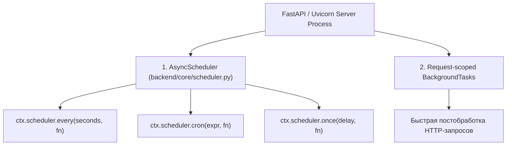

# ⚙️ 16. Фоновые задачи и планировщик (AsyncScheduler & ctx.scheduler)

---

Платформа **NMS WebUI** обеспечивает надежное выполнение фоновых и периодических процессов (сбор SNMP/Modbus метрик, опрос сетевого оборудования, фоновая очистка хранилищ, рассылка уведомлений, экспорт отчетов) с помощью **управляемого ядром asyncio-планировщика** (`ctx.scheduler`).

В данном руководстве рассмотрены принципы работы встроенного планировщика `AsyncScheduler` (`backend/core/scheduler.py`), способы вызова периодических и однократных задач, их автоматическая отмена при выгрузке модулей и интеграция с `lifespan` FastAPI.

---

## 🧭 1. Многоуровневая архитектурная модель

Платформа разграничивает фоновые задачи по уровню ресурсоемкости, контексту исполнения и принципам управления жизненным циклом:



### 📊 Сравнительная матрица механизмов воркеров

| Характеристика | Планировщик модулей (`ctx.scheduler`) | Однократные задачи (`ctx.scheduler.once`) | FastAPI `BackgroundTasks` |
| :--- | :--- | :--- | :--- |
| **Основное назначение** | Периодический опрос оборудования (`every`), расписание запуска по cron (`cron`) | Отложенные отклики и задачи с задержкой | Постобработка HTTP-запроса (отправка письма, логирование audit log) |
| **Контекст выполнения** | Внутри веб-процесса FastAPI (`AsyncScheduler` Event Loop) | Внутри веб-процесса FastAPI (`AsyncScheduler` Event Loop) | Внутри веб-процесса FastAPI (После отправки HTTP-ответа) |
| **Внешние зависимости** | Нет (встроено в `asyncio` / Python Stdlib) | Нет (встроено в `asyncio` / Python Stdlib) | Нет (встроено в FastAPI / Starlette) |
| **Время жизни** | Привязано к циклу жизни модуля (`ctx.module_id`), автоматический останов при `stop/disable/uninstall` | Автоматическое завершение и удаление после исполнения | Короткое (в рамках обработки конкретного запроса) |
| **Изоляция ошибок** | Полная (исключение в задаче логируется с traceback и не роняет планировщик) | Изолированное исполнение с фиксацией `error_count` | Логируется FastAPI |


---

## 🔄 2. Использование `ctx.scheduler` в модулях

Это **основной и рекомендуемый механизм** для выполнения любых фоновых задач в модулях NMS WebUI. Каждому модулю через `ctx.scheduler` доступен удобный интерфейс для регистрации задач по интервалу, cron-расписанию или однократно с задержкой.

### 📜 Основные методы `ctx.scheduler`

1. `ctx.scheduler.every(seconds: float, fn: Callable, name: str | None = None) -> str`
   - Периодический запуск синхронной или асинхронной функции `fn` каждые `seconds` секунд.
2. `ctx.scheduler.cron(expr: str, fn: Callable, name: str | None = None) -> str`
   - Запуск функции `fn` по 5-элементному cron-выражению (`min hour dom month dow`, например `"*/5 * * * *"`) или макросу (`@hourly`, `@daily`, `@weekly`, `@monthly`).
3. `ctx.scheduler.once(delay: float, fn: Callable, name: str | None = None) -> str`
   - Однократный запуск функции `fn` через `delay` секунд с автоматическим удалением из планировщика после выполнения.
4. `ctx.scheduler.cancel(job_id: str) -> bool`
   - Отмена конкретной задачи по её идентификатору `job_id`.
5. `ctx.scheduler.cancel_all() -> int`
   - Отмена всех фоновых задач данного модуля.

---

### 💻 Пример 1: Периодический опрос сенсоров и WebSockets

```python
import logging
from backend.modules.base import BaseModule
from backend.core.plugin.context import ModuleContext
from backend.core.events import broadcaster

_log = logging.getLogger("nms.module.sensor_monitor")

class SensorPollingModule(BaseModule):
    def __init__(self, context: ModuleContext):
        super().__init__(context)
        self._job_id: str | None = None

    def init(self) -> None:
        """Синхронная инициализация таблиц модуля."""
        self.context.create_table(
            "mod_sensor_polling_log",
            "id INTEGER PRIMARY KEY AUTOINCREMENT, device_id TEXT, val REAL, timestamp DATETIME DEFAULT CURRENT_TIMESTAMP"
        )

    def start(self) -> None:
        """Регистрация фоновых задач через ctx.scheduler."""
        # Запуск задачи каждые 15 секунд
        self._job_id = self.context.scheduler.every(15, self._poll_sensors, name="poll_sensors_task")
        
        # Запуск фоновой очистки логов каждые сутки в 03:00 по cron
        self.context.scheduler.cron("0 3 * * *", self._daily_cleanup, name="daily_cleanup_task")
        
        _log.info("Задачи опроса сенсоров и очистки логов успешно запланированы.")

    async def _poll_sensors(self) -> None:
        """Асинхронная задача опроса сетевого оборудования."""
        metrics_data = await self._poll_network_devices()
        
        # Трансляция результатов в UI через WebSockets / Event Bus
        broadcaster.broadcast(
            data_dict={
                "type": "sensor_metrics_updated",
                "module_id": self.context.module_id,
                "payload": metrics_data,
            }
        )

    async def _daily_cleanup(self) -> None:
        """Ежедневная асинхронная очистка старых логов."""
        await self.context.execute_sql_async(
            "DELETE FROM mod_sensor_polling_log WHERE timestamp < datetime('now', '-30 days')"
        )

    async def _poll_network_devices(self) -> dict:
        """Эмуляция асинхронного сбора метрик."""
        return {"device_id": "sw-core-01", "cpu_load": 14.5, "status": "online"}
```

> **Обратите внимание**: Не требуется вручную отменять задачи в методе `stop()`! При отключении, остановке или удалении модуля ядро автоматически вызывает `cleanup_module_scheduler(module_id)`, который отменяет все задачи, привязанные к `ctx.module_id`.

---

## 🏛️ 3. Изоляция ошибок и жизненный цикл (`lifespan`)

### 🛡️ Изоляция ошибок в планировщике

Если внутри исполняемой задачи модуля возникает неотловленное исключение `Exception`:
1. Ошибка перехватывается планоровщиком, фиксируется в `last_error` и прибавляет 1 к `error_count`.
2. Подробный traceback записывается в системный логгера `nms.scheduler`.
3. **Планировщик продолжит работу**: сбой конкретной задачи не останавливает работу других задач и не ломает сам планировщик. Для типов `every` и `cron` следующая итерация выполнится по расписанию.

### ⚙️ Интеграция с lifespan приложения

Планировщик `AsyncScheduler` запускается и останавливается вместе с веб-приложением в `backend/core/app.py`:

```python
# backend/core/app.py
@asynccontextmanager
async def lifespan(app: FastAPI):
    # Startup: запуск глобального планировщика
    from backend.core.scheduler import scheduler
    scheduler.start()

    # Запуск всех активных модулей
    for mid, inst in get_all_instances().items():
        if hasattr(inst, "start"):
            inst.start()

    yield

    # Shutdown: остановка планировщика и всех задач
    await scheduler.stop()
    await shutdown_all()
```

---

## 🗄️ 4. Безопасность и работа с БД (SQLite WAL) из задач

При выполнении фоновых задач соблюдайте следующие правила для предотвращения блокировок SQLite (`database is locked`):

1. **Используйте асинхронные методы `ModuleContext`**:
   - `await ctx.execute_sql_async(sql, params)`
   - `await ctx.create_table_async(...)`
2. **Короткие транзакции**: не удерживайте открытое соединение БД во время длительных сетевых операций (`await asyncio.sleep(...)` или сетевой опрос).

```python
async def _poll_task(self) -> None:
    # 1. Сетевой опрос выполняется без блокировки БД
    metrics = await self._fetch_snmp_data()

    # 2. Асинхронное выполнение короткого SQL-запроса
    await self.context.execute_sql_async(
        "INSERT INTO mod_sensor_log (device_id, val) VALUES (?, ?)",
        (metrics["device_id"], metrics["val"])
    )
```

---

## ⚡ 5. Легкие задачи HTTP-запросов (`FastAPI BackgroundTasks`)

Для вызова фоновой работы строго **после отправки HTTP-ответа** фронтенду (например, отложенное отправление аудит-вебхука):

```python
from fastapi import APIRouter, BackgroundTasks

router = APIRouter()

def send_audit_webhook_sync(event_data: dict):
    print(f"Отправка вебхука: {event_data}")

@router.post("/device/reboot")
async def reboot_device(device_id: str, background_tasks: BackgroundTasks):
    # Регистрация короткой фоновой задачи после ответа
    background_tasks.add_task(send_audit_webhook_sync, {"action": "reboot", "device_id": device_id})
    return {"status": "accepted", "message": "Перезагрузка инициирована"}
```

---

## ⚠️ 6. Антипаттерны и распространенные ошибки

| ❌ Антипаттерн | ⚠️ Последствия | ✅ Рекомендуемый подход |
| :--- | :--- | :--- |
| Использование `time.sleep()` внутри задачи | Блокирует весь Event Loop веб-сервера | Использовать `await asyncio.sleep()` или запуск через `ctx.scheduler.every` |
| Создание ручных `while True:` циклов в `start()` | Сложность управления отменой и риск утечек тасок | Использовать `ctx.scheduler.every(...)` |
| Ручная сборка параметров cron | Ошибки синтаксиса расписания | Использовать валидный 5-элементный cron формат (`"*/5 * * * *"`) или макросы `@hourly`, `@daily` |
| Игнорирование асинхронных операций с БД | Блокировка Event Loop при тяжелых SQL-запросах | Использовать `await ctx.execute_sql_async(...)` |

---

## 🧪 7. Тестирование фоновых задач модулей

Для тестирования планировщика задач модуля в `pytest` используйте маркер `@pytest.mark.anyio`:

```python
# tests/test_my_module_scheduler.py
import pytest
import asyncio
from pathlib import Path
from backend.core.plugin.context import ModuleContext, cleanup_module_scheduler
from backend.core.scheduler import scheduler

@pytest.mark.anyio
async def test_module_scheduler_lifecycle():
    scheduler.start()

    ctx = ModuleContext(module_id="test_module", root=Path("/tmp"))
    run_count = 0

    def sample_task():
        nonlocal run_count
        run_count += 1

    # Запуск периодической задачи каждые 50 мс
    job_id = ctx.scheduler.every(0.05, sample_task)
    assert job_id.startswith("job_")

    await asyncio.sleep(0.12)
    assert run_count >= 2

    # Проверка отмены при выгрузке модуля
    cancelled = cleanup_module_scheduler("test_module")
    assert cancelled == 1
    assert len(scheduler.get_jobs("test_module")) == 0

    await scheduler.stop()
```
