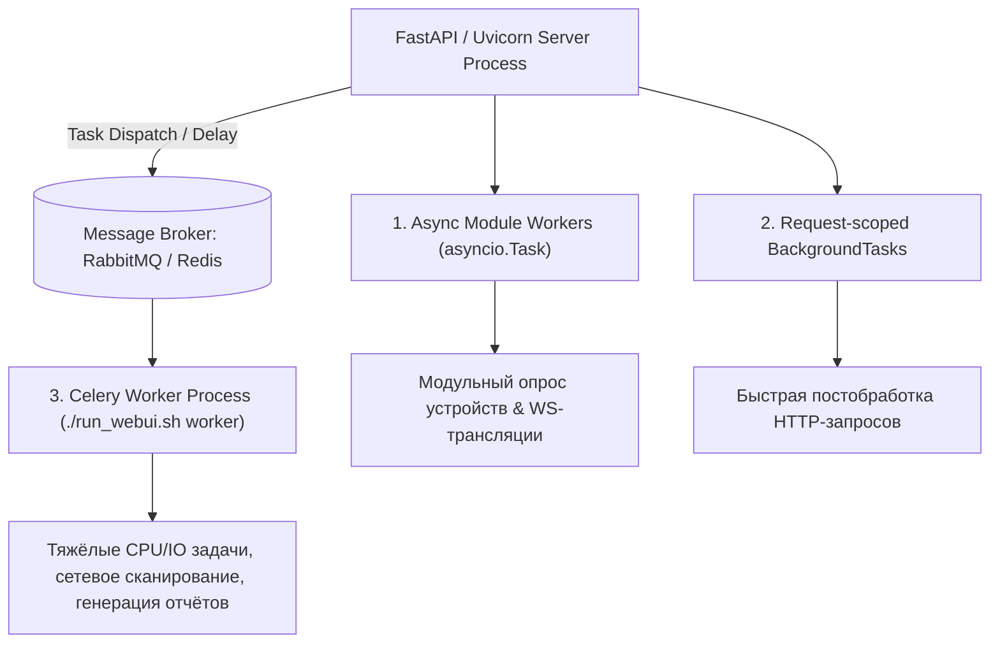
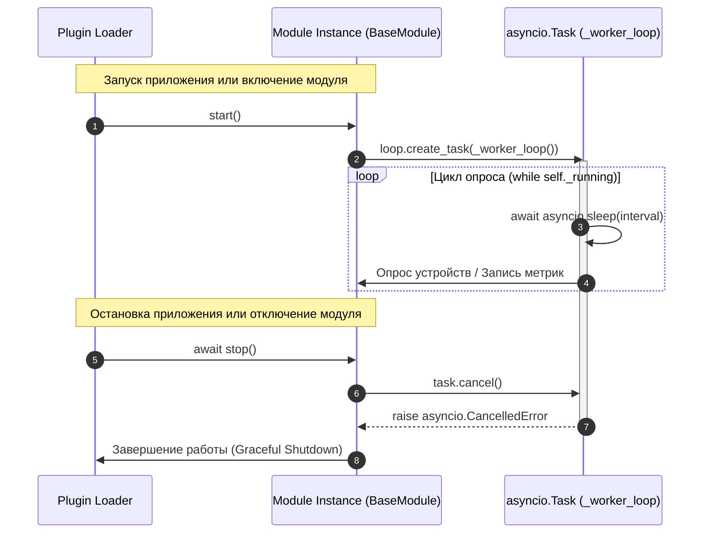

# ⚙️ 16. Фоновые воркеры и очереди задач (Background Workers & Queues)

---

Платформа **NMS WebUI** обеспечивает надежное выполнение длительных и фоновых процессов (сбор SNMP/Modbus метрик, опрос сетевого оборудования, фоновая очистка хранилищ, рассылка уведомлений, экспорт отчетов) с помощью **двухуровневой архитектуры фоновых воркеров**.

В данном руководстве рассмотрены принципы работы встроенных асинхронных воркеров модулей (`asyncio.Task`), распределенных очередей задач на базе **Celery**, а также легких фоновых задач HTTP-запросов (`FastAPI BackgroundTasks`).

---

## 🧭 1. Двухуровневая архитектурная модель

Платформа разграничивает фоновые задачи по уровню ресурсоемкости и принципам исполнения:



### 📊 Сравнительная матрица механизмов воркеров

| Характеристика | Асинхронные воркеры модулей (`asyncio.Task`) | Celery Worker (`Celery`) | FastAPI `BackgroundTasks` |
| :--- | :--- | :--- | :--- |
| **Основное назначение** | Непрерывный асинхронный опрос, реактивные подписки, фоновые таймеры модулей | Тяжёлые CPU/IO вычисления, распределённое сетевое сканирование, генерация бинарных отчётов | Постобработка HTTP-запроса (отправка письма, логирование audit log) |
| **Контекст выполнения** | Внутри веб-процесса FastAPI (Общий Event Loop) | В отдельном выделенном Python-процессе (или воркер-узле) | Внутри веб-процесса FastAPI (После отправки HTTP-ответа) |
| **Внешние зависимости** | Нет (встроено в `asyncio` / Python Stdlib) | Брокер сообщений (RabbitMQ / Redis) | Нет (встроено в FastAPI / Starlette) |
| **Время жизни** | Привязано к циклу жизни модуля (`start()` / `stop()`) | Независимо от веб-сервера, длительное фоновое | Короткое (в рамках обработки конкретного запроса) |
| **Гарантии выполнения** | При перезапуске сервера перезапускаются из `start()` | Гарантия доставки (ACK), очереди, повторные попытки (Retry) | Запускаются однократно в рамках процесса |

---

## 🔄 2. Асинхронные воркеры модулей (`asyncio.Task`)

Это **основной рекомендованный механизм** для большинства модулей NMS WebUI. Фоновые воркеры создаются на фазе запуска модуля `start()` и непрерывно исполняются в асинхронном событийнном цикле.

### 📜 Контракт взаимодействия в `BaseModule`

Все фоновые воркеры модулей подчиняются строгой цепочке вызовов Загрузчика (`loader.py`):



---

### 💻 Пример 1: Стандартный одиночный воркер с обработкой ошибок

```python
import asyncio
from backend.modules.base import BaseModule
from backend.core.plugin.context import ModuleContext

class SensorPollingModule(BaseModule):
    def __init__(self, context: ModuleContext):
        super().__init__(context)
        self._task: asyncio.Task | None = None
        self._running: bool = False
        self._poll_interval: int = 15

    def init(self) -> None:
        """Синхронная инициализация таблиц и настроек."""
        self.context.create_table(
            "mod_sensor_polling_log",
            "id INTEGER PRIMARY KEY AUTOINCREMENT, device_id TEXT, val REAL, timestamp DATETIME DEFAULT CURRENT_TIMESTAMP"
        )

    def start(self) -> None:
        """Фаза 2 жизненного цикла: Запуск фонового воркера при активном Event Loop."""
        self._running = True
        loop = asyncio.get_running_loop()
        self._task = loop.create_task(self._worker_loop())
        self.context.logger.info("Воркер опроса сенсоров успешно запущен.")

    async def _worker_loop(self) -> None:
        """Бесконечный цикл с отловом CancelledError и экспоненциальной задержкой."""
        backoff = 1
        max_backoff = 300
        
        while self._running:
            try:
                # Основная бизнес-логика фонового опроса
                self.context.logger.debug("Выполняется опрос сетевых устройств...")
                
                # Пример вызова внутренней функции модуля
                await self._poll_network_devices()

                # Сброс экспоненциальной задержки при успешной итерации
                backoff = 1
                await asyncio.sleep(self._poll_interval)

            except asyncio.CancelledError:
                # Корректный перехват отмены таски при shutdown
                self.context.logger.info("Получен сигнал отмены воркера (CancelledError).")
                break

            except Exception as exc:
                # Отлов неожиданных ошибок, чтобы воркер не упал навсегда
                self.context.logger.error("Сбой в воркере опроса: %s. Повтор через %d сек.", exc, backoff)
                await asyncio.sleep(backoff)
                backoff = min(backoff * 2, max_backoff)

    async def _poll_network_devices(self) -> None:
        """Эмуляция асинхронной работы с сетью."""
        await asyncio.sleep(0.5)

    async def stop(self) -> None:
        """ Graceful shutdown: отмена задачи и ожидание завершения."""
        self._running = False
        if self._task and not self._task.done():
            self._task.cancel()
            try:
                await self._task
            except asyncio.CancelledError:
                pass
        self.context.logger.info("Воркер опроса сенсоров остановлен.")

    def get_status(self) -> dict:
        """Метрики здоровья воркера для UI и REST API."""
        return {
            "running": self._running,
            "worker_alive": self._task is not None and not self._task.done(),
            "interval_sec": self._poll_interval
        }
```

---

### 💻 Пример 2: Управление набором воркеров (`MultiWorkerModule`)

Для модулей, выполняющих разнородную фоновую работу (например, воркер опроса + воркер очистки кэша + воркер синхронизации времени), используется паттерн `set[asyncio.Task]`:

```python
class MultiWorkerModule(BaseModule):
    def __init__(self, context: ModuleContext):
        super().__init__(context)
        self._tasks: set[asyncio.Task] = set()
        self._running: bool = False

    def start(self) -> None:
        self._running = True
        loop = asyncio.get_running_loop()

        # Создаём несколько параллельных фоновых воркеров
        poll_task = loop.create_task(self._poll_loop())
        cleanup_task = loop.create_task(self._cleanup_loop())

        self._tasks.add(poll_task)
        self._tasks.add(cleanup_task)

        # Автоматическое удаление завершённых тасок из множества
        poll_task.add_done_callback(self._tasks.discard)
        cleanup_task.add_done_callback(self._tasks.discard)

    async def _poll_loop(self) -> None:
        while self._running:
            try:
                await asyncio.sleep(10)
            except asyncio.CancelledError:
                break

    async def _cleanup_loop(self) -> None:
        while self._running:
            try:
                await asyncio.sleep(3600) # Запуск раз в час
            except asyncio.CancelledError:
                break

    async def stop(self) -> None:
        self._running = False
        for task in self._tasks:
            task.cancel()

        if self._tasks:
            await asyncio.gather(*self._tasks, return_exceptions=True)
        self._tasks.clear()
```

---

## 📦 3. Распределенный Celery Worker (`Celery`)

Для ресурсоёмких задач, выполнение которых внутри единого событиянного цикла `asyncio` может вызвать блокировку I/O или высокую загрузку CPU, в платформе интегрирован **Celery**.

### 🛠️ Архитектура и конфигурация

Параметры подключения к брокеру определены в [`backend/core/config.py`](file:///opt/nms-webui/backend/core/config.py):

```python
class Settings(BaseSettings):
    # URL брокера сообщений (RabbitMQ / Redis)
    celery_broker_url: str = "pyamqp://guest@localhost//"
    celery_result_backend: str = "rpc://"
```

### 🚀 Запуск Celery Worker

Для запуска воркера процессов используйте скрипт управления платформой [`run_webui.sh`](file:///opt/nms-webui/run_webui.sh):

```bash
./run_webui.sh worker
```

Закулисно исполняется команда:
```bash
cd backend && .venv/bin/celery -A main.celery_worker worker --loglevel=info
```

---

### 💻 Объявление и запуск задач Celery

Размещение Celery-тасок рекомендуется выполнять в файле `tasks.py` соответствующего модуля:

```python
# backend/modules/network_scanner/tasks.py
from celery import shared_task
import time
import logging

logger = logging.getLogger(__name__)

@shared_task(name="network_scanner.ping_subnet", bind=True, max_retries=3)
def ping_subnet_task(self, subnet_cidr: str) -> dict:
    """Тяжёлая синхронная задача сканирования подсети."""
    logger.info("Начато фоновое сканирование подсети: %s", subnet_cidr)
    
    try:
        # Эмуляция длительной синхронной сетевой операции
        time.sleep(5) 
        discovered_hosts = ["192.168.1.1", "192.168.1.10", "192.168.1.50"]
        
        return {
            "status": "success",
            "subnet": subnet_cidr,
            "hosts_found": len(discovered_hosts),
            "hosts": discovered_hosts
        }
    except Exception as exc:
        logger.error("Ошибка при сканировании %s: %s", subnet_cidr, exc)
        raise self.retry(exc=exc, countdown=10)
```

### 🔗 Вызов Celery-задачи из REST API модуля

```python
# backend/modules/network_scanner/router.py
from fastapi import APIRoute, APIRouter, Depends
from backend.modules.network_scanner.tasks import ping_subnet_task

router = APIRouter(prefix="/api/v1/network-scanner", tags=["Network Scanner"])

@router.post("/scan")
async def trigger_subnet_scan(subnet: str):
    # Асинхронная отправка задачи в очередь Celery без блокировки HTTP-запроса
    task_result = ping_subnet_task.delay(subnet)
    
    return {
        "message": "Задача сканирования добавлена в очередь",
        "task_id": task_result.id
    }
```

---

## ⚡ 4. Легкие задачи HTTP-запросов (`FastAPI BackgroundTasks`)

Когда нужно выполнить короткую фоновую операцию строго **после успешно отправленного HTTP-ответа** (например, запись аудита или отправка Webhook):

```python
from fastapi import APIRouter, BackgroundTasks

router = APIRouter()

def send_audit_webhook_sync(event_data: dict):
    """Синхронная или асинхронная функция отправки уведомления."""
    print(f"Отправка вебхука: {event_data}")

@router.post("/device/reboot")
async def reboot_device(device_id: str, background_tasks: BackgroundTasks):
    # Выполнение перезагрузки
    
    # Регистрация фоновой задачи
    background_tasks.add_task(send_audit_webhook_sync, {"action": "reboot", "device_id": device_id})
    
    return {"status": "accepted", "message": "Перезагрузка инициирована"}
```

---

## 🛡️ 5. Безопасность, лимиты и лучшие практики

> `ponytail:` *Процессный лимит масштабирования*: Текущие `asyncio.Task` воркеры работают строго в памяти текущего процесса Python/Uvicorn. При горизонтальном масштабировании веб-сервера на несколько воркеров Uvicorn (`gunicorn -w 4 -k uvicorn.workers.UvicornWorker`) задачи `asyncio.Task` будут продублированы в каждом процессе! Для задач с глобальной уникальностью (singleton workers) используйте распределённую блокировку (Redis lock) или Celery.

### 📌 Чек-лист надежности воркера:

1. **Всегда перехватывайте `asyncio.CancelledError`**: Не проглатывайте `CancelledError` без проброса или корректного выхода из цикла `break`.
2. **Экспоненциальная задержка (Exponential Backoff)**: Обязательно увеличивайте интервал ожидания при сбоях сети/БД, чтобы воркер не забивал логи и ресурсы тысячами ошибок в секунду.
3. **Изоляция исключений**: Обворачивайте итерацию воркера в `try...except Exception`, чтобы непредвиденная ошибка структуры данных не убила фоновую задачу навсегда.
4. **Очистка ресурсов в `stop()`**: Обязательно вызывайте `task.cancel()` и делайте `await task` при остановке модуля.

---

## 🧪 6. Тестирование фоновых воркеров

Для проверки корректности воркера используйте `pytest-asyncio` и микро-задержки времени:

```python
# tests/test_sensor_worker.py
import pytest
import asyncio
from unittest.mock import MagicMock
from backend.modules.sensor_monitor.module import SensorPollingModule

@pytest.mark.asyncio
async def test_sensor_worker_lifecycle():
    # Подготовка контекста-заглушки
    mock_ctx = MagicMock()
    module = SensorPollingModule(mock_ctx)
    
    module.init()
    assert module.get_status()["running"] is False

    # Запуск воркера
    module.start()
    assert module.get_status()["running"] is True
    assert module.get_status()["worker_alive"] is True

    # Даём воркеру прокрутиться 100 мс
    await asyncio.sleep(0.1)

    # Остановка воркера
    await module.stop()
    assert module.get_status()["running"] is False
    assert module.get_status()["worker_alive"] is False
