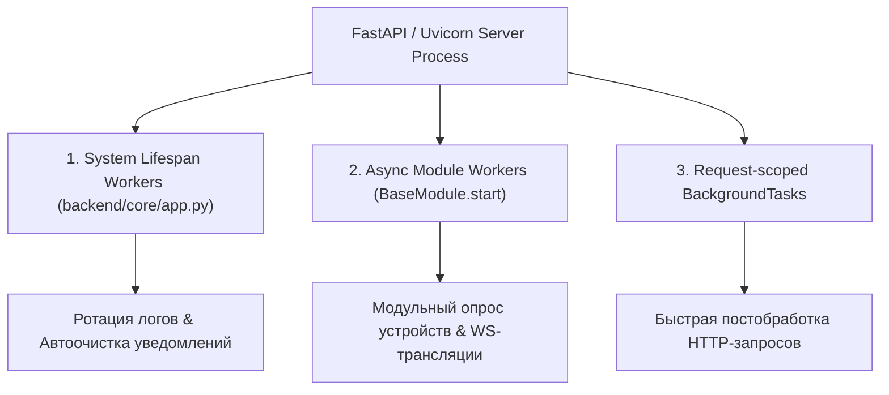
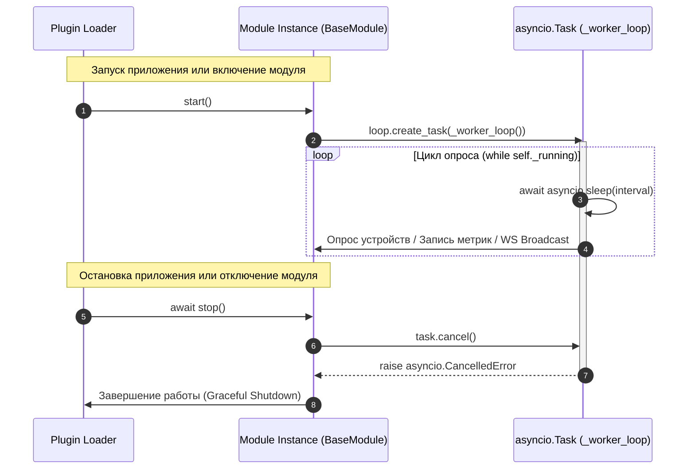

# ⚙️ 16. Фоновые воркеры и очереди задач (Background Workers & Queues)

---

Платформа **NMS WebUI** обеспечивает надежное выполнение длительных и фоновых процессов (сбор SNMP/Modbus метрик, опрос сетевого оборудования, фоновая очистка хранилищ, рассылка уведомлений, экспорт отчетов) с помощью **многоуровневой архитектуры фоновых воркеров**.

В данном руководстве рассмотрены принципы работы встроенных асинхронных воркеров модулей (`asyncio.Task`), системных фоновых служб ядра (`lifespan`), а также легких фоновых задач HTTP-запросов (`FastAPI BackgroundTasks`).

---

## 🧭 1. Многоуровневая архитектурная модель

Платформа разграничивает фоновые задачи по уровню ресурсоемкости, контексту исполнения и принципам управления жизненным циклом:



### 📊 Сравнительная матрица механизмов воркеров

| Характеристика | Системные воркеры ядра (`lifespan`) | Асинхронные воркеры модулей (`asyncio.Task`) | FastAPI `BackgroundTasks` |
| :--- | :--- | :--- | :--- |
| **Основное назначение** | Глобальная очистка системы, ротация аудит-логов, фоновый сбор системных метрик | Непрерывный асинхронный опрос оборудования, реактивные подписки, фоновые таймеры модулей | Постобработка HTTP-запроса (отправка письма, логирование audit log) |
| **Контекст выполнения** | Внутри веб-процесса FastAPI (`lifespan` контекст) | Внутри веб-процесса FastAPI (Общий Event Loop модуля) | Внутри веб-процесса FastAPI (После отправки HTTP-ответа) |
| **Внешние зависимости** | Нет (встроено в `asyncio` / Python Stdlib) | Нет (встроено в `asyncio` / Python Stdlib) | Нет (встроено в FastAPI / Starlette) |
| **Время жизни** | Старт при запуске сервера, останов при завершении Uvicorn | Привязано к циклу жизни модуля (`start()` / `stop()`) | Короткое (в рамках обработки конкретного запроса) |
| **Гарантии выполнения** | При перезапуске сервера перезапускаются из `lifespan` | При перезапуске сервера перезапускаются из `start()` | Запускаются однократно в рамках процесса |


---

## 🔄 2. Асинхронные воркеры модулей (`asyncio.Task`)

Это **основной рекомендованный механизм** для большинства модулей NMS WebUI. Фоновые воркеры создаются на фазе запуска модуля `start()` и непрерывно исполняются в асинхронном событийном цикле.

### 📜 Контракт взаимодействия в `BaseModule`

Все фоновые воркеры модулей подчиняются строгой цепочке вызовов Загрузчика (`loader.py`):



---

### 💻 Пример 1: Стандартный воркер с горячей перезагрузкой и WebSockets

Настоящий пример демонстрирует работу воркера модуля (подобно `backend/modules/tuya/module.py`), который на каждой итерации считывает актуальные настройки модуля, ведет метрики здоровья и транслирует данные в UI через WebSockets/Event Bus:

```python
import asyncio
import logging
from typing import Any
from backend.modules.base import BaseModule
from backend.core.plugin.context import ModuleContext
from backend.core.plugin.registry import get_module_settings
from backend.core.events import broadcaster

_log = logging.getLogger("nms.module.sensor_monitor")

class SensorPollingModule(BaseModule):
    def __init__(self, context: ModuleContext):
        super().__init__(context)
        self._task: asyncio.Task | None = None
        self._running: bool = False
        # Метрики здоровья воркера для телеметрии и REST API
        self._execution_count: int = 0
        self._error_count: int = 0
        self._last_successful_run: float | None = None

    def init(self) -> None:
        """Синхронная инициализация таблиц и ресурсов."""
        self.context.create_table(
            "mod_sensor_polling_log",
            "id INTEGER PRIMARY KEY AUTOINCREMENT, device_id TEXT, val REAL, timestamp DATETIME DEFAULT CURRENT_TIMESTAMP"
        )

    def start(self) -> None:
        """Запуск фонового воркера при активном Event Loop."""
        self._running = True
        try:
            loop = asyncio.get_running_loop()
            if self._task is None or self._task.done():
                self._task = loop.create_task(self._worker_loop())
                _log.info("Воркер опроса сенсоров успешно запущен.")
        except RuntimeError:
            _log.warning("Event Loop недоступен при запуске модуля.")

    async def _worker_loop(self) -> None:
        """Бесконечный цикл с динамической перезагрузкой настроек и экспоненциальной задержкой при ошибках."""
        backoff = 1
        max_backoff = 300
        
        while self._running:
            try:
                # 1. Горячая перезагрузка интервала опроса из настроек системы
                settings = get_module_settings("sensor_monitor")
                poll_interval = int(settings.get("poll_interval_sec", 15))

                _log.debug("Выполняется фоновый опрос сенсоров (интервал %d c)...", poll_interval)
                
                # 2. Выполнение основной бизнес-логики
                metrics_data = await self._poll_network_devices()

                # 3. Трансляция обновлений в реальном времени в UI (WebSockets / Event Bus)
                broadcaster.broadcast(
                    data_dict={
                        "type": "sensor_metrics_updated",
                        "module_id": self.context.module_id,
                        "payload": metrics_data,
                    }
                )

                # 4. Обновление метрик работы воркера
                self._execution_count += 1
                self._last_successful_run = asyncio.get_running_loop().time()
                backoff = 1 # Сброс экспоненциальной паузы при успехе

                # 5. Асинхронное ожидание перед следующей итерацией
                await asyncio.sleep(poll_interval)

            except asyncio.CancelledError:
                # Корректный перехват отмены таски при shutdown модуля
                _log.info("Получен сигнал отмены воркера (CancelledError).")
                break

            except Exception as exc:
                self._error_count += 1
                _log.error("Сбой в воркере опроса: %s. Повтор через %d сек.", exc, backoff)
                await asyncio.sleep(backoff)
                backoff = min(backoff * 2, max_backoff)

    async def _poll_network_devices(self) -> dict[str, Any]:
        """Эмуляция асинхронного сбора метрик оборудования."""
        await asyncio.sleep(0.3)
        return {"device_id": "sw-core-01", "cpu_load": 14.5, "status": "online"}

    async def stop(self) -> None:
        """Graceful shutdown: отмена задачи и ожидание завершения."""
        self._running = False
        if self._task and not self._task.done():
            self._task.cancel()
            try:
                await self._task
            except asyncio.CancelledError:
                pass
        self._task = None
        _log.info("Воркер опроса сенсоров остановлен.")

    def get_status(self) -> dict[str, Any]:
        """Расширенные метрики здоровья воркера для UI и REST API."""
        return {
            "running": self._running,
            "worker_alive": self._task is not None and not self._task.done(),
            "execution_count": self._execution_count,
            "error_count": self._error_count,
            "last_successful_run": self._last_successful_run
        }
```

---

### 💻 Пример 2: Управление набором воркеров (`MultiWorkerModule`)

Для модулей, выполняющих разнородную фоновую работу (например, воркер опроса + воркер очистки кэша + воркер синхронизации времени), используется паттерн `set[asyncio.Task]`:

```python
class MultiWorkerModule(BaseModule):
    def __init__(self, context: ModuleContext):
        super().__init__(context)
        self._tasks: set[asyncio.Task] = set()
        self._running: bool = False

    def start(self) -> None:
        self._running = True
        loop = asyncio.get_running_loop()

        # Создаём несколько параллельных фоновых воркеров
        poll_task = loop.create_task(self._poll_loop())
        cleanup_task = loop.create_task(self._cleanup_loop())

        self._tasks.add(poll_task)
        self._tasks.add(cleanup_task)

        # Автоматическое удаление завершённых тасок из множества
        poll_task.add_done_callback(self._tasks.discard)
        cleanup_task.add_done_callback(self._tasks.discard)

    async def _poll_loop(self) -> None:
        while self._running:
            try:
                await asyncio.sleep(10)
            except asyncio.CancelledError:
                break

    async def _cleanup_loop(self) -> None:
        while self._running:
            try:
                await asyncio.sleep(3600) # Запуск раз в час
            except asyncio.CancelledError:
                break

    async def stop(self) -> None:
        self._running = False
        for task in self._tasks:
            task.cancel()

        if self._tasks:
            await asyncio.gather(*self._tasks, return_exceptions=True)
        self._tasks.clear()
```

---

## 🏛️ 3. Системные фоновые службы уровня приложения (`lifespan`)

В отличие от модульных воркеров, системные фоновые задачи обеспечивают обслуживание всей платформы NMS WebUI (например, ротация логов аудит-журнала, автоматическая очистка просроченных уведомлений, мониторинг системных ресурсов). 

Они регистрируются в `lifespan` контексте управления приложением (`backend/core/app.py`):

```python
# backend/core/app.py
from contextlib import asynccontextmanager
import asyncio
from fastapi import FastAPI

async def notifications_cleanup_loop():
    """Системный фоновый цикл ротации уведомлений (выполняется 1 раз в сутки)."""
    while True:
        try:
            cleaned = cleanup_old_notifications(days=30)
            if cleaned > 0:
                _log.info("Автоочистка: удалено %d устаревших уведомлений", cleaned)
        except Exception as exc:
            _log.warning("Ошибка автоочистки уведомлений: %s", exc)
        await asyncio.sleep(86400) # 24 часа

@asynccontextmanager
async def lifespan(app: FastAPI):
    # Startup: Запуск глобальных фоновых задач платформы
    cleanup_task = asyncio.create_task(notifications_cleanup_loop())

    # Запуск всех модулей
    for mid, inst in get_all_instances().items():
        if hasattr(inst, "start"):
            inst.start()

    yield

    # Shutdown: Безопасное завершение системных задач
    cleanup_task.cancel()
    await shutdown_all()
```

---

## 🗄️ 4. Безопасность и работа с БД (SQLite WAL) из воркеров

При выполнении фоновых воркеров часто возникает задача записи считываемых метрик в базу данных. В NMS WebUI при работе с SQLite крайне важно соблюдать следующие правила для предотвращения ошибок `sqlite3.OperationalError: database is locked`:

1. **Режим WAL (Write-Ahead Logging)**: Убедитесь, что база данных переведена в режим WAL, что позволяет параллельно выполнять чтение и запись.
2. **Короткие изолированные транзакции**: Не держите открытую транзакцию базы данных во время выполнения асинхронных сетевых операций (`await asyncio.sleep(...)` или сетевой опрос).
3. **Изоляция соединений**: Каждая фоновая итерация или воркер должны использовать свой собственный эксемпляр соединения/сессии к БД.

```python
async def _poll_loop(self) -> None:
    while self._running:
        try:
            # 1. Сетевой опрос выполняется БЕЗ открытой транзакции БД
            metrics = await self._fetch_snmp_data()

            # 2. Быстрое подключение и сохранение в БД (короткая транзакция)
            with self.context.get_db() as db:
                db.execute(
                    "INSERT INTO mod_sensor_log (device_id, val) VALUES (?, ?)",
                    (metrics["device_id"], metrics["val"])
                )
                db.commit()

            await asyncio.sleep(15)
        except asyncio.CancelledError:
            break
        except Exception as exc:
            _log.error("Сбой записи в БД: %s", exc)
            await asyncio.sleep(5)
```

---

## ⚡ 5. Легкие задачи HTTP-запросов (`FastAPI BackgroundTasks`)

Когда нужно выполнить короткую фоновую операцию строго **после успешно отправленного HTTP-ответа** (например, запись аудита или отправка Webhook):

```python
from fastapi import APIRouter, BackgroundTasks

router = APIRouter()

def send_audit_webhook_sync(event_data: dict):
    """Синхронная или асинхронная функция отправки уведомления."""
    print(f"Отправка вебхука: {event_data}")

@router.post("/device/reboot")
async def reboot_device(device_id: str, background_tasks: BackgroundTasks):
    # Выполнение перезагрузки
    
    # Регистрация фоновой задачи
    background_tasks.add_task(send_audit_webhook_sync, {"action": "reboot", "device_id": device_id})
    
    return {"status": "accepted", "message": "Перезагрузка инициирована"}
```

---

## ⚠️ 6. Антипаттерны и распространенные ошибки (Anti-Patterns)

При написании фоновых воркеров разработчики модулей должны избегать следующих распространённых ошибок:

| ❌ Антипаттерн | ⚠️ Последствия | ✅ Рекомендуемый подход |
| :--- | :--- | :--- |
| Использование `time.sleep()` внутри `asyncio.Task` | Блокирует весь Event Loop веб-сервера, зависают все HTTP-запросы и WebSockets | Использовать исключительно `await asyncio.sleep()` |
| Синхронные HTTP-вызовы (`requests.get`) | Замораживают обработку асинхронного потока воркера | Использовать `httpx.AsyncClient` или `aiohttp` |
| Подавление `asyncio.CancelledError` (`except Exception:` без `raise` или `break`) | Воркер не может быть остановлен через `stop()`, зависает при выключении сервера | Всегда делать `except asyncio.CancelledError: break` или использовать отдельный блок `try...except` |
| Бесконечный цикл без задержки `while self._running:` | Утилизирует 100% CPU процессора в пустом цикле (Spin-lock) | Обязательный `await asyncio.sleep(interval)` на каждой итерации |
| Хранение открытого соединения БД между итерациями | Ошибки `database is locked` при многопоточной/многозадачной работе | Открывать DB-сессию коротко внутри итерации или использовать асинхронный пул |
| Игнорирование масштабирования Uvicorn воркеров | При `gunicorn -w 4` воркер `asyncio.Task` запустится в 4 экземплярах | Для эксклюзивных воркеров использовать распределённые блокировки (Redis Lock) |

---

## 🛡️ 7. Безопасность, лимиты и лучшие практики

> `ponytail:` *Процессный лимит масштабирования*: Текущие `asyncio.Task` воркеры работают строго в памяти текущего процесса Python/Uvicorn. При горизонтальном масштабировании веб-сервера на несколько воркеров Uvicorn (`gunicorn -w 4 -k uvicorn.workers.UvicornWorker`) задачи `asyncio.Task` будут продублированы в каждом процессе! Для задач с глобальной уникальностью (singleton workers) используйте распределённую блокировку (Redis lock).


### 📌 Чек-лист надежности воркера:

1. **Всегда перехватывайте `asyncio.CancelledError`**: Не проглатывайте `CancelledError` без проброса или корректного выхода из цикла `break`.
2. **Экспоненциальная задержка (Exponential Backoff)**: Обязательно увеличивайте интервал ожидания при сбоях сети/БД, чтобы воркер не забивал логи и ресурсы тысячами ошибок в секунду.
3. **Изоляция исключений**: Обворачивайте итерацию воркера в `try...except Exception`, чтобы непредвиденная ошибка структуры данных не убила фоновую задачу навсегда.
4. **Очистка ресурсов в `stop()`**: Обязательно вызывайте `task.cancel()` и делайте `await task` при остановке модуля.

---

## 🧪 9. Тестирование фоновых воркеров

Для проверки корректности воркера используйте `pytest-asyncio` и микро-задержки времени:

```python
# tests/test_sensor_worker.py
import pytest
import asyncio
from unittest.mock import MagicMock
from backend.modules.sensor_monitor.module import SensorPollingModule

@pytest.mark.asyncio
async def test_sensor_worker_lifecycle():
    # Подготовка контекста-заглушки
    mock_ctx = MagicMock()
    module = SensorPollingModule(mock_ctx)
    
    module.init()
    assert module.get_status()["running"] is False

    # Запуск воркера
    module.start()
    assert module.get_status()["running"] is True
    assert module.get_status()["worker_alive"] is True

    # Даём воркеру прокрутиться 100 мс
    await asyncio.sleep(0.1)

    # Остановка воркера
    await module.stop()
    assert module.get_status()["running"] is False
    assert module.get_status()["worker_alive"] is False
```
