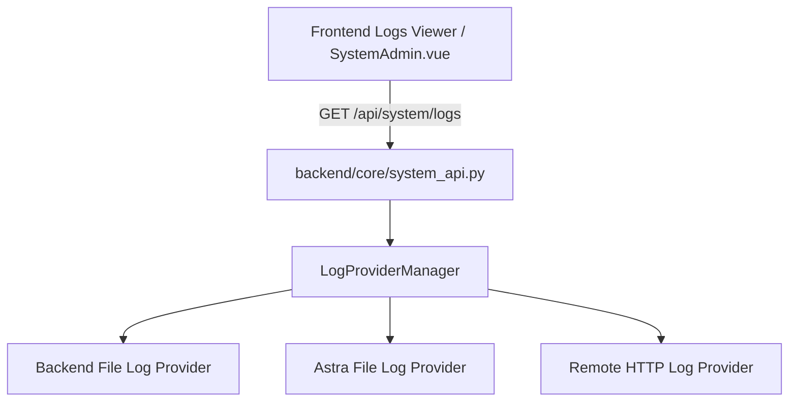

# Система логов и Журнал аудита

Платформа **NMS WebUI** содержит две подсистемы протоколирования:
1. **Журнал аудита (`audit_logs`)** — фиксация критических действий пользователей (вход, создание бэкапов, изменение настроек).
2. **Провайдеры логов (`LogProviderManager`)** — просмотр в реальном времени и фильтрация системных логов backend, Astra, MediaMTX и сторонних сервисов.

---

## 🛡️ 1. Журнал Аудита (Audit Log)

Система аудита реализована в модуле `backend/core/audit.py`. Каждое защищенное действие записывается в SQLite таблицу `audit_logs`.

### Структура записи аудита
| Поле | Тип | Описание |
| :--- | :--- | :--- |
| `id` | `INTEGER` | Автоинкрементный ID записи |
| `timestamp` | `DATETIME` | Время UTC в ISO формате (например, `2026-08-01T20:41:44Z`) |
| `user_id` | `TEXT` | Уникальный ID пользователя (или `null` при неудачном входе) |
| `username` | `TEXT` | Имя пользователя |
| `action` | `TEXT` | Тип действия (`AUTH_SUCCESS`, `AUTH_FAILURE`, `SETTINGS_CHANGE`, `SYSTEM_BACKUP`, `USER_CREATE`) |
| `resource` | `TEXT` | Затронутый ресурс (`users`, `system`, `tuya`) |
| `details` | `TEXT` | Подробное текстовое описание на языке пользователя |
| `ip_address` | `TEXT` | IP-адрес клиента (`request.client.host`) |

### Ротация записей аудита
Для предотвращения переполнения БД функция `rotate_audit_logs(max_days=90, max_records=100000)` очищает устаревшие данные:
- Удаляются записи старше **90 дней** (по умолчанию).
- Лимит общего числа записей — не более **100,000**.

---

## 📜 2. Провайдеры Логов (Log Providers)

Подсистема `backend/core/log_providers.py` организует доступ к логам платформы через единый REST API и WebSocket интерфейс:

### Доступные провайдеры логов:
1. **LocalFileLogProvider**: Чтение текстовых логов с диска (`backend.log`, `astra.log`). Поддерживает поиск по подстроке и фильтрацию по уровню (`DEBUG`, `INFO`, `WARNING`, `ERROR`).
2. **RemoteHTTPLogProvider**: Получение логов от удаленных узлов NMS или сторонних инстансов по HTTP API.

### REST API Эндпоинты логов
- `GET /api/system/logs` — Список доступных провайдеров логов и их метаданные.
- `GET /api/system/logs/{provider_id}` — Получение последних N строк логов с поддержкой фильтров `level`, `search`, `limit`.
- `WS /api/system/logs/{provider_id}/stream` — Стриминг строк логов по WebSocket в реальном времени.
